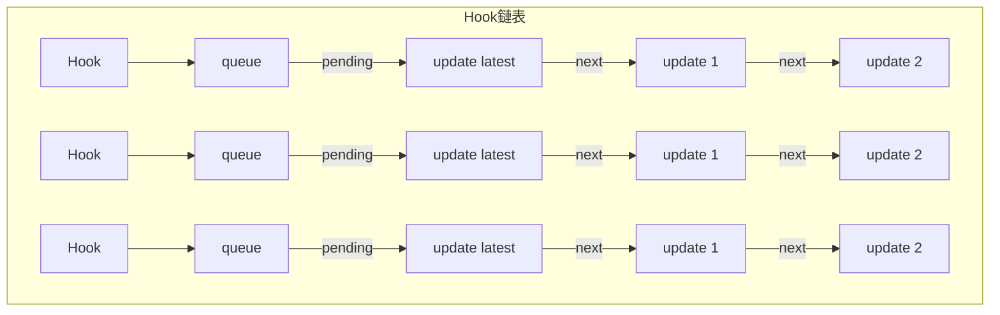

# hooks

## 型別

```ts
  export type Update<S, A> = {
    lane: Lane;
    action: A;
    hasEagerState: boolean;
    eagerState: S | null;
    next: Update<S, A>;
  };

  // hook 上有 queue
  export type UpdateQueue<S, A> = {
    pending: Update<S, A> | null;
    lanes: Lanes;
    dispatch: (A => mixed) | null;
    lastRenderedReducer: ((S, A) => S) | null; // 上次執行的 reducer
    lastRenderedState: S | null; // 組件上次掛載的狀態
  };

  export type Hook = {
    // 不同類型的 hook，存的內容不同
    // useState / useReducer 存 state，
    // useEffect / useLayoutEffect 存 effect 單向循環鏈表
    memorizedState: any;

    // 下一個 hook，如果是 null，表示他是最後一個 hook
    next: Hook | null;

    baseState: any; // 所有的 update 對象合併後的狀態（比方說setState多次調用
    baseQueue: Update<any, any> | null; // 環形鏈表，只有包含高於本次渲染優先級的 update對象
    queue:  UpdateQueue < any , any > | null; // 包括所有優先級的 update 對象
  };
```



## 狀態 hooks - useState, useReducer

### mount - hook 和 fiber 關聯

當我們調用 `useState` 時，會發現 dispatcher 是來自 `ReactCurrentDispatcher.current`

> react-debugger/src/react/packages/react/src/ReactHooks.js

```ts
export function useState(initialState) {
  // resolveDispatcher ➡️ const dispatcher = ReactCurrentDispatcher.current;
  const dispatcher = resolveDispatcher();
  return dispatcher.useState(initialState);
}
```

回到處理 fiber 時，進入 `beginWork`，判定是 `FunctionComponent` 時，調用 `updateFunctionComponent` ，看到 `renderWithHooks` 返回了子節點 React Element 對象，再去調用 `reconcileChildren`

> react-debugger/src/react/packages/react-reconciler/src/ReactFiberBeginWork.js

```ts
// currentlyRenderingFiber.memoizedState 指向第一個 hook
let currentlyRenderingFiber = null;
let currentHook = null;
// 指向最後一個hook
let workInProgressHook = null;

function updateFunctionComponent(
  current,
  workInProgress,
  Component,
  nextProps,
  renderLanes
) {
  let context;
  if (!disableLegacyContext) {
    const unmaskedContext = getUnmaskedContext(workInProgress, Component, true);
    context = getMaskedContext(workInProgress, unmaskedContext);
  }

  let nextChildren;
  let hasId;
  prepareToReadContext(workInProgress, renderLanes);
  if (enableSchedulingProfiler) {
    markComponentRenderStarted(workInProgress);
  }

  // * 處理 hooks，要把 hooks 和 fiber 關聯
  nextChildren = renderWithHooks(
    current,
    workInProgress,
    Component,
    nextProps,
    context,
    renderLanes
  );
  hasId = checkDidRenderIdHook();

  if (enableSchedulingProfiler) {
    markComponentRenderStopped();
  }

  // ! 如果是更新階段，但又沒有接到新的更新，則復用老節點，退出更新
  if (current !== null && !didReceiveUpdate) {
    bailoutHooks(current, workInProgress, renderLanes);
    return bailoutOnAlreadyFinishedWork(current, workInProgress, renderLanes);
  }

  if (getIsHydrating() && hasId) {
    pushMaterializedTreeId(workInProgress);
  }

  // React DevTools reads this flag.
  workInProgress.flags |= PerformedWork;
  reconcileChildren(current, workInProgress, nextChildren, renderLanes);
  return workInProgress.child;
}
```

> react-debugger/src/react/packages/react-reconciler/src/ReactFiberHooks.js

```ts
export function renderWithHooks(
  current,
  workInProgress,
  Component,
  props,
  secondArg,
  nextRenderLanes
) {
  // 紀錄到變量當中，現在執行到哪個 fiber ，因為 workInProgress 不存在在這個文件作用域中
  renderLanes = nextRenderLanes;
  // 指向第一個 hooks
  currentlyRenderingFiber = workInProgress;

  // 只有至少使用一個有狀態的 hooks 時，使用 memoizedState 來區分是 mount / update ，才有效
  // Non-stateful hooks (e.g. context)  不會新增到 memoizedState
  // 因此在 mount & update 期間 memoizedState = null
  workInProgress.memoizedState = null; // 初始化
  workInProgress.updateQueue = null;
  workInProgress.lanes = NoLanes;

  // ! 如果組件是初次掛載，回傳的物件對應的 hooks api 是 for mount 的
  // ! 如果組件是更新，回傳的物件對應的 hooks api 是 for update 的
  // ! 雖然對於使用者來說，都是一樣叫做 useState || useEffect 但實際執行的函式有變化
  ReactCurrentDispatcher.current =
    current === null || current.memoizedState === null
      ? HooksDispatcherOnMount
      : HooksDispatcherOnUpdate;

  // ! 函式執行，取得子 react.element
  let children = Component(props, secondArg);

  // ! 把全局變量再重置
  finishRenderingHooks(current, workInProgress, Component);

  return children;
}
```

執行函式會執行函式內的 hooks ，以 `useReducer` 為例，這時透過 `ReactCurrentDispatcher.current` 拿到 `mountReducer`，構建 hooks 鏈表和構建 queue

#### mountReducer

1. 構建 hooks 鏈表
2. 拿初始 state，初始 hook、queue 屬性（ex: lastRenderedReducer: reducer)
3. 設定 hook.dispatch
4. 返回[目前狀態, dispatch 函數]

```ts
// https://zh-hans.react.dev/reference/react/useReducer
// ! 創建＆初始化 hook，最後返回[目前狀態, dispatch函數]
function mountReducer(reducer, initialArg, init) {
  // ! 1. 構建 hooks 鏈表
  const hook = mountWorkInProgressHook();
  let initialState;
  // ! 2. 拿初始 state，初始屬性
  // 可看官網，第三個參數是可選的函式
  if (init !== undefined) {
    initialState = init(initialArg);
  } else {
    initialState = initialArg;
  }
  hook.memoizedState = hook.baseState = initialState;
  const queue = {
    pending: null,
    lanes: NoLanes,
    dispatch: null,
    lastRenderedReducer: reducer,
    lastRenderedState: initialState,
  };
  hook.queue = queue;

  // ! 3. 設定hook.dispatch
  const dispatch = (queue.dispatch = dispatchReducerAction.bind(
    null,
    currentlyRenderingFiber,
    queue
  ));
  // ! 4. 返回[目前狀態, dispatch函數]
  return [hook.memoizedState, dispatch];
}

// ! 掛載階段沒辦法復用，直接創建
function mountWorkInProgressHook() {
  const hook = {
    memoizedState: null,

    baseState: null,
    baseQueue: null,
    queue: null,

    next: null,
  };

  if (workInProgressHook === null) {
    // This is the first hook in the list
    // ! 現在是第 0 個 hook，是頭節點，currentlyRenderingFiber 指向 workInProgress
    // ! 把 workInProgressHook 掛載到 fiber.memoizedState 上面
    currentlyRenderingFiber.memoizedState = workInProgressHook = hook;
  } else {
    // Append to the end of the list
    // ! 是單鏈表用 next 鏈接
    workInProgressHook = workInProgressHook.next = hook;
  }
  return workInProgressHook;
}
```

#### mountState

同步看下一樣式狀態更新的 `mountState`，

1. 構建 hooks 鏈表
2. 拿初始 state，初始 hook、queue 屬性（ex: lastRenderedReducer: basicStateReducer)
3. 設定 hook.dispatch
4. 返回[目前狀態, dispatch 函數]

```ts
// ! 創建＆初始化 hook，最後返回[目前狀態, dispatch函數]
function mountState(initialState) {
  // ! 1. 建立 hook，初始化屬性
  const hook = mountStateImpl(initialState);
  // ! 設定 queue
  const queue = hook.queue;
  // ! 2. 設定 hook.dispatch
  const dispatch = dispatchSetState.bind(null, currentlyRenderingFiber, queue);
  queue.dispatch = dispatch;
  // ! 3. 返回[目前狀態, dispatch函數]
  return [hook.memoizedState, dispatch];
}

function mountStateImpl(initialState) {
  const hook = mountWorkInProgressHook();
  if (typeof initialState === "function") {
    // $FlowFixMe[incompatible-use]: Flow doesn't like mixed types
    initialState = initialState();
  }

  hook.memoizedState = hook.baseState = initialState;
  const queue = {
    pending: null,
    lanes: NoLanes,
    dispatch: null,
    lastRenderedReducer: basicStateReducer, // ! 內建的函式，和 useReducer 不同的地方
    lastRenderedState: initialState,
  };
  hook.queue = queue;
  return hook;
}

function basicStateReducer(state, action) {
  // $FlowFixMe[incompatible-use]: Flow doesn't like mixed types
  return typeof action === "function" ? action(state) : action;
}

function dispatchSetState(fiber, queue, action) {
  const lane = requestUpdateLane(fiber);

  const update = {
    lane,
    revertLane: NoLane,
    action,
    hasEagerState: false,
    eagerState: null,
    next: null,
  };

  if (isRenderPhaseUpdate(fiber)) {
    enqueueRenderPhaseUpdate(queue, update);
  } else {
    const alternate = fiber.alternate;
    // ! 下面這個if判斷, 能保證目前建立的update, 是`queue.pending`中第一個`update`.
    // ! 為什麼? 發起更新之後fiber.lanes會被改動, 如果`fiber.lanes && alternate.lanes`沒有被改動, 自然就是首個update
    if (
      fiber.lanes === NoLanes &&
      (alternate === null || alternate.lanes === NoLanes)
    ) {
      // The queue is currently empty, which means we can eagerly compute the
      // next state before entering the render phase. If the new state is the
      // same as the current state, we may be able to bail out entirely.
      const lastRenderedReducer = queue.lastRenderedReducer;
      if (lastRenderedReducer !== null) {
        let prevDispatcher;
        if (__DEV__) {
          prevDispatcher = ReactCurrentDispatcher.current;
          ReactCurrentDispatcher.current =
            InvalidNestedHooksDispatcherOnUpdateInDEV;
        }
        try {
          const currentState = queue.lastRenderedState;
          const eagerState = lastRenderedReducer(currentState, action);
          // Stash the eagerly computed state, and the reducer used to compute
          // it, on the update object. If the reducer hasn't changed by the
          // time we enter the render phase, then the eager state can be used
          // without calling the reducer again.
          // ! 如果在render階段reducer==update.eagerReducer, 則可以直接使用無需再次計算 是useState
          update.hasEagerState = true;
          update.eagerState = eagerState;
          // ! eagerState與currentState相同, 無需調度更新
          // ! update 已經被加到了 queue.pending, 並沒有丟棄. 之後需要更新的時候, 此update還是會起作用
          if (is(eagerState, currentState)) {
            // Fast path. We can bail out without scheduling React to re-render.
            // It's still possible that we'll need to rebase this update later,
            // if the component re-renders for a different reason and by that
            // time the reducer has changed.
            // TODO: Do we still need to entangle transitions in this case?
            enqueueConcurrentHookUpdateAndEagerlyBailout(fiber, queue, update);
            return;
          }
        } catch (error) {
          // Suppress the error. It will throw again in the render phase.
        }
      }
    }

    const root = enqueueConcurrentHookUpdate(fiber, queue, update, lane);
    if (root !== null) {
      scheduleUpdateOnFiber(root, fiber, lane);
      entangleTransitionUpdate(root, queue, lane);
    }
  }
}
```

#### useState 和 useReducer 比較

可以看到基本目的和流程都一樣：創建 hook, 初始化 hook 的屬性, 最後返回[目前狀態, dispatch 函數]。
最大的差異是 `hook.queue.lastRenderedReducer`， `mountState` 使用了內建的 `basicStateReducer`，useState 就是對 useReducer 的基本封裝, 內建了一個特殊的 reducer

```ts
const [state, dispatch] = useState({ count: 0 });

// 可以這樣更新
dispatch({ count: 1 });
// 或是這樣更新
dispatch((state) => ({ count: state.count + 1 }));
```

因為

```ts
// const [state, dispatch] = useState({ count: 0 }); 等價於
const [state, dispatch] = useReducer(
  function basicStateReducer(state, action) {
    return typeof action === "function" ? action(state) : action;
  },
  { count: 0 }
);
```

而 `useReducer` 只能 `dispatch ( { type : 'someType' } );` 這樣更新。

狀態上都有 `hook.memoizedState = hook.baseState = initialState;`，初始狀態被保存在 `hook.baseState`（基礎狀態，會合併 `hook.baseQueue` 的初始值）、`hook.memoizedState`（目前狀態） 當中

### update - dispatchReducerAction

1. 創建 update
2. 把 update 暫存到 concurrentQueue array 中
3. 調度更新

```ts
function dispatchReducerAction(fiber, queue, action) {
  // ! 得到 lane
  const lane = requestUpdateLane(fiber);

  // ! 創建 update
  const update = {
    lane,
    revertLane: NoLane,
    action,
    hasEagerState: false,
    eagerState: null,
    next: null,
  };

  if (isRenderPhaseUpdate(fiber)) {
    enqueueRenderPhaseUpdate(queue, update);
  } else {
    // ! 把 update 暫存到 concurrentQueue array 中
    const root = enqueueConcurrentHookUpdate(fiber, queue, update, lane);
    if (root !== null) {
      // ! 調度更新
      scheduleUpdateOnFiber(root, fiber, lane);
      entangleTransitionUpdate(root, queue, lane);
    }
  }

  markUpdateInDevTools(fiber, lane, action);
}
```

> react-debugger/src/react/packages/react-reconciler/src/ReactFiberConcurrentUpdates.js

```ts
export function enqueueConcurrentHookUpdate(fiber, queue, update, lane) {
  const concurrentQueue = queue;
  const concurrentUpdate = update;
  // 入隊
  enqueueUpdate(fiber, concurrentQueue, concurrentUpdate, lane);
  return getRootForUpdatedFiber(fiber);
}
```

使用者交互觸發更新，將更新入隊，調度開始，將暫存的更新放上 fiber.updateQueue 中。
調度處理 函式組件 fiber 節點

`dispatchReducerAction` -> `enqueueUpdate` -> `scheduleUpdateOnFiber` -> `finishQueueingConcurrentUpdates` -> `beginWork` -> `updateFunctionComponent` -> `updateReducer` -> `finishQueueingConcurrentUpdates`(上個更新可能又產生新的 update) -> `commitRoot`

所以開始正式計算新的狀態之前，當前的樣子是：
update 已經添加到 fiber 上; 在 mount 階段，已經構建好一個 hooks 鏈表存在 memoizedState 上;

更新階段要重新構建 hooks 鏈表，並且判斷是否可以復用老的 hooks

> react-debugger/src/react/packages/react-reconciler/src/ReactFiberHooks.js

拿到 workInProgressHook，可能是可以復用，拿到複製的 hook

```ts
function updateReducer(reducer, initialArg, init) {
  const hook = updateWorkInProgressHook();
  return updateReducerImpl(hook, currentHook, reducer);
}
```

調度開始了

1. 把 `hook.queue.pending` 上的更新們，轉移到 `hook.baseQueue`（記得嗎？他是環形鏈表），把 `hook.queue.pending` 設置為空。
2. 循環遍歷 `hook.baseQueue`，找出符合當前優先級的更新，如果優先權不夠先暫存並略過，等待下次渲染，如果足夠則狀態合併
3. 看 `update.hasEagerState` 看是否是`useState`的呼叫，可以直接用 `eagerState`，如果是 `useReducer` 還要走到 `reducer` 計算結果
4.

```ts
function updateReducerImpl(hook, current, reducer) {
  const queue = hook.queue;

  if (queue === null) {
    throw new Error(
      "Should have a queue. This is likely a bug in React. Please file an issue."
    );
  }

  queue.lastRenderedReducer = reducer;

  // The last rebase update that is NOT part of the base state.
  let baseQueue = hook.baseQueue; // ! 單向循環鏈表

  // The last pending update that hasn't been processed yet.
  const pendingQueue = queue.pending;
  // 把 pendingQueue 轉移到 baseQueue
  if (pendingQueue !== null) {
    // We have new updates that haven't been processed yet.
    // We'll add them to the base queue.
    if (baseQueue !== null) {
      // Merge the pending queue and the base queue.
      const baseFirst = baseQueue.next;
      const pendingFirst = pendingQueue.next;
      baseQueue.next = pendingFirst;
      pendingQueue.next = baseFirst;
    }

    current.baseQueue = baseQueue = pendingQueue;
    queue.pending = null;
  }

  if (baseQueue !== null) {
    // We have a queue to process.
    const first = baseQueue.next;
    let newState = hook.baseState;

    let newBaseState = null;
    let newBaseQueueFirst = null;
    let newBaseQueueLast = null;
    let update = first;
    // 循環遍歷 hooks 鏈表
    do {
      // An extra OffscreenLane bit is added to updates that were made to
      // a hidden tree, so that we can distinguish them from updates that were
      // already there when the tree was hidden.
      const updateLane = removeLanes(update.lane, OffscreenLane);
      const isHiddenUpdate = updateLane !== update.lane;

      // Check if this update was made while the tree was hidden. If so, then
      // it's not a "base" update and we should disregard the extra base lanes
      // that were added to renderLanes when we entered the Offscreen tree.
      const shouldSkipUpdate = isHiddenUpdate
        ? !isSubsetOfLanes(getWorkInProgressRootRenderLanes(), updateLane)
        : !isSubsetOfLanes(renderLanes, updateLane);

      // ! 優先權不夠，加入baseQueue, 等待下次render
      if (shouldSkipUpdate) {
        // Priority is insufficient. Skip this update. If this is the first
        // skipped update, the previous update/state is the new base
        // update/state.
        const clone = {
          lane: updateLane,
          revertLane: update.revertLane,
          action: update.action,
          hasEagerState: update.hasEagerState,
          eagerState: update.eagerState,
          next: null,
        };
        if (newBaseQueueLast === null) {
          newBaseQueueFirst = newBaseQueueLast = clone;
          newBaseState = newState;
        } else {
          newBaseQueueLast = newBaseQueueLast.next = clone;
        }
        // Update the remaining priority in the queue.
        // TODO: Don't need to accumulate this. Instead, we can remove
        // renderLanes from the original lanes.
        currentlyRenderingFiber.lanes = mergeLanes(
          currentlyRenderingFiber.lanes,
          updateLane
        );
        markSkippedUpdateLanes(updateLane);
      } else {
        // ! 優先權足夠，狀態合併
        // This update does have sufficient priority.

        // Check if this is an optimistic update.
        const revertLane = update.revertLane;
        if (!enableAsyncActions || revertLane === NoLane) {
          // This is not an optimistic update, and we're going to apply it now.
          // But, if there were earlier updates that were skipped, we need to
          // leave this update in the queue so it can be rebased later.
          if (newBaseQueueLast !== null) {
            const clone = {
              // This update is going to be committed so we never want uncommit
              // it. Using NoLane works because 0 is a subset of all bitmasks, so
              // this will never be skipped by the check above.
              lane: NoLane,
              revertLane: NoLane,
              action: update.action,
              hasEagerState: update.hasEagerState,
              eagerState: update.eagerState,
              next: null,
            };
            newBaseQueueLast = newBaseQueueLast.next = clone;
          }
        } else {
          // This is an optimistic update. If the "revert" priority is
          // sufficient, don't apply the update. Otherwise, apply the update,
          // but leave it in the queue so it can be either reverted or
          // rebased in a subsequent render.
          if (isSubsetOfLanes(renderLanes, revertLane)) {
            // The transition that this optimistic update is associated with
            // has finished. Pretend the update doesn't exist by skipping
            // over it.
            update = update.next;
            continue;
          } else {
            const clone = {
              // Once we commit an optimistic update, we shouldn't uncommit it
              // until the transition it is associated with has finished
              // (represented by revertLane). Using NoLane here works because 0
              // is a subset of all bitmasks, so this will never be skipped by
              // the check above.
              lane: NoLane,
              // Reuse the same revertLane so we know when the transition
              // has finished.
              revertLane: update.revertLane,
              action: update.action,
              hasEagerState: update.hasEagerState,
              eagerState: update.eagerState,
              next: null,
            };
            if (newBaseQueueLast === null) {
              newBaseQueueFirst = newBaseQueueLast = clone;
              newBaseState = newState;
            } else {
              newBaseQueueLast = newBaseQueueLast.next = clone;
            }
            // Update the remaining priority in the queue.
            // TODO: Don't need to accumulate this. Instead, we can remove
            // renderLanes from the original lanes.
            currentlyRenderingFiber.lanes = mergeLanes(
              currentlyRenderingFiber.lanes,
              revertLane
            );
            markSkippedUpdateLanes(revertLane);
          }
        }

        // Process this update.
        // ! 走到這裡，拿到更新的 payload，setCount(1 // 這個)
        const action = update.action;
        if (shouldDoubleInvokeUserFnsInHooksDEV) {
          reducer(newState, action);
        }
        if (update.hasEagerState) {
          // If this update is a state update (not a reducer) and was processed eagerly,
          // we can use the eagerly computed state
          // ! 如果是 useState ，可以直接用
          newState = update.eagerState;
        } else {
          // ! 如果是 useReducer，要經過 reducer
          // ! useReducer(
          // !    a => a + 1 // reducer,
          // !    1 // 初始值
          // ! )
          newState = reducer(newState, action);
        }
      }
      update = update.next;
    } while (update !== null && update !== first);

    if (newBaseQueueLast === null) {
      newBaseState = newState;
    } else {
      newBaseQueueLast.next = newBaseQueueFirst;
    }

    // Mark that the fiber performed work, but only if the new state is
    // different from the current state.
    if (!is(newState, hook.memoizedState)) {
      markWorkInProgressReceivedUpdate();
    }

    // 存在 fiber.memoizedState.memoizedState 上
    hook.memoizedState = newState;
    hook.baseState = newBaseState;
    hook.baseQueue = newBaseQueueLast;

    queue.lastRenderedState = newState;
  }

  if (baseQueue === null) {
    // `queue.lanes` is used for entangling transitions. We can set it back to
    // zero once the queue is empty.
    queue.lanes = NoLanes;
  }

  const dispatch = queue.dispatch;
  return [hook.memoizedState, dispatch];
}
```

如果現在有優先級較低的 update3, update4，優先級較高的 update1, update2
並且在 fiber.memorized.baseQueue 上的鏈表是 update1 -> update3 -> update4 -> update2，會先處理高優先級，變成 2，之後合併渲染成 4。
最終結果等於 update 鏈表按順序合併。


