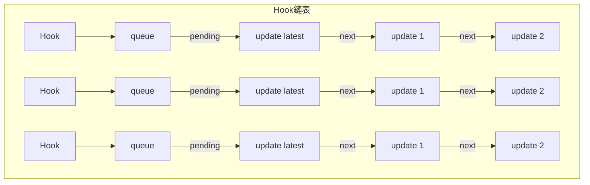
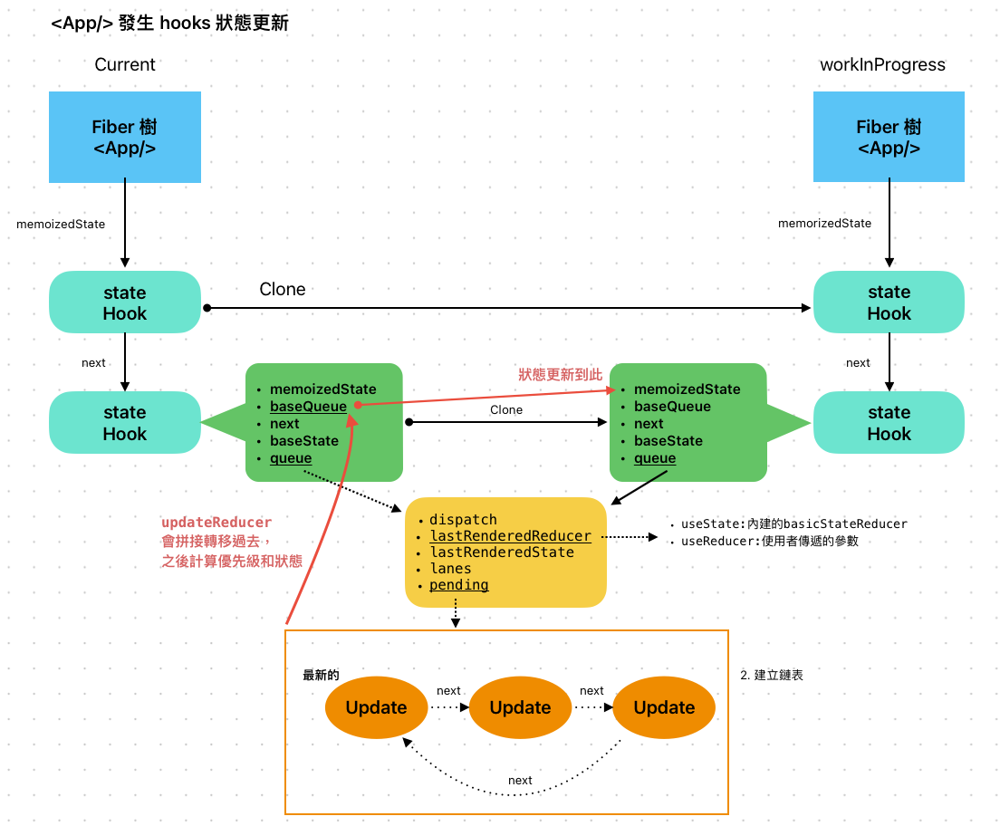

# hooks

## renderWithHooks

在一開始，尋找 hooks 的源頭，發現不管是哪一個 hook 都是調用 `resolveDispatcher`，

> react-debugger/src/react/packages/react/src/ReactHooks.js

```ts
export function useState(initialState) {
  const dispatcher = resolveDispatcher();
  return dispatcher.useState(initialState);
}

export function useReducer(reducer, initialArg, init) {
  const dispatcher = resolveDispatcher();
  return dispatcher.useReducer(reducer, initialArg, init);
}

export function useRef(initialValue) {
  const dispatcher = resolveDispatcher();
  return dispatcher.useRef(initialValue);
}

export function useEffect(create, deps) {
  const dispatcher = resolveDispatcher();
  return dispatcher.useEffect(create, deps);
}
// ... 省略
```

往上朔，會發現他是取 `ReactCurrentDispatcher.current`

> react-debugger/src/react/packages/react/src/ReactHooks.js

```ts
function resolveDispatcher() {
  // console.log("ReactCurrentDispatcher", ReactCurrentDispatcher);
  const dispatcher = ReactCurrentDispatcher.current;

  // Will result in a null access error if accessed outside render phase. We
  // intentionally don't throw our own error because this is in a hot path.
  // Also helps ensure this is inlined.
  return dispatcher;
}
```

而這個變數存在在 `react-debugger/src/react/packages/react/src/ReactHooks.js`，
回到處理 fiber 時，進入 `beginWork`，判定是 `FunctionComponent` 時，調用 `updateFunctionComponent` ，看到 `renderWithHooks` 返回了子節點 React Element 對象，再去調用 `reconcileChildren`

> react-debugger/src/react/packages/react-reconciler/src/ReactFiberBeginWork.js

```ts
// currentlyRenderingFiber.memoizedState 指向第一個 hook
let currentlyRenderingFiber = null;
// 透過這個指向，讓函式組件執行時，依序調用 hooks 可以指到當前運作的 hook 是誰
let currentHook = null;
// 指向最後一個hook
let workInProgressHook = null;

function updateFunctionComponent(
  current,
  workInProgress,
  Component,
  nextProps,
  renderLanes
) {
  // 省略

  // * 處理 hooks，要把 hooks 和 fiber 關聯
  nextChildren = renderWithHooks(
    current,
    workInProgress,
    Component,
    nextProps,
    context,
    renderLanes
  );

  // 省略
  // ! 如果是更新階段，但又沒有接到新的更新，則復用老節點，退出更新
  if (current !== null && !didReceiveUpdate) {
    bailoutHooks(current, workInProgress, renderLanes);
    return bailoutOnAlreadyFinishedWork(current, workInProgress, renderLanes);
  }
  // 省略
  // React DevTools reads this flag.
  workInProgress.flags |= PerformedWork;
  reconcileChildren(current, workInProgress, nextChildren, renderLanes);
  return workInProgress.child;
}
```

在 `renderWithHooks` 會判斷是在更新或是初始化階段，賦予不同的值。
並且會把 workInProgress 的整個 hook 鏈表和 lanes 和 effect 重置，

```ts
export function renderWithHooks(
  current,
  workInProgress,
  Component,
  props,
  secondArg,
  nextRenderLanes
) {
  // ! 1. 設定全域變數
  // 紀錄到變量當中，現在執行到哪個 fiber ，因為 workInProgress 不存在在這個文件作用域中
  renderLanes = nextRenderLanes;
  currentlyRenderingFiber = workInProgress;

  // ! 初始化，清除目前fiber的遺留狀態
  // ! 每次函式組件執行時，會重新設定
  workInProgress.memoizedState = null;
  workInProgress.updateQueue = null;
  workInProgress.lanes = NoLanes;

  // The following should have already been reset
  // currentHook = null;
  // workInProgressHook = null;

  // didScheduleRenderPhaseUpdate = false;
  // localIdCounter = 0;
  // thenableIndexCounter = 0;
  // thenableState = null;

  // TODO Warn if no hooks are used at all during mount, then some are used during update.
  // Currently we will identify the update render as a mount because memoizedState === null.
  // This is tricky because it's valid for certain types of components (e.g. React.lazy)

  // Using memoizedState to differentiate between mount/update only works if at least one stateful hook is used.
  // Non-stateful hooks (e.g. context) don't get added to memoizedState,
  // so memoizedState would be null during updates and mounts.
  if (__DEV__) {
    // 省略
  } else {
    // ! 2. 呼叫function
    // ! 如果組件是初次掛載，回傳的物件對應的 hooks api 是 for mount 的
    // ! 如果組件是更新，回傳的物件對應的 hooks api 是 for update 的
    // ! 雖然對於使用者來說，都是一樣叫做 useState || useEffect 但實際執行的函式有變化
    ReactCurrentDispatcher.current =
      current === null || current.memoizedState === null
        ? HooksDispatcherOnMount
        : HooksDispatcherOnUpdate;
  }

  // ! 函式執行，產生子 ReactElement
  let children = Component(props, secondArg);

  // 省略

  // ! 3. 把全局變量再重置
  finishRenderingHooks(current, workInProgress, Component);

  return children;
}
```

主要是看這段

```ts
ReactCurrentDispatcher.current =
  current === null || current.memoizedState === null
    ? HooksDispatcherOnMount
    : HooksDispatcherOnUpdate;
```

```ts
const HooksDispatcherOnMount: Dispatcher = {
  ...
  useCallback: mountCallback,
  useContext: readContext,
  useEffect: mountEffect,
  useImperativeHandle: mountImperativeHandle,
  useLayoutEffect: mountLayoutEffect,
  useMemo: mountMemo,
  useReducer: mountReducer,
  useRef: mountRef,
  useState: mountState,
  ...
};

const HooksDispatcherOnUpdate: Dispatcher = {
  ...
  useCallback: updateCallback,
  useContext: readContext,
  useEffect: updateEffect,
  useImperativeHandle: updateImperativeHandle,
  useLayoutEffect: updateLayoutEffect,
  useMemo: updateMemo,
  useReducer: updateReducer,
  useRef: updateRef,
  useState: updateState,
  ...
};
```

初始時，都會調用 `mountWorkInProgressHook`，會創建 hook，在此之前先來講 hook 的結構和型別

## 型別

```ts
  export type Update<S, A> = {
    lane: Lane;
    action: A;
    hasEagerState: boolean;
    eagerState: S | null;
    next: Update<S, A>;
  };

  // hook 上有 queue
  export type UpdateQueue<S, A> = {
    pending: Update<S, A> | null;
    lanes: Lanes;
    dispatch: (A => mixed) | null;
    lastRenderedReducer: ((S, A) => S) | null; // 上次執行的 reducer
    lastRenderedState: S | null; // 組件上次掛載的狀態
  };

  export type Hook = {
    // 不同類型的 hook，存的內容不同
    // useState / useReducer 存 state，
    // useEffect / useLayoutEffect 存 effect 單向循環鏈表，指向最後一個 effect
    memorizedState: any;

    // 下一個 hook，如果是 null，表示他是最後一個 hook
    next: Hook | null;

    baseState: any; // 所有的 update 對象合併後的狀態（比方說setState多次調用
    baseQueue: Update<any, any> | null; // 環形鏈表，只有包含高於本次渲染優先級的 update對象
    queue:  UpdateQueue <any , any > | null; // 包括所有優先級的 update 對象
  };

  export type FunctionComponentUpdateQueue = {|
    lastEffect: Effect | null, // 單向循環鏈表
    stores: Array<StoreConsistencyCheck<any>> | null,
  |};

  type Effect = {
    tag: HookFlags; // 標記 Hook 類型
    create: () => (() => void) | void; // 就是放在 useEffect 和 useLayoutEffect 的第一個參數
    destroy: (() => void) | void; // 就是放在 useEffect 和 useLayoutEffect 的第一個參數回傳的函式
    deps: Array<any> | void | null; // 依賴項
    next: null | Effect; // 指向下一個 effect，是單向循環鏈表
  };
```

注意：`狀態 hooks` 使用 fiber.memorizedState 內儲存的狀態 hook 自己的 queue 和 baseState、baseQueue，但 `effect hooks` 用 hook.memorizedState 儲存 effect 單向循環鏈表，還有使用 fiber.updateQueue， 在儲存內部的函式和依賴項。

## 所有 hook 共同調用的函式

### 初始化 - mountWorkInProgressHook

初始化時調用 `mountWorkInProgressHook`，每種 hooks 需要保存不一樣的值

```ts
// ! 掛載階段沒辦法復用，直接創建
function mountWorkInProgressHook() {
  const hook = {
    memoizedState: null, // 上次渲染用的 state
    baseState: null, // 已經處理的 update 計算出來的 state
    baseQueue: null, // 還沒處理的 update 隊列（上一次還沒處理完的
    queue: null, // 當前的 update 隊列
    next: null, // 指向下一個 hook
  };

  if (workInProgressHook === null) {
    // This is the first hook in the list
    // ! 現在是第 0 個 hook，是頭節點，currentlyRenderingFiber 指向 workInProgress
    // ! 把 workInProgressHook 掛載到 fiber.memoizedState 上面
    currentlyRenderingFiber.memoizedState = workInProgressHook = hook;
  } else {
    // Append to the end of the list
    // ! 是單鏈表用 next 鏈接
    workInProgressHook = workInProgressHook.next = hook;
  }
  return workInProgressHook;
}
```

### 更新 - updateWorkInProgressHook

更新時，都會調用 `updateWorkInProgressHook`

- fiber 樹有兩顆對應新舊， hooks 也有兩個鏈表對應新舊
- 開始正式計算新的狀態之前，當前的樣子是：
  在 mount 階段，已經構建好一個 hooks 鏈表存在 memoizedState 上; 更新階段再跑一次 `beginWork`，在 `renderWithHooks` 會 reset hooks 鏈表、狀態和 effect。
- 再執行 `updateWorkInProgressHook` ，使用 `nextCurrentHook` 和 `nextWorkInProgressHook` 來識別下一個 hook，如果新的 `nextWorkInProgressHook` 存在，直接使用它，不然就複製 `currentHook` 來用。

- 為什麼要重構 hooks?
  1. 確保最新狀態：每次更新時，組件邏輯可能會有所變化，要確保所有 hook 狀態是最新的。比如 useState 的值或是 useEffect 的依賴項。
  2. 支持併發模式：可能會中斷渲染，退回之前的狀態，獨立構建的鏈表可以避免影響到舊的 fiber。
  3. 性能優化：最大化的復用 hook，減少不必要的操作。
- 操作流程是？

  1. 把 `hook.queue.pending` 上的更新們，轉移到 `hook.baseQueue`（記得嗎？他是環形鏈表），把 `hook.queue.pending` 設置為空。
  2. 循環遍歷 `hook.baseQueue`，找出符合當前優先級的更新

     - 如果優先權不夠先暫存並略過，等待下次渲染
     - 如果足夠則執行該 update 的 action，計算出新的狀態，作為回傳值

  3. 看 `update.hasEagerState` 看是否是`useState`的呼叫，可以直接用 `eagerState`，如果是 `useReducer` 還要走到 `reducer` 計算結果

```ts
// ! renderWithHooks 中設定 workInProgress.memoizedState = null，
// ! workInProgressHook 一開始也是 null，只能從 currentHook clone
// ! clone 過來的 newHook.next = null，所以 workInProgressHook 會完全重建
function updateWorkInProgressHook() {
  // This function is used both for updates and for re-renders triggered by a
  // render phase update. It assumes there is either a current hook we can
  // clone, or a work-in-progress hook from a previous render pass that we can
  // use as a base.
  // ! 1. 拿 current 樹上的 hook 鏈表
  let nextCurrentHook;
  if (currentHook === null) {
    const current = currentlyRenderingFiber.alternate;
    if (current !== null) {
      nextCurrentHook = current.memoizedState;
    } else {
      nextCurrentHook = null;
    }
  } else {
    nextCurrentHook = currentHook.next;
  }
  // ! 2. 拿 workInProgress 樹上的 hook 鏈表
  let nextWorkInProgressHook;
  if (workInProgressHook === null) {
    nextWorkInProgressHook = currentlyRenderingFiber.memoizedState;
  } else {
    nextWorkInProgressHook = workInProgressHook.next;
  }

  // ! 如果 nextWorkInProgressHook 不為空，直接使用
  if (nextWorkInProgressHook !== null) {
    // There's already a work-in-progress. Reuse it.
    workInProgressHook = nextWorkInProgressHook;
    nextWorkInProgressHook = workInProgressHook.next;

    currentHook = nextCurrentHook;
  } else {
    // Clone from the current hook.
    // ! 不然就複製 currentHook
    if (nextCurrentHook === null) {
      const currentFiber = currentlyRenderingFiber.alternate;
      if (currentFiber === null) {
        // This is the initial render. This branch is reached when the component
        // suspends, resumes, then renders an additional hook.
        // Should never be reached because we should switch to the mount dispatcher first.
        throw new Error(
          "Update hook called on initial render. This is likely a bug in React. Please file an issue."
        );
      } else {
        // This is an update. We should always have a current hook.
        throw new Error("Rendered more hooks than during the previous render.");
      }
    }

    currentHook = nextCurrentHook;
    // ! 3. 複製 currentHook 作為新的 workInProgressHook.
    // ! 之後邏輯和 mountWorkInProgressHook 一致
    const newHook = {
      memoizedState: currentHook.memoizedState,

      baseState: currentHook.baseState,
      baseQueue: currentHook.baseQueue,
      queue: currentHook.queue,

      next: null, // ! 預設是 null
    };

    if (workInProgressHook === null) {
      // This is the first hook in the list.
      currentlyRenderingFiber.memoizedState = workInProgressHook = newHook;
    } else {
      // Append to the end of the list.
      workInProgressHook = workInProgressHook.next = newHook;
    }
  }
  return workInProgressHook;
}
```

也因為要 hooks 鏈表需要複製使用，要確保順序一樣，但鏈表又沒有下標，因此完全不能在 hook 外部使用條件句或是在循環中呼叫，需要將函式放在頂層。否則會產生不可預期的結果。

## 緩存 hooks - useCallback, useMemo

我們都知道 `useCallback` 的參數長這樣：

```ts
useCallback(fn, dependencies);
```

如果依賴項沒有變化，就會回傳一樣的 fn。 依賴項會使用 `Object.is` 比較每一個和先前的值是否一致。
通常會和 react.memo 做搭配使用，函式以 props 傳入子組件，因為 memo 是透過校驗 props 的記憶體位置來判定是否相同（傳址），只要物件位址一致就不會觸發渲染。

他的源碼很簡潔，在初始時，記憶參數到 `memoizedState` 上，更新時，比較依賴項，回傳快取的函式，不然把新的替換上 `memoizedState`

```ts
function mountCallback(callback, deps) {
  const hook = mountWorkInProgressHook();
  const nextDeps = deps === undefined ? null : deps;
  hook.memoizedState = [callback, nextDeps];
  return callback;
}

function updateCallback(callback, deps) {
  const hook = updateWorkInProgressHook();
  const nextDeps = deps === undefined ? null : deps;
  const prevState = hook.memoizedState;
  if (nextDeps !== null) {
    const prevDeps = prevState[1];
    if (areHookInputsEqual(nextDeps, prevDeps)) {
      return prevState[0];
    }
  }
  hook.memoizedState = [callback, nextDeps];
  return callback;
}

function areHookInputsEqual(nextDeps, prevDeps) {
  if (prevDeps === null) {
    return false;
  }

  // $FlowFixMe[incompatible-use] found when upgrading Flow
  for (let i = 0; i < prevDeps.length && i < nextDeps.length; i++) {
    // $FlowFixMe[incompatible-use] found when upgrading Flow
    if (is(nextDeps[i], prevDeps[i])) {
      continue;
    }
    return false;
  }
  return true;
}
```

同樣的原理套用在 `useMemo` 上

```ts
const cachedValue = useMemo(calculateValue, dependencies);
```

```ts
function mountMemo(nextCreate, deps) {
  const hook = mountWorkInProgressHook();
  const nextDeps = deps === undefined ? null : deps;
  if (shouldDoubleInvokeUserFnsInHooksDEV) {
    nextCreate();
  }
  const nextValue = nextCreate();
  hook.memoizedState = [nextValue, nextDeps];
  return nextValue;
}

function updateMemo(nextCreate, deps) {
  const hook = updateWorkInProgressHook();
  const nextDeps = deps === undefined ? null : deps;
  const prevState = hook.memoizedState;
  // Assume these are defined. If they're not, areHookInputsEqual will warn.
  if (nextDeps !== null) {
    const prevDeps = prevState[1];
    if (areHookInputsEqual(nextDeps, prevDeps)) {
      return prevState[0];
    }
  }
  const nextValue = nextCreate(); // ! 主要差異是要執行結果再緩存
  hook.memoizedState = [nextValue, nextDeps];
  return nextValue;
}
```

### 順便看 memo 源碼

在 `beginWork` 中，會特別處理

```ts
switch (workInProgress.tag) {
  // 省略
  case MemoComponent: {
    const type = workInProgress.type;
    const unresolvedProps = workInProgress.pendingProps;
    // Resolve outer props first, then resolve inner props.
    let resolvedProps = resolveDefaultProps(type, unresolvedProps); // type 是 memo 包裹的組件
    resolvedProps = resolveDefaultProps(type.type, resolvedProps); // type.type 是指自己的組件
    return updateMemoComponent(
      current,
      workInProgress,
      type,
      resolvedProps,
      renderLanes
    );
  }
  // 省略
}

function updateMemoComponent(
  current: Fiber | null,
  workInProgress: Fiber,
  Component: any,
  nextProps: any,
  renderLanes: Lanes
): null | Fiber {
  if (current === null) {
    //省略
    const prevProps = currentChild.memoizedProps;
    let compare = Component.compare; // 可以傳入自定義的比較函式
    compare = compare !== null ? compare : shallowEqual; // 這個是淺層比較，比較每一個 props 用 Object.is 判定，如果是基本型別一樣就不會重繪，如果是物件型別要位址一樣
    // 如果一樣就復用之前的
    if (compare(prevProps, nextProps) && current.ref === workInProgress.ref) {
      return bailoutOnAlreadyFinishedWork(current, workInProgress, renderLanes);
    }
  }
  workInProgress.flags |= PerformedWork;
  const newChild = createWorkInProgress(currentChild, nextProps);
  newChild.ref = workInProgress.ref;
  newChild.return = workInProgress;
  workInProgress.child = newChild;
  return newChild;
}
```

為什麼會呼叫兩次 `resolveDefaultProps` ?

```ts
const MyComponent = (props) => {
  return <div>{props.name}</div>;
};

MyComponent.defaultProps = {
  name: "Default Name",
};

const MemoizedComponent = React.memo(MyComponent);

MemoizedComponent.defaultProps = {
  name: "Memoized Default Name",
};
```

因為可能會有兩層自己的 props，

## 緩存 hooks - useRef

有兩種用法，存緩存的值或是存 DOM 物件。每次渲染時，都會回傳同一個物件，但 ref 並不會觸發重新渲染。

```ts
function mountRef(initialValue) {
  const hook = mountWorkInProgressHook();

  // 省略
  const ref = { current: initialValue };
  hook.memoizedState = ref;
  return ref;
}

function updateRef(initialValue) {
  const hook = updateWorkInProgressHook();
  return hook.memoizedState;
}
```

ref 是可以操作 DOM 的，所以要怎麼綁定？在哪裡綁？

在一開始從 reactElement -> fiber 時，處理 props 就有單獨對 ref 做處理，在 `useRef` 或 `createRef` 傳入的，同步到 fiber 上。
`beginWork` 時，會在 `flags` 上標記，在 `completeWork` 也有另一個標記函式做同樣的事情！之後在處理時，可以進行相關的操作。

進入 commit

- `commitMutationEffectsOnFiber`: 會進行遞歸處理刪除，並且呼叫 `safelyDetachRef`，判定 ref 是否是函式，如果是：則是類組件 `createRef` 創造的，則呼叫他 `ref(null)`，把內部直設定成空; 如果不是：就把 `useRef` 值設定成 null。
- `commitLayoutEffect`: 會操作真實 DOM，如果 `flags` 有標記，則處理綁定 DOM(原生節點的話) 或是 `fiber.stateNode` 或是實例。

### 總結

- createRef 是每次渲染時重新創建的，所以每次渲染都會得到一個新的 ref 物件。useRef 返回的物件引用是固定的，它在組件渲染期間保持不變，只能改變 .current 的內容。
- 如果 useRef 被用來指向某個 DOM 節點，它的賦值和重置會發生在 React 的 commit 階段。
- useRef 作為一個 "容器" 存儲可變的值，在組件的生命週期內持續存在。不會觸發組件重新渲染，不會在組件重新渲染時重置或丟失。

### 另補充 forwardRef

能夠將其接受的 ref 屬性轉送到其元件樹下的另一個元件中。

- 它解決了組件封裝時，父組件需要訪問子組件內部 DOM 或方法的問題。在高階組件中，中間隔了一層，傳遞 ref 會失敗

- 函數組件不支持 ref，需要 forwardRef 來將 ref 從父組件傳遞給子組件內部的 DOM 元素或組件實例。

- 配合 useImperativeHandle 可以提供更靈活的自定義接口，讓 ref 暴露更多可控功能。

```ts
import React, { useRef, forwardRef, useImperativeHandle } from "react";

const CustomInput = forwardRef((props, ref) => {
  const inputRef = useRef();

  // 自定義暴露給父組件的 ref 方法和屬性
  useImperativeHandle(ref, () => ({
    focus: () => {
      inputRef.current.focus();
    },
    clear: () => {
      inputRef.current.value = "";
    },
  }));

  return <input ref={inputRef} />;
});

const App = () => {
  const inputRef = useRef();

  return (
    <div>
      <CustomInput ref={inputRef} />
      <button onClick={() => inputRef.current.focus()}>Focus</button>
      <button onClick={() => inputRef.current.clear()}>Clear</button>
    </div>
  );
};

export default App;
```

## 狀態 hooks - useState, useReducer

基本用法

```ts
setState(newState);
setState((prevState) => prevState + 1);
```

兩者有什麼差異呢？ 都知道 setState 是非同步的，函式的更新會拿到最新值，一般值則不然。
如果同時做多次的更新就會發現差異！

```ts
// ! 在同一次渲染之中
// count 的值是固定的，三次都是設定一樣的值
function handleClick() {
  setCount(count + 1);
  setCount(count + 1);
  setCount(count + 1);
}
// count 從函式的參數中取到 回傳的都是不一樣且最新的值
function handleClick() {
  setCount((count) => count + 1);
  setCount((count) => count + 1);
  setCount((count) => count + 1);
}
```

另外，如果值是物件，類組件是合併物件，函式組件是替換（Object.is 比較後不一樣就替換）。



useReducer：

```ts
const [state, dispatch] = useReducer(reducer, initialArg, init?)
```

初始時，

```ts
function mountReducer(reducer, initialArg, init) {
  // ! 1. 構建 hooks 鏈表
  const hook = mountWorkInProgressHook();
  let initialState;
  // ! 2. 拿初始 state，初始屬性
  // 可看官網，第三個參數是可選的函式
  if (init !== undefined) {
    initialState = init(initialArg);
  } else {
    initialState = initialArg;
  }
  // 初始化放到 hook 節點的memoizedState和baseState屬性上
  // memoizedState: 上一次處理完成的 state
  // baseState: 目前已經處理完的更新所產生的 state
  // 因為是初始化，所以設定為初始值
  hook.memoizedState = hook.baseState = initialState;
  const queue = {
    pending: null,
    lanes: NoLanes,
    dispatch: null,
    lastRenderedReducer: reducer, // 綁上上次 setState 傳入的內容，可能是函式||值
    lastRenderedState: initialState, // 上次 render 過後的 state
  };
  // 建立更新貯列
  hook.queue = queue; // 不同的 hook 不一定會使用

  // ! 3. 設定hook.dispatch
  const dispatch = (queue.dispatch = dispatchReducerAction.bind(
    null,
    currentlyRenderingFiber,
    queue
  ));
  // ! 4. 返回[目前狀態, dispatch函數]
  return [hook.memoizedState, dispatch];
}

function dispatchReducerAction(fiber, queue, action) {
  // ! 得到 lane
  const lane = requestUpdateLane(fiber);

  // ! 創建 update，和 fiber.updateQueue 是不一樣的喔
  const update = {
    lane,
    revertLane: NoLane,
    action,
    hasEagerState: false,
    eagerState: null,
    next: null,
  };

  if (isRenderPhaseUpdate(fiber)) {
    // 在渲染階段的更新，不會走到這裡
    enqueueRenderPhaseUpdate(queue, update);
  } else {
    // ! 把 update 暫存到 concurrentQueues 陣列當中，
    const root = enqueueConcurrentHookUpdate(fiber, queue, update, lane);
    if (root !== null) {
      // ! 調度更新，之後 finishQueueingConcurrentUpdates，會把 concurrentQueues 的內容添加到 fiber.memorizedState 的 hook 的 queue.pending 上
      scheduleUpdateOnFiber(root, fiber, lane);
      entangleTransitionUpdate(root, queue, lane);
    }
  }

  markUpdateInDevTools(fiber, lane, action);
}
```

流程圖

```rust
用戶事件 (onClick)
   |
修改 executionContext (DiscreteEventContext)
   |
執行回調 -> 呼叫 setState
   |
計算優先級 -> 拿到當前上下文中對應的優先級(getCurrentUpdatePriority)，創建 update，儲存在內存的陣列當中
   |
加入更新隊列 (hook.queue.pending 或 fiber.updateQueue.shared.pending)
   |
調度更新 (scheduleUpdateOnFiber)
   |
進入 render 階段 -> 應用更新
   |
完成 commit 階段 -> 更新 DOM
```

同步看下一樣式狀態更新的 `mountState`，

```ts
// ! 創建＆初始化 hook，最後返回[目前狀態, dispatch函數]
function mountState(initialState) {
  // ! 1. 建立 hook，初始化屬性
  const hook = mountStateImpl(initialState);
  // ! 設定 queue
  const queue = hook.queue;
  // ! 2. 設定 hook.dispatch
  const dispatch = dispatchSetState.bind(null, currentlyRenderingFiber, queue);
  queue.dispatch = dispatch;
  // ! 3. 返回[目前狀態, dispatch函數]
  return [hook.memoizedState, dispatch];
}

function mountStateImpl(initialState) {
  const hook = mountWorkInProgressHook();
  if (typeof initialState === "function") {
    // $FlowFixMe[incompatible-use]: Flow doesn't like mixed types
    initialState = initialState();
  }

  hook.memoizedState = hook.baseState = initialState;
  const queue = {
    pending: null,
    lanes: NoLanes,
    dispatch: null,
    lastRenderedReducer: basicStateReducer, // ! 內建的函式，和 useReducer 不同的地方
    lastRenderedState: initialState,
  };
  hook.queue = queue;
  return hook;
}

function basicStateReducer(state, action) {
  // $FlowFixMe[incompatible-use]: Flow doesn't like mixed types
  return typeof action === "function" ? action(state) : action;
}

function dispatchSetState(fiber, queue, action) {
  const lane = requestUpdateLane(fiber);

  const update = {
    lane,
    revertLane: NoLane,
    action,
    hasEagerState: false,
    eagerState: null,
    next: null,
  };

  if (isRenderPhaseUpdate(fiber)) {
    enqueueRenderPhaseUpdate(queue, update);
  } else {
    const alternate = fiber.alternate;
    // ! 下面這個if判斷, 能保證目前建立的update, 是`queue.pending`中第一個`update`.
    // ! 為什麼? 發起更新之後fiber.lanes會被改動, 如果`fiber.lanes && alternate.lanes`沒有被改動, 自然就是首個update
    if (
      fiber.lanes === NoLanes &&
      (alternate === null || alternate.lanes === NoLanes)
    ) {
      // The queue is currently empty, which means we can eagerly compute the
      // next state before entering the render phase. If the new state is the
      // same as the current state, we may be able to bail out entirely.
      const lastRenderedReducer = queue.lastRenderedReducer;
      if (lastRenderedReducer !== null) {
        let prevDispatcher;
        if (__DEV__) {
          prevDispatcher = ReactCurrentDispatcher.current;
          ReactCurrentDispatcher.current =
            InvalidNestedHooksDispatcherOnUpdateInDEV;
        }
        try {
          const currentState = queue.lastRenderedState;
          const eagerState = lastRenderedReducer(currentState, action);
          // Stash the eagerly computed state, and the reducer used to compute
          // it, on the update object. If the reducer hasn't changed by the
          // time we enter the render phase, then the eager state can be used
          // without calling the reducer again.
          // ! 如果在render階段reducer==update.eagerReducer, 則可以直接使用無需再次計算 是useState
          update.hasEagerState = true;
          update.eagerState = eagerState;
          // ! eagerState與currentState相同, 無需調度更新
          // ! update 已經被加到了 queue.pending, 並沒有丟棄. 之後需要更新的時候, 此update還是會起作用
          if (is(eagerState, currentState)) {
            // Fast path. We can bail out without scheduling React to re-render.
            // It's still possible that we'll need to rebase this update later,
            // if the component re-renders for a different reason and by that
            // time the reducer has changed.
            // TODO: Do we still need to entangle transitions in this case?
            enqueueConcurrentHookUpdateAndEagerlyBailout(fiber, queue, update);
            return;
          }
        } catch (error) {
          // Suppress the error. It will throw again in the render phase.
        }
      }
    }

    const root = enqueueConcurrentHookUpdate(fiber, queue, update, lane);
    if (root !== null) {
      scheduleUpdateOnFiber(root, fiber, lane);
      entangleTransitionUpdate(root, queue, lane);
    }
  }
}
```

更新時，會執行 `dispatchReducerAction`

1. 創建 update
2. 把 update 入隊，暫存到 concurrentQueue array 中
3. 調度更新，放到 hook.queue.pending 上面
4. 執行更新

流程圖

```rust
dispatchReducerAction
   |
enqueueUpdate (update 入隊)
   |
scheduleUpdateOnFiber
   |
finishQueueingConcurrentUpdates（把更新掛載到 fiber 的 hooks 儲存處的 queue.pending 上）
   | render 階段
beginWork
   |
updateFunctionComponent
   |
renderWithHooks（再次執行函式組件）
   |
useReducer（再次執行函式組件內的 useReducer，指向 updateReducer，執行完成後返回新的 state 和 dispatch）
   |
updateWorkInProgressHook 看是否復用 hook 拼接到 workInProgressHook 上，改變指針，讓下個 hook 有指向
   |
updateReducerImpl(處理 pending 隊列和之前遺留的隊列合併，優先處理 pending 新增的，因為是用戶最新的交互，優先級可能會更高。遍歷 hook 上待更新隊列，按照優先級判定執行與否。計算出最新的 state，（執行待更新隊列時，如果此更新是存函式(ex:`setCount((count) => count + 1);`) ，所傳入的參數是 最新的狀態值，如果是一般值的更新，就是取同一個值本身)，作為新的 回傳值，看是否要更新，處理標籤。如果不符合優先級，則將此更新以後的其他更新，保留鏈表儲存起來，並將處理到一半的狀態也保留。
   |
finishQueueingConcurrentUpdates (上個更新可能又產生新的 update)
   |
完成 commit 階段 -> 更新 DOM
```

> react-debugger/src/react/packages/react-reconciler/src/ReactFiberHooks.js

```ts
function updateReducer(reducer, initialArg, init) {
  const hook = updateWorkInProgressHook();
  return updateReducerImpl(hook, currentHook, reducer);
}

function updateReducerImpl(hook, current, reducer) {
  const queue = hook.queue;

  if (queue === null) {
    throw new Error(
      "Should have a queue. This is likely a bug in React. Please file an issue."
    );
  }

  queue.lastRenderedReducer = reducer;

  // The last rebase update that is NOT part of the base state.
  // ! 上次優先度不足遺留下來的任務
  let baseQueue = hook.baseQueue; // ! 單向循環鏈表

  // The last pending update that hasn't been processed yet.
  // ! 新的待更新 queue
  const pendingQueue = queue.pending;
  // !!! 把 pendingQueue 轉移到 baseQueue，拼接起來
  // ! ex:
  // ! baseQueue: A -> B -> C (-> A) (環形的，C next-> A)
  // ! pendingQueue: D -> E (-> D) (環形的，E next-> D)
  // ! 合併後 A -> D -> E -> B -> C (-> A)
  if (pendingQueue !== null) {
    // We have new updates that haven't been processed yet.
    // We'll add them to the base queue.
    if (baseQueue !== null) {
      // Merge the pending queue and the base queue.
      const baseFirst = baseQueue.next; // ! A
      const pendingFirst = pendingQueue.next; // ! D
      baseQueue.next = pendingFirst; // ! C -> D
      pendingQueue.next = baseFirst; // ! E -> A
    }

    // ! baseQueue: A -> B -> C -> D -> E (-> A)
    // ! pendingQueue: D -> E -> A -> B -> C (-> D)
    // ! 全部被更新成： D -> E -> A -> B -> C (-> D)
    current.baseQueue = baseQueue = pendingQueue;
    queue.pending = null;
  }

  // pendingQueue ! == null
  if (baseQueue !== null) {
    // We have a queue to process.
    // ! pendingFirst，優先處理 pending
    // ! 因為是可能被中斷的，所以要記下上次執行到一半的結果，可能不等於當前渲染的結果
    // ! 確保在高優先級打斷當前渲染時，可以回退到一個穩定的狀態
    // ! memoizedState 是最後一次渲染計算的狀態結果
    // ! baseState 會是 commit 的結果
    const first = baseQueue.next; // !D
    // ! 上次渲染的值
    let newState = hook.baseState; // ! 上次渲染的結果值，每次循環時計算再賦值，供下次循環使用
    // ! 新的渲染用的狀態值
    let newBaseState = null;
    // ! 新的 baseQueue，用於儲存優先級不符合，或是中斷後尚未計算的 queue 鏈表頭節點
    let newBaseQueueFirst = null; // ! 新的 baseQueue
    let newBaseQueueLast = null;
    let update = first;
    // !! 循環遍歷 hooks 鏈表，找出符合當前優先級的更新
    do {
      // An extra OffscreenLane bit is added to updates that were made to
      // a hidden tree, so that we can distinguish them from updates that were
      // already there when the tree was hidden.
      const updateLane = removeLanes(update.lane, OffscreenLane);
      const isHiddenUpdate = updateLane !== update.lane;

      // Check if this update was made while the tree was hidden. If so, then
      // it's not a "base" update and we should disregard the extra base lanes
      // that were added to renderLanes when we entered the Offscreen tree.
      const shouldSkipUpdate = isHiddenUpdate
        ? !isSubsetOfLanes(getWorkInProgressRootRenderLanes(), updateLane)
        : // ! 如果 lane 沒有變動，表示沒有更新
          !isSubsetOfLanes(renderLanes, updateLane);

      // ! 優先權不夠，加入 baseQueue, 等待下次render
      if (shouldSkipUpdate) {
        // Priority is insufficient. Skip this update. If this is the first
        // skipped update, the previous update/state is the new base
        // update/state.
        const clone = {
          lane: updateLane,
          revertLane: update.revertLane,
          action: update.action,
          hasEagerState: update.hasEagerState,
          eagerState: update.eagerState,
          next: null,
        };
        // ! 首次發現低優先級
        if (newBaseQueueLast === null) {
          newBaseQueueFirst = newBaseQueueLast = clone;
          newBaseState = newState; // 紀錄跳過此更新時的狀態
        } else {
          newBaseQueueLast = newBaseQueueLast.next = clone;
        }
        // Update the remaining priority in the queue.
        // TODO: Don't need to accumulate this. Instead, we can remove
        // renderLanes from the original lanes.
        // ! 更新優先級
        currentlyRenderingFiber.lanes = mergeLanes(
          currentlyRenderingFiber.lanes,
          updateLane
        );
        // ! 標示跳過的任務的優先級
        markSkippedUpdateLanes(updateLane);
      } else {
        // ! 優先權足夠，狀態合併
        // This update does have sufficient priority.

        // Check if this is an optimistic update.
        // ! 之前的節點有不能執行的，但我們需要保存這個更新在佇列中，之後可以重新調整基礎
        const revertLane = update.revertLane;
        if (!enableAsyncActions || revertLane === NoLane) {
          // This is not an optimistic update, and we're going to apply it now.
          // But, if there were earlier updates that were skipped, we need to
          // leave this update in the queue so it can be rebased later.
          if (newBaseQueueLast !== null) {
            const clone = {
              // This update is going to be committed so we never want uncommit
              // it. Using NoLane works because 0 is a subset of all bitmasks, so
              // this will never be skipped by the check above.
              // ! 該 update 需要被執行 要進入 commit 階段，使用 NoLane，避免跳過
              lane: NoLane, // ! 標記為無需再次處理
              revertLane: NoLane,
              action: update.action,
              hasEagerState: update.hasEagerState,
              eagerState: update.eagerState,
              next: null,
            };
            newBaseQueueLast = newBaseQueueLast.next = clone;
          }
        } else {
          // This is an optimistic update. If the "revert" priority is
          // sufficient, don't apply the update. Otherwise, apply the update,
          // but leave it in the queue so it can be either reverted or
          // rebased in a subsequent render.
          if (isSubsetOfLanes(renderLanes, revertLane)) {
            // The transition that this optimistic update is associated with
            // has finished. Pretend the update doesn't exist by skipping
            // over it.
            update = update.next;
            continue;
          } else {
            const clone = {
              // Once we commit an optimistic update, we shouldn't uncommit it
              // until the transition it is associated with has finished
              // (represented by revertLane). Using NoLane here works because 0
              // is a subset of all bitmasks, so this will never be skipped by
              // the check above.
              lane: NoLane,
              // Reuse the same revertLane so we know when the transition
              // has finished.
              revertLane: update.revertLane,
              action: update.action,
              hasEagerState: update.hasEagerState,
              eagerState: update.eagerState,
              next: null,
            };
            if (newBaseQueueLast === null) {
              newBaseQueueFirst = newBaseQueueLast = clone;
              newBaseState = newState;
            } else {
              newBaseQueueLast = newBaseQueueLast.next = clone;
            }
            // Update the remaining priority in the queue.
            // TODO: Don't need to accumulate this. Instead, we can remove
            // renderLanes from the original lanes.
            currentlyRenderingFiber.lanes = mergeLanes(
              currentlyRenderingFiber.lanes,
              revertLane
            );
            markSkippedUpdateLanes(revertLane);
          }
        }

        // Process this update.
        // ! 優先權足夠可以計算最新的狀態
        // !!! 走到這裡，拿到更新的 payload，setCount(1 // 這個)
        const action = update.action;
        if (shouldDoubleInvokeUserFnsInHooksDEV) {
          reducer(newState, action);
        }
        // ! hasEagerState : 是否已經提前計算好更新狀態了，可以直接拿取結果，不用再調用 reducer
        // ! 在 dispatchAction 或 dispatchReducerAction 階段，如果當前狀態和更新的動作可以直接應用，React 會嘗試提前計算新狀態，並將其存儲在 eagerState 中。
        if (update.hasEagerState) {
          // If this update is a state update (not a reducer) and was processed eagerly,
          // we can use the eagerly computed state
          // ! 如果是 useState ，可以直接用
          newState = update.eagerState;
        } else {
          // ! 如果是 useReducer，要經過 reducer
          // ! useReducer(
          // !    a => a + 1 // reducer,
          // !    1 // 初始值
          // ! )
          newState = reducer(newState, action);
        }
      }
      update = update.next;
    } while (update !== null && update !== first);

    if (newBaseQueueLast === null) {
      newBaseState = newState;
    } else {
      newBaseQueueLast.next = newBaseQueueFirst;
    }

    // Mark that the fiber performed work, but only if the new state is
    // different from the current state.
    if (!is(newState, hook.memoizedState)) {
      markWorkInProgressReceivedUpdate();
    }

    // 存在 fiber.memoizedState.memoizedState 上
    hook.memoizedState = newState;
    hook.baseState = newBaseState;
    hook.baseQueue = newBaseQueueLast;

    queue.lastRenderedState = newState;
  }

  if (baseQueue === null) {
    // `queue.lanes` is used for entangling transitions. We can set it back to
    // zero once the queue is empty.
    queue.lanes = NoLanes;
  }

  const dispatch = queue.dispatch;
  return [hook.memoizedState, dispatch];
}
```

而 `useState` 在更新階段也只是調用 `updateReducer`

```ts
function updateState(initialState) {
  return updateReducer(basicStateReducer, initialState);
}
```



### 疑問？觀念面試題

- 為什麼優先度足夠的更新也會加入 BaseQueue?

  1. 低優先任務被跳過，後續要恢復處理，重新計算時，需要奠基在之前處理過的高優先級任務上。
     例如：

     - 假設當前有 updateA -> updateB -> updateC。
     - 只有 updateA 優先級足夠，updateB 和 updateC 被跳過。
     - React 必須將 updateA 保存到 BaseQueue，這樣後續在處理 updateB 和 updateC 時，能基於已經應用的 updateA 進行狀態計算。

  2. 樂觀更新：處理樂觀更新時，要保留當前的狀態在隊列中，以免到時要重新使用。

     - 樂觀更新（Optimistic Update）是一種用於改善用戶體驗的編程技術，主要應用於需要進行異步操作的情境中，比如表單提交、數據庫更新、或 API 請求。核心理念是先假設操作會成功並立即更新用戶界面，而不等待服務器或後端的響應。若操作失敗，再回滾（撤銷）更改。

- `hasEagerState` 的作用？

  - 是 React 中用於 優化狀態更新 的一個屬性。它的主要作用是判斷一個 update 是否已經提前計算出新狀態（即 "eager state"），從而可以直接使用這個結果來避免調用 reducer 函數重新計算，進一步提高性能。
  - 在 dispatchAction 或 dispatchReducerAction 階段，如果當前狀態和更新的動作可以直接應用(直接用一個值覆蓋狀態或執行簡單的合併 || 調用 setState 時，提前算出新狀態並存儲)，React 會嘗試提前計算新狀態，並將其存儲在 eagerState 中。同時設置 hasEagerState = true。
  - 在渲染時應用更新時，如果發現 hasEagerState = true，則直接使用 eagerState，跳過調用 reducer 的步驟。

- `useState` 是同步還是異步？一次呼叫多個 setState 會觸發多次更新嗎？
  - 異步，他不會立即更新，也不會觸發多次更新，一個 setState，會是結合優先級、建立一個 update，儲存在內存的陣列中，後續調度更新一次處理。
    ```rust
    用戶事件 (onClick)
    |
    修改 executionContext (DiscreteEventContext)
    |
    執行回調 -> 呼叫 setState
    |
    計算優先級 -> 拿到當前上下文中對應的優先級(getCurrentUpdatePriority)，創建 update，儲存在內存的陣列當中
    |
    加入更新隊列 (hook.queue.pending 或 fiber.updateQueue.shared.pending)
    |
    調度更新 (scheduleUpdateOnFiber)
    |
    進入 render 階段 -> 應用更新
    |
    完成 commit 階段 -> 更新 DOM
    ```
- 使用 props 作為子組件內 `useState` 的初始值，會動態改變嗎？
  - 只有在 mount 時，才會使用初始值，後續調用更新的邏輯，不再跟資料結構的 hook 鏈表有關聯。如果想要按照 props 改變，要使用到 `useEffect`

### useState 和 useReducer 比較

可以看到基本目的和流程都一樣：創建 hook, 初始化 hook 的屬性, 最後返回[目前狀態, dispatch 函數]。
最大的差異是 `hook.queue.lastRenderedReducer`， `mountState` 使用了內建的 `basicStateReducer`，useState 就是對 useReducer 的基本封裝, 內建了一個特殊的 reducer

```ts
const [state, dispatch] = useState({ count: 0 });

// 可以這樣更新
dispatch({ count: 1 });
// 或是這樣更新
dispatch((state) => ({ count: state.count + 1 }));
```

因為

```ts
// const [state, dispatch] = useState({ count: 0 }); 等價於
const [state, dispatch] = useReducer(
  function basicStateReducer(state, action) {
    return typeof action === "function" ? action(state) : action;
  },
  { count: 0 }
);
```

而 `useReducer` 只能 `dispatch ( { type : 'someType' } );` 這樣更新。

狀態上都有 `hook.memoizedState = hook.baseState = initialState;`，初始狀態被保存在 `hook.baseState`（基礎狀態，會合併 `hook.baseQueue` 的初始值）、`hook.memoizedState`（目前狀態） 當中

#### 優先級問題

如果現在有優先級較低的 update3, update4，優先級較高的 update1, update2
並且在 fiber.memorized.baseQueue 上的鏈表是 update1 -> update3 -> update4 -> update2，會先處理高優先級，變成 2，之後合併渲染成 4。
最終結果等於 update 鏈表**按順序合併**。

另外，`baseState` 是 commit `的結果，memoizedState` 是最後一次渲染計算的狀態結果。
確保在高優先級打斷當前渲染時，可以回退到一個穩定的狀態，比方說：

```ts
const [state, setState] = useState(0);
setState(1); // 低優先級
setState(2); // 高優先級
setState(3); // 低優先級
```


