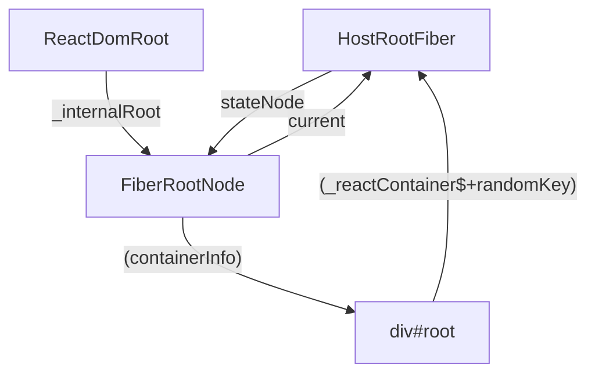

- [mini-react](#mini-react)
  - [創建 Fiber 和 FiberRoot](#創建-fiber-和-fiberroot)
    - [1. 生成 fiber](#1-生成-fiber)
    - [2. 生成 FiberRoot](#2-生成-fiberroot)
  - [實現入口 createRoot](#實現入口-createroot)
    - [1. 建立 ReactDOMRoot，讓外部調用 createRoot 和 render()](#1-建立-reactdomroot讓外部調用-createroot-和-render)
    - [2. 調用 render，根組件交給 react，react 內部調用 updateContainer，創建 update，啟動調度](#2-調用-render根組件交給-reactreact-內部調用-updatecontainer創建-update啟動調度)
  - [scheduleUpdateOnFiber 調度更新開始](#scheduleupdateonfiber-調度更新開始)
    - [ensureRootIsScheduled -\> scheduleTaskForRootDuringMicrotask，確保在當次瀏覽器工作循環執行啟動 scheduler 包中的調度](#ensurerootisscheduled---scheduletaskforrootduringmicrotask確保在當次瀏覽器工作循環執行啟動-scheduler-包中的調度)
    - [react-reconciler workLoop](#react-reconciler-workloop)
      - [第一階段 render -\> performUnitOfWork()：兩階段 beginWork, completeUnitWork](#第一階段-render---performunitofwork兩階段-beginwork-completeunitwork)
        - [beginWork - 建立 fiber 結構](#beginwork---建立-fiber-結構)
        - [completeUnitWork - 深度優先遍歷，按照 fiber tag 建立真實 DOM](#completeunitwork---深度優先遍歷按照-fiber-tag-建立真實-dom)
          - [看 fiber 建立的結果](#看-fiber-建立的結果)
      - [第二階段 commit: VDOM -\> DOM](#第二階段-commit-vdom---dom)
  - [補充各種節點渲染](#補充各種節點渲染)
    - [文本節點](#文本節點)
      - [第一種: .render("xxx")](#第一種-renderxxx)
      - [第二種: children fibers Array 中有文字節點](#第二種-children-fibers-array-中有文字節點)
    - [Fragment](#fragment)
      - [第一種: 巢狀的 Framgment](#第一種-巢狀的-framgment)
      - [第二種: 根節點就是 Fragment](#第二種-根節點就是-fragment)
    - [ClassComponent](#classcomponent)
      - [beginWork](#beginwork)
      - [completeWork](#completework)
    - [FunctionComponent](#functioncomponent)
      - [beginWork](#beginwork-1)
      - [completeWork](#completework-1)
  - [Hooks](#hooks)
    - [模擬 useReducer](#模擬-usereducer)
      - [定義 useReducer](#定義-usereducer)
        - [架構](#架構)
        - [建立 hook 鏈表](#建立-hook-鏈表)
        - [dispatch 事件，修改 hook.memorizedState](#dispatch-事件修改-hookmemorizedstate)
        - [render 階段](#render-階段)
    - [節點刪除](#節點刪除)
    - [多節點 DIFF](#多節點-diff)
      - [DIFF 的邏輯規則](#diff-的邏輯規則)
      - [1.從左邊往右邊遍歷，按照位置比較，如果可以復用，就復用。不能復用就退出當前循環](#1從左邊往右邊遍歷按照位置比較如果可以復用就復用不能復用就退出當前循環)
      - [2.1 遍歷比較後，遇到不同的，跳出迴圈，要繼續比較剩餘的節點。](#21-遍歷比較後遇到不同的跳出迴圈要繼續比較剩餘的節點)
      - [2.2 新節點還有，老節點沒了，剩下的新增即可，也包含初次渲染](#22-新節點還有老節點沒了剩下的新增即可也包含初次渲染)
      - [2.3 新老節點都還有，改用 Map](#23-新老節點都還有改用-map)
      - [fiber 完成後，進入 commit，補插入節點邏輯](#fiber-完成後進入-commit補插入節點邏輯)
    - [模擬 useState](#模擬-usestate)
    - [模擬 useMemo](#模擬-usememo)
    - [模擬 useCallback](#模擬-usecallback)
    - [模擬 useRef](#模擬-useref)
    - [模擬 useLayoutEffect, useEffect](#模擬-uselayouteffect-useeffect)
      - [effect 結構](#effect-結構)
      - [初始化 updateQueue、建立 effect 鏈表](#初始化-updatequeue建立-effect-鏈表)
      - [執行 effect](#執行-effect)
        - [mutation 階段，遍歷 fiber，渲染 DOM 樹時，順便處理 useLayoutEffect](#mutation-階段遍歷-fiber渲染-dom-樹時順便處理-uselayouteffect)
        - [處理延遲的 effect，要再次遍歷 fiber，找到身上 tags 有掛載 Passive 的 effect 執行](#處理延遲的-effect要再次遍歷-fiber找到身上-tags-有掛載-passive-的-effect-執行)
  - [Context](#context)
    - [模擬 context](#模擬-context)
      - [結構](#結構)
      - [創建 context](#創建-context)
      - [beginWork 處理 `<Provider>`](#beginwork-處理-provider)
        - [補充源碼](#補充源碼)
    - [Consumer](#consumer)
    - [Class Component context](#class-component-context)
  - [合成事件](#合成事件)
    - [事件委託](#事件委託)
    - [不適合委託的事件](#不適合委託的事件)
    - [模擬合成事件](#模擬合成事件)
      - [實現事件註冊](#實現事件註冊)
        - [不適合委託的事件型別](#不適合委託的事件型別)
        - [實現不同類型的事件註冊](#實現不同類型的事件註冊)
        - [實現事件派發](#實現事件派發)
          - [提取事件](#提取事件)
        - [處理 Lane](#處理-lane)
      - [實現合成事件](#實現合成事件)
      - [受控事件](#受控事件)
        - [實作 onChange](#實作-onchange)
  - [Lane 模型](#lane-模型)
    - [lanes 和 lane 的基本運算函式和類型](#lanes-和-lane-的基本運算函式和類型)
    - [Lanes 模型背景](#lanes-模型背景)
    - [Lanes 模型應用場景](#lanes-模型應用場景)
      - [Update 的 Lane](#update-的-lane)
      - [事件優先級](#事件優先級)
      - [調度更新 scheduleUpdateOnFiber](#調度更新-scheduleupdateonfiber)
  - [transition](#transition)
    - [useTransition: 某一個操作變成 transition](#usetransition-某一個操作變成-transition)
    - [useDeferredValue: 相當於參數版本的 transitions](#usedeferredvalue-相當於參數版本的-transitions)
      - [模擬 useDeferredValue](#模擬-usedeferredvalue)
  - [memo: 允許你的組件在某些情況下跳過渲染](#memo-允許你的組件在某些情況下跳過渲染)
    - [模擬 memo](#模擬-memo)

# mini-react

- [scheduler 筆記及實現](./packages/scheduler/README.md)
- [二叉堆算法筆記及實現](./packages/scheduler/heap.md)

---

react 中的階段：

- triggering: a render （把客人的點單分發到廚房)
- rendering: the component beginWork, completeWork (準備訂單)
- commiting: to the DOM (將菜放在桌上)

## 創建 Fiber 和 FiberRoot

> @mono/react-reconciler

### 1. 生成 fiber

根據不同的標籤，生成不同屬性的 fiber，並且掛載到 workInprogress 樹上

> 核心代碼 src/ReactFiber.ts
> 類型主要在 src/ReactInternalTypes.ts

```ts
import { ReactElement, ReactFragment } from "@mono/shared/ReactTypes";
import { REACT_FRAGMENT_TYPE } from "@mono/shared/ReactSymbols";
import { isFn, isStr } from "@mono/shared/utils";
import {
  ClassComponent,
  Fragment,
  FunctionComponent,
  HostComponent,
  HostRoot,
  HostText,
  IndeterminateComponent,
  WorkTag,
} from "./ReactWorkTags";
import { Fiber } from "./ReactInternalTypes";
import { NoFlags } from "./ReactFiberFlags";
import { Lanes, NoLanes } from "./ReactFiberLane";
import { RootTag } from "./ReactFiberRoot";

export function createFiber(
  tag: WorkTag,
  pendingProps: any,
  key: null | string
): Fiber {
  return new FiberNode(tag, pendingProps, key);
}

function FiberNode(tag: WorkTag, pendingProps: unknown, key: string | null) {
  // 1. 基本的屬性
  this.tag = tag;
  this.key = key;
  this.elementType = null;
  this.type = null;
  // 不同組件定義不同 原生標籤-string; 類組件-實例
  this.stateNode = null;

  // 2. fiber 的節點鏈表
  this.return = null;
  this.child = null;
  this.sibling = null;
  // 紀錄節點在兄弟節點中位置下標，用於 diff 時判斷節點是否需要發生位移
  this.index = 0;

  // 3. Effects
  this.flags = NoFlags;
  this.subtreeFlags = NoFlags;
  this.deletions = null;

  // 4. 優先級
  this.lanes = NoLanes;
  this.childLanes = NoLanes;

  // 5. 兩棵樹上的 fiber 節點，指向對應的 fiber 節點
  this.alternate = null;

  this.memoizedProps = null;
  // 不同組件指向不同，函數組件 -> hook0; 類組件 -> state
  this.memoizedState = null;
  this.pendingProps = pendingProps;
}

// 創造新的樹
export function createWorkInProgress(current: Fiber, pendingProps: any): Fiber {
  let workInProgress = current.alternate;

  // 初始化只有一棵樹的時候
  if (workInProgress === null) {
    workInProgress = createFiber(current.tag, pendingProps, current.key);
    workInProgress.elementType = current.elementType;
    workInProgress.type = current.type;
    workInProgress.stateNode = current.stateNode;

    // 把新的樹節點指向到舊的樹的節點上
    workInProgress.alternate = current;
    // 把舊樹節點指向到新的樹的節點上
    current.alternate = workInProgress;
  } else {
    // 已經存在節點了，但有更新！
    // 更新可能是 props, type
    workInProgress.pendingProps = pendingProps;
    workInProgress.type = current.type;

    // 已經有 flags，但這邊給他重置成初始狀態
    workInProgress.flags = NoFlags;

    // 因為有更新，所以子結構也一定有變更 -> 重置成初始狀態，刪除的標籤也重置
    workInProgress.subtreeFlags = NoFlags;
    workInProgress.deletions = null;
  }

  // 重置靜態 effects 以外的所有屬性 轉移到新的樹上
  workInProgress.flags = current.flags;
  workInProgress.childLanes = current.childLanes;
  workInProgress.lanes = current.lanes;

  workInProgress.child = current.child;
  workInProgress.memoizedProps = current.memoizedProps;
  workInProgress.memoizedState = current.memoizedState;
  workInProgress.updateQueue = current.updateQueue;

  workInProgress.sibling = current.sibling;
  workInProgress.index = current.index;

  return workInProgress;
}

// 按照Element 創造出 fiber
export function createFiberFromElement(element: ReactElement) {
  const { type, key } = element;
  const pendingProps = element.props;
  const fiber = createFiberFromTypeAndProps(type, key, pendingProps);
  return fiber;
}

export function createHostRootFiber(tag: RootTag): Fiber {
  return createFiber(HostRoot, null, null);
}

// 按照不同的 type 創造出不同的 fiber
export function createFiberFromTypeAndProps(
  type: any,
  key: null | string,
  pendingProps: any,
  lanes: Lanes = NoLanes
): Fiber {
  // 是組件！
  let fiberTag: WorkTag = IndeterminateComponent;
  if (isFn(type)) {
    // 是 ClassComponent | FunctionComponent
    if (shouldConstruct(type)) {
      fiberTag = ClassComponent;
    } else {
      fiberTag = FunctionComponent;
    }
  } else if (isStr(type)) {
    // 如果是原生標籤
    fiberTag = HostComponent;
  } else if (type === REACT_FRAGMENT_TYPE && lanes) {
    return createFiberFromFragment(pendingProps.children, lanes, key);
  }

  const fiber = createFiber(fiberTag, pendingProps, key);
  fiber.elementType = type;
  fiber.type = type;
  fiber.lanes = lanes;

  return fiber;
}

// 創造Fragment節點的 fiber
export function createFiberFromFragment(
  elements: ReactFragment,
  lanes: Lanes,
  key: null | string
): Fiber {
  const fiber = createFiber(Fragment, elements, key);
  fiber.lanes = lanes;
  return fiber;
}

// 創造文本節點的 fiber
export function createFiberFromText(content: string, lanes: Lanes): Fiber {
  const fiber = createFiber(HostText, content, null);
  fiber.lanes = lanes;
  return fiber;
}

function shouldConstruct(Component: Function) {
  const prototype = Component.prototype;
  return !!(prototype && prototype.isReactComponent);
}
```

### 2. 生成 FiberRoot

❌ 注意不是 fiber 類型，只是掛載了整個樹相關的屬性，包含新舊樹等
可以想像是 最外層把一切封裝起來。

> 核心代碼 src/ReactFiberRoot.ts
> 類型主要在 src/ReactInternalTypes.ts

```ts
import { NoLane, NoLanes, createLaneMap, NoTimestamp } from "./ReactFiberLane";
import type { Container, FiberRoot } from "./ReactInternalTypes";
import type { ReactNodeList } from "@mono/shared/ReactTypes";
import { createHostRootFiber } from "./ReactFiber";
import { initializeUpdateQueue } from "./ReactFiberClassUpdateQueue";

export type RootTag = 0 | 1;
// export const LegacyRoot = 0;
export const ConcurrentRoot = 1;

export type RootState = {
  element: any;
};

// 創建 FiberRootNode，掛載整棵樹相關的屬性
export function FiberRootNode(containerInfo, tag) {
  this.tag = tag;
  this.containerInfo = containerInfo;
  this.pendingChildren = null;
  this.current = null;
  this.finishedWork = null;
  this.callbackNode = null;
  this.callbackPriority = NoLane;

  this.eventTimes = createLaneMap(NoLanes);
  this.expirationTimes = createLaneMap(NoTimestamp);

  this.pendingLanes = NoLanes;
  this.finishedLanes = NoLanes;
}

export function createFiberRoot(
  containerInfo: Container, // 就是者 document.getElementById('root')
  tag: RootTag,
  initialChildren: ReactNodeList
): FiberRoot {
  // !注意#root 以containerInfo掛載FiberRoot上，之後commit會用到
  const root: FiberRoot = new FiberRootNode(containerInfo, tag);

  // Cyclic construction. This cheats the type system right now because
  // stateNode is any.
  // 創建 fiber 根節點
  const uninitializedFiber = createHostRootFiber(tag);
  // FiberRootNode 的 current 樹指向 fiber 根節點
  root.current = uninitializedFiber;
  // fiber 的 stateNode 也要指向 FiberRoot
  uninitializedFiber.stateNode = root;

  // ! 初始時，子節點會變成 element 掛載到 memoizedState 上
  const initialState: RootState = {
    element: initialChildren,
  };
  uninitializedFiber.memoizedState = initialState;

  initializeUpdateQueue(uninitializedFiber);

  return root;
}
```

## 實現入口 createRoot

> @mono/react-dom

### 1. 建立 ReactDOMRoot，讓外部調用 createRoot 和 render()

react 的入口點

> 主要在 @mono/react-dom/src/client/ReactDOMRoot.ts

```ts
import type { FiberRoot } from "@mono/react-reconciler/src/ReactInternalTypes";
import type { ReactNodeList } from "@mono/shared/ReactTypes";
import {
  ConcurrentRoot,
  createFiberRoot,
} from "@mono/react-reconciler/src/ReactFiberRoot";
import {
  updateContainer,
  createContainer,
} from "@mono/react-reconciler/src/ReactFiberReconciler";

type RootType = {
  render: (children: ReactNodeList) => void;
  _internalRoot: FiberRoot;
};

// 創造一個類型，掛載 render 和 unmount 的方法，並且創造和 fiber 的連結
// 把 fiber 掛載到 _internalRoot 上面
function ReactDOMRoot(internalRoot: FiberRoot) {
  this._internalRoot = internalRoot;
}

ReactDOMRoot.prototype.render = function (children: ReactNodeList) {
  // 拿到 fiberRoot
  const root = this._internalRoot;
  updateContainer(children, root);
};

function createRoot(
  container: Element | Document | DocumentFragment
): RootType {
  const root = createContainer(container, ConcurrentRoot);

  return new ReactDOMRoot(root);
}

export default { createRoot };
```

### 2. 調用 render，根組件交給 react，react 內部調用 updateContainer，創建 update，啟動調度

> @mono/react-reconciler/src/ReactFiberReconciler.ts

1. 獲取 current, lane
2. 創建 update // 這裡先略過
3. update 入隊放到暫存區 // 這裡先略過
4. scheduleUpdateOnFiber 啟動調度
5. entangleTranstions // 這裡先略過

```ts
import { ReactNodeList } from "@mono/shared/ReactTypes";
import type { Container, Fiber, FiberRoot } from "./ReactInternalTypes";
import type { RootTag } from "./ReactFiberRoot";
import { createFiberRoot } from "./ReactFiberRoot";

// 輸出給 react-dom，實現 react 的入口，創造出 fiberRoot, fiber 樹狀結構掛載在實例根節點上
export function createContainer(containerInfo: Container, tag: RootTag) {
  return createFiberRoot(containerInfo, tag);
}

export function updateContainer(element: ReactNodeList, container: FiberRoot) {
  // 組件初次渲染

  // 1. 獲取 current, lane
  const current = container.current;
  // 源碼中，初次渲染 子element 會作為 update.payload
  // const eventTime = getCurrentTime();
  // const update = createUpdate(eventTime, lane);
  // update.payload = { element };
  // 暫時簡寫放到 memoizedState
  current.memoizedState = { element };

  // scheduleUpdateOnFiber(root, current, lane, eventTime);
}
```

## scheduleUpdateOnFiber 調度更新開始

> @mono/react-reconciler/ReactFiberWorkLoop

在 `updateContainer()` 中調度 `scheduleUpdateOnFiber()`，這也是之後頁面觸發渲染都會執行的函式，會將指針指向正在處理的節點

```ts
import { Lane } from "./ReactFiberLane";
import { Fiber, FiberRoot } from "./ReactInternalTypes";

// 創建指針，指向正在處理的節點
let workInProgress: Fiber | null = null;
let workInProgressRoot: FiberRoot | null = null;

// 頁面初次渲染、類組件 setState/forceUpdate、函數組件 setState 都會走到此
export function scheduleUpdateOnFiber(root: FiberRoot, fiber: Fiber) {
  /**
   * 源碼核心:
   * 1. markRootUpdated: 標記根節點有一個 pending update
   * 2. ensureRootIsScheduled：主要是創建微任務去啟動 scheduler 調度器，調度器再去執行 react-reconciler 的 workLoop
   *    a. scheduleImmediateTask
   *    b. processRootScheduleInMicroTask
   *
   * 但因為目前還沒處理 lane 先忽略掉 1.
   **/

  workInProgressRoot = root;
  workInProgress = fiber;

  ensureRootIsScheduled(root);
}
```

### ensureRootIsScheduled -> scheduleTaskForRootDuringMicrotask，確保在當次瀏覽器工作循環執行啟動 scheduler 包中的調度

將 FiberRoot 傳入，把調度任務加入微任務， 確保在當次瀏覽器工作循環執行啟動 scheduler 包中的調度，再去執行 react-reconciler 的 workLoop

> @mono/react-reconciler/src/ReactFiberRootScheduler.ts

```ts
import { preformConcurrentWorkOnRoot } from "./ReactFiberWorkLoop";
import { FiberRoot } from "./ReactInternalTypes";
import { scheduleCallback, NormalPriority } from "@mono/scheduler";

export function ensureRootIsScheduled(root: FiberRoot) {
  // window 的方法，加入微任務，會去執行 scheduler包中的調度，確保在當次瀏覽器工作循環執行
  queueMicrotask(() => {
    scheduleTaskForRootDuringMicrotask(root);
  });
}

// 調度
export function scheduleTaskForRootDuringMicrotask(root: FiberRoot) {
  // 準備要調度更新，又分為 render 和 commit 階段
  // 這裡是入口
  scheduleCallback(
    NormalPriority,
    preformConcurrentWorkOnRoot.bind(null, root)
  );
}
```

### react-reconciler workLoop

入口點，執行 reconciler 兩階段

1. render: 構建 fiber 樹(VDOM)，核心就是調用 renderRootSync，又分為兩階段
   1. beginWork
   2. completeWork
2. commit: VDOM -> DOM

> react-reconciler/src/ReactFiberWorkLoop.ts

```ts
export function preformConcurrentWorkOnRoot(root: FiberRoot) {
  // ! 1. render: 構建 fiber 樹(VDOM)
  renderRootSync(root);
  // ! 2. commit: VDOM -> DOM
}
// 紀錄在哪個階段
let executionContext: ExecutionContext = NoContext;
function renderRootSync(root: FiberRoot) {
  // ! 1. render 階段開始
  // 紀錄之前正處理到哪個階段
  const prevExecutionContext = executionContext;
  // 先 merge 成 Render
  executionContext |= RenderContext;

  // ! 2. 初始化數據，準備好 WorkInProgress 樹
  prepareFreshStack(root);

  // ! 3. 遍歷構建 fiber 樹，深度優先遍歷
  workLoopSync();

  // ! 4. render 結束，把數據還原
  executionContext = prevExecutionContext;
  workInProgressRoot = null;
}

// 準備一顆 WorkInProgress 樹，在初次渲染是沒有的
function prepareFreshStack(root: FiberRoot): Fiber {
  root.finishedWork = null;

  workInProgressRoot = root;
  const rootWorkInprogress = createWorkInProgress(root.current, null);
  workInProgress = rootWorkInprogress;

  return rootWorkInprogress;
}

/** 開始了 fiber 建構的循環 */
function workLoopSync() {
  while (workInProgress !== null) {
    // 處理單一節點
    performUnitOfWork(workInProgress);
  }
}
```

#### 第一階段 render -> performUnitOfWork()：兩階段 beginWork, completeUnitWork

1. beginWork: 執行子節點的 fiber 創建
   1. 執行 unitOfWork 的 fiber 創建
   2. 看有沒有要走 diff，比方類組件 shouldComponentUpdate 比較後走到 bailout,
   3. 返回子節點（深度優先，一路執行 child)
2. 沒有子節點則執行 completeUnitWork: 循環執行創建真實 DOM
   ，並且把 workInProgress 轉移指針到同層級的兄弟節點，回到 beginWork，直到所有兄弟節點與其子節點都完成，這時指針轉移到父節點上，因為已經執行過 beginWork，不需要跳出 completeUnitWork 的迴圈，執行 DOM 創建之餘，把所有有 stateNode 的子節點（需要略過 Fragment、child === null）全部 appendAllChildren 到父節點 stateNode 中。以上 重複直到根節點。

```ts
function performUnitOfWork(unitOfWork: Fiber) {
  // 對應的 老的 current 節點
  const current = unitOfWork.alternate;
  // 1. beginWork，返回子節點
  let next = beginWork(current, unitOfWork);

  // 沒有子節點了
  if (next === null) {
    completeUnitWork(unitOfWork);
  } else {
    workInProgress = next;
  }
}
```

##### beginWork - 建立 fiber 結構

> react-reconciler/src/ReactFiberBeginWork.ts

```ts
import { mountChildFibers, reconcileChildFibers } from "./ReactChildFiber";
import type { Fiber } from "./ReactInternalTypes";
import { HostComponent, HostRoot } from "./ReactWorkTags";
import { shouldSetTextContent } from "@mono/react-dom/client/ReactDOMHostConfig";
// 處理當前的節點，因應不同節點做不同的處理
// 返回子節點
export function beginWork(
  current: Fiber | null,
  workInProgress: Fiber
): Fiber | null {
  switch (workInProgress.tag) {
    // 根節點
    case HostRoot:
      return updateHostRoot(current, workInProgress);
    // 原生標籤
    case HostComponent:
      return updateHostComponent(current, workInProgress);
  }
  // TODO:剩餘type
  throw new Error(`beginWork 有標籤沒有處理到 - ${workInProgress.tag}`);
}
// 根 fiber 節點，所需要做的只是，協調子節點
function updateHostRoot(current: Fiber | null, workInProgress: Fiber) {
  const nextChildren = current?.memoizedState.element;
  reconcileChildren(current, workInProgress, nextChildren);
  return workInProgress.child;
}
// 原生標籤，ex: div, span。初次渲染會進入協調，更新則可能是協調或是 bailout
// TODO: 更新
function updateHostComponent(current: Fiber | null, workInProgress: Fiber) {
  const { type, pendingProps } = workInProgress;
  // 如果原生標籤只有一個文本，這個時候文本不會再生成 fiber 節點，而是會變成原生標籤的屬性
  const isDirectTextChild = shouldSetTextContent(type, pendingProps);
  if (isDirectTextChild) {
    return null;
  } else {
    const nextChildren = workInProgress?.pendingProps.children;
    reconcileChildren(current, workInProgress, nextChildren);
    return workInProgress.child;
  }
}

// 協調子節點，構建新的 fiber 樹，
function reconcileChildren(
  current: Fiber | null,
  workInProgress: Fiber,
  nextChildren: any
) {
  // 初次渲染，但根節點#root存在所以不會走到這
  if (current === null) {
    workInProgress.child = mountChildFibers(workInProgress, null, nextChildren);
  } else {
    workInProgress.child = reconcileChildFibers(
      workInProgress,
      current.child,
      nextChildren
    );
  }
}
```

> react-reconciler/src/ReactChildFiber.ts

```ts
import {
  REACT_ELEMENT_TYPE,
  REACT_FRAGMENT_TYPE,
} from "@mono/shared/ReactSymbols";
import { ReactElement } from "@mono/shared/ReactTypes";
import { isArray } from "@mono/shared/utils";
import {
  createFiberFromElement,
  createFiberFromFragment,
  createFiberFromText,
} from "./ReactFiber";
// import {updateFragment} from "./ReactFiberBeginWork";
import { ChildDeletion, Forked, Placement, Update } from "./ReactFiberFlags";
import { Lanes } from "./ReactFiberLane";
import { Fiber } from "./ReactInternalTypes";
import { Fragment, HostText } from "./ReactWorkTags";

type ChildReconciler = (
  returnFiber: Fiber,
  currentFirstChild: Fiber | null,
  newChild: any
  //   lanes: Lanes
) => Fiber | null;

export const reconcileChildFibers: ChildReconciler =
  createChildReconciler(true);

export const mountChildFibers: ChildReconciler = createChildReconciler(false);

// 協調子節點
function createChildReconciler(shouldTrackSideEffect: boolean) {
  // 給 fiber 添加標記，flag，這邊會影響到之後 commit
  function placeSingleChild(newFiber: Fiber) {
    if (shouldTrackSideEffect && newFiber.alternate) {
      newFiber.flags |= Placement;
    }
    return newFiber;
  }

  // 只有協調單個子節點，沒有bailout
  function reconcileSingleElement(
    returnFiber: Fiber,
    currentFirstChild: Fiber | null,
    newChild: ReactElement
  ) {
    let createFiber = createFiberFromElement(newChild);
    createFiber.return = returnFiber;
    return createFiber;
  }

  function reconcileChildFibers(
    returnFiber: Fiber,
    currentFirstChild: Fiber | null,
    newChild: any
  ) {
    // 檢查 newChild 類型，有可能是文本 數組
    if (typeof newChild === "object" && newChild !== null) {
      switch (newChild.$$typeof) {
        case REACT_ELEMENT_TYPE: {
          return placeSingleChild(
            reconcileSingleElement(returnFiber, currentFirstChild, newChild)
          );
        }
      }
    }
    // TODO
    return null;
  }
  return reconcileChildFibers;
}
```

##### completeUnitWork - 深度優先遍歷，按照 fiber tag 建立真實 DOM

> react-reconciler/src/ReactFiberWorkLoop.ts

```ts
// 深度優先遍歷，子節點、兄弟節點、叔叔節點、爺爺節點....
function completeUnitWork(unitOfWork: Fiber) {
  let completedWork: Fiber | null = unitOfWork;

  do {
    const current = completedWork.alternate;
    const returnFiber = completedWork.return;
    // 依照不同的節點 tag 生成節點，如果是函式組件也可能 還有子節點等等
    // 如果自身處理完成，返回null
    // 並且看有沒有兄弟節點，沒有則返回父節點，再處理父節點的兄弟節點
    let next = completeWork(current, completedWork);

    // 如果有下個 work 的話，next可能指向 child 或是 標記 next 是
    if (next !== null) {
      workInProgress = next;
      return;
    }

    const siblingFiber = completedWork.sibling;
    if (siblingFiber !== null) {
      workInProgress = siblingFiber;
      return;
    }

    // 回到父節點上，如果下次循環，發現是已經完成的節點，會走到兄弟節點上
    completedWork = returnFiber;
    workInProgress = completedWork;
  } while (completedWork !== null);
}
```

> react-reconciler/src/ReactFiberCompleteWork.ts

```ts
import { isNum, isStr } from "@mono/shared/utils";
import { Fiber } from "./ReactInternalTypes";
import { HostComponent, HostRoot } from "./ReactWorkTags";

export function completeWork(
  current: Fiber | null,
  workInProgress: Fiber
): Fiber | null {
  switch (workInProgress.tag) {
    case HostRoot: {
      return null;
    }
    // 原生標籤
    case HostComponent: {
      const { type, pendingProps } = workInProgress;
      // 1. 創建真實dom
      const instance = document.createElement(type);
      // 2. 初始化DOM屬性
      finalizeInitialChildren(instance, pendingProps);
      appendAllChildren(instance, workInProgress);
      workInProgress.stateNode = instance;
      return null;
    }
    // TODO: 其他組件標籤 之後再說
  }
  throw new Error("不知名的 work tag");
}
// 初始化屬性
function finalizeInitialChildren(domElement: Element, props: any) {
  for (const propKey in props) {
    const nextVal = props[propKey];
    if (propKey === "style") {
      // TODO:
    } else if (propKey === "children") {
      // TODO:

      // 是文本節點
      if (isStr(nextVal) || isNum(nextVal)) {
        domElement.textContent = `${nextVal}`;
      }
    } else {
      domElement[propKey] = nextVal;
    }
  }
}

function appendAllChildren(parent: Element, workInProgress: Fiber) {
  let node = workInProgress.child;
  if (node) {
    parent.appendChild(node.stateNode);
  }
}
```

###### 看 fiber 建立的結果

> 終端下 `pnpm run dev`，此時，如果 examples 專案的 `main.jsx` 的結構是長這樣(目前只有單純寫純標籤節點)

```tsx
// import { createRoot } from "react-dom/client";
// 開啟手寫的 react
import { createRoot } from "@mono/react-dom/client";

const jsx = (
  <div className="border">
    <h1 className="h1Border">react</h1>
  </div>
);

createRoot(document.getElementById("root")!).render(jsx);
```

會建立起這樣的 FiberRootNode 結構

```ts
// FiberRootNode
{
  // ...省略
  current: { // FiberNode
    alternate: {
      child: {
        // ...省略
        stateNode: div.border, // 已經建立 instance 了
        child:{
          // ...省略
          stateNode: h1.h1Border, // 已經建立 instance 了
          child: null
        }
      } // FiberNode
    },
    containerInfo: div#root // 已經建立 instance 了
  }
}
```

#### 第二階段 commit: VDOM -> DOM

> react-reconciler/src/ReactFiberWorkLoop.ts

```ts
export function preformConcurrentWorkOnRoot(root: FiberRoot) {
  // ! 1. render: 構建 fiber 樹(VDOM)
  renderRootSync(root);
  // ! 2. commit: VDOM -> DOM
  // 新的根fiber
  const finishedWork = root.current.alternate;
  root.finishedWork = finishedWork;
  commitRoot(root);
}

function commitRoot(root: FiberRoot) {
  // ! 1. commit 階段開始
  const prevExecutionContext = executionContext;
  executionContext |= CommitContext;
  // ! 2. mutation 階段，渲染 DOM 樹
  commitMutationEffects(root, root.finishedWork);

  // ! 4. commit 結束，把數據還原
  executionContext = prevExecutionContext;
  workInProgressRoot = null;
}
```

創建完 VDOM 要想辦法渲染在真實的 DOM 上，要逐一遍歷，使用遞迴

> react-reconciler/src/ReactFiberCommitWork.ts

```ts
// finishedWork 是 HostRoot 類型的 fiber，要把子節點渲染到 root 裡面，root 是 #root
export function commitMutationEffects(root: FiberRoot, finishedWork: Fiber) {
  // 遍歷子節點和兄弟節點
  recursivelyTraverseMutationEffects(root, finishedWork);
  // 根據flags做相對應的操作，比方在父節點 appendChild
  commitReconciliationEffects(finishedWork);
}

// 遍歷 finishedWork
function recursivelyTraverseMutationEffects(root, parentFiber: Fiber) {
  // 單鏈表
  let child = parentFiber.child;
  while (child !== null) {
    // 再次遞迴，每個子節點都一一提交，包含同級的兄弟節點
    commitMutationEffects(root, child);
    child = child.sibling;
  }
}
// 提交協調中產生的effects，比如flags標記 Placement, Update, ChildDeletion
function commitReconciliationEffects(finishedWork: Fiber) {
  // TODO 只先完成 Placement
  const flags = finishedWork.flags;
  if (flags & Placement) {
    // 頁面初次渲染，新增插入 appendChild
    commitPlacement(finishedWork);
    // 把 Placement 從 flags 移除
    finishedWork.flags &= ~Placement;
  }
}

function commitPlacement(finishedWork: Fiber) {
  // 目前先把 HostComponent 渲染上去，之後再處理其他組件的情況
  if (finishedWork.stateNode && finishedWork.tag === HostComponent) {
    const domNode = finishedWork.stateNode;
    const parentFiber = getHostParentFiber(finishedWork);
    // 要找到最接近的祖先節點 是 Host 的 fiber，再把他塞進去
    // Host 節點有三種 HostRoot, HostComponent, HostText(不能有子節點)
    let parentDOM = parentFiber.stateNode;
    // HostRoot 的實例存在 containerInfo 中
    if (parentDOM.containerInfo) parentDOM = parentDOM.containerInfo;
    parentDOM.appendChild(domNode);
  }
}

function getHostParentFiber(fiber: Fiber) {
  let parentFiber = fiber.return;
  while (parentFiber !== null) {
    if (isHostParent(parentFiber)) {
      return parentFiber;
    }
    parentFiber = parentFiber.return;
  }
  throw Error("Expected to find a host parent.");
}

function isHostParent(fiber: Fiber) {
  return fiber.tag === HostComponent || fiber.tag === HostRoot;
}
```

看 react 建立的結果，此時最簡單的 jsx 已經出現在畫面上了。

## 補充各種節點渲染

### 文本節點

有兩種使用方式，可以創造出文本節點

1.

```tsx
createRoot(document.getElementById("root")!).render("abc123");
```

2.

```tsx
const jsx = (
  <div className="border">
    <h1 className="h1Border">react</h1>
    abctest
  </div>
);

createRoot(document.getElementById("root")!).render(jsx);
```

#### 第一種: .render("xxx")

渲染流程，進入 render workLoop `renderRootSync` - `workLoopSync` - `performUnitOfWork` - `beginWork` - `completeUnitWork`

```js
function performUnitOfWork(unitOfWork: Fiber) {
  const current = unitOfWork.alternate;
  // 1. beginWork，返回子節點
  let next = beginWork(current, unitOfWork);

  // 沒有子節點了
  if (next === null) {
    completeUnitWork(unitOfWork);
  } else {
    workInProgress = next;
  }
}
```

1. `beginWork`

```js
export function beginWork(
  current: Fiber | null,
  workInProgress: Fiber
): Fiber | null {
  switch (workInProgress.tag) {
    // 省略

    // 先進入根節點
    case HostRoot:
      return updateHostRoot(current, workInProgress);
    case HostText:
      return updateHostText();
  }
  // 省略
}
// beginWork 如果有子節點，會回傳 workInProgress子節點，不然空
function updateHostText() {
  return null;
}
```

進入 `updateHostRoot` - `reconcileChildren` - `reconcileChildFibers`

```js
function reconcileChildFibers(
  returnFiber: Fiber,
  currentFirstChild: Fiber | null,
  newChild: any
) {
  if (isText(newChild)) {
    return placeSingleChild(
      reconcileSingleTextNode(returnFiber, currentFirstChild, newChild)
    );
  }
  // 省略

  return null;
}

// 只有協調單個子節點，沒有bailout
function reconcileSingleTextNode(
  returnFiber: Fiber,
  currentFirstChild: Fiber | null, // TODO:
  textContent: string | number
) {
  // 把 textContent 作為 pendingProps 放入 fiber
  // 強制轉型成字串，以防數字
  const created = createFiberFromText(textContent + "");
  created.return = returnFiber;
  return created;
}

function isText(newChild: any) {
  return (
    (typeof newChild === "string" && newChild !== "") ||
    typeof newChild === "number"
  );
}
```

2. `completeUnitWork` - `completeWork` - `createChildReconciler`

創建真實 DOM

```js
export function completeWork(
  current: Fiber | null,
  workInProgress: Fiber
): Fiber | null {
  const { type, pendingProps } = workInProgress;

  switch (workInProgress.tag) {
    // 省略
    // 上面 createFiberFromText 時，textContent 作為 pendingProps 放入 fiber
    case HostText: {
      workInProgress.stateNode = document.createTextNode(pendingProps);
      return null;
    }
  }
  // 省略
}
```

再進入 commit 階段 `commitRoot` - `commitMutationEffects`-`commitPlacement`

增加 commit parentDOM.appendChild 的判斷

```js
function commitPlacement(finishedWork: Fiber) {
  if (
    finishedWork.stateNode &&
    (finishedWork.tag === HostComponent || finishedWork.tag === HostText)
  ) {
    // 省略
  }
}
```

就可以得到 文字節點 渲染在畫面上。

#### 第二種: children fibers Array 中有文字節點

渲染流程，進入 render workLoop `renderRootSync` - `workLoopSync` - `performUnitOfWork` - `beginWork` - `updateHostComponent` - `reconcileChildren` - `reconcileChildFibers` - `createChildReconciler`

```js
export function beginWork(
  current: Fiber | null,
  workInProgress: Fiber
): Fiber | null {
  switch (workInProgress.tag) {
    // 省略
    // 進入原生標籤
    case HostComponent:
      return updateHostComponent(current, workInProgress);
  }
  // 省略
}
```

```js
function reconcileChildFibers(
  returnFiber: Fiber,
  currentFirstChild: Fiber | null,
  newChild: any
) {
  // 省略
  // 如果節點是陣列，有多個子節點
  if (isArray(newChild)) {
    return reconcileChildrenArray(returnFiber, currentFirstChild, newChild);
  }

  // 省略
  return null;
}
```

`reconcileChildrenArray` - `createChild`

```js
function createChild(returnFiber: Fiber, newChild: any) {
  if (isText(newChild)) {
    // 強制轉型成字串，以防數字
    const created = createFiberFromText(newChild + "");
    created.return = returnFiber;
    return created;
  }
  // 省略
}
```

剩下就是走第一種流程，循環 beginWork，commit

### Fragment

```tsx
const jsx = <>11111</>;
```

會被 babel 轉譯成這樣

```js
{
  $$typeof: Symbol(react.element);
  key: null;
  props: {
    children: "11111";
  }
  ref: null;
  type: Symbol(react.fragment);
}
```

有三種使用方式，可以創造出 Fragment 節點

1. 巢狀的 Framgment

```tsx
const jsx = (
  <div className="border">
    <h1 className="h1Border">react</h1>
    <h2 className="h2Border">h2</h2>
    123
    <>
      11111
      <>
        <div>333</div>
      </>
    </>
  </div>
);

createRoot(document.getElementById("root")!).render(jsx);
```

2. 根節點就是 Fragment

```tsx
createRoot(document.getElementById("root")!).render(<>123</>);
```

3. 使用 Fragment 標籤，轉譯過後跟第一種第二種一樣

```tsx
createRoot(document.getElementById("root")!).render(<Fragment>123</Fragment>);
```

#### 第一種: 巢狀的 Framgment

一樣流程進入 beginWork 轉換成 fiber，
root 先 再來 `<div className="border">`，在`updateHostComponent`建立了四個子節點的 fiber（h1-h2-textNode-Fragment)，並且返回 h1 fiber，依次執行，直到 Fragment

```tsx
<div className="border">
  <h1 className="h1Border">react</h1>
  <h2 className="h2Border">h2</h2>
  123
  <>
    11111
    <>
      <div>333</div>
    </>
  </>
</div>
```

```ts
export function beginWork(
  current: Fiber | null,
  workInProgress: Fiber
): Fiber | null {
  switch (workInProgress.tag) {
    case HostRoot:
      // 1.root
      return updateHostRoot(current, workInProgress);
    case HostComponent:
      // 2. div
      // 3. h1 -> completeUnitWork
      // 4. h2 -> completeUnitWork
      // 9. div -> completeUnitWork
      return updateHostComponent(current, workInProgress);
    case HostText:
      // 5. 123 -> completeUnitWork  -> 把 workInProgress 指向 Fragment 再次進入 beginWork
      // 7. 11111 -> completeUnitWork
      return updateHostText();
    case Fragment:
      // 6. Fragment
      // 8. Fragment
      return updateHostFragment(current, workInProgress);
  }
  // 省略
}
```

```ts
// 和原生標籤 HostComponent 做差不多的處理
function updateHostComponent(current: Fiber | null, workInProgress: Fiber) {
  // children 一樣在 pendingProps 上
  const nextChildren = workInProgress?.pendingProps.children;
  reconcileChildren(current, workInProgress, nextChildren); //  newChild = [h1,h2,123,Fragment]
  return workInProgress.child; // h1
}
```

```ts
function reconcileChildFibers(
  returnFiber: Fiber,
  currentFirstChild: Fiber | null,
  newChild: any
) {
  // 省略
  if (isArray(newChild)) {
    // newChild = [h1,h2,123,Fragment] 都還沒變成 fiber
    return reconcileChildrenArray(returnFiber, currentFirstChild, newChild);
  }
  // 省略
}
```

`reconcileChildrenArray` - 遍歷陣列 children `createChild`

```ts
function createChild(returnFiber: Fiber, newChild: any) {
  debugger;
  if (isText(newChild)) {
    // 強制轉型成字串，以防數字
    const created = createFiberFromText(newChild + "");
    created.return = returnFiber;
    return created;
  }
  if (typeof newChild === "object" && newChild !== null) {
    switch (newChild.$$typeof) {
      case REACT_ELEMENT_TYPE: {
        const created = createFiberFromElement(newChild);
        created.return = returnFiber;
        return created;
      }
    }
  }

  // TODO
  return null;
}
```

```ts
// 按照Element 創造出 fiber
export function createFiberFromElement(element: ReactElement) {
  const { type, key } = element;
  const pendingProps = element.props;
  const fiber = createFiberFromTypeAndProps(type, key, pendingProps);
  return fiber;
}

// 按照不同的 type 創造出不同的 fiber
export function createFiberFromTypeAndProps(
  type: any,
  key: null | string,
  pendingProps: any,
  lanes: Lanes = NoLanes
): Fiber {
  // 是組件！
  let fiberTag: WorkTag = IndeterminateComponent;
  if (isFn(type)) {
    // 省略
  } else if (isStr(type)) {
    // 省略
  } else if (type === REACT_FRAGMENT_TYPE) {
    fiberTag = Fragment; // 為 Fragment 創造屬於他的tag
  }

  const fiber = createFiber(fiberTag, pendingProps, key);
  fiber.elementType = type;
  fiber.type = type;
  fiber.lanes = lanes;

  return fiber;
}
```

中間經過 completeUnitWork 轉移 workInProgress 指針，依序執行 h1, h2, 123，就不贅述，快轉到處理 Fragment，回到 `beginWork`，進入 `updateHostFragment` 後 - `reconcileChildren` - `reconcileChildFibers`

```ts
export function beginWork(
  current: Fiber | null,
  workInProgress: Fiber
): Fiber | null {
  switch (workInProgress.tag) {
    // 省略
    case Fragment:
      return updateHostFragment(current, workInProgress);
  }
  // 省略
}
```

```ts
function updateHostFragment(current: Fiber | null, workInProgress: Fiber) {
  // children 一樣在 pendingProps 上
  const nextChildren = workInProgress?.pendingProps.children;
  reconcileChildren(current, workInProgress, nextChildren); //  newChild = ["11111", {Fragment(還沒變成fiber)}]
  return workInProgress.child; // '11111'
}
```

```ts
function reconcileChildFibers(
  returnFiber: Fiber,
  currentFirstChild: Fiber | null,
  newChild: any
) {
  // 省略
  if (isArray(newChild)) {
    // newChild = ["11111", {Fragment(還沒變成fiber)}]
    return reconcileChildrenArray(returnFiber, currentFirstChild, newChild);
  }
  // 省略
}
```

`reconcileChildrenArray` - `createChild` 一樣處理成 fiber 後，一樣處理 `newChild = {div 333}`，進入 `completeUnitWork` 完成創建 DOM，回到父節點 Fragment，
這時在 `completeWork` 中，因為 Fragment 是沒有實際 DOM 的，因此回傳 null

```ts
// 針對 workInProgress 創建真實 DOM
export function completeWork(
  current: Fiber | null,
  workInProgress: Fiber
): Fiber | null {
  // 省略
  switch (workInProgress.tag) {
    case HostRoot:
    case Fragment: {
      return null;
    }
    // 省略
  }
  // 省略
}
```

在這之後繼續遞迴直到回到 `div className="border"`，

```ts
export function completeWork(
  current: Fiber | null,
  workInProgress: Fiber
): Fiber | null {
  // 省略
  switch (workInProgress.tag) {
    // 省略
    case HostComponent: {
      // 1. 創建真實dom
      const instance = document.createElement(type);
      // 2. 初始化DOM屬性
      finalizeInitialChildren(instance, pendingProps);
      appendAllChildren(instance, workInProgress);
      workInProgress.stateNode = instance;
      return null;
    }
    // 省略
  }
  // 省略
}
```

重點放在`appendAllChildren`，要把所有的子節點遞迴，append 到真實 DOM，這個時候，如果子節點除了 `fiber.tag === HostComponent ||
    fiber.tag === HostRoot ||
    fiber.tag === HostText` 可以直接添加以外，應該要把 子節點的子節點添加進去，比如 Fragment 下面的節點，把 workInProgress 下面的整顆樹都添加進去。

```ts
function appendAllChildren(parent: Element, workInProgress: Fiber) {
  let node = workInProgress.child;
  while (node !== null) {
    // 如果子節點是 Fragment，就沒有 node.stateNode
    if (isHost(node)) {
      parent.appendChild(node.stateNode); // node.stateNode 是 DOM 節點
      // 向下找直到小孩是有 stateNode
    } else if (node.child !== null) {
      node = node.child;
      continue;
    }

    // 已經處理完 workInProgress 下方的整顆樹了
    if (node === workInProgress) return;

    // 同層級結束
    while (node.sibling === null) {
      // 如果是根節點，或是已經是 workInProgress 下方的整顆樹的最後一個節點
      if (node.return === null || node.return === workInProgress) {
        return;
      }
      node = node.return;
    }
    node = node.sibling;
  }
}

export function isHost(fiber: Fiber) {
  return (
    fiber.tag === HostComponent ||
    fiber.tag === HostRoot ||
    fiber.tag === HostText
  );
}
```

最後進入 commit 階段，遍歷 FiberRoot 添加到 parentDOM 中

#### 第二種: 根節點就是 Fragment

在 commit 時，會找根節點 appendChild，要是根節點是 Fragment，會沒有 stateNode

```ts
function commitPlacement(finishedWork: Fiber) {
  // 目前先把 HostComponent 渲染上去，之後再處理其他組件的情況
  if (finishedWork.stateNode && isHost(finishedWork)) {
    const domNode = finishedWork.stateNode;
    const parentFiber = getHostParentFiber(finishedWork);
    // 要找到最接近的祖先節點 是 Host 的 fiber，再把他塞進去
    // Host 節點有三種 HostRoot, HostComponent, HostText(不能有子節點)
    let parentDOM = parentFiber.stateNode;
    // HostRoot 的實例存在 containerInfo 中
    if (parentDOM.containerInfo) parentDOM = parentDOM.containerInfo;
    parentDOM.appendChild(domNode);
  } else {
    // 要是根節點是 Fragment，會沒有stateNode
    let child = finishedWork.child;
    while (child !== null) {
      // 要是實際的節點
      commitPlacement(child);
      // 一樣處理完子樹後處理兄弟節點
      child = child.sibling;
    }
  }
}
```

### ClassComponent

```tsx
class ClassComp extends Component {
  render() {
    return <div>123</div>;
  }
}

createRoot(document.getElementById("root")!).render(
  <div>
    <ClassComp />
  </div>
);
```

在 @mono/react 建立 Component 類別

> react/src/ReactBaseClasses.ts

```ts
export function Component(props: any) {
  this.props = props;
}

Component.prototype.isReactComponent = {};
```

> react/index.ts

export 出去

```ts
export { REACT_FRAGMENT_TYPE as Fragment } from "@mono/shared/ReactSymbols";
export { Component } from "./src/ReactBaseClasses";
```

轉譯後 class 的 react element 結構

```ts
{
  $$typeof: Symbol(react.element),
  key: null,
  props: {},
  ref: null,
  type: class ClassComp,
  _owner: null,
  _store: {validated: true}
}
```

#### beginWork

在 beginWork 處理 div 時，會進入 `createChildReconciler` - `reconcileSingleElement` - `createFiberFromElement` - `createFiberFromTypeAndProps` 處理子節點，要創造出 tag 是 ClassComponent 的 Fiber 節點

```ts
export function createFiberFromTypeAndProps(
  type: any,
  key: null | string,
  pendingProps: any,
  lanes: Lanes = NoLanes
): Fiber {
  // 是組件！
  let fiberTag: WorkTag = IndeterminateComponent;
  if (isFn(type)) {
    // 是 ClassComponent
    if (type.prototype.isReactComponent) {
      fiberTag = ClassComponent;
    }
  }
  // 省略

  const fiber = createFiber(fiberTag, pendingProps, key);
  fiber.elementType = type;
  fiber.type = type;
  fiber.lanes = lanes;

  return fiber;
}
```

處理到 class 本身時，beginWork 要處理 ClassComponent

```ts
export function beginWork(
  current: Fiber | null,
  workInProgress: Fiber
): Fiber | null {
  switch (workInProgress.tag) {
    // 省略
    case ClassComponent:
      return updateClassComponent(current, workInProgress);
  }

  // TODO:
  throw new Error(`beginWork 有標籤沒有處理到 - ${workInProgress.tag}`);
}

function updateClassComponent(current: Fiber | null, workInProgress: Fiber) {
  const { type, pendingProps } = workInProgress;
  // 實例在 type 上
  const instance = new type(pendingProps);
  // 調用 render 創造節點
  const children = instance.render();
  reconcileChildren(current, workInProgress, children);
  return workInProgress.child;
}
```

#### completeWork

```ts
export function completeWork(
  current: Fiber | null,
  workInProgress: Fiber
): Fiber | null {
  const { type, pendingProps } = workInProgress;

  switch (workInProgress.tag) {
    // 省略
    case ClassComponent: {
      // class 是不用創造出實體 DOM 的，因此回傳 null
      return null;
    }
    // 省略
  }
  // 省略
}
```

處理到這，已經可以成功渲染出節點在畫面上了

### FunctionComponent

```tsx
function Comp() {
  return <div>123</div>;
}
createRoot(document.getElementById("root")!).render(
  <div>
    <Comp />
  </div>
);
```

轉譯後 class 的 react element 結構

```ts
{
  $$typeof: Symbol(react.element),
  key: null,
  props: {},
  ref: null,
  type: ƒ Comp(),
  _owner: null,
  _store: {validated: true}
}
```

#### beginWork

在 beginWork 處理 div 時，會進入 `createChildReconciler` - `reconcileSingleElement` - `createFiberFromElement` - `createFiberFromTypeAndProps` 處理子節點，要創造出 tag 是 ClassComponent 的 Fiber 節點

```ts
export function createFiberFromTypeAndProps(
  type: any,
  key: null | string,
  pendingProps: any,
  lanes: Lanes = NoLanes
): Fiber {
  // 是組件！
  let fiberTag: WorkTag = IndeterminateComponent;
  if (isFn(type)) {
    // 是 ClassComponent | FunctionComponent
    if (type.prototype.isReactComponent) {
      fiberTag = ClassComponent;
    } else {
      fiberTag = FunctionComponent;
    }
  }
  // 省略
}
```

處理到 FN 本身時，beginWork 要處理 FunctionComponent

```ts
export function beginWork(
  current: Fiber | null,
  workInProgress: Fiber
): Fiber | null {
  switch (workInProgress.tag) {
    // 省略
    case FunctionComponent:
      return updateFunctionComponent(current, workInProgress);
  }
  // 省略
}

function updateFunctionComponent(current: Fiber | null, workInProgress: Fiber) {
  const { type, pendingProps } = workInProgress;
  // 調用 render 創造節點
  const children = type(pendingProps);
  reconcileChildren(current, workInProgress, children);
  return workInProgress.child;
}
```

#### completeWork

```ts
export function completeWork(
  current: Fiber | null,
  workInProgress: Fiber
): Fiber | null {
  const { type, pendingProps } = workInProgress;

  switch (workInProgress.tag) {
    // 省略
    case FunctionComponent: {
      return null;
    }
    // 省略
  }
  // 省略
}
```

處理到這，已經可以成功渲染出節點在畫面上了

## Hooks

- 規則：官網說不能在循換、條件或是嵌套中調用，要確保在 react 函式最頂層以及任何 return 前調用他們。
  - 是為什麼呢？ 因為在 hook 存在在 `fiber.memorized` 中，*單鏈表*的每個 hook 節點是沒有名字或是 key 的，除了他們的順序，_無法記錄他們的唯一性_，為了保持穩定性，才有這些規則。
- 類型：

  ```ts
  export type Hook = {
    // 不同類型的 hook，取值也不同
    // useState / useReducer 存 state，
    // useEffect / useLayoutEffect 存 effect單向循環鏈表
    memorizedState: any;

    // 下一個 hook，如果是 null，表示他是最後一個 hook
    next: Hook | null;

    // 下面三個先不深入，之後再說
    baseState: any;
    baseQueue: Update<any, any> | null;
    queue: any;
  };
  ```

- 存儲：
  就像是 fiber，會有一個指針指向正在工作中的 hook - `workInProgressHook`
  fiber.memorizedState(hook0) --next--> next(hook1) --next--> .... -> next(hookN)

  ```tsx
  let workInProgressHook = null;

  function FnComp(){
    const [state0, setState0] = useState(0); // hook0
    const [state1, setState1] = useState(0); // hook1
    useEffect(()=>{},[]) // hook2
    ...
  }
  ```

### 模擬 useReducer

```tsx
function Comp() {
  const [count, setC] = useReducer((x) => {
    return x + 1;
  }, 0);

  // 僅先處理一個子節點喔
  return (
    <button
      onClick={() => {
        console.log("??????click");
        setC();
      }}
    >
      {count}
    </button>
  );
}
```

> react-reconciler/src/ReactFiberCompleteWork.ts

```ts
// 初始化屬性 || 更新屬性
function finalizeInitialChildren(domElement: Element, props: any) {
  for (const propKey in props) {
    const nextProp = props[propKey];
    if (propKey === "style") {
      // 省略
    } else if (propKey === "children") {
      // 省略
    } else {
      // ! 處理事件，源碼是用合成事件做處理，暫時用原生的
      if (propKey === "onClick") {
        domElement.addEventListener("click", nextProp);
      } else {
        domElement[propKey] = nextProp;
      }
    }
  }
}
```

此時已經可以看到`console.log("??????click");`

#### 定義 useReducer

##### 架構

> react-reconciler/src/ReactFiberHooks.ts

```ts
type Hook = {
  memorizedState: any;
  next: null | Hook;
};

export function useReducer<S, I, A>(
  reducer: (state: S, action: A) => S,
  initialArg: I,
  init?: (initialArg: I) => S
) {
  // TODO: 構建Hook鏈表
  const hook: Hook = {
    memorizedState: null,
    next: null,
  };
  let initialState: S;
  if (init) {
    initialState = init(initialArg);
  } else {
    initialState = initialArg as any;
  }

  // TODO: dispatch 事件
  const dispatch = (action: A) => {
    const newVal = reducer(initialArg, action);
  };

  // TODO: 要區分初次掛載還是更新，暫時寫這樣
  hook.memorizedState = initialArg;

  return [initialArg, dispatch];
}
```

> react/index.ts

```ts
export { useReducer } from "@mono/react-reconciler/src/ReactFiberHooks";
```

此時頁面並不會更新，要想更新一定要調用 `schedulerUpdateOnFiber`

在處理這個之前，先要想辦法把 hook 和 fiber 關聯起來。
說到 fiber 就會提到 beginWork，是把節點轉換成 fiber 的過程。
中間應該是可以做到把 hook 掛載上去的！

> react-reconciler/src/ReactFiberBeginWork.ts

```ts
export function beginWork(
  current: Fiber | null,
  workInProgress: Fiber
): Fiber | null {
  switch (workInProgress.tag) {
    // 省略
    case FunctionComponent:
      return updateFunctionComponent(current, workInProgress);
  }
  // 省略
}

function updateFunctionComponent(current: Fiber | null, workInProgress: Fiber) {
  const { type, pendingProps } = workInProgress;
  // 調用 render 創造節點
  // 原先是調用 type(pendingProps);
  const children = renderWithHook(current, workInProgress, type, pendingProps);
  reconcileChildren(current, workInProgress, children);
  return workInProgress.child;
}
```

中間插入 `renderWithHook` 讓 fiber 上面的 `memoizedState` 初始化，並且針對 hook 也設定三個變數，（不共用，會全局污染，workInProgressFiber 隨時會變動）

- `currentlyRenderingFiber`: 記載現在進行中的 fiber
- `workInProgressHook`: 指針指向當前進行中新的 hook
- `currentHook`: 舊的 hook

> react-reconciler/src/ReactFiberHooks.ts

```ts
let currentlyRenderingFiber: Fiber | null = null;
let workInProgressHook: Hook | null = null;
let currentHook: Hook | null = null;

export function renderWithHook(
  current: Fiber | null,
  workInProgress: Fiber,
  component: any,
  props: any
) {
  currentlyRenderingFiber = workInProgress;
  // 初始化
  workInProgress.memoizedState = null;
  let children = component(props);

  finishRenderingHooks();
  return children;
}

// reset: 處理完後，要把指針都重置
export function finishRenderingHooks() {
  currentlyRenderingFiber = null;
  currentHook = null;
  workInProgressHook = null;
}
```

##### 建立 hook 鏈表

回到 `useReducer`，在一開始 mount 呼叫時，需要構建出 hook 鏈表掛載在 fiber 身上。創造 `updateWorkInProgressHook`，目的是 返回新建立的 Hook 並且構建 hook 鏈表。
注意，在 mount 和 update 階段針對 hook 的處理會不一樣，
如果是 mount 的階段，需要構建鏈表，更新階段只需要更新鏈表。再針對是不是 hook0 做判斷。

> react-reconciler/src/ReactFiberHooks.ts

```ts
type Hook = {
  memorizedState: any;
  next: null | Hook;
};

// 返回新建立的 Hook 並且構建 hook鏈表
function updateWorkInProgressHook(): Hook {
  let hook: Hook;

  // 指向到節點舊的fiber
  const current = currentlyRenderingFiber?.alternate;

  if (current) {
    // update 階段
    // 把老的state掛載到新的fiber的memoizedState上
    currentlyRenderingFiber!.memoizedState = current.memoizedState;
    if (workInProgressHook) {
      // 不是 hook0
      // 把當前新的hook掛載到鏈表上，並更新當前的hook
      workInProgressHook = hook = workInProgressHook.next!;
      currentHook = currentHook?.next as Hook;
    } else {
      // 第一個hook
      workInProgressHook = hook = currentlyRenderingFiber?.memoizedState;
      // 把老的hook倒給 currentHook
      currentHook = current.memoizedState;
    }
  } else {
    // mount 階段
    currentHook = null;
    hook = {
      memorizedState: null,
      next: null,
    };
    if (workInProgressHook) {
      workInProgressHook = workInProgressHook.next = hook;
    } else {
      workInProgressHook = currentlyRenderingFiber!.memoizedState = hook;
    }
  }
  return hook;
}

export function useReducer<S, I, A>(
  reducer: (state: S, action: A) => S,
  initialArg: I,
  init?: (initialArg: I) => S
) {
  // TODO: 構建Hook鏈表
  // const hook: Hook = {
  //   memorizedState: null,
  //   next: null,
  // };
  const hook: Hook = updateWorkInProgressHook();
  // 省略

  // 初次掛載還是更新
  // mount階段，初次渲染
  if (!currentlyRenderingFiber?.alternate) {
    hook.memorizedState = initialState;
  }
}
```

##### dispatch 事件，修改 hook.memorizedState

> react-reconciler/src/ReactFiberHooks.ts

```ts
export function useReducer<S, I, A>(
  reducer: (state: S, action: A) => S,
  initialArg: I,
  init?: (initialArg: I) => S
) {
  // 省略

  // 之所以會用bind是要保留當前的全局變量，因為currentlyRenderingFiber隨時會變動
  const dispatch = dispatchReducerAction.bind(
    null,
    currentlyRenderingFiber!,
    hook,
    reducer as any
  );

  return [hook.memorizedState, dispatch];
}

function dispatchReducerAction<S, I, A>(
  fiber: Fiber,
  hook: Hook,
  reducer?: (state: S, action: A) => S,
  action?: any
) {
  hook.memorizedState = reducer ? reducer(hook.memorizedState, action) : action;

  // 重複使用 fiber
  fiber.alternate = { ...fiber };
  // 找到 HostRoot
  const root = getRootForUpdateFiber(fiber);
  scheduleUpdateOnFiber(root, fiber);
}

function getRootForUpdateFiber(fiber: Fiber): FiberRoot {
  let parent = fiber.return;
  let node = fiber;
  while (parent !== null) {
    node = parent;
    parent = node.return;
  }
  // node.stateNode 是 FiberRoot，可以回看，在 createFiberRoot 當中有指向
  return node.tag === HostRoot ? node.stateNode : null;
}
```



現在 只是發起調度更新，還沒做 beginWork 協調子節點、compeleteWork 進行更新。

##### render 階段

`scheduleUpdateOnFiber` 發起調度更新後，跑到 `renderRootSync`，`prepareFreshStack` 會準備好 WorkInProgress 樹

```ts
function renderRootSync(root: FiberRoot) {
  // 省略

  // ! 2. 初始化數據，準備好 WorkInProgress 樹
  prepareFreshStack(root);

  // ! 3. 遍歷構建 fiber 樹，深度優先遍歷
  workLoopSync();

  // 省略
}

// 準備一顆 WorkInProgress 樹
function prepareFreshStack(root: FiberRoot): Fiber {
  root.finishedWork = null;

  workInProgressRoot = root;
  const rootWorkInprogress = createWorkInProgress(root.current, null);

  if (workInProgress === null) {
    // 如果是初次渲染的話，workInProgress 才是從根 fiber 開始
    workInProgress = rootWorkInprogress;
  }

  return rootWorkInprogress;
}
```

`workLoopSync` 執行 `performUnitOfWork`，`beginWork` 剛剛已經處理過了 `updateFunctionComponent` 和 hook 連結，之後要處理協調子節點，看是否要復用 - `reconcileChildren` - `reconcileChildFibers`。因為暫時只有處理單節點 -> `reconcileSingleElement`。

```ts
// 協調子節點，構建新的 fiber 樹，
function reconcileChildren(
  current: Fiber | null,
  workInProgress: Fiber,
  nextChildren: any
) {
  // 初次渲染
  if (current === null) {
    workInProgress.child = mountChildFibers(workInProgress, null, nextChildren);
  } else {
    workInProgress.child = reconcileChildFibers(
      workInProgress,
      current.child,
      nextChildren
    );
  }
}
```

- 節點復用的條件需滿足：
  1. 同一層級下(如果父節點變化就不算，且比較整個樹成本太高)
  2. key 相同
  3. type 相同

```ts
// 只有協調單個子節點，已經在同一層級下了
function reconcileSingleElement(
  returnFiber: Fiber,
  currentFirstChild: Fiber | null,
  element: ReactElement
) {
  const key = element.key; // 新的子節點的 key
  let child = currentFirstChild; // 舊的子節點
  while (child !== null) {
    if (child.key === key) {
      const elementType = element.type;
      if (child.elementType === elementType) {
        // ! 滿足所有條件了，復用
        const existing = useFiber(child, element.props);
        existing.return = returnFiber;
        return existing;
      } else {
        // key 值唯一性，相同層級下只有一個相同的 key，type 不同就不能復用
        // 所以直接跳出迴圈
        break;
      }
    } else {
      // 舊的子節點中找不到一樣的key
      // 加上是走單個節點的邏輯
      // TODO: delete
    }
    child = child.sibling;
  }
  const createFiber = createFiberFromElement(element);
  createFiber.return = returnFiber;
  return createFiber;
}

// 復用
function useFiber(fiber: Fiber, pendingProps: any) {
  // 新創建 調用 createWorkInProgress，把新的 props 掛載到 fiber 上
  // 這時候的child 沒有新的alternate 所以會把新的節點 的 stateNode 指向舊的
  const clone = createWorkInProgress(fiber, pendingProps);
  clone.index = 0;
  clone.sibling = null;
  return clone;
}
```

處理完成後要把新的 props 更新到舊的上面。

```ts
function performUnitOfWork(unitOfWork: Fiber) {
  // 對應的 老的 current 節點
  const current = unitOfWork.alternate;
  // beginWork，返回子節點
  let next = beginWork(current, unitOfWork);
  // ! 把新的props更新到舊的上
  unitOfWork.memoizedProps = unitOfWork.pendingProps;
  // 沒有子節點了
  if (next === null) {
    completeUnitWork(unitOfWork);
  } else {
    workInProgress = next;
  }
}
```

走到 `completeUnitWork`，要完成->如果是復用就要拿原本的，不要再次創建！

```ts
export function completeWork(
  current: Fiber | null,
  workInProgress: Fiber
): Fiber | null {
  const { type, pendingProps } = workInProgress;

  switch (workInProgress.tag) {
    case HostRoot:
    case Fragment:
    case ClassComponent:
    case FunctionComponent: {
      return null;
    }
    // 原生標籤
    case HostComponent: {
      // 這邊也要進行復用條件判斷<如果已經有實例了，不需要再次創建
      if (current !== null && workInProgress.stateNode !== null) {
        // 比較和更新屬性
        updateHostComponent(current, workInProgress, type, pendingProps);
      } else {
        // 1. 創建真實dom
        const instance = document.createElement(type);

        // 2. 初始化DOM屬性
        finalizeInitialChildren(instance, null, pendingProps);
        appendAllChildren(instance, workInProgress);
        workInProgress.stateNode = instance;
        return null;
      }
    }
    case HostText: {
      workInProgress.stateNode = document.createTextNode(pendingProps);
      return null;
    }
    // TODO: 其他組件標籤 之後再說
  }
  throw new Error("不知名的 work tag");
}

function updateHostComponent(
  current: Fiber | null,
  workInProgress: Fiber,
  type: string,
  newProps: any
) {
  if (current?.memoizedProps === newProps) {
    return;
  } else {
    // 比較和更新屬性
    finalizeInitialChildren(
      workInProgress.stateNode,
      current?.memoizedProps,
      newProps
    );
  }
}

// 初始化屬性 || 更新屬性，prevProps和nextProps的dom指向一樣的
function finalizeInitialChildren(
  domElement: Element,
  prevProps: any,
  nextProps: any
) {
  for (const propKey in prevProps) {
    const prevProp = prevProps[propKey];
    if (propKey === "style") {
      // TODO:
    } else if (propKey === "children") {
      // TODO:

      // 是文本節點
      if (isStr(prevProp) || isNum(prevProp)) {
        domElement.textContent = "";
      }
    } else {
      // 處理事件
      if (propKey === "onClick") {
        // 移除舊的click事件
        domElement.removeEventListener("click", prevProp);
      } else {
        // 如果新的props沒有，把他設置成空
        if (!(prevProp in nextProps)) {
          domElement[propKey] = "";
        }
      }
    }
  }
  for (const propKey in nextProps) {
    const nextProp = nextProps[propKey];
    if (propKey === "style") {
      // TODO:
    } else if (propKey === "children") {
      // TODO:

      // 是文本節點
      if (isStr(nextProp) || isNum(nextProp)) {
        domElement.textContent = `${nextProp}`;
      }
    } else {
      // 處理事件
      if (propKey === "onClick") {
        domElement.addEventListener("click", nextProp);
      } else {
        domElement[propKey] = nextProp;
      }
    }
  }
}
```

如果是更新階段，根節點走到 `beginWork`，

```ts
// 根 fiber 節點，所需要做的只是，協調子節點
function updateHostRoot(current: Fiber | null, workInProgress: Fiber) {
  const nextChildren = current?.memoizedState.element;
  reconcileChildren(current, workInProgress, nextChildren);
  // 如果是更新階段，走到此，表示整棵樹都要更新，
  // 協調子節點完成後，舊的子節點，更新成新的子節點
  if (current) {
    current.child = workInProgress.child;
  }
  return workInProgress.child;
}
```

---

小重點複習：

1. hook 存在 fiber 上的 memoizedState
2. 他是鏈表
3. 為什麼 useReducer 會觸發更新？因為會去呼叫 `schedulerUpdateOnFiber`

### 節點刪除

刪除子節點，紀錄在父節點 fiber 結構的 `deletions`，比起在子節點上一一掛在 flags 上要高效，到 commit 階段直接遍歷刪除

```ts
deletions: Array<Fiber> | null;
```

改下 `main.tsx`

```tsx
// import { createRoot } from "react-dom/client";
import { createRoot } from "@mono/react-dom/client";
import { Fragment, Component, useReducer } from "@mono/react";

function Comp() {
  const [count, setC] = useReducer((x) => x + 1, 0);

  return (
    <div>
      {count % 2 === 0 ? (
        <button
          onClick={() => {
            console.log("??????click");
            setC();
          }}
        >
          {count}
        </button>
      ) : (
        <span>1234</span>
      )}
    </div>
  );
}

createRoot(document.getElementById("root")!).render((<Comp />) as any);
```

要做到刪除分為兩部分：

1. 在協調 reconciler 中父節點要紀錄子節點的刪除 deletions，並更新 flags
2. 在 commit 階段，根據 fiber 更新 DOM，刪除節點，其中要注意易找到原生的祖先節點再刪除

目前只有協調單個子節點 - `reconcileSingleElement`

> react-reconciler/src/ReactChildFiber.ts

```ts
// 只有協調單個子節點
function reconcileSingleElement(
  returnFiber: Fiber,
  currentFirstChild: Fiber | null,
  element: ReactElement
) {
  // 節點復用的條件需滿足
  // 1. 同一層級下
  // 2. key 相同
  // 3. type 相同
  const key = element.key;
  let child = currentFirstChild;
  while (child !== null) {
    if (child.key === key) {
      const elementType = element.type;
      if (child.elementType === elementType) {
        // 復用
        const existing = useFiber(child, element.props);
        existing.return = returnFiber;
        return existing;
      } else {
        // ! 同層級下 key 不應相同，沒一個可以復用，要刪除所有的剩下的child(之前的已經走到下面的 deleteChild)
        deleteRemaingChildren(returnFiber, child);
        break;
      }
    } else {
      // ! delete 因為是單個節點才會進來這裡
      deleteChild(returnFiber, child);
    }
    child = child.sibling;
  }
  const createFiber = createFiberFromElement(element);
  createFiber.return = returnFiber;
  return createFiber;
}

function deleteChild(returnFiber: Fiber, childToDelete: Fiber) {
  const deletions = returnFiber.deletions;
  if (!shouldTrackSideEffect) {
    // 初次渲染
    return;
  }
  if (!deletions) {
    returnFiber.deletions = [childToDelete];
    returnFiber.flags |= ChildDeletion;
  } else {
    returnFiber.deletions!.push(childToDelete);
  }
}

function deleteRemaingChildren(returnFiber: Fiber, currentFirstChild: Fiber) {
  if (!shouldTrackSideEffect) {
    // 初次渲染
    return;
  }
  let childToDelete: Fiber | null = currentFirstChild;
  while (childToDelete !== null) {
    deleteChild(returnFiber, childToDelete);
    childToDelete = childToDelete.sibling;
  }
  return null;
}
```

> react-reconciler/src/ReactFiberCommitWork.ts

```ts
// 提交協調中產生的effects，比如flags標記 Placement, Update, ChildDeletion
function commitReconciliationEffects(finishedWork: Fiber) {
  // TODO 只先完成 Placement ChildDeletion
  const flags = finishedWork.flags;

  if (flags & Placement) {
    // 省略
  } else if (flags & ChildDeletion) {
    // 找到 原生的祖先節點（網上找，直到找到為止
    const parentFiber = isHostParent(finishedWork)
      ? finishedWork
      : getHostParentFiber(finishedWork);
    const parentDOM = parentFiber.stateNode;

    commitDeletions(finishedWork.deletions, parentDOM);

    // 把 ChildDeletion 從 flags 移除
    finishedWork.flags &= ~ChildDeletion;
    finishedWork.deletions = null;
  }
}

function getStateNode(deletion: Fiber) {
  let node: Fiber = deletion;
  // 一直找到是Host類型的node為止，不是的話略過
  while (true) {
    if (isHost(node) && node.stateNode) {
      return node.stateNode;
    }
    node = node.child as Fiber;
  }
}

// 根據fiber 刪除 DOM 節點（包含父子
function commitDeletions(
  deletions: Fiber["deletions"],
  parentFiberDOM: Element | Document | DocumentFragment
) {
  deletions?.forEach((deletion) => {
    parentFiberDOM.removeChild(getStateNode(deletion));
  });
}
```

這個時候就可以實現刪除節點了！

### 多節點 DIFF

假設有個陣列，在更新後，他的 key 值是這樣變化的

- old 0 1 2 3 4
- new 0 1 2 3

```tsx
function Comp() {
  const [count, setC] = useReducer((x) => x + 1, 0);
  const arr = count % 2 === 0 ? [0, 1, 2, 3, 4] : [0, 1, 2, 3];
  return (
    <div>
      <button
        onClick={() => {
          setC();
        }}
      >
        {count}
      </button>
      <ul>
        {arr.map((i) => {
          return <li key={`li` + i}>{i}</li>;
        })}
      </ul>
    </div>
  );
}
```

如果一個一個找，這會很麻煩（比方說 先找 3，遍歷一次，再找 2 ，遍歷一次）。實際應用上，節點相對位置是不變的。

#### DIFF 的邏輯規則

1. 從左邊向右遍歷，如果可以復用則繼續向右，不然就停止。(假設多數的列表都不會發生大規模的移動置換可以解決大部分問題)(vue 是從右往左遍歷，按位置比較，如果不能復用就退出本輪)
2. 遇到不同了，沒辦法復用了，新老節點的判斷：
   - 新節點沒了，但老節點還有。則刪除剩餘的老節點
   - 新節點還有，老節點沒了，剩下的新增即可，也包含初次渲染
   - 新老節點都還有，但是因為老 fiber 是鏈表，不方便快速的 get 和 delete。因此把老 fiber 鏈表中的節點放入 Map 中，後續操作這個 Map。
     - 如果是組件更新階段，新節點已經遍歷完成了，能復用的老節點都用完了，則最後查找 Map 當中是否還有元素，如果有，就表示新節點裡不能復用的，就只能刪除

---

#### 1.從左邊往右邊遍歷，按照位置比較，如果可以復用，就復用。不能復用就退出當前循環

先試著處理
old [0, 1, 2]
new [0, 1, 2, 3]

> react-reconciler/src/ReactChildFiber.ts

```ts
function reconcileChildrenArray(
  returnFiber: Fiber,
  currentFirstChild: Fiber | null,
  newChildren: Array<any>
) {
  let newIdx = 0;
  // 頭節點，也是要返回的值
  let resultFirstChild: Fiber | null = null;
  // 紀錄比對中的老 fiber，初始是頭節點
  let oldFiber = currentFirstChild;
  // 紀錄前 Fiber，後續要將 previousNewFiber sibling 指向 新 fiber
  let previousNewFiber: Fiber | null = null;
  // oldFiber.sibling
  let nextOldFiber = null;

  // 1. 從左邊往右邊遍歷，按照位置比較，如果可以復用，就復用。不能復用就退出當前循環
  // 他的假設前提是，應該會盡可能的和原來的順序一樣
  for (; oldFiber !== null && newIdx < newChildren.length; newIdx++) {
    if (oldFiber.index > newIdx) {
      // ???? 雖然源碼這樣寫，但想不到什麼時候會有這樣的狀況
      // ???? 用於處理現有子組件在新子組件列表中沒有對應位置的情況，為了優化子組件的復用和刪除邏輯
      // ???? 按照位置比，如果舊的已經超前，就跳過
      nextOldFiber = oldFiber;
      // A. 不進行比較了，直接創造新的
      oldFiber = null;
    } else {
      // 紀錄下一個 fiber
      nextOldFiber = oldFiber.sibling;
    }
    // 比對新舊，看是否要復用
    const newFiber = updateSlot(returnFiber, oldFiber, newChildren[newIdx]);
    // 先暫停
  }
}
```

```ts
// 建立一個比對的函式，看是否要復用
// 條件是 key 和 type 要一樣
function updateSlot(returnFiber: Fiber, oldFiber: Fiber | null, newChild: any) {
  // 判斷節點可以復用嗎
  const key = oldFiber !== null ? oldFiber.key : null;

  // 像是 reconcileChildFibers 也要先處理文字節點，再去判斷，
  if (isText(newChild)) {
    // 如果是文本節點 是沒有key的
    // 新節點是文本，老節點不是
    if (key !== null) {
      // 確定完完全全的不同，也有可能之後key和其他老節點可以匹配，所以先跳過
      return null;
    } else {
      // key 一樣！！
      // 有可能可以復用
      // 所以要馬復用，要馬創建新的，而且確定處理完可以把舊的刪掉
      return updateTextNode(returnFiber, oldFiber, newChild + "");
    }
  }

  if (typeof newChild === "object" && newChild !== null) {
    if (newChild.key === key) {
      return updateElement(returnFiber, oldFiber, newChild);
    } else {
      // 不能復用，之後老節點要刪除，新節點創建
      return null;
    }
  }

  // ! 如果是 null, undefined, boolean 需要回傳 空值
  return null;
}

function updateTextNode(
  returnFiber: Fiber,
  current: Fiber | null,
  textContent: string
) {
  // current === null 給 2.3 後續沒有比對上時使用
  if (current === null || current.tag !== HostText) {
    // 老節點不是文本節點，但已經確定 key 是一樣的了，直接創建新的
    const created = createFiberFromText(textContent);
    created.return = returnFiber;
    return created;
  } else {
    // 復用
    const existing = useFiber(current, textContent);
    existing.return = returnFiber;
    return existing;
  }
}

function updateElement(
  returnFiber: Fiber,
  current: Fiber | null,
  element: any
) {
  const elementType = element.type;
  if (current !== null && current.elementType === elementType) {
    // 復用
    const existing = useFiber(current, element.props);
    existing.return = returnFiber;
    return existing;
  }
  // current === null 給 2.3 後續沒有比對上時使用
  const created = createFiberFromElement(element);
  created.return = returnFiber;
  return created;
}

function useFiber(fiber: Fiber, pendingProps: any) {
  const clone = createWorkInProgress(fiber, pendingProps);
  clone.index = 0;
  clone.sibling = null;
  return clone;
}
```

回到 `reconcileChildrenArray()`，比對完成後

- `updateSlot()`

  - 回傳的 null，表示 key 不同，不能復用，有可能是位置置換了或是全新的節點。
  - 有值，表示 key 相同，去判斷是復用的還是新創建的
    - 如果是創建的那刪除老的節點，之後不用再進入比對了

- 紀錄可以復用的相對位置
- 更新 `previousNewFiber`, `previousNewFiber.sibling`, `oldFiber`

```ts
function reconcileChildrenArray(
  returnFiber: Fiber,
  currentFirstChild: Fiber | null,
  newChildren: Array<any>
) {
  let newIdx = 0;
  // 頭節點
  let resultFirstChild: Fiber | null = null;
  // 紀錄比對中的老 fiber，初始是頭節點
  let oldFiber = currentFirstChild;
  // 紀錄前 Fiber，後續要將 previousNewFiber sibling 指向 新 fiber
  let previousNewFiber: Fiber | null = null;
  // oldFiber.sibling
  let nextOldFiber = null;
  // 用來記錄最後一個，新節點相對於老節點 不變的位置
  let lastPlacedIndex = 0;
  let lastPlacedIndex = 0; // 一個基準！用來記錄最後一個，新節點相對於老節點 不變的位置

  // 1. 從左邊往右邊遍歷，按照位置比較，如果可以復用，就復用。不能復用就退出當前循環
  // 他的假設前提是，應該會盡可能的和原來的順序一樣
  for (; oldFiber !== null && newIdx < newChildren.length; newIdx++) {
    if (oldFiber.index > newIdx) {
      // ???? 雖然源碼這樣寫，但想不到什麼時候會有這樣的狀況
      // ???? 用於處理現有子組件在新子組件列表中沒有對應位置的情況，為了優化子組件的復用和刪除邏輯
      // ???? 按照位置比，如果舊的已經超前，就跳過
      nextOldFiber = oldFiber;
      // A. 不進行比較了，直接創造新的
      oldFiber = null;
    } else {
      nextOldFiber = oldFiber.sibling;
    }
    const newFiber = updateSlot(returnFiber, oldFiber, newChildren[newIdx]);
    // 沒辦法復用
    if (newFiber === null) {
      // 有可能走到 A.，換下個位置，再去遍歷復用
      if (oldFiber === null) {
        oldFiber = nextOldFiber;
      }
      break;
    }

    // 更新階段，
    if (shouldTrackSideEffect) {
      // 還是沒辦法復用(在比較中 key相同，但 type 不一樣，會立刻創建新的)，這時候可以確定刪掉了
      // 但比較中完全不一樣時，newFiber 是 null，舊的節點後續可能繼續被比較
      if (oldFiber && newFiber?.alternate === null) {
        deleteChild(returnFiber, oldFiber);
      }
    }
    // 判斷節點相對位置是否發生變化，組件更新階段在更新前後的位置是否一樣
    lastPlacedIndex = placeChild(newFiber as Fiber, lastPlacedIndex, newIdx);

    if (previousNewFiber === null) {
      resultFirstChild = newFiber as Fiber;
    } else {
      (previousNewFiber as Fiber).sibling = newFiber as Fiber;
    }
    previousNewFiber = newFiber as Fiber;
    oldFiber = nextOldFiber;
  }
}

// 判斷有沒有需要移動位置
function placeChild(
  newFiber: Fiber,
  lastPlacedIndex: number, // 新fiber 在老 fiber 的位置
  newIndex: number
) {
  newFiber.index = newIndex;

  if (!shouldTrackSideEffect) return lastPlacedIndex;
  const current = newFiber.alternate;
  // 是復用來著
  if (current !== null) {
    // TODO: 移動位置的狀況

    // 不需要移動位置
    return oldIndex;
  } else {
    // flags 標記上 更新
    newFiber.flags |= Placement;
    return lastPlacedIndex;
  }
}
```

#### 2.1 遍歷比較後，遇到不同的，跳出迴圈，要繼續比較剩餘的節點。

如果此時 `newIdx === newChildren.length`，表示新節點已經遍歷完成，刪除剩餘的老節點即可。

```ts
// 2.1 老節點還有，新節點沒了，刪除剩餘的老節點
if (newIdx === newChildren.length) {
  deleteRemaingChildren(returnFiber, oldFiber);
  return resultFirstChild;
}
```

#### 2.2 新節點還有，老節點沒了，剩下的新增即可，也包含初次渲染

如果此時，新節點還有，但老節點沒了，表示後續的節點是新增的，也包含初次渲染（初次渲染也是沒有老節點）

```ts
if (oldFiber === null) {
  for (; newIdx < newChildren.length; newIdx++) {
    const newFiber = createChild(returnFiber, newChildren[newIdx]);
    // 沒有有效的創建，就不需要創建fiber
    if (newFiber === null) continue;
    // 更新階段，判斷更新前後位置是否一致，是否要移動位置，因為是鏈表所以要記index
    lastPlacedIndex = placeChild(newFiber as Fiber, lastPlacedIndex, newIdx);

    if (previousNewFiber === null) {
      // 紀錄頭節點，不能用 index 判斷，因為有可能 null，null 就不是有效的 fiber
      resultFirstChild = newFiber;
    } else {
      // 把前一個節點的兄弟節點重新指向
      previousNewFiber.sibling = newFiber;
    }
    previousNewFiber = newFiber;
  }
  return resultFirstChild;
}
```

#### 2.3 新老節點都還有，改用 Map

新老節點都還有，但是因為老 fiber 是鏈表，不方便快速的 get 和 delete。因此把老 fiber 鏈表中的節點放入 Map 中，後續操作這個 Map。

比方 new[0,1,2,3,4] old[0,1,2,4]
[0,1,2] 已經在 2.1 被處理，[3,4] 尚未處理。
新老節點都還有。

```ts
function mapRemainingChildren(oldFiber: Fiber) {
  let existingChildren: Map<string | number, Fiber> = new Map();
  let existingChild: Fiber | null = oldFiber;
  while (existingChild !== null) {
    if (existingChild.key !== null) {
      existingChildren.set(existingChild.key, existingChild);
    } else {
      existingChildren.set(existingChild.index, existingChild);
    }
    existingChild = existingChild.sibling;
  }
  return existingChildren;
}

function updateFromMap(
  existingChildren: Map<string | number, Fiber>,
  returnFiber: Fiber,
  newIdx: number,
  newChild: Fiber
) {
  if (isText(newChild)) {
    const matchedFiber = existingChildren.get(newIdx) || null;
    return updateTextNode(returnFiber, matchedFiber, "" + newChild);
  } else if (typeof newChild === "object" && newChild !== null) {
    const matchedFiber =
      existingChildren.get(newChild.key === null ? newIdx : newChild.key) ||
      null;
    return updateElement(returnFiber, matchedFiber, newChild);
  }
  // null, undefined, boolean 回傳空值
  return null;
}
```

回到 `reconcileChildrenArray`

```ts
const existingChildren = mapRemainingChildren(oldFiber);
for (; newIdx < newChildren.length; newIdx++) {
  const newFiber = updateFromMap(
    existingChildren,
    returnFiber,
    newIdx,
    newChildren[newIdx]
  );
  // 不管有沒有復用，都應該會有值，除非是 null, undefined, boolean 回傳空值
  if (newFiber !== null) {
    if (shouldTrackSideEffect) {
      // 更新階段 已經比對過了，所以可以瘦身，減少map的大小
      existingChildren.delete(newFiber?.key === null ? newIdx : newFiber!.key);
    }
    lastPlacedIndex = placeChild(newFiber, lastPlacedIndex, newIdx);

    if (previousNewFiber === null) {
      // 頭節點
      resultFirstChild = newFiber;
    } else {
      previousNewFiber.sibling = newFiber;
    }
    previousNewFiber = newFiber;
  }
}

if (shouldTrackSideEffect) {
  // 新節點已經都完成了，剩下老節點要清除
  // Any existing children that weren't consumed above were deleted. We need
  // to add them to the deletion list.
  existingChildren.forEach((child) => deleteChild(returnFiber, child));
}

return resultFirstChild;
```

```ts
// 判斷有沒有需要移動位置
function placeChild(
  newFiber: Fiber,
  lastPlacedIndex: number, // 新fiber 在老 fiber 的位置
  newIndex: number
) {
  newFiber.index = newIndex;

  if (!shouldTrackSideEffect) return lastPlacedIndex;
  const current = newFiber.alternate;
  // 復用來著
  if (current !== null) {
    // old [0, 1, 2, 3]
    // new [0, 2, 1, 3]
    const oldIndex = current.index;
    // lastPlacedIndex = 0 在 2.1 時確定下來
    // 跳出迴圈後進入 2.3
    // new 2; 在 oldIndex 2 的位置
    // lastPlacedIndex = 0 => 2; 2 變成基準
    // new 1; 在 oldIndex 1 的位置
    // lastPlacedIndex 2; oldIndex(1) < lastPlacedIndex(2)
    // 新的1的位置，相較於上一個沒有變動的2來說，是移動到了2的後面
    // 1 應該要被標記為換位置
    // return 2; 2維持基準

    if (oldIndex < lastPlacedIndex) {
      newFiber.flags |= Placement;
      return lastPlacedIndex;
    } else {
      // 不需要移動相對位置
      return oldIndex;
    }
  } else {
    // flags 標記上 更新
    newFiber.flags |= Placement;
    return lastPlacedIndex;
  }
}
```

#### fiber 完成後，進入 commit，補插入節點邏輯

在全部的 fiber 都被整理過後，進入 commit 階段，但當時只有寫
Append node，應該要寫個判斷說

之前的寫法，要改寫 `// !!!!` 的區塊

```ts
function commitPlacement(finishedWork: Fiber) {
  // 目前先把 HostComponent 渲染上去，之後再處理其他組件的情況
  if (finishedWork.stateNode && isHost(finishedWork)) {
    const domNode = finishedWork.stateNode;
    const parentFiber = getHostParentFiber(finishedWork);
    // 要找到最接近的祖先節點 是 Host 的 fiber，再把他塞進去
    // Host 節點有三種 HostRoot, HostComponent, HostText(不能有子節點)
    let parentDOM = parentFiber.stateNode;
    // HostRoot 的實例存在 containerInfo 中
    if (parentDOM.containerInfo) {
      parentDOM = parentDOM.containerInfo;
    }
    // !!!! 這段，所以不管怎樣所有的 fiber 都會插入在 parentDOM 裡的最後
    // if (isHostParent(parentFiber)) {
    //   parentDOM.appendChild(domNode);
    // }

    // 遍歷 fiber 尋找 finishedWork 兄弟節點，並且 這個 sibling 有 dom 節點，且是更新的節點
    // 在本輪不發生移動
    const before = getHostSibling(finishedWork);
    insertOrAppendPlacementNode(finishedWork, before, parentDOM);
  } else {
    // 要是根節點是 Fragment，會沒有stateNode
    let child = finishedWork.child;
    while (child !== null) {
      commitPlacement(child);
      child = child.sibling;
    }
  }
}
```

```ts
function insertOrAppendPlacementNode(
  node: Fiber,
  before: Element,
  parent: Element
) {
  if (before) {
    // insertBefore(newNode, referenceNode)
    parent.insertBefore(getStateNode(node), before);
  } else {
    parent.appendChild(getStateNode(node));
  }
}
```

創造 `getHostSibling()`，遍歷 fiber 尋找 finishedWork 兄弟節點，並且 這個 sibling 有 dom 節點，且是更新的節點，在本輪不發生移動

```ts
function getHostSibling(fiber: Fiber) {
  let node = fiber;
  siblings: while (1) {
    // 往上找，找到有兄弟節點的節點
    while (node.sibling === null) {
      if (node.return === null || isHostParent(node.return)) {
        return null;
      }
      node = node.return;
    }
    // 改到兄弟節點上
    node = node.sibling;
    // 往下找，找到是 tag 是 Host 節點
    // 而且不能是本次更新中
    // ❌ 被標記更新的節點
    // ❌ 沒有子節點的節點
    while (!isHost(node)) {
      // 要馬是初次渲染，新增插入或是移動位置
      if (node.flags & Placement) {
        continue siblings;
      }
      // 沒有子節點
      if (node.child === null) {
        continue siblings;
      } else {
        node = node.child;
      }
    }
    // 找到沒有位移的節點
    // 有 stateNode ，是HostComponent | HostText
    if (!(node.flags & Placement)) {
      return node.stateNode;
    }
  }
}
```

目前為止，已經完成了 多節點的變化渲染，可以針對不同的陣列渲染成不同的列表了

```tsx
// import { createRoot } from "react-dom/client";
import { createRoot } from "@mono/react-dom/client";
import { Fragment, Component, useReducer } from "@mono/react";

function Comp() {
  const [count, setC] = useReducer((x) => x + 1, 0);
  const arr = count % 2 === 0 ? [0, 2, 1, 3, 4] : [0, 2, 1, 3];
  // const arr = count % 2 === 0 ? [0, 1, 2, 3] : [0, 2, 1, 3];
  return (
    <div>
      <button
        onClick={() => {
          setC();
        }}
      >
        {count}
      </button>
      <ul>
        {arr.map((i) => {
          return <li key={`li` + i}>{i}</li>;
        })}
      </ul>
    </div>
  );
}

createRoot(document.getElementById("root")!).render((<Comp />) as any);
```

### 模擬 useState

- 源碼當中，`useState` 和 `useReducer` 對比
  1. `useState` 如果 state 沒改變，不會引起改變，`useReducer` 不是！
  2. reducer 代表的是修改的規則，儲存邏輯。 `useReducer` 比較方便復用這個參數。所以在複雜的狀態下，比方多組件共用同個狀態，但又有很多需要判斷的邏輯，就使用 `useReducer`

在源碼當中，在掛載階段執行的是 `mountState()`，dispatch 會去呼叫 `dispatchSetState`（會去判斷有沒有改變，再做掛載）。在這邊簡化成 `dispatchReducerAction`。源碼中 `updateState` 則是套用 `useReducer`

```ts
export function useState<S>(initialState: (() => S) | S) {
  const init = isFn(initialState) ? initialState() : initialState;
  return useReducer(null, init);
}
```

### 模擬 useMemo

每次重新渲染能夠緩存計算的結果。

```ts
const cached = useMemo(calc, dependencies);
```

- `calc`: 必須是一個純函式。可以返回任意的類型。會在首次渲染時調用緩存。除非`dependencies`發生變化，重新返回計算結果。通常不帶參數。
- `dependencies`: 使用 `Object.is` 將每個依賴和之前的值進行比較。

```tsx
function Comp() {
  const [count, setCount] = useReducer((x) => x + 1, 0);
  const [count1, setCount1] = useState(1);
  const arr = count % 2 === 0 ? [0, 1, 2, 3] : [0, 2, 1, 3];

  const calcVal = useMemo(() => {
    console.log("useMemo");
    let sum = 0;
    for (let i = 0; i < count1; i++) {
      sum += 1;
    }
    return sum;
  }, [count1]);

  return (
    <div>
      <button
        onClick={() => {
          setCount();
        }}
      >
        {count}
      </button>
      <ul>
        {arr.map((i) => {
          return <li key={`li` + i}>{i}</li>;
        })}
      </ul>
      <button
        onClick={() => {
          setCount1(count1 + 1);
        }}
      >
        {count1}
      </button>
      <p>{calcVal}</p>
      {count1 % 2 === 0 ? <h1>null</h1> : null}
      {count1 % 2 === 0 ? <h1>undefined</h1> : undefined}
      {count1 % 2 === 0 && <h1>boolean</h1>}
    </div>
  );
}

createRoot(document.getElementById("root")!).render((<Comp />) as any);
```

> react-reconciler/src/ReactFiberHooks.ts

```ts
export function useMemo<T>(
  nextCreate: () => T,
  deps: Array<any> | void | null
): T {
  const hook: Hook = updateWorkInProgressHook();
  const nextDeps = deps === undefined ? null : deps;
  const prevState = hook.memorizedState;
  if (prevState !== null) {
    if (nextDeps !== null) {
      const prevDeps = prevState[1];
      if (areHookInputEqual(nextDeps, prevDeps)) {
        // 依賴沒有變化，返回緩存的結果
        return prevState[0];
      }
    }
  }
  const nextVal = nextCreate();
  hook.memorizedState = [nextVal, nextDeps];
  return nextVal;
}
// 檢查 hook deps 是否發生變化
export function areHookInputEqual(nextDeps: Array<any>, prevDeps: Array<any>) {
  if (prevDeps === null) {
    return false;
  }
  for (let i = 0; i < prevDeps.length && i < nextDeps.length; i++) {
    if (Object.is(prevDeps[i], nextDeps[i])) {
      continue;
    }
    return false;
  }
  return true;
}
```

### 模擬 useCallback

如果函式以`props`往子組件傳遞，子組件已經包裹過`memo`，但父組件每次更新時，函式都是新的。

```tsx
const Child = memo(({ addClick }: { addClick: () => number }) => {
  return (
    <div>
      <h1>child</h1>
      <button onClick={addClick}>addClick</button>
    </div>
  );
});

function Comp() {
  const [count1, setCount1] = useState(1);

  function addClick() {
    let sum = 0;
    for (let i = 0; i < count1; i++) {
      sum += 1;
    }
    return sum;
  }

  return (
    <div>
      <button
        onClick={() => {
          setCount1(count1 + 1);
        }}
      >
        {count1}
      </button>
      <Child addClick={addClick} />
    </div>
  );
}
```

但因為目前還沒有實現`memo`，所以先測試會不會在`count`變化時`console.log`就好

```tsx
function Comp() {
  const [count, setCount] = useReducer((x) => x + 1, 0);
  const [count1, setCount1] = useState(1);

  const addClick = useCallback(() => {
    let sum = 0;
    for (let i = 0; i < count1; i++) {
      sum += 1;
    }
    return sum;
  }, [count1]);

  const calcVal = useMemo(() => {
    console.log("addClick");
    return addClick();
  }, [addClick]);

  return (
    <div>
      <button
        onClick={() => {
          setCount();
        }}
      >
        {count}
      </button>
      <button
        onClick={() => {
          setCount1(count1 + 1);
        }}
      >
        {count1}
      </button>
      <p>{calcVal}</p>
    </div>
  );
}
```

他的邏輯和`useMemo`差不多，只是改存 callback 而已

> react-reconciler/src/ReactFiberHooks.ts

```ts
export function useCallback<T extends Function>(
  callback: T,
  deps: Array<any> | void | null
): T {
  const hook: Hook = updateWorkInProgressHook();
  const nextDeps = deps === undefined ? null : deps;
  const prevState = hook.memorizedState;
  if (prevState !== null) {
    if (nextDeps !== null) {
      const prevDeps = prevState[1];
      if (areHookInputEqual(nextDeps, prevDeps)) {
        // 依賴沒有變化，返回緩存的結果
        return prevState[0];
      }
    }
  }
  hook.memorizedState = [callback, nextDeps];

  return callback;
}
```

### 模擬 useRef

```tsx
function Comp() {
  const addClick = () => {
    ref.current += 1;
    alert("ref current = ", ref.current);
  };

  return (
    <div>
      <button onClick={addClick}>{count1}</button>
    </div>
  );
}
```

> react-reconciler/src/ReactFiberHooks.ts

```ts
export function useRef<T>(data: T): { current: T } {
  const hook: Hook = updateWorkInProgressHook();
  // 初次掛載
  if (currentHook === null) {
    hook.memorizedState = { current: data };
  }
  return hook.memorizedState;
}
```

日常應用

```ts
const useInterval = (
  fn: () => void,
  delay?: number,
  options: {
    immediate?: boolean;
  } = {}
) => {
  const timerCallback = useCallback(fn, []);
  const timerRef = useRef(null);

  const clear = useCallback(() => {
    if (timerRef.current) {
      clearInterval(timerRef.current);
    }
  }, []);

  useEffect(() => {
    if (!isNumber(delay) || delay < 0) {
      return;
    }
    if (options.immediate) {
      timerCallback();
    }
    timerRef.current = setInterval(timerCallback, delay);
    return clear;
  }, [delay, options.immediate]);

  return clear;
};
```

### 模擬 useLayoutEffect, useEffect

- useLayoutEffect

和 `useEffect` 相同，但在所有的 DOM 變更之後**同步**調用 effect。可以用它來讀取佈局並同步觸發重渲染。在瀏覽器繪製之前，`useLayoutEffect`內部的更新計畫將被同步刷新。
盡量避免使用以防止阻塞渲染，延後螢幕加載。

- useEffect

從 react 純函式中通往命令式的逃生通道。會在渲染之後**延遲**執行。 專門針對副作用的操作，比方改變 DOM、添加訂閱、計時器設置、紀錄日誌等等。

```tsx
const [count, setCount] = useReducer((x) => x + 1, 0);
useEffect(() => {
  console.log("useEffect");
}, []);

useLayoutEffect(() => {
  console.log("useLayoutEffect");
}, [count]);
```

#### effect 結構

首先知道 effect 是掛載在 fiber 的 updateQueue 上面，而且他的結構是長這樣

```ts
type Effect = {
  tag: HookFlags; // 標記 Hook 類型
  create: () => (() => void) | void;
  deps: Array<any> | void | null; // 依賴項
  next: null | Effect; // 指向下一個 effect，是單向循環鏈表
};

// > react-reconciler/src/ReactHookEffectTags.ts
export type HookFlags = number;
export const HookNoFlags = /*   */ 0b0000;

// Represents whether effect should fire.
export const HookHasEffect = /* */ 0b0001;

// Represents the phase in which the effect (not the clean-up) fires.
export const HookInsertion = /* */ 0b0010;
export const HookLayout = /*    */ 0b0100;
export const HookPassive = /*   */ 0b1000;
```

fiber tag 上面也會做記號

```ts
// useLayoutEffect
export const Update = /*                       */ 0b0000000000000000000000000100;
// useEffect 標記的延遲
export const Passive = /*                      */ 0b0000000000000000100000000000; // 2048
```

依賴項會掛載在 memorizedState。處理是否有更新就和上面 useCallback 相同。call `areHookInputEqual。`

#### 初始化 updateQueue、建立 effect 鏈表

在 `renderWithHook` 時需要初始化 updateQueue

```ts
export function renderWithHook(
  current: Fiber | null,
  workInProgress: Fiber,
  component: any,
  props: any
) {
  // 省略
  workInProgress.updateQueue = null;
  // 省略
}
```

基本上 `useLayoutEffect`、`useEffect` 是做一樣的事情，只是執行的時機點不同！
在執行之前要先在 fiber 上面標記，並且做好 effect 鏈表。

> react-reconciler/src/ReactFiberHooks.ts

```ts
export function useLayoutEffect(
  create: () => (() => void) | void,
  deps: Array<any> | void | null
) {
  return updateEffectImpl(Update, HookLayout, create, deps);
}

export function useEffect(
  create: () => (() => void) | void,
  deps: Array<any> | void | null
) {
  return updateEffectImpl(Passive, HookPassive, create, deps);
}

function updateEffectImpl(
  fibrFlags: Flags,
  hookFlags: HookFlags,
  create: () => (() => void) | void,
  deps: Array<any> | void | null
) {
  const hook = updateWorkInProgressHook();
  // 依賴項是否發生變化
  const nextDeps = deps === undefined ? null : deps;
  // 組件是否在更新階段
  if (currentHook !== null) {
    if (nextDeps !== null) {
      const prevDeps = currentHook.memorizedState.deps;
      if (areHookInputEqual(nextDeps, prevDeps)) {
        return;
      }
    }
  }

  currentlyRenderingFiber!.flags |= fibrFlags;
  // 1. 保存 Effect
  // 2. 構建 effect 鏈表
  hook.memorizedState = pushEffect(hookFlags, create, deps);
}

function pushEffect(
  hookFlags: HookFlags,
  create: () => (() => void) | void,
  deps: Array<any> | void | null
) {
  const effect: Effect = {
    tag: hookFlags,
    create,
    deps,
    next: null,
  };
  let componentUpdateQueue = currentlyRenderingFiber!.updateQueue;

  // effect 是單向循環鍊錶
  // 第一個effect
  if (componentUpdateQueue === null) {
    componentUpdateQueue = {
      lastEffect: null,
    };
    currentlyRenderingFiber!.updateQueue = componentUpdateQueue;
    componentUpdateQueue.lastEffect = effect.next = effect;
  } else {
    // 剪開循環鏈表再接起來
    const lastEffect = componentUpdateQueue.lastEffect;
    const firstEffect = lastEffect.next;
    lastEffect.next = effect;
    effect.next = firstEffect;
    componentUpdateQueue.lastEffect = effect;
  }

  return effect;
}
```

完成鏈表創建後，真正要執行的時機就不一樣了！

#### 執行 effect

- **`useLayoutEffect` 是在 commit 階段執行的**
- **`useEffect`是延後執行，要怎麼延後？利用 scheduleCallback，排隊等待調度！**

> react-reconciler/src/ReactFiberWorkLoop.ts

```ts
function commitRoot(root: FiberRoot) {
  // ! 1. commit 階段開始
  const prevExecutionContext = executionContext;
  executionContext |= CommitContext;
  // ! 2.1 mutation 階段，遍歷 fiber，渲染 DOM 樹
  // useLayoutEffect 也應當在這個階段執行
  commitMutationEffects(root, root.finishedWork as Fiber);
  // ! 2.2 passive effect 階段，執行 passive effect 階段
  // 這也是為什麼 useEffect 延遲調用的原因
  scheduleCallback(NormalPriority, () => {
    flushPassiveEffect(root.finishedWork as Fiber);
  });
  // ! 3. commit 結束，把數據還原
  executionContext = prevExecutionContext;
  workInProgressRoot = null;
}
```

##### mutation 階段，遍歷 fiber，渲染 DOM 樹時，順便處理 useLayoutEffect

> react-reconciler/src/ReactFiberCommitWork.ts

```ts
// finishedWork 是 HostRoot 類型的 fiber，要把子節點渲染到 root 裡面，root 是 #root
export function commitMutationEffects(root: FiberRoot, finishedWork: Fiber) {
  recursivelyTraverseMutationEffects(root, finishedWork);
  commitReconciliationEffects(finishedWork);
}
// 遍歷 finishedWork
function recursivelyTraverseMutationEffects(root, parentFiber: Fiber) {
  // 單鏈表
  let child = parentFiber.child;
  while (child !== null) {
    // 每個子節點都一一提交，包含同級的兄弟節點，逐一往上
    commitMutationEffects(root, child);
    child = child.sibling;
  }
}
// 提交協調中產生的effects，比如flags標記 Placement, Update, ChildDeletion
function commitReconciliationEffects(finishedWork: Fiber) {
  // 省略

  // 有標記更新的話(useLayoutEffect 會標記 Update)
  if (flags & Update) {
    // 只有函式組件才會有 useEffect
    if (finishedWork.tag === FunctionComponent) {
      // useLayoutEffect 同步變更執行，有可能會造成堵塞，有性能問題
      commitHookEffectListMount(HookLayout, finishedWork);
    }
  }
}

function commitHookEffectListMount(hookFlags: HookFlags, finishedWork: Fiber) {
  const updateQueue = finishedWork.updateQueue;
  let lastEffect = updateQueue!.lastEffect;
  // 遍歷單向循環鏈表，前提是鏈表存在
  if (lastEffect !== null) {
    const firstEffect = lastEffect.next;
    let effect = firstEffect;
    do {
      if ((effect.tag & hookFlags) === hookFlags) {
        const create = effect.create;
        // TODO: effect.destroy()
        // 執行 effect 內容
        create();
      }
      effect = effect.next;
    } while (effect !== firstEffect);
  }
}
```

這樣算是完成 `useLayoutEffect`

##### 處理延遲的 effect，要再次遍歷 fiber，找到身上 tags 有掛載 Passive 的 effect 執行

```ts
export function flushPassiveEffect(finishedWork: Fiber) {
  // 遍歷子節點，檢查子節點自己的 effect
  recursivelyTraversePassiveMountEffects(finishedWork);
  // 如果有 passive effect 執行
  commitPassiveEffects(finishedWork);
}

function recursivelyTraversePassiveMountEffects(finishedWork: Fiber) {
  let child = finishedWork.child;
  while (child !== null) {
    recursivelyTraversePassiveMountEffects(child);
    // 如果有 passive effect 執行
    commitPassiveEffects(finishedWork);
    child = child.sibling;
  }
}

function commitPassiveEffects(finishedWork: Fiber) {
  switch (finishedWork.tag) {
    case FunctionComponent: {
      if (finishedWork.flags & Passive) {
        commitHookEffectListMount(HookPassive, finishedWork);
        finishedWork.flags &= ~Passive;
      }
      break;
    }
  }
}
```

到此，effect 已經簡單的處理完成了。

## Context

- 使用時機：當父組件想要和後代組件要跨層級溝通。
- 使用方式：
  1. 創建 Context 對象：可以設置預設值，如果缺少匹配的 Provider 後代組件將會讀取這裡的默認值。
  2. Provider 傳遞值給後代組件，。
  3. 後代組件消費 value，會一直往上找到**最近也匹配的** Provider:
     1. contextType: 只能用在 _類組件_，且只能訂閱單一的 context 來源 (這個值名稱不能更動)
     2. useContext: 只能用在 _函式組件_ 或是 _自定義的 Hook 中_
     3. Consumer 組件: 無限制
  4. 只有訂閱 context 的組件會更新，其他不受影響！但要注意 Provider state 應該要另外封裝使用，用 useMemo 包住（避免 Provider re-render，他的所有訂閱者都會更新，即使 value 沒有發生變化），children 以 props 傳入（一種 composition 的優化作法），如此可以確保在資料改變時，只有使用到此資料的 Consumer 元件會 re-render。

```tsx
// 1. 創建 context
const CountContext = createContext(0);
const ColorContext = createContext("red");

const Child = () => {
  // 3-2. 後代組件消費 value
  const count = useContext(CountContext);
  return (
    <div>
      <h1>{count}</h1>
      {/* 3-3. 後代組件消費 */}
      <ColorContext.Consumer>
        {(theme) => (
          <div>
            {theme}
            <CountContext.Consumer>
              {(value) => <p>{value}</p>}
            </CountContext.Consumer>
          </div>
        )}
      </ColorContext.Consumer>
    </div>
  );
};

function Comp() {
  const [count, setCount] = useReducer((x) => x + 1, 0);
  useEffect(() => {
    console.log("useEffect");
  }, []);

  useLayoutEffect(() => {
    console.log("useLayoutEffect");
  }, [count]);

  return (
    // 2. 創建 Provider 組件，對後代對象組件進行傳遞 value
    <div>
      <CountContext.Provider value={count}>
        <ColorContext.Provider value="green">
          <CountContext.Provider value={count + 1}>
            <button onClick={() => setCount()}>add</button>
            <Child />
          </CountContext.Provider>
        </ColorContext.Provider>
        <Child />
      </CountContext.Provider>
    </div>
  );
}
```

### 模擬 context

！沒有判斷實現訂閱者更新的部分。

#### 結構

```ts
export type ReactConsumerType<T> = {
  $$typeof: symbol | number;
  _context: ReactContext<T>;
};

export type ReactProviderType<T> = {
  $$typeof: symbol | number;
  type: ReactConsumerType<T>;
  key: null | string;
  ref: null;
  props: {
    children: (value: T) => ReactNodeList;
  };
};

export type ReactContext<T> = {
  $$typeof: symbol | number;
  Consumer: ReactContext<T>;
  Provider: ReactProviderType<T>;
  _currentValue: T; // 默認值
};
```

#### 創建 context

> packages/react/src/ReactContext.ts

```ts
import type { ReactContext } from "@mono/shared/ReactTypes";
import {
  REACT_CONTEXT_TYPE,
  REACT_PROVIDER_TYPE,
} from "@mono/shared/ReactSymbols";

export function createContext<T>(defaultValue: T): ReactContext<T> {
  const context: ReactContext<T> = {
    $$typeof: REACT_CONTEXT_TYPE,
    _currentValue: defaultValue,
    Provider: null,
    Consumer: null,
  };
  // TODO: Provider Consumer
  // 指定了 react element - provider element的 type
  context.Provider = {
    $$typeof: REACT_PROVIDER_TYPE,
    _context: context,
  };
  return context;
}
```

後續處理 child 時，會走到 `createFiberFromTypeAndProps` 按照不同的 type 創造出不同的 fiber

> react-reconciler/src/ReactFiber.ts

```ts
export function createFiberFromTypeAndProps(
  type: any,
  key: null | string,
  pendingProps: any,
  lanes: Lanes = NoLanes
): Fiber {
  // 是組件！
  let fiberTag: WorkTag = IndeterminateComponent;
  if (isFn(type)) {
    // 省略
  } else if (isStr(type)) {
    // 如果是原生標籤
    // 省略
  } else if (type === REACT_FRAGMENT_TYPE) {
    // 省略
  } else if (type.$$typeof === REACT_PROVIDER_TYPE) {
    // 幫他加上 tag 之後辨認用
    fiberTag = ContextProvider;
  }

  const fiber = createFiber(fiberTag, pendingProps, key);
  fiber.elementType = type;
  fiber.type = type;
  fiber.lanes = lanes;

  return fiber;
}
```

#### beginWork 處理 `<Provider>`

考慮到所有的 context 都有初始值(createContext(defaultVal))，而 context 又有可以被重複使用的特性。在執行的順序會只讀取到最近的那個 context value，所以必須在製作 fiber 階段先儲存起來(`context._currentValue` 也指向最新的值），供後代消費，在使用完成(Child 已經執行完畢) completeWork 時，刪除，避免重複讀取。

- 概念：
  - stack 裝 Context.Provider 上 `context._currentValue` 的初始值。比如有 n 個 value，把 n-1 個 value 放到 stack 當中，指針 cursor 則保留最後的值，方便讀取元素。
    - 為什麼要用 stack 來儲存呢？因為 Provider 預期並不會這麼多，每個子節點都要向上尋找太麻煩。依賴 stack 做存提是比較高效的，stack 先進後出、棧尾操作的特性，也符合開始結束標籤的流程，beginWork/completeWork。
    - 指針保留最後一個的 `context._currentValue` 值，再遇到下個 context 時才會放入 stack。
  - 更新 `context._currentValue` 成 props 上 value 的樣子。
    - 可以確保 useContext 在調用 context 時會拿到最新的值。
  - 彈出時，指針因為保留了上一個 context 的值，只要再還原給 context 就好，並且把指針指向到再上一個 context 值（也就是 stack[index])。

比方說，兩個 context，使用三次

```ts
const CountContext = createContext(0);
const ColorContext = createContext("red");
```

```tsx
function Comp() {
  const [count, setCount] = useReducer((x) => x + 1, 1);

  return (
    // 2. 創建 Provider 組件，對後代對象組件進行傳遞 value
    <div>
      <CountContext.Provider value={count}>
        <ColorContext.Provider value="green">
          <CountContext.Provider value={count + 1}>
            <button
              onClick={() => {
                setCount();
              }}
            >
              add
            </button>
            <Child /> // A.
          </CountContext.Provider>
        </ColorContext.Provider>
        <Child /> // B.
      </CountContext.Provider>
    </div>
  );
}
```

- beginWork 時，

  - 指針目前指向 `null` ，存進 stack 當中，先紀錄上 valueStack：`[null]`，再更新指針指向-> `context._currentValue：0`。更新掛載在 fiber 上的 `context._currentValue`，設成 props 上的 value：1。
  - 指針目前指向的上一次的值 0 ，存進 stack 當中，valueStack：`[null, 0]`，再更新指針指向-> `context._currentValue："red"`，更新掛載在 fiber 上的 `context._currentValue`，設成 props 上的 value："green"。
  - 指針指向的上一次的值 "red" ，存進 stack 當中，valueStack：`[null, 0, "red"]`，再更新指針指向-> `context._currentValue ：1`，更新掛載在 fiber 上的 `context._currentValue`，設成 props 上的 value："2"。

- 子元件使用時，`<Child />` 在呼叫時，`useContext` 讀到的 `context._currentValue` -> 2。

- completeWork 時，

  - `</CountContext.Provider>` 指針指向的是保留下來尚未更新 props 的 1，設定 currentValue 保存 1。更新指針指向上一個 stack 的保留值 - "red"。stack 對應位置設定成 `null`。`context._currentValue` 指向 currentValue - 1。
  - `</ColorContext.Provider>` 指針指向的是保留下來尚未更新 props 的 "red"，設定 currentValue 保存 "red"。更新指針指向上一個 stack 的保留值 - "0"。stack 對應位置設定成 `null` 。`context._currentValue` 指向 currentValue - "red"。

- 子元件使用時，`<Child />` 在呼叫時，useContext 讀到的 `context._currentValue` - 1。

- completeWork 時，
  - `</CountContext.Provider>` 指針指向的是保留下來尚未更新 props 的 0，設定 currentValue 保存 0。更新指針指向上一個 stack 的保留值 - null。stack 對應位置設定成 null。

```ts
export function beginWork(
  current: Fiber | null,
  workInProgress: Fiber
): Fiber | null {
  switch (workInProgress.tag) {
    // 省略
    case ContextProvider:
      return updateContextProvider(current, workInProgress);
  }
  // 省略
}
```

```ts
function updateContextProvider(current: Fiber | null, workInProgress: Fiber) {
  // 在 createContext 中，被記到 Provider 上
  const context = workInProgress.type._context;
  // 放在 <CountContext.Provider value={count + 1}>
  const value = workInProgress.pendingProps.value;
  // 創造一個 stack 依照順序放入 context
  // 創造一個指針指向最尾巴 棧頂的 context value
  // 把 Provider 的 context 指向 value
  // 並且把它存入堆中
  pushProvider(context, value);

  reconcileChildren(
    current,
    workInProgress,
    workInProgress.pendingProps.children
  );
  return workInProgress.child;
}
```

**找到一個匹配的 context 就可以停止遍歷單鏈表了。**

先處理紀錄 context

> packages/react-reconciler/src/ReactFiberNewContext.ts

```ts
import { ReactContext } from "@mono/shared/ReactTypes";
import { createCursor, pop, push, StackCursor } from "./ReactFiberStack";

// 紀錄棧尾元素
const valueCursor: StackCursor<any> = createCursor(null);

// 使用前，在 beginWork 要加入
export function pushProvider<T>(context: ReactContext<T>, nextValue: T): void {
  // 推入棧堆，把紀錄指針指到新值
  push(valueCursor, context._currentValue);
  // 把 context 上的值更新
  context._currentValue = nextValue;
}

// 使用後，在 completeWork 要刪除
export function popProvider<T>(context: ReactContext<T>): void {
  // 紀錄下當前的值到 context 上，但此 context 已經彈出 stack
  const currentValue = valueCursor.current;
  pop(valueCursor);
  // 後續其他相同 context 在讀取時
  context._currentValue = currentValue;
}

// 後代組件消費
export function readContext<T>(context: ReactContext<T>) {
  return context._currentValue;
}
```

> react-reconciler/src/ReactFiberStack.ts

```ts
export type StackCursor<T> = { current: T };

const valueStack: Array<any> = [];
let index = -1;

export function createCursor<T>(defaultValue: T): StackCursor<T> {
  return { current: defaultValue };
}

export function push<T>(cursor: StackCursor<T>, value: T): void {
  index++;
  // 紀錄上一個棧尾元素
  valueStack[index] = cursor.current;
  // cursor.current 紀錄棧尾元素
  cursor.current = value;
}

export function pop<T>(cursor: StackCursor<T>): void {
  debugger;
  if (index < 0) return;
  // cursor.current 紀錄上一個棧尾元素
  cursor.current = valueStack[index];
  // 上一個棧尾元素 = null
  valueStack[index] = null;
  index--;
}
```

小結：每一次更新 stack 都會放入 context 預設值，然後再還原。指針和 fiber 上的 `context._currentValue` 會紀錄保留和更新的值。

##### 補充源碼

在源碼當中，會去判斷 value 有沒有發生變化，如果 children 也沒有變化，不需要再進行後面的 render 流程，直接 bailout，但如果 context value 發生改變，必須要搜索匹配的後代消費者並調度更新他們！

後代消費者（函式組件、類組件、consumer 組件）會把 context 會存在 `workInProgress.dependencies.firstContext` 上，以鏈表的形式儲存(也有 next 和 memorizedValue 的屬性）。

後代消費者在 beginWork 時，會調用 `prepareToReadContext` 如果有 context 了就標記更新，不然就初始化鏈表 設成空。
`readContextForConsumer` 讀取 context 時，建立鏈表，或是已經有頭節點就銜接到 next 上。（源碼中，流程跟思路跟 hook 構建有點像）。
開始深度優先遍歷，遍歷 workInProgress.child ，while 處理

1. 判斷如果有 context 消費，遍歷此單鏈表 `workInProgress.dependencies.firstContext`，找到匹配的 context 則調度更新，更新 fiber.lanes 和 所有祖先的 childLanes。
2. 判斷是 匹配的 Provider，就不需要繼續遍歷。因為 Provider 會再次走到 `updateContextProvider`。

遍歷完子節點找兄弟節點，再遍歷父節點的兄弟節點。

### Consumer

> react/src/ReactContext.ts

```ts
import type { ReactContext } from "@mono/shared/ReactTypes";
import {
  REACT_CONTEXT_TYPE,
  REACT_PROVIDER_TYPE,
} from "@mono/shared/ReactSymbols";

export function createContext<T>(defaultValue: T): ReactContext<T> {
  const context: ReactContext<T> = {
    $$typeof: REACT_CONTEXT_TYPE,
    _currentValue: defaultValue,
    Provider: null,
    Consumer: null,
  };

  context.Provider = {
    $$typeof: REACT_PROVIDER_TYPE,
    _context: context,
  };

  // Consumer 儲存整個 context 本身
  context.Consumer = context;
  return context;
}
```

> react-reconciler/src/ReactFiber.ts

```ts
export function createFiberFromTypeAndProps(
  type: any,
  key: null | string,
  pendingProps: any,
  lanes: Lanes = NoLanes
): Fiber {
  // 是組件！
  let fiberTag: WorkTag = IndeterminateComponent;
  if (isFn(type)) {
    // 省略
  } else if (isStr(type)) {
    // 如果是原生標籤
    // 省略
  } else if (type === REACT_FRAGMENT_TYPE) {
    // 省略
  } else if (type.$$typeof === REACT_PROVIDER_TYPE) {
    // 省略
  } else if (type.$$typeof === REACT_CONTEXT_TYPE) {
    fiberTag = ContextConsumer;
  }
  // 省略
  return fiber;
}
```

> react-reconciler/src/ReactFiberBeginWork.ts

```ts
export function beginWork(
  current: Fiber | null,
  workInProgress: Fiber
): Fiber | null {
  switch (workInProgress.tag) {
    // 省略
    case ContextConsumer:
      return updateContextConsumer(current, workInProgress);
  }
  // 省略
}
```

```ts
function updateContextConsumer(current: Fiber | null, workInProgress: Fiber) {
  const context = workInProgress.type;
  const newValue = readContext(context);
  const render = workInProgress.pendingProps.children;
  const newChildren = render(newValue);

  reconcileChildren(current, workInProgress, newChildren);

  return workInProgress.child;
}
```

> react-reconciler/src/ReactFiberCompleteWork.ts

```ts
export function completeWork(
  current: Fiber | null,
  workInProgress: Fiber
): Fiber | null {
  const { type, pendingProps } = workInProgress;

  switch (workInProgress.tag) {
    // 省略
    case ContextConsumer: {
      return null;
    }
    // 省略
}
```

這個時候應該就可以運行了

```tsx
const CountContext = createContext(0);
const ColorContext = createContext("red");

const Child = () => {
  const count = useContext(CountContext);

  return (
    <div>
      <h1>{count}</h1>
      <ColorContext.Consumer>
        {(theme) => (
          <div>
            {theme}
            <CountContext.Consumer>
              {(value) => <p>{value}</p>}
            </CountContext.Consumer>
          </div>
        )}
      </ColorContext.Consumer>
    </div>
  );
};

function Comp() {
  const [count, setCount] = useReducer((x) => x + 1, 1);

  return (
    <div>
      <CountContext.Provider value={count}>
        <ColorContext.Provider value="green">
          <CountContext.Provider value={count + 1}>
            <button
              onClick={() => {
                setCount();
              }}
            >
              add
            </button>
            <Child />
          </CountContext.Provider>
        </ColorContext.Provider>
        <Child />
      </CountContext.Provider>
    </div>
  );
}
```

### Class Component context

```tsx
class ClassChild extends Component {
  // 規定寫法
  static contextType = CountContext;
  render() {
    return <div>{this.context as number}</div>;
  }
}
```

增加 class 類別上的 context 屬性

> react/src/ReactBaseClasses.ts

```ts
export function Component(props: any, context: any) {
  this.props = props;
  // 要想辦法把 contextType 的值 賦給 context
  // 而且在 render() 執行之前
  // ---> beginWork!
  this.context = context;
}

Component.prototype.isReactComponent = {};
```

> react-reconciler/src/ReactFiberBeginWork.ts

```ts
function updateClassComponent(current: Fiber | null, workInProgress: Fiber) {
  // 實例在 type 上
  const { type, pendingProps } = workInProgress;
  const context = type.contextType;
  const newValue = readContext(context);
  let instance = current?.stateNode;
  if (current === null) {
    // 實例在 type 上
    instance = new type(pendingProps, context);
    workInProgress.stateNode = instance;
  }
  // 賦給 context
  instance.context = newValue;
  // 調用 render 創造節點
  const children = instance.render();
  reconcileChildren(current, workInProgress, children);
  return workInProgress.child;
}
```

現在就可以實現 class component 使用 context 的情境。

## 合成事件

react 基於瀏覽器事件機制自身實踐了一套事件機制。包括事件註冊、事件冒泡、事件派發，合稱為合成事件。
相比於原生的機制，不僅考慮了瀏覽器的兼容性，還考慮了內存和性能，像是實踐了事件委託。

在 JS 當中，每個函式都是物件，物件越多性能越差。指定事件處理程序所需要訪問 DOM 的次數會先造成整個頁面的交互延遲，只要在使用事件處理程序時多注意一些方法，就可以改善頁面性能。

### 事件委託

事件委託是用來解決過多的事件處理程序，**利用事件冒泡**，可以只使用一個事件處理程序來管理一種類型的事件。比方説只要在 document 綁定 click 事件，就可以為整個頁面指定一個統一處理 click 的程序。

優點有

1. document 不用等 DOMContentLoaded 或是 load 事件。這意味著只要頁面渲染出可點擊的元件，就不會有延遲。
2. 節省花在設置頁面事件處理的時間，只有指定一個事件處理可以節省 DOM 引用和節省時間。
3. 減少頁面所需的內存，提升整體的性能。

合成事件就是基於事件委託。
v16 之前的版本將事件委託給 `document.addEventListener`，一旦想要局部使用 react ，就會影響全局。而且有事件池統一管理事件，事件回調函式內，如果有延遲的 cb 都會被取消掉（react 在舊的瀏覽器中重用了不同事件的事件對象，以提高性能，所有事件會被設置成 null)，除非加上 `e.persist()`。
v17 之後把事件委託放在了可控的 container 層。這樣可以局部的使用 react，甚至是不同版本的 react 放在同一頁面使用。

### 不適合委託的事件

比如 cancel, scroll...，在冒泡的行為不一致，也就不把事件委託給 container。

### 模擬合成事件

#### 實現事件註冊

建立一個新的 package，`react-dom-bindings`，
先建立型別

> react-dom-bindings/src/events/DOMEventNames.ts

```ts
export type DOMEventName =
  | "abort"
  | "afterblur" // Not a real event. This is used by event experiments.
  // These are vendor-prefixed so you should use the exported constants instead:
  // 'animationiteration' |
  // 'animationend |
  // 'animationstart' |
  | "beforeblur" // Not a real event. This is used by event experiments.
  | "beforeinput"
  | "beforetoggle"
  | "blur"
  // 省略
  | "volumechange"
  | "waiting"
  | "wheel";
```

之前為了方便實現，在 `react-reconciler/src/ReactFiberCompleteWork.ts` 中 `finalizeInitialChildren` 寫了這段 要移除

```ts
if (propKey === "onClick") {
  // 移除舊的click事件
  // domElement.removeEventListener("click", prevProp);
  // 直接添加在 document 上的，性能不好
}
```

現在事件就沒有觸發了

##### 不適合委託的事件型別

> react-dom-bindings/src/events/DOMPluginEventSystem.ts

```ts
// List of events that need to be individually attached to media elements.
// 需要分別附加到媒體元素的事件列表
export const mediaEventTypes: Array<DOMEventName> = [
  "abort",
  "canplay",
  "canplaythrough",
  "durationchange",
  "emptied",
  "encrypted",
  "ended",
  "error",
  "loadeddata",
  "loadedmetadata",
  "loadstart",
  "pause",
  "play",
  "playing",
  "progress",
  "ratechange",
  "resize",
  "seeked",
  "seeking",
  "stalled",
  "suspend",
  "timeupdate",
  "volumechange",
  "waiting",
];

// We should not delegate these events to the container, but rather
// set them on the actual target element itself. This is primarily
// because these events do not consistently bubble in the DOM.
// 我們不應該將事件委託給容器，應該直接在實際的目標元素上設置他們。
// 主要是因為這些事件在 DOM 的冒泡行為不一致
export const nonDelegatedEvents: Set<DOMEventName> = new Set([
  "beforetoggle",
  "cancel",
  "close",
  "invalid",
  "load",
  "scroll",
  "scrollend",
  "toggle",
  // In order to reduce bytes, we insert the above array of media events
  // into this Set. Note: the "error" event isn't an exclusive media event,
  // and can occur on other elements too. Rather than duplicate that event,
  // we just take it from the media events array.
  ...mediaEventTypes,
]);
```

##### 實現不同類型的事件註冊

我們知道 react 把事件分成不同的類型，賦予不同的優先級，這裡只以 `SimpleEventPlugin` 為例

> react-dom-bindings/src/events/DOMPluginEventSystem.ts

```ts
import * as SimpleEventPlugin from "./plugins/SimpleEventPlugin";

// 不同類型的事件註冊
SimpleEventPlugin.registerEvents();
// EnterEventPlugin.registerEvents();
// ChangeEventPlugin.registerEvents();
// SelectEventPlugin.registerEvents();
// BeforeEventPlugin.registerEvents();
```

> `react-dom-bindings/src/events/plugins/SimpleEventPlugin.ts`

```ts
import { registrySimpleEvents } from "../DOMEventProperties";

export { registrySimpleEvents as registryEvents };
```

> react-dom-bindings/src/events/DOMEventProperties.ts

```ts
const simpleEventPluginEvents = [
  "click",
  // 省略
  "toggle",
  "touchMove",
  "wheel",
];

// 然後改成 react 當中使用的小駝峰的寫法，進行紀錄
// 註冊
export function registrySimpleEvents() {
  for (let i = 0; i < simpleEventPluginEvents.length; i++) {
    const eventName = simpleEventPluginEvents[i];
    const domEventName = eventName.toLowerCase() as DOMEventName;
    const capitalizedEvent = eventName[0].toUpperCase() + eventName.slice(1);
    registrySimpleEvent(domEventName, "on" + capitalizedEvent);
  }

  registrySimpleEvent("dblclick", "onDoubleClick");
  registrySimpleEvent("focusin", "onFocus");
  registrySimpleEvent("focusout", "obBlur");
}

import { registerTwoPhaseEvent } from "./EventRegistry";

// 建立原生事件和 react 事件名稱的映射表
export const topLevelEventsToReactNames: Map<DOMEventName, string | null> =
  new Map();

function registrySimpleEvent()(domEventName: DOMEventName, reactName: string) {
  // 設定進映射表中
  topLevelEventsToReactNames.set(domEventName, reactName);
  // 註冊冒泡和捕獲階段
  registerTwoPhaseEvent(reactName, [domEventName]);
}
```

> react-dom-bindings/src/events/EventRegistry.ts

```ts
export const allNativeEvents: Set<DOMEventName> = new Set();
export const registrationNameDependencies: {
  [registrationName: string]: Array<DOMEventName>;
} = {};

// 事件註冊
export function registerTwoPhaseEvent(
  registrationName: string,
  dependencies: Array<DOMEventName>
) {
  registerDirectEvent(registrationName, dependencies);
  registerDirectEvent(registrationName + "Capture", dependencies);
}
```

> react-reconciler/src/ReactFiberCompleteWork.ts
> `finalizeInitialChildren`

```ts
// 省略

// 處理事件，如果是合成事件就略過
if (registrationNameDependencies[propKey]) {
  // 移除舊的click事件
  // domElement.removeEventListener("click", prevProp);
} else {
  // 省略
}
// 省略
```

回到 react-dom ，我們要把事件綁定在 root 上

> react-dom/client/index.ts

```ts
import { listenToAllSupportedEvents } from "@mono/react-dom-bindings/src/events/DOMPluginEventSystem";

function createRoot(
  container: Element | Document | DocumentFragment
): RootType {
  const root = createContainer(container, ConcurrentRoot);
  // 綁定事件
  listenToAllSupportedEvents(container);
  return new ReactDOMRoot(root);
}
```

> react-dom-bindings/src/events/DOMPluginEventSystem.ts

```ts
const listeningMarker = "_reactListening" + Math.random().toString(36).slice(2);

export function listenToAllSupportedEvents(rootContainerElement: EventTarget) {
  // 防止重複綁定
  if (!rootContainerElement[listeningMarker]) {
    rootContainerElement[listeningMarker] = true;
    allNativeEvents.forEach((domEventName) => {
      // 特殊處理 selectionchange
      if (domEventName !== "selectionchange") {
        // 捕獲階段 冒泡階段
        // 有些事件在 DOM 上冒泡行為不一致，就不做事件委託
        if (!nonDelegatedEvents.has(domEventName)) {
          // 第二個參數是事件類型
          listenToNativeEvent(domEventName, false, rootContainerElement);
        }
        listenToNativeEvent(domEventName, true, rootContainerElement);
      }
    });
  }
}

// flag 標記一下
function listenToNativeEvent(
  domEventName: DOMEventName,
  isCapturePhaseListener: boolean,
  target: EventTarget
) {
  let eventSystemFlags = 0;
  if (isCapturePhaseListener) {
    // 標記是不是捕獲階段
    eventSystemFlags |= IS_CAPTURE_PHASE;
  }
  addTrappedEventListener(
    target,
    domEventName,
    eventSystemFlags,
    isCapturePhaseListener
  );
}

function addTrappedEventListener(
  target: EventTarget,
  domEventName: DOMEventName,
  eventSystemFlags: EventSystemFlags,
  isCapturePhaseListener: boolean
) {
  // ! 1. 獲取對應事件，事件定義在 ReactDOMEventListener.js 當中
  // 獲取不同的優先級，定義不同的派發方法
  // 如 DiscreteEventPriority 對應 dispatchDiscreteEvent,
  let listener = createEventListenerWrapperWithPriority(
    target,
    domEventName,
    eventSystemFlags
  );

  let isPassiveListener = false;
  /** 在行動網頁中，我們常用的就是touch系列的事件，如：touchstart, touchmove, touchend。無法事先知道一個監聽器會不會呼叫preventDefault()，它需要等監聽器執行完成後，再去執行預設行為，而監聽器執行是要運行的，這樣就會導致頁面卡頓。不知道你是否有阻止預設事件，所以會先不滾動而先處理監聽函數，然後才知道是否要滾動；
所以我們需要主動告訴瀏覽器，我是否設定事件處理函數來阻止預設事件 **/
  // react 就不在將他們綁定到 document 上，但現在改變這一點將會撤銷之前的性能優勢，
  // 因此，要在根節點上手動的模擬現有的行為
  if (
    domEventName === "touchstart" ||
    domEventName === "touchmove" ||
    domEventName === "wheel"
  ) {
    isPassiveListener = true;
  }

  // ! 2. 綁定事件
  if (isCapturePhaseListener) {
    addEventCaptureListener(target, domEventName, listener);
  } else {
    addEventBubbleListener(target, domEventName, listener);
  }
}
```

> react-dom-bindings/src/events/EventListeners.ts

```ts
export function addEventBubbleListener(
  target: EventTarget,
  eventType: string,
  listener: Function,
  passive: boolean
) {
  target.addEventListener(eventType, listener as any, {
    passive,
    capture: false,
  });
  return listener;
}

export function addEventCaptureListener(
  target: EventTarget,
  eventType: string,
  listener: Function,
  passive: boolean
) {
  target.addEventListener(eventType, listener as any, {
    passive,
    capture: true,
  });
  return listener;
}

export function removeEventCaptureListener(
  target: EventTarget,
  eventType: string,
  listener: Function,
  capture: boolean
) {
  target.removeEventListener(eventType, listener as any, capture);
}
```

##### 實現事件派發

> react-dom-bindings/src/events/DOMPluginEventSystem.ts

```ts
export type AnyNativeEvent = Event | KeyboardEvent | MouseEvent | TouchEvent;
```

> react-dom-bindings/src/events/ReactDOMEventListener.ts

```ts
export function createEventListenerWrapperWithPriority(
  target: EventTarget,
  domEventName: DOMEventName,
  eventSystemFlags: EventSystemFlags
) {
  // 根據事件的名稱 獲取優先級
  // 比如 click, input, drop 對應的優先級是 DiscreteEventPriority
  // drag, scroll 對應的是 ContinuousEventPriority
  // message 也許處於 scheduler 當中，根據 getCurrentSchedulerPriorityLevel 獲取優先級
  // 其他事 DefaultEventPriority
  const eventPriority = getEventPriority(domEventName);

  let listenerWrapper;
  switch (eventPriority) {
    case DiscreteEventPriority:
      listenerWrapper = dipatchDiscreteEvent;
      break;
    case ContinuousEventPriority:
      listenerWrapper = dipatchContinuousEvent;
      break;
    case DefaultEventPriority:
    default:
      listenerWrapper = dispatchEvent;
  }
  return listenerWrapper.bind(null, domEventName, eventSystemFlags, target);
}

function dipatchDiscreteEvent(
  domEventName: DOMEventName,
  eventSystemFlags: EventSystemFlags,
  target: EventTarget,
  nativeEvent: AnyNativeEvent
) {
  console.log("dipatchDiscreteEvent", domEventName);
  // 讀取當前事件的優先等級
  const previousPriority = getCurrentUpdatePriority();
  try {
    // 設置為新的優先級 - DiscreteEventPriority
    setCurrentUpdatePriority(DiscreteEventPriority);
    // 調用 dispatchEvent，執行事件
    dispatchEvent(domEventName, eventSystemFlags, target, nativeEvent);
  } finally {
    // 恢復之前的優先級
    setCurrentUpdatePriority(previousPriority);
  }
}

function dipatchContinuousEvent(
  domEventName: DOMEventName,
  eventSystemFlags: EventSystemFlags,
  target: EventTarget,
  nativeEvent: AnyNativeEvent
) {
  // 下方處理 Lane 有寫
  // 拿到現在的優先級
  const previousPriority = getCurrentUpdatePriority();
  try {
    // 設置為新的優先級 - DiscreteEventPriority
    setCurrentUpdatePriority(ContinuousEventPriority);
    // 調用 dispatchEvent，執行事件
    dispatchEvent(domEventName, eventSystemFlags, target, nativeEvent);
  } finally {
    // 恢復之前的優先級
    setCurrentUpdatePriority(previousPriority);
  }
}

function dispatchEvent(
  domEventName: DOMEventName,
  eventSystemFlags: EventSystemFlags,
  target: EventTarget,
  nativeEvent: AnyNativeEvent
) {
  // 事件觸發的DOM本身
  const nativeEventTarget = nativeEvent.target as Node;
  // 事件回調在 fiber 上，要怎麼拿到對應的 fiber呢？
  const return_targetInst = getClosestInstanceFromNode(nativeEventTarget);

  const dispatchQueue: DispatchQueue = [];

  // 給 dispatchQueue 添加事件
  extractEvents(
    dispatchQueue,
    domEventName,
    return_targetInst,
    nativeEvent,
    nativeEventTarget,
    eventSystemFlags,
    target
  );

  processDispatchQueue(dispatchQueue, eventSystemFlags);
}
```

事件回調在 fiber 上，要怎麼拿到對應的 fiber 呢？

把 props 通過 random key 存放在 `fiber.stateNode` 上，到時候就可以通過 key 取值了

> react-dom-bindings/src/client/ReactDOMComponentTree.ts

```ts
import { Fiber } from "@mono/react-reconciler/src/ReactInternalTypes";

const randomKey = Math.random().toString(36).slice(2);
const internaleInstanceKey = "__reactFiber$" + randomKey;
const internalePropseKey = "__reactPropsr$" + randomKey;

export function precacheFiberNode(hostInst: Fiber, node: Element | Text): void {
  node[internaleInstanceKey] = hostInst;
}

export function getClosestInstanceFromNode(targetNode: Node): null | Fiber {
  let targetInst = targetNode[internaleInstanceKey];
  if (targetInst) {
    return targetInst as Fiber;
  }
  return null;
}

export function getFiberCurrentPropsFromNode(node: Element | Text) {
  return node[internalePropseKey] || null;
}

export function updateFiberProps(node: Element | Text, props: any): void {
  node[internalePropseKey] = props;
}
```

在 completeWork 建立完 instance 時加上

> react-reconciler/src/ReactFiberCompleteWork.ts

```ts
// 針對 workInProgress 創建真實 DOM
export function completeWork(
  current: Fiber | null,
  workInProgress: Fiber
): Fiber | null {
  const { type, pendingProps } = workInProgress;

  switch (workInProgress.tag) {
    case HostRoot:
    case Fragment:
    case ClassComponent:
    case FunctionComponent:
    case ContextConsumer: {
      return null;
    }
    case ContextProvider: {
      popProvider(workInProgress.type._context);
      return null;
    }
    // 原生標籤
    case HostComponent: {
      // 這邊也要進行復用條件判斷<如果已經有實例了，不需要再次創建
      if (current !== null && workInProgress.stateNode !== null) {
        updateHostComponent(current, workInProgress, type, pendingProps);
      } else {
        // 1. 創建真實dom
        const instance = document.createElement(type);

        // 2. 初始化DOM屬性
        finalizeInitialChildren(instance, null, pendingProps);
        appendAllChildren(instance, workInProgress);
        workInProgress.stateNode = instance;
      }
      // 存 key 值在 dom 身上，方便合成事件尋找 fiber 本身
      precacheFiberNode(workInProgress, workInProgress.stateNode as Element);
      updateFiberProps(workInProgress.stateNode, pendingProps);
      return null;
    }
    case HostText: {
      workInProgress.stateNode = document.createTextNode(pendingProps);
      // 存 key 值在 dom 身上，方便合成事件尋找 fiber 本身
      precacheFiberNode(workInProgress, workInProgress.stateNode as Element);
      updateFiberProps(workInProgress.stateNode, pendingProps);
      return null;
    }
    // TODO: 其他組件標籤 之後再說
  }
  throw new Error("不知名的 work tag");
}
```

###### 提取事件

> react-dom-bindings/src/events/DOMPluginEventSystem.ts

```ts
export type DispatchListener = {
  instance: null | Fiber;
  listener: Function;
  currentTarget: EventTarget;
};

type DispatchEntry = {
  event: AnyNativeEvent; // TODO: 實現合成事件
  listeners: Array<DispatchListener>;
};

export type DispatchQueue = Array<DispatchEntry>;

export function extractEvents(
  dispatchQueue: DispatchQueue,
  domEventName: DOMEventName,
  targetInst: null | Fiber,
  nativeEvent: AnyNativeEvent,
  nativeEventTarget: null | EventTarget,
  eventSystemFlags: EventSystemFlags,
  targetContainer: EventTarget
) {
  SimpleEventPlugin.extractEvents(
    dispatchQueue,
    domEventName,
    targetInst,
    nativeEvent,
    nativeEventTarget,
    eventSystemFlags,
    targetContainer
  );
}
```

> react-dom-bindings/src/events/plugins/SimpleEventPlugin.ts

```ts
import { Fiber } from "@mono/react-reconciler/src/ReactInternalTypes";
import { DOMEventName } from "../DOMEventNames";
import {
  registrySimpleEvents,
  topLevelEventsToReactNames,
} from "../DOMEventProperties";
import {
  accumulateSinglePhaseListeners,
  AnyNativeEvent,
  DispatchQueue,
} from "../DOMPluginEventSystem";
import { EventSystemFlags, IS_CAPTURE_PHASE } from "../EventSystemFlags";

// export { registrySimpleEvents as registryEvents };

function extractEvents(
  dispatchQueue: DispatchQueue,
  domEventName: DOMEventName,
  targetInst: null | Fiber,
  nativeEvent: AnyNativeEvent,
  nativeEventTarget: null | EventTarget,
  eventSystemFlags: EventSystemFlags,
  targetContainer: EventTarget
) {
  // click -> onClick，從映射表把對應的 react 事件名拿出來
  const reactName = topLevelEventsToReactNames.get(domEventName);
  if (reactName === undefined) {
    return;
  }
  // 是捕獲階段嗎
  const inCapturePhase = (eventSystemFlags & IS_CAPTURE_PHASE) !== 0;
  // 如果是 scroll | scrollend 事件，只會在冒泡階段觸發
  const accumulateTargetOnly =
    !inCapturePhase &&
    (domEventName === "scroll" || domEventName === "scrollend");
  // 拿到綁在 react 上的方法
  // 遍歷 targetInst，一路向上搜集
  const listeners = accumulateSinglePhaseListeners(
    targetInst,
    reactName,
    nativeEvent.type,
    inCapturePhase,
    accumulateTargetOnly,
    nativeEvent
  );

  if (listeners.length > 0) {
    dispatchQueue.push({ event: nativeEvent, listeners });
  }
}

export { registrySimpleEvents as registerEvents, extractEvents };
```

> react-dom-bindings/src/events/DOMPluginEventSystem.ts

```ts
export function accumulateSinglePhaseListeners(
  targetFiber: null | Fiber,
  reactName: string | null,
  type: string,
  inCapturePhase: boolean,
  accumulateTargetOnly: boolean,
  nativeEvent: AnyNativeEvent
): Array<DispatchListener> {
  const captureName = reactName !== null ? reactName + "Capture" : null;
  const reactEventName = inCapturePhase ? captureName : reactName;
  let listeners: Array<DispatchListener> = [];

  let instance = targetFiber;
  let lastHostComponent = null;

  // 通過 target => root 累積所有的 fiber 和 listeners
  while (instance !== null) {
    const { stateNode, tag } = instance;
    // 處理 HostComponents 原生標籤上的 listeners;
    if (tag === HostComponent) {
      lastHostComponent = stateNode;

      if (reactEventName !== null && stateNode !== null) {
        const listener = getListener(instance, reactEventName);

        if (listener !== null) {
          listeners.push({
            instance,
            listener,
            currentTarget: stateNode,
          });
        }
      }
    }
    // 如果只是為了 target 累積事件，那麼我們就不會繼續通過 React Fiber 樹傳播以查找其他的 listeners
    // 比如是 scroll 就不需要在往上傳播
    if (accumulateTargetOnly) {
      break;
    }
    instance = instance.return;
  }
  return listeners;
}
```

> react-dom-bindings/src/events/getListener.ts

```ts
import { Fiber } from "@mono/react-reconciler/src/ReactInternalTypes";
import { getFiberCurrentPropsFromNode } from "../client/ReactDOMComponentTree";

function isInteractive(tag) {
  return (
    tag === "button" ||
    tag === "input" ||
    tag === "select" ||
    tag === "textarea"
  );
}

// 檢查沒有被禁止
function shouldPreventMouseEvent(
  name: string,
  type: string,
  props: any
): boolean {
  switch (name) {
    case "onClick":
    case "onClickCapture":
    case "onDoubleClick":
    case "onDoubleClickCapture":
    case "onMouseDown":
    case "onMouseDownCapture":
    case "onMouseMove":
    case "onMouseMoveCapture":
    case "onMouseUp":
    case "onMouseUpCapture":
    case "onMouseEnter":
      return !!(props.disabled && isInteractive(type));
    default:
      return false;
  }
}

export default function getListener(
  inst: Fiber,
  registrationName: string
): Function | null {
  const stateNode = inst.stateNode;
  if (stateNode === null) return null;

  // completeWork 儲存在 dom 上的 props
  const props = getFiberCurrentPropsFromNode(stateNode);
  if (props === null) return null;

  const listener = props[registrationName];
  // 檢查沒有被禁止
  if (shouldPreventMouseEvent(registrationName, inst.type, props)) {
    return null;
  }
  if (listener && typeof listener !== "function") {
    throw new Error(
      `expected ${registrationName} listener to be a function, instead got a value of ${typeof listener}`
    );
  }

  return listener;
}
```

執行 `processDispatchQueue`
遍歷 `dispatchQueue`

> react-dom-bindings/src/events/ReactDOMEventListener.ts

```ts
export function processDispatchQueue(
  dispatchQueue: DispatchQueue,
  eventSystemFlags: EventSystemFlags
) {
  // 是捕獲階段嗎
  const inCapturePhase = (eventSystemFlags & IS_CAPTURE_PHASE) !== 0;
  for (let i = 0; i < dispatchQueue.length; i++) {
    const { event, listeners } = dispatchQueue[i];
    processDispatchQueueItemsInOrder(event, listeners, inCapturePhase);
  }
}

function processDispatchQueueItemsInOrder(
  event: Event,
  dispatchListeners: Array<DispatchListener>,
  inCapturePhase: boolean
) {
  if (inCapturePhase) {
    // 捕獲階段，由上往下執行
    for (let i = dispatchListeners.length - 1; i >= 0; i--) {
      const { instance, listener, currentTarget } = dispatchListeners[i];
      executeDispatch(event, listener, currentTarget);
    }
  } else {
    // 冒泡階段，由下往上執行
    for (let i = 0; i < dispatchListeners.length; i++) {
      const { instance, listener, currentTarget } = dispatchListeners[i];
      executeDispatch(event, listener, currentTarget);
    }
  }
}

function executeDispatch(
  event: Event,
  listener: Function,
  currentTarget: EventTarget
) {
  const type = event.type || "unknown-event";
  // 執行加上錯誤處理
  invokeGuardedCallbackAndCatchFirstError(type, listener, undefined, event);
}
```

> shared/invokeGuardedCallbackAndCatchFirstError.ts

```ts
import invokeGuardedCallbackImpl from "./invokeGuardedCallbackImpl";

// Used by Fiber to simulate a try-catch.
let hasError = false;
let caughtError = null;

// Used by event system to capture/rethrow the first error.
let hasRethrowError = false;
let rethrowError = null;

const reporter = {
  onError(error) {
    hasError = true;
    caughtError = error;
  },
};

/**
 * Call a function while guarding against errors that happens within it.
 * Returns an error if it throws, otherwise null.
 *
 * In production, this is implemented using a try-catch. The reason we don't
 * use a try-catch directly is so that we can swap out a different
 * implementation in DEV mode.
 *
 * @param {String} name of the guard to use for logging or debugging
 * @param {Function} func The function to invoke
 * @param {*} context The context to use when calling the function
 * @param {...*} args Arguments for function
 */
export function invokeGuardedCallback(name, func, context, a, b, c, d, e, f) {
  hasError = false;
  caughtError = null;
  invokeGuardedCallbackImpl.apply(reporter, arguments);
}

/**
 * Same as invokeGuardedCallback, but instead of returning an error, it stores
 * it in a global so it can be rethrown by `rethrowCaughtError` later.
 * TODO: See if caughtError and rethrowError can be unified.
 *
 * @param {String} name of the guard to use for logging or debugging
 * @param {Function} func The function to invoke
 * @param {*} context The context to use when calling the function
 * @param {...*} args Arguments for function
 */
export function invokeGuardedCallbackAndCatchFirstError<
  A,
  B,
  C,
  D,
  E,
  F,
  Context
>(
  this,
  name: string | null,
  func: (a: A, b: B, c: C, d: D, e: E, f: F) => void,
  context: Context,
  a: A,
  b: B,
  c: C,
  d: D,
  e: E,
  f: F
) {
  invokeGuardedCallback.apply(this, arguments);
  if (hasError) {
    const error = clearCaughtError();
    if (!hasRethrowError) {
      hasRethrowError = true;
      rethrowError = error;
    }
  }
}

/**
 * During execution of guarded functions we will capture the first error which
 * we will rethrow to be handled by the top level error handler.
 */
export function rethrowCaughtError() {
  if (hasRethrowError) {
    const error = rethrowError;
    hasRethrowError = false;
    rethrowError = null;
    throw error;
  }
}

export function hasCaughtError() {
  return hasError;
}

export function clearCaughtError() {
  if (hasError) {
    const error = caughtError;
    hasError = false;
    caughtError = null;
    return error;
  } else {
    throw new Error(
      "clearCaughtError was called but no error was captured. This error " +
        "is likely caused by a bug in React. Please file an issue."
    );
  }
}
```

> shared/invokeGuardedCallbackImpl.ts

```ts
export default function invokeGuardedCallbackImpl(
  this: { onError: (error: any) => void },
  name: string | null,
  func: (...Args) => any,
  context: any
): void {
  const funcArgs = Array.prototype.slice.call(arguments, 3);
  try {
    func.apply(context, funcArgs);
  } catch (error) {
    this.onError(error);
  }
}
```

##### 處理 Lane

> react-reconciler/src/ReactEventPriorities.ts

```ts
import {
  DefaultLane,
  IdleLane,
  InputContinuousLane,
  Lane,
  NoLane,
  SyncLane,
} from "./ReactFiberLane";

export type EventPriority = Lane;

export const DiscreteEventPriority: EventPriority = SyncLane;
export const ContinuousEventPriority: EventPriority = InputContinuousLane;
export const DefaultEventPriority: EventPriority = DefaultLane;
export const IdleEventPriority: EventPriority = IdleLane;

let currentUpdatePriority: EventPriority = NoLane;

export function getCurrentUpdatePriority(): EventPriority {
  return currentUpdatePriority;
}

export function setCurrentUpdatePriority(newPriority: EventPriority) {
  currentUpdatePriority = newPriority;
}
```

> react-dom-bindings/src/events/EventSystemFlags.ts

```ts
export type EventSystemFlags = number;

export const IS_EVENT_HANDLE_NON_MANAGED_NODE = 1;
// 有些事件不適合事件委託
export const IS_NON_DELEGATED = 1 << 1;
// 當前處於捕獲階段嗎
export const IS_CAPTURE_PHASE = 1 << 2;
export const IS_PASSIVE = 1 << 3;
export const IS_LEGACY_FB_SUPPORT_MODE = 1 << 4;

export const SHOULD_NOT_DEFER_CLICK_FOR_FB_SUPPORT_MODE =
  IS_LEGACY_FB_SUPPORT_MODE | IS_CAPTURE_PHASE;
// 要不要處理 plugin
export const SHOULD_NOT_PROCESS_POLYFILL_EVENT_PLUGINS =
  IS_EVENT_HANDLE_NON_MANAGED_NODE | IS_NON_DELEGATED | IS_CAPTURE_PHASE;
```

目前為止完成了事件的綁定和派發，但不是合成事件

```tsx
<button
  onClick={(e) => {
    console.log("event---->還是dom原生事件", e);
    setCount();
  }}
>
  add
</button>
```

#### 實現合成事件

定義型別

> react-dom-bindings/src/events/ReactSyntheticEventType.ts

```ts
import { Fiber } from "@mono/react-reconciler/src/ReactInternalTypes";

type BaseSynctheticEvent = {
  isPersistent: () => boolean;
  isPropagationStopped: () => boolean;
  _targetInst: Fiber;
  nativeEvent: Event;
  target?: any;
  relatedTarget?: any;
  type: string;
  currentTarget: null | EventTarget;
};

// 已知的有效的合成事件
export type KnownReactSynctheticEvent = BaseSynctheticEvent & {
  _reactName: string;
};

// 比方寫了 react 不支持的事件
export type UnknownReactSynctheticEvent = BaseSynctheticEvent & {
  _reactName: string;
};

export type ReactSyntheticEvent =
  | KnownReactSynctheticEvent
  | UnknownReactSynctheticEvent;
```

合成事件在源碼當中，要兼容好幾種，這裡以 click 為例，

```ts
import { Fiber } from "@mono/react-reconciler/src/ReactInternalTypes";
import { DOMEventName } from "../DOMEventNames";
import {
  registrySimpleEvents,
  topLevelEventsToReactNames,
} from "../DOMEventProperties";
import {
  accumulateSinglePhaseListeners,
  AnyNativeEvent,
  DispatchQueue,
} from "../DOMPluginEventSystem";
import { EventSystemFlags, IS_CAPTURE_PHASE } from "../EventSystemFlags";
import { SyntheticEvent, SyntheticMouseEvent } from "../SyntheticEvent";

function extractEvents(
  dispatchQueue: DispatchQueue,
  domEventName: DOMEventName,
  targetInst: null | Fiber,
  nativeEvent: AnyNativeEvent,
  nativeEventTarget: null | EventTarget,
  eventSystemFlags: EventSystemFlags,
  targetContainer: EventTarget
) {
  // click -> onClick，從映射表把對應的 react 事件名拿出來
  const reactName = topLevelEventsToReactNames.get(domEventName);
  if (reactName === undefined) {
    return;
  }

  let SyntheticEventCtor = SyntheticEvent;
  let reactEventType = domEventName;
  // 源碼中會去判斷各種事件給予對應的合成事件構造器，這邊先省略
  switch (domEventName) {
    case "click":
      // Firefox creates a click event on right mouse clicks. This removes the
      // unwanted click events.
      // TODO: Fixed in https://phabricator.services.mozilla.com/D26793. Can
      // probably remove.
      if (nativeEvent.button === 2) {
        return;
      }
    /* falls through */
    case "auxclick":
    case "dblclick":
    case "mousedown":
    case "mousemove":
    case "mouseup":
    // TODO: Disabled elements should not respond to mouse events
    /* falls through */
    case "mouseout":
    case "mouseover":
    case "contextmenu":
      SyntheticEventCtor = SyntheticMouseEvent;
      break;
    default:
      // Unknown event. This is used by createEventHandle.
      break;
  }

  // 是捕獲階段嗎
  const inCapturePhase = (eventSystemFlags & IS_CAPTURE_PHASE) !== 0;
  // 如果是 scroll | scrollend 事件，只會在冒泡階段觸發
  const accumulateTargetOnly =
    !inCapturePhase &&
    (domEventName === "scroll" || domEventName === "scrollend");
  // 拿到綁在 react 上的方法
  const listeners = accumulateSinglePhaseListeners(
    targetInst,
    reactName,
    nativeEvent.type,
    inCapturePhase,
    accumulateTargetOnly,
    nativeEvent
  );

  if (listeners.length > 0) {
    const event = new SyntheticEventCtor(
      reactName,
      reactEventType,
      null,
      nativeEvent,
      nativeEventTarget
    );
    dispatchQueue.push({ event, listeners });
  }
}

export { registrySimpleEvents as registerEvents, extractEvents };
```

> react-dom-bindings/src/events/ReactDOMEventListener.ts

```ts
import { Fiber } from "@mono/react-reconciler/src/ReactInternalTypes";

type EventInterfaceType = {
  [propName: string]: 0 | ((event: { [propName: string]: any }) => any);
};

function functionThatReturnsTrue() {
  return true;
}

function functionThatReturnsFalse() {
  return false;
}
const assign = Object.assign;
// This is intentionally a factory so that we have different returned constructors.
// If we had a single constructor, it would be megamorphic and engines would deopt.
function createSyntheticEvent(Interface) {
  /**
   * Synthetic events are dispatched by event plugins, typically in response to a
   * top-level event delegation handler.
   *
   * These systems should generally use pooling to reduce the frequency of garbage
   * collection. The system should check `isPersistent` to determine whether the
   * event should be released into the pool after being dispatched. Users that
   * need a persisted event should invoke `persist`.
   *
   * Synthetic events (and subclasses) implement the DOM Level 3 Events API by
   * normalizing browser quirks. Subclasses do not necessarily have to implement a
   * DOM interface; custom application-specific events can also subclass this.
   */
  // $FlowFixMe[missing-this-annot]
  function SyntheticBaseEvent(
    reactName,
    reactEventType,
    targetInst,
    nativeEvent,
    nativeEventTarget
  ): void {
    this._reactName = reactName;
    this._targetInst = targetInst;
    this.type = reactEventType;
    this.nativeEvent = nativeEvent;
    this.target = nativeEventTarget;
    this.currentTarget = null;

    for (const propName in Interface) {
      if (!Interface.hasOwnProperty(propName)) {
        continue;
      }
      const normalize = Interface[propName];
      if (normalize) {
        this[propName] = normalize(nativeEvent);
      } else {
        this[propName] = nativeEvent[propName];
      }
    }

    const defaultPrevented =
      nativeEvent.defaultPrevented != null
        ? nativeEvent.defaultPrevented
        : nativeEvent.returnValue === false;
    if (defaultPrevented) {
      this.isDefaultPrevented = functionThatReturnsTrue;
    } else {
      this.isDefaultPrevented = functionThatReturnsFalse;
    }
    this.isPropagationStopped = functionThatReturnsFalse;
    return this;
  }

  // $FlowFixMe[prop-missing] found when upgrading Flow
  assign(SyntheticBaseEvent.prototype, {
    // $FlowFixMe[missing-this-annot]
    preventDefault: function () {
      this.defaultPrevented = true;
      const event = this.nativeEvent;
      if (!event) {
        return;
      }

      if (event.preventDefault) {
        event.preventDefault();
        // $FlowFixMe[illegal-typeof] - flow is not aware of `unknown` in IE
      } else if (typeof event.returnValue !== "unknown") {
        event.returnValue = false;
      }
      this.isDefaultPrevented = functionThatReturnsTrue;
    },

    // $FlowFixMe[missing-this-annot]
    stopPropagation: function () {
      const event = this.nativeEvent;
      if (!event) {
        return;
      }

      if (event.stopPropagation) {
        event.stopPropagation();
        // $FlowFixMe[illegal-typeof] - flow is not aware of `unknown` in IE
      } else if (typeof event.cancelBubble !== "unknown") {
        // The ChangeEventPlugin registers a "propertychange" event for
        // IE. This event does not support bubbling or cancelling, and
        // any references to cancelBubble throw "Member not found".  A
        // typeof check of "unknown" circumvents this issue (and is also
        // IE specific).
        event.cancelBubble = true;
      }
      // 檢查是不是有禁止冒泡
      this.isPropagationStopped = functionThatReturnsTrue;
    },

    /**
     * We release all dispatched `SyntheticEvent`s after each event loop, adding
     * them back into the pool. This allows a way to hold onto a reference that
     * won't be added back into the pool.
     */
    persist: function () {
      // Modern event system doesn't use pooling.
    },

    /**
     * Checks if this event should be released back into the pool.
     *
     * @return {boolean} True if this should not be released, false otherwise.
     */
    isPersistent: functionThatReturnsTrue,
  });
  return SyntheticBaseEvent;
}
/**
 * Translation from modifier key to the associated property in the event.
 * @see http://www.w3.org/TR/DOM-Level-3-Events/#keys-Modifiers
 */
const modifierKeyToProp = {
  Alt: "altKey",
  Control: "ctrlKey",
  Meta: "metaKey",
  Shift: "shiftKey",
};

// Older browsers (Safari <= 10, iOS Safari <= 10.2) do not support
// getModifierState. If getModifierState is not supported, we map it to a set of
// modifier keys exposed by the event. In this case, Lock-keys are not supported.
// $FlowFixMe[missing-local-annot]
// $FlowFixMe[missing-this-annot]
function modifierStateGetter(keyArg) {
  const syntheticEvent = this;
  const nativeEvent = syntheticEvent.nativeEvent;
  if (nativeEvent.getModifierState) {
    return nativeEvent.getModifierState(keyArg);
  }
  const keyProp = modifierKeyToProp[keyArg];
  return keyProp ? !!nativeEvent[keyProp] : false;
}

function getEventModifierState(nativeEvent) {
  return modifierStateGetter;
}
/**
 * @interface Event
 * @see http://www.w3.org/TR/DOM-Level-3-Events/
 */
const EventInterface = {
  eventPhase: 0,
  bubbles: 0,
  cancelable: 0,
  timeStamp: function (event) {
    return event.timeStamp || Date.now();
  },
  defaultPrevented: 0,
  isTrusted: 0,
};
const UIEventInterface = {
  ...EventInterface,
  view: 0,
  detail: 0,
};

let lastMovementX;
let lastMovementY;
let lastMouseEvent;

function updateMouseMovementPolyfillState(event) {
  if (event !== lastMouseEvent) {
    if (lastMouseEvent && event.type === "mousemove") {
      // $FlowFixMe[unsafe-arithmetic] assuming this is a number
      lastMovementX = event.screenX - lastMouseEvent.screenX;
      // $FlowFixMe[unsafe-arithmetic] assuming this is a number
      lastMovementY = event.screenY - lastMouseEvent.screenY;
    } else {
      lastMovementX = 0;
      lastMovementY = 0;
    }
    lastMouseEvent = event;
  }
}

/**
 * @interface MouseEvent
 * @see http://www.w3.org/TR/DOM-Level-3-Events/
 */
const MouseEventInterface = {
  ...UIEventInterface,
  screenX: 0,
  screenY: 0,
  clientX: 0,
  clientY: 0,
  pageX: 0,
  pageY: 0,
  ctrlKey: 0,
  shiftKey: 0,
  altKey: 0,
  metaKey: 0,
  getModifierState: getEventModifierState,
  button: 0,
  buttons: 0,
  relatedTarget: function (event) {
    if (event.relatedTarget === undefined)
      return event.fromElement === event.srcElement
        ? event.toElement
        : event.fromElement;

    return event.relatedTarget;
  },
  movementX: function (event) {
    if ("movementX" in event) {
      return event.movementX;
    }
    updateMouseMovementPolyfillState(event);
    return lastMovementX;
  },
  movementY: function (event) {
    if ("movementY" in event) {
      return event.movementY;
    }
    // Don't need to call updateMouseMovementPolyfillState() here
    // because it's guaranteed to have already run when movementX
    // was copied.
    return lastMovementY;
  },
};
export const SyntheticMouseEvent = createSyntheticEvent(MouseEventInterface);
export const SyntheticEvent = createSyntheticEvent(EventInterface);
```

> react-dom-bindings/src/events/ReactDOMEventListener.ts

```ts
function processDispatchQueueItemsInOrder(
  event: ReactSyntheticEvent,
  dispatchListeners: Array<DispatchListener>,
  inCapturePhase: boolean
) {
  let preInstance: Fiber | null = null;
  if (inCapturePhase) {
    // 捕獲階段，由上往下執行
    for (let i = dispatchListeners.length - 1; i >= 0; i--) {
      const { instance, listener, currentTarget } = dispatchListeners[i];
      // 如果禁止冒泡傳播的話，要阻止
      if (preInstance !== instance && event.isPropagationStopped()) {
        return;
      }
      executeDispatch(event, listener, currentTarget);
      preInstance = instance;
    }
  } else {
    // 冒泡階段，由下往上執行
    for (let i = 0; i < dispatchListeners.length; i++) {
      const { instance, listener, currentTarget } = dispatchListeners[i];
      // 如果禁止冒泡傳播的話，要阻止
      if (preInstance !== instance && event.isPropagationStopped()) {
        return;
      }
      executeDispatch(event, listener, currentTarget);
      preInstance = instance;
    }
  }
}
```

現在，tsx click 回調中的 event 都是合成事件了！

#### 受控事件

受控組件是指組件的狀態交給 react 管理，確保 ui 和狀態一致性，使單向數據流更加明確，在表單控制時特別有用。非受控組件則是交給 DOM 本身管理，通常通過 ref 來訪問。

```tsx
function Comp() {
  const [text, setText] = useState("");

  return (
    <div>
      <input
        type="text"
        value={text}
        onChange={(e) => setText(e.target.value)}
      />
      <p>{text}</p>
    </div>
  );
}
```

##### 實作 onChange

這邊只處理文本類型，其他先不考慮

新增 `react-dom-bindings/src/events/plugins/ChangeEventPlugin.ts`

```ts
import { registerTwoPhaseEvent } from "../EventRegistry";
import { Fiber } from "@mono/react-reconciler/src/ReactInternalTypes";
import { DOMEventName } from "../DOMEventNames";
import {
  registrySimpleEvents,
  topLevelEventsToReactNames,
} from "../DOMEventProperties";
import {
  accumulateSinglePhaseListeners,
  accumulateTwoPhaseListeners,
  type AnyNativeEvent,
  type DispatchQueue,
} from "../DOMPluginEventSystem";
import { EventSystemFlags, IS_CAPTURE_PHASE } from "../EventSystemFlags";
import { SyntheticEvent, SyntheticMouseEvent } from "../SyntheticEvent";
import isTextInputElement from "../isTextInputElement";

function registerEvents() {
  registerTwoPhaseEvent("onChange", [
    "change",
    "click",
    "focusin",
    "focusout",
    "input",
    "keydown",
    "keyup",
    "selectionchange",
  ]);
}
// 給 dispatchQueue 添加事件
function extractEvents(
  dispatchQueue: DispatchQueue,
  domEventName: DOMEventName,
  targetInst: null | Fiber,
  nativeEvent: AnyNativeEvent,
  nativeEventTarget: null | EventTarget,
  eventSystemFlags: EventSystemFlags,
  targetContainer: EventTarget
): void {
  // TODO: 這邊只處理文本類型，其他先不考慮

  const targetNode = targetInst?.stateNode || null;
  if (isTextInputElement(targetNode)) {
    // 因為沒實現blur，會再觸發
    const inst = getInstIfValueChanged(targetInst as Fiber, targetNode);
    if (!inst) return;
    if (domEventName === "input" || domEventName === "change") {
      // 兩階段都支持
      const listeners = accumulateTwoPhaseListeners(targetInst, "onChange");
      if (listeners.length > 0) {
        const event = new SyntheticEvent(
          "onChange",
          "change",
          null,
          nativeEvent,
          nativeEventTarget
        );

        dispatchQueue.push({ event, listeners });
      }
    }
  }
}

// 源碼當中 實現的複雜很多會再返回 targetInst 再判斷
function getInstIfValueChanged(
  targetInst: null | Fiber,
  targetNode: HTMLInputElement
): boolean {
  const oldValue = targetInst?.pendingProps.value;
  const newValue = targetNode.value;
  return oldValue !== newValue;
}

export { registerEvents, extractEvents };
```

新增`react-dom-bindings/src/events/isTextInputElement.ts`

```ts
const supportedInputTypes = {
  color: true,
  date: true,
  datetime: true,
  "datetime-local": true,
  email: true,
  month: true,
  number: true,
  password: true,
  range: true,
  search: true,
  tel: true,
  text: true,
  time: true,
  url: true,
  week: true,
};

function isTextInputElement(elem) {
  const nodeName = elem && elem.nodeName && elem.nodeName.toLowerCase();

  if (nodeName === "input") {
    return !!supportedInputTypes[elem.type];
  }

  if (nodeName === "textarea") {
    return true;
  }

  return false;
}

export default isTextInputElement;
```

> react-dom-bindings/src/events/DOMPluginEventSystem.ts

```ts
// 不同類型的事件註冊
SimpleEventPlugin.registerEvents();
ChangeEventPlugin.registerEvents();
// EnterEventPlugin.registerEvents();
// SelectEventPlugin.registerEvents();
// BeforeEventPlugin.registerEvents();

export function extractEvents(
  dispatchQueue: DispatchQueue,
  domEventName: DOMEventName,
  targetInst: null | Fiber,
  nativeEvent: AnyNativeEvent,
  nativeEventTarget: null | EventTarget,
  eventSystemFlags: EventSystemFlags,
  targetContainer: EventTarget
) {
  // 省略
  // 在捕獲階段要處理回調
  if ((eventSystemFlags & SHOULD_NOT_PROCESS_POLYFILL_EVENT_PLUGINS) === 0) {
    ChangeEventPlugin.extractEvents(
      dispatchQueue,
      domEventName,
      targetInst,
      nativeEvent,
      nativeEventTarget,
      eventSystemFlags,
      targetContainer
    );
  }

  // TODO: 其他事件類型，這次就不實作了
}

// 兩階段都支持
export function accumulateTwoPhaseListeners(
  targetFiber: null | Fiber,
  reactName: string | null
) {
  const captureName = reactName !== null ? reactName + "Capture" : null;
  let listeners: Array<DispatchListener> = [];
  let instance = targetFiber;

  while (instance !== null) {
    const { stateNode, tag } = instance;
    // 處理 HostComponents 原生標籤上的 listeners;
    if (tag === HostComponent && stateNode !== null) {
      const captureListener = getListener(instance, captureName as string);
      const bubbleListener = getListener(instance, reactName as string);

      // captureListener 有可能是 undefined
      if (captureListener !== null && captureListener !== undefined) {
        listeners.unshift({
          instance,
          listener: captureListener,
          currentTarget: stateNode,
        });
      }
      // bubbleListener 有可能是 undefined
      if (bubbleListener !== null && bubbleListener !== undefined) {
        listeners.push({
          instance,
          listener: bubbleListener,
          currentTarget: stateNode,
        });
      }

    instance = instance.return;
  }
  return listeners;
}
```

這樣就暫時簡單完成 受控組件 onChange 的實作了！

## Lane 模型

在講 lane 模型之前，會提到位運算。位運算速度比乘除要快很多，功率較小，資源使用較少
主要的操作有幾種：

1. AND(`&`): 對應位置上的位只有當兩個數字的該位都為 1 時，結果才為 1，否則為 0。可以理解為提取都有的。

```
  5 & 3
  0101 (5)
  0011 (3)
  ----
  0001 // 結果是 1，因為只有最後一位兩個數字都是 1。
```

2. OR(`|`): 對應位置上的位只要其中一個數字的該位是 1，結果就為 1，只有當兩個數字的該位都為 0 時，結果才是 0。可以理解有就是存在。

```
  5 | 3
  0101 (5)
  0011 (3)
  ----
  0111 // 結果是 7，因為任何位置只要有一個 1 就為 1。
```

3. XOR(`^`): 對應位置上的位如果兩個數字的該位不同，則結果為 1，如果相同則結果為 0。都存在就歸零。排除共同存在。

```
  5 ^ 3
  0101 (5)
  0011 (3)
  ----
  0110 (6) // 結果是 6，因為只有第二位和第三位是不同的。
```

4. NOT(`~`): 這是一個單目運算符，對數字進行按位反轉，即 0 變 1，1 變 0。需要注意，~ 操作是按位取反，並且會受到數字的二進制表示方式（補碼）影響。

```
~5
0101 (5)
----
1010 (-6)  // 以 32 位來說，這會轉成負數
```

5. 左移(`<<`): 將數字的所有位向左移動指定的位數，右側補 0。這相當於將數字乘以 2 的幾次方。

```
5 << 1
0101 (5)
----
1010 (10) // 結果是 10，因為 5 乘以 2。
```

6. 右移(`>>`): 將數字的所有位向右移動指定的位數。左側補 0（對於正數）或者補充符號位（對於負數）。

```
0101 (5)
----
0010 (2) // 結果是 2，因為 5 右移一位相當於整數除以 2。
```

react 當中在 lanes、fiber 的 Flags、HookFlags、ReactFiberWorkLoop.js 中紀錄上下文環境的 ExecutionContext 都有用到二進制。

想想看要是沒有使用位運算，要重複檢查是否存在，甚至需要遍歷。

### lanes 和 lane 的基本運算函式和類型

> react-reconciler/src/ReactFiberLane.ts

```ts
export type Lanes = number;
export type Lane = number;
export type LaneMap<T> = Array<T>;
// 緊急更新
export const SyncUpdateLanes: Lane =
  SyncLane | InputContinuousLane | DefaultLane;
```

```ts
export function getNextLanes(root: FiberRoot, wipLanes: Lanes): Lanes {
  const pendingLanes = root.pendingLanes;
  if (pendingLanes === NoLanes) {
    return NoLanes;
  }

  let nextLanes = getHighestPriorityLanes(pendingLanes);
  if (nextLanes === NoLanes) {
    return NoLanes;
  }

  // 如果我們已經在 render 階段，切換 lanes 會中斷當前的渲染進程，導致進度丟失
  // 只有當新的 lanes 優先及更高時，才應該切換 lane
  if (wipLanes !== NoLanes && wipLanes !== nextLanes) {
    const nextLane = getHighestPriorityLane(nextLanes);
    const wipLane = getHighestPriorityLane(wipLanes);
    if (
      nextLane >= wipLane ||
      // Default 優先級的更新不應該中斷 transition。
      // Default 和 transition 的唯一區別是在於前者不支持刷新過度
      (nextLane === DefaultLane && (wipLane & TransitionLanes) !== NoLanes)
    ) {
      // 繼續完成進行中的
      return wipLanes;
    }
  }
  return nextLanes;
}

export function markRootUpdated(
  root: FiberRoot,
  updateLane: Lane,
  eventTime: number
) {
  root.pendingLanes |= updateLane;

  const eventTimes = root.eventTimes;
  const index = laneToIndex(updateLane);

  eventTimes[index] = eventTime;
}

function pickArbitraryLaneIndex(lanes: Lanes) {
  return 31 - Math.clz32(lanes);
}

function laneToIndex(lane: Lane) {
  return pickArbitraryLaneIndex(lane);
}

export function createLaneMap<T>(initial: T): LaneMap<T> {
  // Intentionally pushing one by one.
  // https://v8.dev/blog/elements-kinds#avoid-creating-holes
  const laneMap: T[] = [];
  for (let i = 0; i < TotalLanes; i++) {
    laneMap.push(initial);
  }
  return laneMap;
}

let nextTransitionLane: Lane = TransitionLane1;

// 獲取優先等級最高的 lane。在 lane 中 值越小優先等級越高
// 獲取最低位的1，比方 4194240 & -4194240 -> 64
// 負數源碼會轉換成補碼的方法，符號位置保持不變，數值按位子求反，末位加一
export function getHighestPriorityLane(lanes: Lanes): Lane {
  return lanes & -lanes;
}

// 合併 lanes，聯集
export function mergeLanes(a: Lanes | Lane, b: Lanes | Lane): Lanes {
  return a | b;
}

// 對應到 某些空閒任務
export function includesNonIdleWork(lanes: Lanes) {
  return (lanes & NonIdleLanes) !== NoLanes;
}

export function isTransitionLane(lane: Lane): boolean {
  // 提取都有的，也就是 TransitionLanes 的車道（位元）位置有值
  return (lane & TransitionLanes) !== NoLanes;
}

export function includesSomeLane(a: Lanes | Lane, b: Lanes | Lane): boolean {
  // 提取都有的，取交集
  return (a & b) !== NoLanes;
}

// set 是否包含 subset，和 includesSomeLane，是檢查 set 是不是有 subset 這個子集
export function isSubsetOfLanes(set: Lanes, subset: Lanes | Lane): boolean {
  return (set & subset) === subset;
}

// ~: 對數字進行按位反轉，即 0 變 1，1 變 0。
// 再聯集就會是去除
export function removeLanes(set: Lanes, subset: Lanes | Lane): Lanes {
  return set & ~subset;
}

// 是不是只有包含非緊急更新？
export function includesOnlyNonUrgentLanes(lanes: Lanes): boolean {
  const UrgentLanes = SyncLane | InputContinuousLane | DefaultLane;
  return (lanes & UrgentLanes) === NoLanes;
}

// 找下一個 TransitionLane
export function claimNextTransitionLane(): Lane {
  const lane = nextTransitionLane;
  nextTransitionLane <<= 1; // 左移
  // 到盡頭，都用完了，就重新回到 TransitionLane1
  if ((nextTransitionLane & TransitionLanes) === NoLanes) {
    nextTransitionLane = TransitionLane1;
  }
  return lane;
}
```

### Lanes 模型背景

一個位掩碼可以標記一個任務(Lane)或是批量任務(Lanes)，react v17 開始正式採用 Lanes 模型，以前是用十進制的 expirationTime。 Lanes 比較適合處理批量任務。

```ts
const isTaskIncludedInBatch = (task & batchOfTasks) !== 0;
```

### Lanes 模型應用場景

#### Update 的 Lane

> react-reconciler/src/ReactFiberClassUpdateQueue.ts

```ts
export type Update<State> = {
  eventTime: number;
  lane: Lane;
  tag:
    | typeof UpdateState
    | typeof ReplaceState
    | typeof ForceUpdate
    | typeof CaptureUpdate;
  payload: any;
  callback: (() => any) | null;
  next: Update<State> | null;
};

export type SharedQueue<State> = {
  pending: Update<State> | null;
  lanes: Lanes;
  hiddenCallbacks: Array<() => any> | null;
};

export type UpdateQueue<State> = {
  baseState: State;
  firstBaseUpdate: Update<State> | null;
  lastBaseUpdate: Update<State> | null;
  shared: SharedQueue<State>;
  callbacks: Array<() => any> | null;
};
```

> react-reconciler/src/ReactFiberHooks.ts

```ts
export type Update<S,A>={
  lane: Lane.
  revertLane: Lane,
  action: A,
  hasEagerState: boolean,
  eagerState: S | null,
  next: Update<S,A>
}
export type UpdateQueue<S,A>={
  pending: Update<S,A> | null,
  lanes: Lanes,
  dispatch: (A=>mixed) | null,
  lastRenderedReducer: ((S,A)=>S)|null,
  lastRenderedState: S| null
}
```

#### 事件優先級

> react-reconciler/src/ReactEventPriorities.ts

```ts
import {
  DefaultLane,
  getHighestPriorityLane,
  IdleLane,
  includesNonIdleWork,
  InputContinuousLane,
  Lane,
  Lanes,
  NoLane,
  SyncLane,
} from "./ReactFiberLane";

export type EventPriority = Lane;

export const DiscreteEventPriority: EventPriority = SyncLane;
export const ContinuousEventPriority: EventPriority = InputContinuousLane;
export const DefaultEventPriority: EventPriority = DefaultLane;
export const IdleEventPriority: EventPriority = IdleLane;
let currentUpdatePriority: EventPriority = NoLane;

export function getCurrentUpdatePriority(): EventPriority {
  return currentUpdatePriority;
}

export function setCurrentUpdatePriority(newPriority: EventPriority) {
  currentUpdatePriority = newPriority;
}

function isHigherEventPriority(a: EventPriority, b: EventPriority): boolean {
  return a !== 0 && a < b;
}

// 根據 lanes 優先級最高的 lane 返回對應的 EventPriority。
// 這裡會對應到 scheduler 包中的優先級
export function lanesToEventPriority(lanes: Lanes): EventPriority {
  const lane = getHighestPriorityLane(lanes);
  if (!isHigherEventPriority(DiscreteEventPriority, lane)) {
    return DiscreteEventPriority;
  }
  if (!isHigherEventPriority(ContinuousEventPriority, lane)) {
    return ContinuousEventPriority;
  }
  if (includesNonIdleWork(lane)) {
    return DefaultEventPriority;
  }
  return IdleEventPriority;
}
```

#### 調度更新 scheduleUpdateOnFiber

## transition

- urgent updates: 緊急更新（普通更新），如點擊和輸入，這種更新一但延遲，用戶就會覺得怪怪的
- transition updates: 過度更新（非緊急更新），如 ui 從一個視圖向另一個視圖更新。

### useTransition: 某一個操作變成 transition

- useTransition: 幫助你在不阻塞 ui 的情況下更新狀態的 hook
- startTransition: 可以用在想更新的時候。

  - 渲染慢：如果有很多沒那麼著急的內容要渲染
  - 網路慢：如果更新的內容要花較多時間從服務端獲取。可以跟 Suspense 搭配。保證 ui 的連續性，可以短暫保留原本的畫面，延遲切換。
    - 和 setTimeout 的不同？ startTransition 不會延遲調度（setTimeout 至少有 400ms 延後），接收的函式是同步執行，只是被加上延遲的標記，可以更早被 react 處理。

  ```jsx
  export default function TransitionPage(props) {
    const [resource, setResource] = useState(inititalSource);
    const [isePending, startTransition] = useTransition();

    const refresh = () => {
      startTransition(() => setResource(fetchData()));
    };

    return (
      <div>
        <Suspense fallback={"loading------"}>
          <User resource={resource} /> // 一開始fetch會顯示"loading------"
        </Suspense>
        <button onClick={refresh}>{isPending ? "loading" : "refresh"}</button>
        // 之後refresh User都會延遲畫面，完成後才改變
      </div>
    );
  }
  ```

```ts
const [isPending, startTranstion] = useTranstion();
```

### useDeferredValue: 相當於參數版本的 transitions

```tsx
function ListItem({ children }) {
  let now = performance.now();
  while (performance.now() - now < 3) {}
  return <div>{children}</div>;
}

const SlowList = memo(function ({ text }) {
  let items = [];
  for (let i = 0; i < 80; i++) {
    items.push(<ListItem>{text}</ListItem>);
  }

  return (
    <div>
      {text}
      <ul>{items}</ul>
    </div>
  );
});

export default function UseDeferredValuePage() {
  const [text, setText] = useState("hello");
  const defferedText = useDeferredValue(text);
  const handleChange = (e) => setText(e.target.value);

  return (
    <div>
      <input value={text} onChange={handleChange} />
      <p>{defferedText}</p>
    </div>
  );
}
```

#### 模擬 useDeferredValue

```ts
let renderLanes: Lanes = NoLanes;

// renderWithHook 應該會有參數 nextRenderLanes: Lanes，
// renderLanes = nextRenderLanes; 紀錄當前的優先級
// 只是當前沒有實現
export function useDeferredValue<T>(value: T): T {
  const hook = updateWorkInProgressHook();
  const prevValue: T = hook.memorizedState;

  if (currentHook !== null) {
    // 更新階段
    if (Object.is(value, prevValue)) {
      // 傳入的值和當前渲染的值是相同的，因此可以快速的 bailout
      return value;
    } else {
      // 收到一個與當前數據值不相同的新值
      // 不只有包含非緊急更新
      // renderLanes 還沒有實現，他應該要在 renderWithHooks 時傳入改變
      const shouldDeferValue = !includesOnlyNonUrgentLanes(renderLanes);
      if (shouldDeferValue) {
        const defferredLane = requestDeferredLane();
        currentlyRenderingFiber!.lanes = mergeLanes(
          currentlyRenderingFiber!.lanes, //0
          defferredLane // 128
        );

        // 復用之前的數值，不需要將其標記為一個 update，因為我們沒有渲染新值
        return prevValue;
      } else {
        // 只包含非緊急更新，沒有其他緊急的更新了，這個時候執行這個非緊急更新就好
        hook.memorizedState = value;
        return value;
      }
    }
  }
  hook.memorizedState = value;
  return value;
}
```

> react-reconciler/src/ReactFiberConfigDOM.ts

```ts
import { getEventPriority } from "../../react-dom-bindings/src/events/ReactDOMEventListener";
import { DefaultEventPriority, EventPriority } from "./ReactEventPriorities";

export function getCurrentEventPriority(): EventPriority {
  const currentEvent = window.event;
  if (currentEvent === undefined) {
    // 初次渲染
    return DefaultEventPriority; // 32
  }
  return getEventPriority(currentEvent.type as any);
}
```

> react-reconciler/src/ReactFiberWorkLoop.ts

```ts
// 獲取本次的update對應的優先級<
// 應該會在 dipatchSetState 等地方被調用，這邊沒有實現
export function requestUpdateLane(): Lane {
  // 當前優先級，
  const updateLane = getCurrentUpdatePriority();
  if (updateLane !== NoLane) {
    return updateLane;
  }
  // 初次渲染會走到這
  const eventLane: Lane = getCurrentEventPriority();
  return eventLane;
}

// 在 useDeferredValue 被調用
export function requestDeferredLane(): Lane {
  // 如果其他地方都沒有用到的話
  if (workInProgressDeferredLane === NoLane) {
    // 因為 TransitionLane 有很多條，循環遍歷 lanes 將每個新的 transition 分配到下一個 lane
    // 在大多數情況下，這意味著每個 transition 都有自己的 lane，值到用完所有 lanes 並循環回到開頭
    workInProgressDeferredLane = claimNextTransitionLane();
  }

  return workInProgressDeferredLane;
}
```

> react-reconciler/src/ReactFiberLane.ts

```ts
// 有返回 Lane 或是 Lanes
function getHighestPriorityLanes(lanes: Lanes | Lane): Lanes {
  // 同步的 lanes 要優先被處理
  const pendingSyncLanes = lanes & SyncUpdateLanes;
  if (pendingSyncLanes !== 0) {
    return pendingSyncLanes;
  }

  switch (getHighestPriorityLane(lanes)) {
    case SyncLane:
      return SyncLane;
    case InputContinuousHydrationLane:
      return InputContinuousHydrationLane;
    case InputContinuousLane:
      return InputContinuousLane;
    case DefaultHydrationLane:
      return DefaultHydrationLane;
    case DefaultLane:
      return DefaultLane;
    case TransitionHydrationLane:
      return TransitionHydrationLane;
    case TransitionLane1:
    case TransitionLane2:
    case TransitionLane3:
    case TransitionLane4:
    case TransitionLane5:
    case TransitionLane6:
    case TransitionLane7:
    case TransitionLane8:
    case TransitionLane9:
    case TransitionLane10:
    case TransitionLane11:
    case TransitionLane12:
    case TransitionLane13:
    case TransitionLane14:
    case TransitionLane15:
    case TransitionLane16:
      return lanes & TransitionLanes;
    case RetryLane1:
    case RetryLane2:
    case RetryLane3:
    case RetryLane4:
    case RetryLane5:
      return lanes & RetryLanes;
    case SelectiveHydrationLane:
      return SelectiveHydrationLane;
    case IdleHydrationLane:
      return IdleHydrationLane;
    case IdleLane:
      return IdleLane;
    case OffscreenLane:
      return OffscreenLane;
    default:
      // 基本不會走到這裡
      return lanes;
  }
}
```

## memo: 允許你的組件在某些情況下跳過渲染

```tsx
//  arePropsEqual 接收兩個參數：prevProps, nextProps
const MemorizedComponent = memo(SomeComponent, arePropsEqual?);
```

- 沒有定義 `arePropsEqual`：會自動檢查 props 有沒有改變（`Object.is`），來跳過更新。
- 有定義 `arePropsEqual`：如果返回 true，則跳過更新。

### 模擬 memo

> react/src/ReactMemo.ts

```ts
import { REACT_MEMO_TYPE } from "@mono/shared/ReactSymbols";

export function memo<Props>(
  type: any,
  compare?: (oldProps: Props, newProps: Props) => boolean
) {
  const elementType = {
    $$typeof: REACT_MEMO_TYPE,
    type, //組件
    compare: compare === undefined ? null : compare,
  };

  return elementType;
}
```

> react-reconciler/src/ReactFiber.ts

```ts
export function createFiberFromTypeAndProps(
  type: any,
  key: null | string,
  pendingProps: any,
  lanes: Lanes = NoLanes
): Fiber {
  // 省略
  if (isFn(type)) {
    // 省略
  } else if (type.$$typeof === REACT_MEMO_TYPE) {
    fiberTag = MemoComponent;
  }
  // 省略
}

export function isSimpleFunctionComponent(type: any): boolean {
  return (
    typeof type === "function" &&
    !shouldConstruct(type) &&
    type.defaultProps === undefined
  );
}
```

> react-reconciler/src/ReactFiberBeginWork.ts

```ts
export function beginWork(
  current: Fiber | null,
  workInProgress: Fiber
): Fiber | null {
  switch (workInProgress.tag) {
    // 省略
    case MemoComponent:
      return updateMemoComponent(current, workInProgress);
    case SimpleMemoComponent:
      return updateSimpleMemoComponent(current, workInProgress);
  }
  // TODO:
  throw new Error(`beginWork 有標籤沒有處理到 - ${workInProgress.tag}`);
}

function updateMemoComponent(current: Fiber | null, workInProgress: Fiber) {
  const Component = workInProgress.type;
  const type = Component.type;
  // 組件是不是初次渲染？
  if (current === null) {
    // 是最簡單的 memo 的函式組件，因為 memo 可以包裹 forwardRef 等的組件
    if (
      isSimpleFunctionComponent(type) &&
      Component.compare === null &&
      Component.defaultProps === undefined
    ) {
      workInProgress.type = type;
      workInProgress.tag = SimpleMemoComponent;
      return updateSimpleMemoComponent(current, workInProgress);
    }

    const child = createFiberFromTypeAndProps(
      type,
      null,
      workInProgress.pendingProps
    );
    child.return = workInProgress;
    workInProgress.child = child;
    return child;
  }
  let compare = Component.compare;
  compare = compare !== null ? compare : shallowEqual;
  if (shallowEqual(current?.memoizedProps, workInProgress.pendingProps)) {
    return bailoutOnAlreadyFinishedWork();
  }
  const newChild = createWorkInProgress(
    current.child as Fiber,
    workInProgress.pendingProps
  );
  newChild.return = workInProgress;
  workInProgress.child = newChild;
  return newChild;
}

function updateSimpleMemoComponent(
  current: Fiber | null,
  workInProgress: Fiber
) {
  if (current !== null) {
    if (shallowEqual(current?.memoizedProps, workInProgress.pendingProps)) {
      // 退出渲染，復用
      return bailoutOnAlreadyFinishedWork();
    }
  }
  return updateFunctionComponent(current, workInProgress);
}

function bailoutOnAlreadyFinishedWork() {
  return null;
}
```

> shared/shallowEqual.ts

```ts
/**
 * Copyright (c) Meta Platforms, Inc. and affiliates.
 *
 * This source code is licensed under the MIT license found in the
 * LICENSE file in the root directory of this source tree.
 *
 *
 */

import is from "./objectIs";
import hasOwnProperty from "./hasOwnProperty";

/**
 * Performs equality by iterating through keys on an object and returning false
 * when any key has values which are not strictly equal between the arguments.
 * Returns true when the values of all keys are strictly equal.
 */
function shallowEqual(objA, objB) {
  if (is(objA, objB)) {
    return true;
  }

  if (
    typeof objA !== "object" ||
    objA === null ||
    typeof objB !== "object" ||
    objB === null
  ) {
    return false;
  }

  const keysA = Object.keys(objA);
  const keysB = Object.keys(objB);

  if (keysA.length !== keysB.length) {
    return false;
  }

  // Test for A's keys different from B.
  for (let i = 0; i < keysA.length; i++) {
    const currentKey = keysA[i];
    if (
      !hasOwnProperty.call(objB, currentKey) ||
      // $FlowFixMe[incompatible-use] lost refinement of `objB`
      !is(objA[currentKey], objB[currentKey])
    ) {
      return false;
    }
  }

  return true;
}

export default shallowEqual;
```
