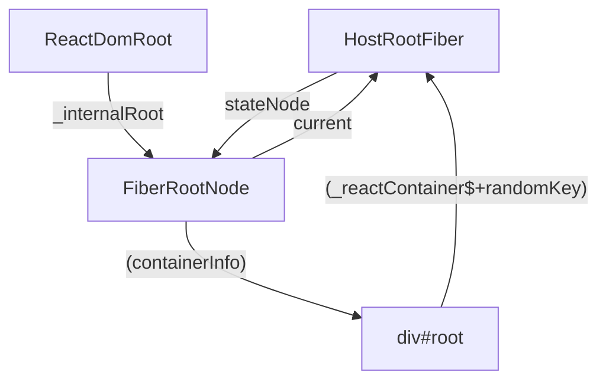

- [mini-react](#mini-react)
  - [創建 Fiber 和 FiberRoot](#創建-fiber-和-fiberroot)
    - [1. 生成 fiber](#1-生成-fiber)
    - [2. 生成 FiberRoot](#2-生成-fiberroot)
  - [實現入口 createRoot](#實現入口-createroot)
    - [1. 建立 ReactDOMRoot，讓外部調用 createRoot 和 render()](#1-建立-reactdomroot讓外部調用-createroot-和-render)
    - [2. 調用 render，根組件交給 react，react 內部調用 updateContainer，創建 update，啟動調度](#2-調用-render根組件交給-reactreact-內部調用-updatecontainer創建-update啟動調度)
  - [scheduleUpdateOnFiber 調度更新開始](#scheduleupdateonfiber-調度更新開始)
    - [ensureRootIsScheduled -\> scheduleTaskForRootDuringMicrotask，確保在當次瀏覽器工作循環執行啟動 scheduler 包中的調度](#ensurerootisscheduled---scheduletaskforrootduringmicrotask確保在當次瀏覽器工作循環執行啟動-scheduler-包中的調度)
    - [react-reconciler workLoop](#react-reconciler-workloop)
      - [第一階段 render -\> performUnitOfWork()：兩階段 beginWork, completeUnitWork](#第一階段-render---performunitofwork兩階段-beginwork-completeunitwork)
        - [beginWork - 建立 fiber 結構](#beginwork---建立-fiber-結構)
        - [completeUnitWork - 深度優先遍歷，按照 fiber tag 建立真實 DOM](#completeunitwork---深度優先遍歷按照-fiber-tag-建立真實-dom)
          - [看 fiber 建立的結果](#看-fiber-建立的結果)
      - [第二階段 commit: VDOM -\> DOM](#第二階段-commit-vdom---dom)
  - [補充各種節點渲染](#補充各種節點渲染)
    - [文本節點](#文本節點)
      - [第一種: .render("xxx")](#第一種-renderxxx)
      - [第二種: children fibers Array 中有文字節點](#第二種-children-fibers-array-中有文字節點)
    - [Fragment](#fragment)
      - [第一種: 巢狀的 Framgment](#第一種-巢狀的-framgment)
      - [第二種: 根節點就是 Fragment](#第二種-根節點就是-fragment)
    - [ClassComponent](#classcomponent)
      - [beginWork](#beginwork)
      - [completeWork](#completework)
    - [FunctionComponent](#functioncomponent)
      - [beginWork](#beginwork-1)
      - [completeWork](#completework-1)
  - [Hooks](#hooks)
    - [模擬 useReducer](#模擬-usereducer)
      - [定義 useReducer](#定義-usereducer)
        - [架構](#架構)
        - [建立 hook 鏈表](#建立-hook-鏈表)
        - [dispatch 事件，修改 hook.memorizedState](#dispatch-事件修改-hookmemorizedstate)
        - [render 階段](#render-階段)
        - [節點刪除](#節點刪除)

# mini-react

react 中的階段：

- triggering: a render （把客人的點單分發到廚房)
- rendering: the component beginWork, completeWork (準備訂單)
- commiting: to the DOM (將菜放在桌上)

## 創建 Fiber 和 FiberRoot

> @mono/react-reconciler

### 1. 生成 fiber

根據不同的標籤，生成不同屬性的 fiber，並且掛載到 workInprogress 樹上

> 核心代碼 src/ReactFiber.ts
> 類型主要在 src/ReactInternalTypes.ts

```ts
import { ReactElement, ReactFragment } from "@mono/shared/ReactTypes";
import { REACT_FRAGMENT_TYPE } from "@mono/shared/ReactSymbols";
import { isFn, isStr } from "@mono/shared/utils";
import {
  ClassComponent,
  Fragment,
  FunctionComponent,
  HostComponent,
  HostRoot,
  HostText,
  IndeterminateComponent,
  WorkTag,
} from "./ReactWorkTags";
import { Fiber } from "./ReactInternalTypes";
import { NoFlags } from "./ReactFiberFlags";
import { Lanes, NoLanes } from "./ReactFiberLane";
import { RootTag } from "./ReactFiberRoot";

export function createFiber(
  tag: WorkTag,
  pendingProps: any,
  key: null | string
): Fiber {
  return new FiberNode(tag, pendingProps, key);
}

function FiberNode(tag: WorkTag, pendingProps: unknown, key: string | null) {
  // 1. 基本的屬性
  this.tag = tag;
  this.key = key;
  this.elementType = null;
  this.type = null;
  // 不同組件定義不同 原生標籤-string; 類組件-實例
  this.stateNode = null;

  // 2. fiber 的節點鏈表
  this.return = null;
  this.child = null;
  this.sibling = null;
  // 紀錄節點在兄弟節點中位置下標，用於 diff 時判斷節點是否需要發生位移
  this.index = 0;

  // 3. Effects
  this.flags = NoFlags;
  this.subtreeFlags = NoFlags;
  this.deletions = null;

  // 4. 優先級
  this.lanes = NoLanes;
  this.childLanes = NoLanes;

  // 5. 兩棵樹上的 fiber 節點，指向對應的 fiber 節點
  this.alternate = null;

  this.memoizedProps = null;
  // 不同組件指向不同，函數組件 -> hook0; 類組件 -> state
  this.memoizedState = null;
  this.pendingProps = pendingProps;
}

// 創造新的樹
export function createWorkInProgress(current: Fiber, pendingProps: any): Fiber {
  let workInProgress = current.alternate;

  // 初始化只有一棵樹的時候
  if (workInProgress === null) {
    workInProgress = createFiber(current.tag, pendingProps, current.key);
    workInProgress.elementType = current.elementType;
    workInProgress.type = current.type;
    workInProgress.stateNode = current.stateNode;

    // 把新的樹節點指向到舊的樹的節點上
    workInProgress.alternate = current;
    // 把舊樹節點指向到新的樹的節點上
    current.alternate = workInProgress;
  } else {
    // 已經存在節點了，但有更新！
    // 更新可能是 props, type
    workInProgress.pendingProps = pendingProps;
    workInProgress.type = current.type;

    // 已經有 flags，但這邊給他重置成初始狀態
    workInProgress.flags = NoFlags;

    // 因為有更新，所以子結構也一定有變更 -> 重置成初始狀態，刪除的標籤也重置
    workInProgress.subtreeFlags = NoFlags;
    workInProgress.deletions = null;
  }

  // 重置靜態 effects 以外的所有屬性 轉移到新的樹上
  workInProgress.flags = current.flags;
  workInProgress.childLanes = current.childLanes;
  workInProgress.lanes = current.lanes;

  workInProgress.child = current.child;
  workInProgress.memoizedProps = current.memoizedProps;
  workInProgress.memoizedState = current.memoizedState;
  workInProgress.updateQueue = current.updateQueue;

  workInProgress.sibling = current.sibling;
  workInProgress.index = current.index;

  return workInProgress;
}

// 按照Element 創造出 fiber
export function createFiberFromElement(element: ReactElement) {
  const { type, key } = element;
  const pendingProps = element.props;
  const fiber = createFiberFromTypeAndProps(type, key, pendingProps);
  return fiber;
}

export function createHostRootFiber(tag: RootTag): Fiber {
  return createFiber(HostRoot, null, null);
}

// 按照不同的 type 創造出不同的 fiber
export function createFiberFromTypeAndProps(
  type: any,
  key: null | string,
  pendingProps: any,
  lanes: Lanes = NoLanes
): Fiber {
  // 是組件！
  let fiberTag: WorkTag = IndeterminateComponent;
  if (isFn(type)) {
    // 是 ClassComponent | FunctionComponent
    if (shouldConstruct(type)) {
      fiberTag = ClassComponent;
    } else {
      fiberTag = FunctionComponent;
    }
  } else if (isStr(type)) {
    // 如果是原生標籤
    fiberTag = HostComponent;
  } else if (type === REACT_FRAGMENT_TYPE && lanes) {
    return createFiberFromFragment(pendingProps.children, lanes, key);
  }

  const fiber = createFiber(fiberTag, pendingProps, key);
  fiber.elementType = type;
  fiber.type = type;
  fiber.lanes = lanes;

  return fiber;
}

// 創造Fragment節點的 fiber
export function createFiberFromFragment(
  elements: ReactFragment,
  lanes: Lanes,
  key: null | string
): Fiber {
  const fiber = createFiber(Fragment, elements, key);
  fiber.lanes = lanes;
  return fiber;
}

// 創造文本節點的 fiber
export function createFiberFromText(content: string, lanes: Lanes): Fiber {
  const fiber = createFiber(HostText, content, null);
  fiber.lanes = lanes;
  return fiber;
}

function shouldConstruct(Component: Function) {
  const prototype = Component.prototype;
  return !!(prototype && prototype.isReactComponent);
}
```

### 2. 生成 FiberRoot

❌ 注意不是 fiber 類型，只是掛載了整個樹相關的屬性，包含新舊樹等
可以想像是 最外層把一切封裝起來。

> 核心代碼 src/ReactFiberRoot.ts
> 類型主要在 src/ReactInternalTypes.ts

```ts
import { NoLane, NoLanes, createLaneMap, NoTimestamp } from "./ReactFiberLane";
import type { Container, FiberRoot } from "./ReactInternalTypes";
import type { ReactNodeList } from "@mono/shared/ReactTypes";
import { createHostRootFiber } from "./ReactFiber";
import { initializeUpdateQueue } from "./ReactFiberClassUpdateQueue";

export type RootTag = 0 | 1;
// export const LegacyRoot = 0;
export const ConcurrentRoot = 1;

export type RootState = {
  element: any;
};

// 創建 FiberRootNode，掛載整棵樹相關的屬性
export function FiberRootNode(containerInfo, tag) {
  this.tag = tag;
  this.containerInfo = containerInfo;
  this.pendingChildren = null;
  this.current = null;
  this.finishedWork = null;
  this.callbackNode = null;
  this.callbackPriority = NoLane;

  this.eventTimes = createLaneMap(NoLanes);
  this.expirationTimes = createLaneMap(NoTimestamp);

  this.pendingLanes = NoLanes;
  this.finishedLanes = NoLanes;
}

export function createFiberRoot(
  containerInfo: Container, // 就是者 document.getElementById('root')
  tag: RootTag,
  initialChildren: ReactNodeList
): FiberRoot {
  // !注意#root 以containerInfo掛載FiberRoot上，之後commit會用到
  const root: FiberRoot = new FiberRootNode(containerInfo, tag);

  // Cyclic construction. This cheats the type system right now because
  // stateNode is any.
  // 創建 fiber 根節點
  const uninitializedFiber = createHostRootFiber(tag);
  // FiberRootNode 的 current 樹指向 fiber 根節點
  root.current = uninitializedFiber;
  // fiber 的 stateNode 也要指向 FiberRoot
  uninitializedFiber.stateNode = root;

  // ! 初始時，子節點會變成 element 掛載到 memoizedState 上
  const initialState: RootState = {
    element: initialChildren,
  };
  uninitializedFiber.memoizedState = initialState;

  initializeUpdateQueue(uninitializedFiber);

  return root;
}
```

## 實現入口 createRoot

> @mono/react-dom

### 1. 建立 ReactDOMRoot，讓外部調用 createRoot 和 render()

react 的入口點

> 主要在 @mono/react-dom/src/client/ReactDOMRoot.ts

```ts
import type { FiberRoot } from "@mono/react-reconciler/src/ReactInternalTypes";
import type { ReactNodeList } from "@mono/shared/ReactTypes";
import {
  ConcurrentRoot,
  createFiberRoot,
} from "@mono/react-reconciler/src/ReactFiberRoot";
import {
  updateContainer,
  createContainer,
} from "@mono/react-reconciler/src/ReactFiberReconciler";

type RootType = {
  render: (children: ReactNodeList) => void;
  _internalRoot: FiberRoot;
};

// 創造一個類型，掛載 render 和 unmount 的方法，並且創造和 fiber 的連結
// 把 fiber 掛載到 _internalRoot 上面
function ReactDOMRoot(internalRoot: FiberRoot) {
  this._internalRoot = internalRoot;
}

ReactDOMRoot.prototype.render = function (children: ReactNodeList) {
  // 拿到 fiberRoot
  const root = this._internalRoot;
  updateContainer(children, root);
};

function createRoot(
  container: Element | Document | DocumentFragment
): RootType {
  const root = createContainer(container, ConcurrentRoot);

  return new ReactDOMRoot(root);
}

export default { createRoot };
```

### 2. 調用 render，根組件交給 react，react 內部調用 updateContainer，創建 update，啟動調度

> @mono/react-reconciler/src/ReactFiberReconciler.ts

1. 獲取 current, lane
2. 創建 update
3. update 入隊放到暫存區
4. scheduleUpdateOnFiber 啟動調度
5. entangleTranstions

```ts
import { ReactNodeList } from "@mono/shared/ReactTypes";
import type { Container, Fiber, FiberRoot } from "./ReactInternalTypes";
import type { RootTag } from "./ReactFiberRoot";
import { createFiberRoot } from "./ReactFiberRoot";

// 輸出給 react-dom，實現 react 的入口，創造出 fiberRoot, fiber 樹狀結構掛載在實例根節點上
export function createContainer(containerInfo: Container, tag: RootTag) {
  return createFiberRoot(containerInfo, tag);
}

export function updateContainer(element: ReactNodeList, container: FiberRoot) {
  // 組件初次渲染

  // 1. 獲取 current, lane
  const current = container.current;
  // 源碼中，初次渲染 子element 會作為 update.payload
  // const eventTime = getCurrentTime();
  // const update = createUpdate(eventTime, lane);
  // update.payload = { element };
  // 暫時簡寫放到 memoizedState
  current.memoizedState = { element };

  // scheduleUpdateOnFiber(root, current, lane, eventTime);
}
```

## scheduleUpdateOnFiber 調度更新開始

> @mono/react-reconciler/ReactFiberWorkLoop

在 `updateContainer()` 中調度 `scheduleUpdateOnFiber()`，這也是之後頁面觸發渲染都會執行的函式，會將指針指向正在處理的節點

```ts
import { Lane } from "./ReactFiberLane";
import { Fiber, FiberRoot } from "./ReactInternalTypes";

// 創建指針，指向正在處理的節點
let workInProgress: Fiber | null = null;
let workInProgressRoot: FiberRoot | null = null;

// 頁面初次渲染、類組件 setState/forceUpdate、函數組件 setState 都會走到此
export function scheduleUpdateOnFiber(root: FiberRoot, fiber: Fiber) {
  /**
   * 源碼核心:
   * 1. markRootUpdated: 標記根節點有一個 pending update
   * 2. ensureRootIsScheduled：主要是創建微任務去啟動 scheduler 調度器，調度器再去執行 react-reconciler 的 workLoop
   *    a. scheduleImmediateTask
   *    b. processRootScheduleInMicroTask
   *
   * 但因為目前還沒處理 lane 先忽略掉 1.
   **/

  workInProgressRoot = root;
  workInProgress = fiber;

  ensureRootIsScheduled(root);
}
```

### ensureRootIsScheduled -> scheduleTaskForRootDuringMicrotask，確保在當次瀏覽器工作循環執行啟動 scheduler 包中的調度

將 FiberRoot 傳入，把調度任務加入微任務， 確保在當次瀏覽器工作循環執行啟動 scheduler 包中的調度，再去執行 react-reconciler 的 workLoop

> @mono/react-reconciler/src/ReactFiberRootScheduler.ts

```ts
import { preformConcurrentWorkOnRoot } from "./ReactFiberWorkLoop";
import { FiberRoot } from "./ReactInternalTypes";
import { scheduleCallback, NormalPriority } from "@mono/scheduler";

export function ensureRootIsScheduled(root: FiberRoot) {
  // window 的方法，加入微任務，會去執行 scheduler包中的調度，確保在當次瀏覽器工作循環執行
  queueMicrotask(() => {
    scheduleTaskForRootDuringMicrotask(root);
  });
}

// 調度
export function scheduleTaskForRootDuringMicrotask(root: FiberRoot) {
  // 準備要調度更新，又分為 render 和 commit 階段
  // 這裡是入口
  scheduleCallback(
    NormalPriority,
    preformConcurrentWorkOnRoot.bind(null, root)
  );
}
```

### react-reconciler workLoop

入口點，執行 reconciler 兩階段

1. render: 構建 fiber 樹(VDOM)，核心就是調用 renderRootSync，又分為兩階段
   1. beginWork
   2. completeWork
2. commit: VDOM -> DOM

> react-reconciler/src/ReactFiberWorkLoop.ts

```ts
export function preformConcurrentWorkOnRoot(root: FiberRoot) {
  // ! 1. render: 構建 fiber 樹(VDOM)
  renderRootSync(root);
  // ! 2. commit: VDOM -> DOM
}
// 紀錄在哪個階段
let executionContext: ExecutionContext = NoContext;
function renderRootSync(root: FiberRoot) {
  // ! 1. render 階段開始
  // 紀錄之前正處理到哪個階段
  const prevExecutionContext = executionContext;
  // 先 merge 成 Render
  executionContext |= RenderContext;

  // ! 2. 初始化數據，準備好 WorkInProgress 樹
  prepareFreshStack(root);

  // ! 3. 遍歷構建 fiber 樹，深度優先遍歷
  workLoopSync();

  // ! 4. render 結束，把數據還原
  executionContext = prevExecutionContext;
  workInProgressRoot = null;
}

// 準備一顆 WorkInProgress 樹，在初次渲染是沒有的
function prepareFreshStack(root: FiberRoot): Fiber {
  root.finishedWork = null;

  workInProgressRoot = root;
  const rootWorkInprogress = createWorkInProgress(root.current, null);
  workInProgress = rootWorkInprogress;

  return rootWorkInprogress;
}

/** 開始了 fiber 建構的循環 */
function workLoopSync() {
  while (workInProgress !== null) {
    // 處理單一節點
    performUnitOfWork(workInProgress);
  }
}
```

#### 第一階段 render -> performUnitOfWork()：兩階段 beginWork, completeUnitWork

1. beginWork: 執行子節點的 fiber 創建
   1. 執行 unitOfWork 的 fiber 創建
   2. 看有沒有要走 diff，比方類組件 shouldComponentUpdate 比較後走到 bailout,
   3. 返回子節點（深度優先，一路執行 child)
2. 沒有子節點則執行 completeUnitWork: 循環執行創建真實 DOM
   ，並且把 workInProgress 轉移指針到同層級的兄弟節點，回到 beginWork，直到所有兄弟節點與其子節點都完成，這時指針轉移到父節點上，因為已經執行過 beginWork，不需要跳出 completeUnitWork 的迴圈，執行 DOM 創建之餘，把所有有 stateNode 的子節點（需要略過 Fragment、child === null）全部 appendAllChildren 到父節點 stateNode 中。以上 重複直到根節點。

```ts
function performUnitOfWork(unitOfWork: Fiber) {
  // 對應的 老的 current 節點
  const current = unitOfWork.alternate;
  // 1. beginWork，返回子節點
  let next = beginWork(current, unitOfWork);

  // 沒有子節點了
  if (next === null) {
    completeUnitWork(unitOfWork);
  } else {
    workInProgress = next;
  }
}
```

##### beginWork - 建立 fiber 結構

> react-reconciler/src/ReactFiberBeginWork.ts

```ts
import { mountChildFibers, reconcileChildFibers } from "./ReactChildFiber";
import type { Fiber } from "./ReactInternalTypes";
import { HostComponent, HostRoot } from "./ReactWorkTags";
import { shouldSetTextContent } from "@mono/react-dom/client/ReactDOMHostConfig";
// 處理當前的節點，因應不同節點做不同的處理
// 返回子節點
export function beginWork(
  current: Fiber | null,
  workInProgress: Fiber
): Fiber | null {
  switch (workInProgress.tag) {
    // 根節點
    case HostRoot:
      return updateHostRoot(current, workInProgress);
    // 原生標籤
    case HostComponent:
      return updateHostComponent(current, workInProgress);
  }
  // TODO:剩餘type
  throw new Error(`beginWork 有標籤沒有處理到 - ${workInProgress.tag}`);
}
// 根 fiber 節點，所需要做的只是，協調子節點
function updateHostRoot(current: Fiber | null, workInProgress: Fiber) {
  const nextChildren = current?.memoizedState.element;
  reconcileChildren(current, workInProgress, nextChildren);
  return workInProgress.child;
}
// 原生標籤，ex: div, span。初次渲染會進入協調，更新則可能是協調或是 bailout
// TODO: 更新
function updateHostComponent(current: Fiber | null, workInProgress: Fiber) {
  const { type, pendingProps } = workInProgress;
  // 如果原生標籤只有一個文本，這個時候文本不會再生成 fiber 節點，而是會變成原生標籤的屬性
  const isDirectTextChild = shouldSetTextContent(type, pendingProps);
  if (isDirectTextChild) {
    return null;
  } else {
    const nextChildren = workInProgress?.pendingProps.children;
    reconcileChildren(current, workInProgress, nextChildren);
    return workInProgress.child;
  }
}

// 協調子節點，構建新的 fiber 樹，
function reconcileChildren(
  current: Fiber | null,
  workInProgress: Fiber,
  nextChildren: any
) {
  // 初次渲染，但根節點#root存在所以不會走到這
  if (current === null) {
    workInProgress.child = mountChildFibers(workInProgress, null, nextChildren);
  } else {
    workInProgress.child = reconcileChildFibers(
      workInProgress,
      current.child,
      nextChildren
    );
  }
}
```

> react-reconciler/src/ReactChildFiber.ts

```ts
import {
  REACT_ELEMENT_TYPE,
  REACT_FRAGMENT_TYPE,
} from "@mono/shared/ReactSymbols";
import { ReactElement } from "@mono/shared/ReactTypes";
import { isArray } from "@mono/shared/utils";
import {
  createFiberFromElement,
  createFiberFromFragment,
  createFiberFromText,
} from "./ReactFiber";
// import {updateFragment} from "./ReactFiberBeginWork";
import { ChildDeletion, Forked, Placement, Update } from "./ReactFiberFlags";
import { Lanes } from "./ReactFiberLane";
import { Fiber } from "./ReactInternalTypes";
import { Fragment, HostText } from "./ReactWorkTags";

type ChildReconciler = (
  returnFiber: Fiber,
  currentFirstChild: Fiber | null,
  newChild: any
  //   lanes: Lanes
) => Fiber | null;

export const reconcileChildFibers: ChildReconciler =
  createChildReconciler(true);

export const mountChildFibers: ChildReconciler = createChildReconciler(false);

// 協調子節點
function createChildReconciler(shouldTrackSideEffect: boolean) {
  // 給 fiber 添加標記，flag，這邊會影響到之後 commit
  function placeSingleChild(newFiber: Fiber) {
    if (shouldTrackSideEffect && newFiber.alternate) {
      newFiber.flags |= Placement;
    }
    return newFiber;
  }

  // 只有協調單個子節點，沒有bailout
  function reconcileSingleElement(
    returnFiber: Fiber,
    currentFirstChild: Fiber | null,
    newChild: ReactElement
  ) {
    let createFiber = createFiberFromElement(newChild);
    createFiber.return = returnFiber;
    return createFiber;
  }

  function reconcileChildFibers(
    returnFiber: Fiber,
    currentFirstChild: Fiber | null,
    newChild: any
  ) {
    // 檢查 newChild 類型，有可能是文本 數組
    if (typeof newChild === "object" && newChild !== null) {
      switch (newChild.$$typeof) {
        case REACT_ELEMENT_TYPE: {
          return placeSingleChild(
            reconcileSingleElement(returnFiber, currentFirstChild, newChild)
          );
        }
      }
    }
    // TODO
    return null;
  }
  return reconcileChildFibers;
}
```

##### completeUnitWork - 深度優先遍歷，按照 fiber tag 建立真實 DOM

> react-reconciler/src/ReactFiberWorkLoop.ts

```ts
// 深度優先遍歷，子節點、兄弟節點、叔叔節點、爺爺節點....
function completeUnitWork(unitOfWork: Fiber) {
  let completedWork: Fiber | null = unitOfWork;

  do {
    const current = completedWork.alternate;
    const returnFiber = completedWork.return;
    // 依照不同的節點 tag 生成節點，如果是函式組件也可能 還有子節點等等
    // 如果自身處理完成，返回null
    // 並且看有沒有兄弟節點，沒有則返回父節點，再處理父節點的兄弟節點
    let next = completeWork(current, completedWork);

    // 如果有下個 work 的話，next可能指向 child 或是 標記 next 是
    if (next !== null) {
      workInProgress = next;
      return;
    }

    const siblingFiber = completedWork.sibling;
    if (siblingFiber !== null) {
      workInProgress = siblingFiber;
      return;
    }

    // 回到父節點上，如果下次循環，發現是已經完成的節點，會走到兄弟節點上
    completedWork = returnFiber;
    workInProgress = completedWork;
  } while (completedWork !== null);
}
```

> react-reconciler/src/ReactFiberCompleteWork.ts

```ts
import { isNum, isStr } from "@mono/shared/utils";
import { Fiber } from "./ReactInternalTypes";
import { HostComponent, HostRoot } from "./ReactWorkTags";

export function completeWork(
  current: Fiber | null,
  workInProgress: Fiber
): Fiber | null {
  switch (workInProgress.tag) {
    case HostRoot: {
      return null;
    }
    // 原生標籤
    case HostComponent: {
      const { type, pendingProps } = workInProgress;
      // 1. 創建真實dom
      const instance = document.createElement(type);
      // 2. 初始化DOM屬性
      finalizeInitialChildren(instance, pendingProps);
      appendAllChildren(instance, workInProgress);
      workInProgress.stateNode = instance;
      return null;
    }
    // TODO: 其他組件標籤 之後再說
  }
  throw new Error("不知名的 work tag");
}
// 初始化屬性
function finalizeInitialChildren(domElement: Element, props: any) {
  for (const propKey in props) {
    const nextVal = props[propKey];
    if (propKey === "style") {
      // TODO:
    } else if (propKey === "children") {
      // TODO:

      // 是文本節點
      if (isStr(nextVal) || isNum(nextVal)) {
        domElement.textContent = `${nextVal}`;
      }
    } else {
      domElement[propKey] = nextVal;
    }
  }
}

function appendAllChildren(parent: Element, workInProgress: Fiber) {
  let node = workInProgress.child;
  if (node) {
    parent.appendChild(node.stateNode);
  }
}
```

###### 看 fiber 建立的結果

> 終端下 `pnpm run dev`，此時，如果 examples 專案的 `main.jsx` 的結構是長這樣(目前只有單純寫純標籤節點)

```tsx
// import { createRoot } from "react-dom/client";
// 開啟手寫的 react
import { createRoot } from "@mono/react-dom/client";

const jsx = (
  <div className="border">
    <h1 className="h1Border">react</h1>
  </div>
);

createRoot(document.getElementById("root")!).render(jsx);
```

會建立起這樣的 FiberRootNode 結構

```ts
// FiberRootNode
{
  // ...省略
  current: { // FiberNode
    alternate: {
      child: {
        // ...省略
        stateNode: div.border, // 已經建立 instance 了
        child:{
          // ...省略
          stateNode: h1.h1Border, // 已經建立 instance 了
          child: null
        }
      } // FiberNode
    },
    containerInfo: div#root // 已經建立 instance 了
  }
}
```

#### 第二階段 commit: VDOM -> DOM

> react-reconciler/src/ReactFiberWorkLoop.ts

```ts
export function preformConcurrentWorkOnRoot(root: FiberRoot) {
  // ! 1. render: 構建 fiber 樹(VDOM)
  renderRootSync(root);
  // ! 2. commit: VDOM -> DOM
  // 新的根fiber
  const finishedWork = root.current.alternate;
  root.finishedWork = finishedWork;
  commitRoot(root);
}

function commitRoot(root: FiberRoot) {
  // ! 1. commit 階段開始
  const prevExecutionContext = executionContext;
  executionContext |= CommitContext;
  // ! 2. mutation 階段，渲染 DOM 樹
  commitMutationEffects(root, root.finishedWork);

  // ! 4. commit 結束，把數據還原
  executionContext = prevExecutionContext;
  workInProgressRoot = null;
}
```

創建完 VDOM 要想辦法渲染在真實的 DOM 上，要逐一遍歷，使用遞迴

> react-reconciler/src/ReactFiberCommitWork.ts

```ts
// finishedWork 是 HostRoot 類型的 fiber，要把子節點渲染到 root 裡面，root 是 #root
export function commitMutationEffects(root: FiberRoot, finishedWork: Fiber) {
  // 遍歷子節點和兄弟節點
  recursivelyTraverseMutationEffects(root, finishedWork);
  // 根據flags做相對應的操作，比方在父節點 appendChild
  commitReconciliationEffects(finishedWork);
}

// 遍歷 finishedWork
function recursivelyTraverseMutationEffects(root, parentFiber: Fiber) {
  // 單鏈表
  let child = parentFiber.child;
  while (child !== null) {
    // 再次遞迴，每個子節點都一一提交，包含同級的兄弟節點
    commitMutationEffects(root, child);
    child = child.sibling;
  }
}
// 提交協調中產生的effects，比如flags標記 Placement, Update, ChildDeletion
function commitReconciliationEffects(finishedWork: Fiber) {
  // TODO 只先完成 Placement
  const flags = finishedWork.flags;
  if (flags & Placement) {
    // 頁面初次渲染，新增插入 appendChild
    commitPlacement(finishedWork);
    // 把 Placement 從 flags 移除
    finishedWork.flags &= ~Placement;
  }
}

function commitPlacement(finishedWork: Fiber) {
  // 目前先把 HostComponent 渲染上去，之後再處理其他組件的情況
  if (finishedWork.stateNode && finishedWork.tag === HostComponent) {
    const domNode = finishedWork.stateNode;
    const parentFiber = getHostParentFiber(finishedWork);
    // 要找到最接近的祖先節點 是 Host 的 fiber，再把他塞進去
    // Host 節點有三種 HostRoot, HostComponent, HostText(不能有子節點)
    let parentDOM = parentFiber.stateNode;
    // HostRoot 的實例存在 containerInfo 中
    if (parentDOM.containerInfo) parentDOM = parentDOM.containerInfo;
    parentDOM.appendChild(domNode);
  }
}

function getHostParentFiber(fiber: Fiber) {
  let parentFiber = fiber.return;
  while (parentFiber !== null) {
    if (isHostParent(parentFiber)) {
      return parentFiber;
    }
    parentFiber = parentFiber.return;
  }
  throw Error("Expected to find a host parent.");
}

function isHostParent(fiber: Fiber) {
  return fiber.tag === HostComponent || fiber.tag === HostRoot;
}
```

看 react 建立的結果，此時最簡單的 jsx 已經出現在畫面上了。

## 補充各種節點渲染

### 文本節點

有兩種使用方式，可以創造出文本節點

1.

```tsx
createRoot(document.getElementById("root")!).render("abc123");
```

2.

```tsx
const jsx = (
  <div className="border">
    <h1 className="h1Border">react</h1>
    abctest
  </div>
);

createRoot(document.getElementById("root")!).render(jsx);
```

#### 第一種: .render("xxx")

渲染流程，進入 render workLoop `renderRootSync` - `workLoopSync` - `performUnitOfWork` - `beginWork` - `completeUnitWork`

```js
function performUnitOfWork(unitOfWork: Fiber) {
  const current = unitOfWork.alternate;
  // 1. beginWork，返回子節點
  let next = beginWork(current, unitOfWork);

  // 沒有子節點了
  if (next === null) {
    completeUnitWork(unitOfWork);
  } else {
    workInProgress = next;
  }
}
```

1. `beginWork`

```js
export function beginWork(
  current: Fiber | null,
  workInProgress: Fiber
): Fiber | null {
  switch (workInProgress.tag) {
    // 省略

    // 先進入根節點
    case HostRoot:
      return updateHostRoot(current, workInProgress);
    case HostText:
      return updateHostText();
  }
  // 省略
}
// beginWork 如果有子節點，會回傳 workInProgress子節點，不然空
function updateHostText() {
  return null;
}
```

進入 `updateHostRoot` - `reconcileChildren` - `reconcileChildFibers`

```js
function reconcileChildFibers(
  returnFiber: Fiber,
  currentFirstChild: Fiber | null,
  newChild: any
) {
  if (isText(newChild)) {
    return placeSingleChild(
      reconcileSingleTextNode(returnFiber, currentFirstChild, newChild)
    );
  }
  // 省略

  return null;
}

// 只有協調單個子節點，沒有bailout
function reconcileSingleTextNode(
  returnFiber: Fiber,
  currentFirstChild: Fiber | null, // TODO:
  textContent: string | number
) {
  // 把 textContent 作為 pendingProps 放入 fiber
  // 強制轉型成字串，以防數字
  const created = createFiberFromText(textContent + "");
  created.return = returnFiber;
  return created;
}

function isText(newChild: any) {
  return (
    (typeof newChild === "string" && newChild !== "") ||
    typeof newChild === "number"
  );
}
```

2. `completeUnitWork` - `completeWork` - `createChildReconciler`

創建真實 DOM

```js
export function completeWork(
  current: Fiber | null,
  workInProgress: Fiber
): Fiber | null {
  const { type, pendingProps } = workInProgress;

  switch (workInProgress.tag) {
    // 省略
    // 上面 createFiberFromText 時，textContent 作為 pendingProps 放入 fiber
    case HostText: {
      workInProgress.stateNode = document.createTextNode(pendingProps);
      return null;
    }
  }
  // 省略
}
```

再進入 commit 階段 `commitRoot` - `commitMutationEffects`-`commitPlacement`

增加 commit parentDOM.appendChild 的判斷

```js
function commitPlacement(finishedWork: Fiber) {
  if (
    finishedWork.stateNode &&
    (finishedWork.tag === HostComponent || finishedWork.tag === HostText)
  ) {
    // 省略
  }
}
```

就可以得到 文字節點 渲染在畫面上。

#### 第二種: children fibers Array 中有文字節點

渲染流程，進入 render workLoop `renderRootSync` - `workLoopSync` - `performUnitOfWork` - `beginWork` - `updateHostComponent` - `reconcileChildren` - `reconcileChildFibers` - `createChildReconciler`

```js
export function beginWork(
  current: Fiber | null,
  workInProgress: Fiber
): Fiber | null {
  switch (workInProgress.tag) {
    // 省略
    // 進入原生標籤
    case HostComponent:
      return updateHostComponent(current, workInProgress);
  }
  // 省略
}
```

```js
function reconcileChildFibers(
  returnFiber: Fiber,
  currentFirstChild: Fiber | null,
  newChild: any
) {
  // 省略
  // 如果節點是陣列，有多個子節點
  if (isArray(newChild)) {
    return reconcileChildrenArray(returnFiber, currentFirstChild, newChild);
  }

  // 省略
  return null;
}
```

`reconcileChildrenArray` - `createChild`

```js
function createChild(returnFiber: Fiber, newChild: any) {
  if (isText(newChild)) {
    // 強制轉型成字串，以防數字
    const created = createFiberFromText(newChild + "");
    created.return = returnFiber;
    return created;
  }
  // 省略
}
```

剩下就是走第一種流程，循環 beginWork，commit

### Fragment

```tsx
const jsx = <>11111</>;
```

會被 babel 轉譯成這樣

```js
{
  $$typeof: Symbol(react.element);
  key: null;
  props: {
    children: "11111";
  }
  ref: null;
  type: Symbol(react.fragment);
}
```

有三種使用方式，可以創造出 Fragment 節點

1. 巢狀的 Framgment

```tsx
const jsx = (
  <div className="border">
    <h1 className="h1Border">react</h1>
    <h2 className="h2Border">h2</h2>
    123
    <>
      11111
      <>
        <div>333</div>
      </>
    </>
  </div>
);

createRoot(document.getElementById("root")!).render(jsx);
```

2. 根節點就是 Fragment

```tsx
createRoot(document.getElementById("root")!).render(<>123</>);
```

3. 使用 Fragment 標籤，轉譯過後跟第一種第二種一樣

```tsx
createRoot(document.getElementById("root")!).render(<Fragment>123</Fragment>);
```

#### 第一種: 巢狀的 Framgment

一樣流程進入 beginWork 轉換成 fiber，
root 先 再來 `<div className="border">`，在`updateHostComponent`建立了四個子節點的 fiber（h1-h2-textNode-Fragment)，並且返回 h1 fiber，依次執行，直到 Fragment

```tsx
<div className="border">
  <h1 className="h1Border">react</h1>
  <h2 className="h2Border">h2</h2>
  123
  <>
    11111
    <>
      <div>333</div>
    </>
  </>
</div>
```

```ts
export function beginWork(
  current: Fiber | null,
  workInProgress: Fiber
): Fiber | null {
  switch (workInProgress.tag) {
    case HostRoot:
      // 1.root
      return updateHostRoot(current, workInProgress);
    case HostComponent:
      // 2. div
      // 3. h1 -> completeUnitWork
      // 4. h2 -> completeUnitWork
      // 9. div -> completeUnitWork
      return updateHostComponent(current, workInProgress);
    case HostText:
      // 5. 123 -> completeUnitWork  -> 把 workInProgress 指向 Fragment 再次進入 beginWork
      // 7. 11111 -> completeUnitWork
      return updateHostText();
    case Fragment:
      // 6. Fragment
      // 8. Fragment
      return updateHostFragment(current, workInProgress);
  }
  // 省略
}
```

```ts
// 和原生標籤 HostComponent 做差不多的處理
function updateHostComponent(current: Fiber | null, workInProgress: Fiber) {
  // children 一樣在 pendingProps 上
  const nextChildren = workInProgress?.pendingProps.children;
  reconcileChildren(current, workInProgress, nextChildren); //  newChild = [h1,h2,123,Fragment]
  return workInProgress.child; // h1
}
```

```ts
function reconcileChildFibers(
  returnFiber: Fiber,
  currentFirstChild: Fiber | null,
  newChild: any
) {
  // 省略
  if (isArray(newChild)) {
    // newChild = [h1,h2,123,Fragment] 都還沒變成 fiber
    return reconcileChildrenArray(returnFiber, currentFirstChild, newChild);
  }
  // 省略
}
```

`reconcileChildrenArray` - 遍歷陣列 children `createChild`

```ts
function createChild(returnFiber: Fiber, newChild: any) {
  debugger;
  if (isText(newChild)) {
    // 強制轉型成字串，以防數字
    const created = createFiberFromText(newChild + "");
    created.return = returnFiber;
    return created;
  }
  if (typeof newChild === "object" && newChild !== null) {
    switch (newChild.$$typeof) {
      case REACT_ELEMENT_TYPE: {
        const created = createFiberFromElement(newChild);
        created.return = returnFiber;
        return created;
      }
    }
  }

  // TODO
  return null;
}
```

```ts
// 按照Element 創造出 fiber
export function createFiberFromElement(element: ReactElement) {
  const { type, key } = element;
  const pendingProps = element.props;
  const fiber = createFiberFromTypeAndProps(type, key, pendingProps);
  return fiber;
}

// 按照不同的 type 創造出不同的 fiber
export function createFiberFromTypeAndProps(
  type: any,
  key: null | string,
  pendingProps: any,
  lanes: Lanes = NoLanes
): Fiber {
  // 是組件！
  let fiberTag: WorkTag = IndeterminateComponent;
  if (isFn(type)) {
    // 省略
  } else if (isStr(type)) {
    // 省略
  } else if (type === REACT_FRAGMENT_TYPE) {
    fiberTag = Fragment; // 為 Fragment 創造屬於他的tag
  }

  const fiber = createFiber(fiberTag, pendingProps, key);
  fiber.elementType = type;
  fiber.type = type;
  fiber.lanes = lanes;

  return fiber;
}
```

中間經過 completeUnitWork 轉移 workInProgress 指針，依序執行 h1, h2, 123，就不贅述，快轉到處理 Fragment，回到 `beginWork`，進入 `updateHostFragment` 後 - `reconcileChildren` - `reconcileChildFibers`

```ts
export function beginWork(
  current: Fiber | null,
  workInProgress: Fiber
): Fiber | null {
  switch (workInProgress.tag) {
    // 省略
    case Fragment:
      return updateHostFragment(current, workInProgress);
  }
  // 省略
}
```

```ts
function updateHostFragment(current: Fiber | null, workInProgress: Fiber) {
  // children 一樣在 pendingProps 上
  const nextChildren = workInProgress?.pendingProps.children;
  reconcileChildren(current, workInProgress, nextChildren); //  newChild = ["11111", {Fragment(還沒變成fiber)}]
  return workInProgress.child; // '11111'
}
```

```ts
function reconcileChildFibers(
  returnFiber: Fiber,
  currentFirstChild: Fiber | null,
  newChild: any
) {
  // 省略
  if (isArray(newChild)) {
    // newChild = ["11111", {Fragment(還沒變成fiber)}]
    return reconcileChildrenArray(returnFiber, currentFirstChild, newChild);
  }
  // 省略
}
```

`reconcileChildrenArray` - `createChild` 一樣處理成 fiber 後，一樣處理 `newChild = {div 333}`，進入 `completeUnitWork` 完成創建 DOM，回到父節點 Fragment，
這時在 `completeWork` 中，因為 Fragment 是沒有實際 DOM 的，因此回傳 null

```ts
// 針對 workInProgress 創建真實 DOM
export function completeWork(
  current: Fiber | null,
  workInProgress: Fiber
): Fiber | null {
  // 省略
  switch (workInProgress.tag) {
    case HostRoot:
    case Fragment: {
      return null;
    }
    // 省略
  }
  // 省略
}
```

在這之後繼續遞迴直到回到 `div className="border"`，

```ts
export function completeWork(
  current: Fiber | null,
  workInProgress: Fiber
): Fiber | null {
  // 省略
  switch (workInProgress.tag) {
    // 省略
    case HostComponent: {
      // 1. 創建真實dom
      const instance = document.createElement(type);
      // 2. 初始化DOM屬性
      finalizeInitialChildren(instance, pendingProps);
      appendAllChildren(instance, workInProgress);
      workInProgress.stateNode = instance;
      return null;
    }
    // 省略
  }
  // 省略
}
```

重點放在`appendAllChildren`，要把所有的子節點遞迴，append 到真實 DOM，這個時候，如果子節點除了 `fiber.tag === HostComponent ||
    fiber.tag === HostRoot ||
    fiber.tag === HostText` 可以直接添加以外，應該要把 子節點的子節點添加進去，比如 Fragment 下面的節點，把 workInProgress 下面的整顆樹都添加進去。

```ts
function appendAllChildren(parent: Element, workInProgress: Fiber) {
  let node = workInProgress.child;
  while (node !== null) {
    // 如果子節點是 Fragment，就沒有 node.stateNode
    if (isHost(node)) {
      parent.appendChild(node.stateNode); // node.stateNode 是 DOM 節點
      // 向下找直到小孩是有 stateNode
    } else if (node.child !== null) {
      node = node.child;
      continue;
    }

    // 已經處理完 workInProgress 下方的整顆樹了
    if (node === workInProgress) return;

    // 同層級結束
    while (node.sibling === null) {
      // 如果是根節點，或是已經是 workInProgress 下方的整顆樹的最後一個節點
      if (node.return === null || node.return === workInProgress) {
        return;
      }
      node = node.return;
    }
    node = node.sibling;
  }
}

export function isHost(fiber: Fiber) {
  return (
    fiber.tag === HostComponent ||
    fiber.tag === HostRoot ||
    fiber.tag === HostText
  );
}
```

最後進入 commit 階段，遍歷 FiberRoot 添加到 parentDOM 中

#### 第二種: 根節點就是 Fragment

在 commit 時，會找根節點 appendChild，要是根節點是 Fragment，會沒有 stateNode

```ts
function commitPlacement(finishedWork: Fiber) {
  // 目前先把 HostComponent 渲染上去，之後再處理其他組件的情況
  if (finishedWork.stateNode && isHost(finishedWork)) {
    const domNode = finishedWork.stateNode;
    const parentFiber = getHostParentFiber(finishedWork);
    // 要找到最接近的祖先節點 是 Host 的 fiber，再把他塞進去
    // Host 節點有三種 HostRoot, HostComponent, HostText(不能有子節點)
    let parentDOM = parentFiber.stateNode;
    // HostRoot 的實例存在 containerInfo 中
    if (parentDOM.containerInfo) parentDOM = parentDOM.containerInfo;
    parentDOM.appendChild(domNode);
  } else {
    // 要是根節點是 Fragment，會沒有stateNode
    let child = finishedWork.child;
    while (child !== null) {
      // 要是實際的節點
      commitPlacement(child);
      // 一樣處理完子樹後處理兄弟節點
      child = child.sibling;
    }
  }
}
```

### ClassComponent

```tsx
class ClassComp extends Component {
  render() {
    return <div>123</div>;
  }
}

createRoot(document.getElementById("root")!).render(
  <div>
    <ClassComp />
  </div>
);
```

在 @mono/react 建立 Component 類別

> react/src/ReactBaseClasses.ts

```ts
export function Component(props: any) {
  this.props = props;
}

Component.prototype.isReactComponent = {};
```

> react/index.ts

export 出去

```ts
export { REACT_FRAGMENT_TYPE as Fragment } from "@mono/shared/ReactSymbols";
export { Component } from "./src/ReactBaseClasses";
```

轉譯後 class 的 react element 結構

```ts
{
  $$typeof: Symbol(react.element),
  key: null,
  props: {},
  ref: null,
  type: class ClassComp,
  _owner: null,
  _store: {validated: true}
}
```

#### beginWork

在 beginWork 處理 div 時，會進入 `createChildReconciler` - `reconcileSingleElement` - `createFiberFromElement` - `createFiberFromTypeAndProps` 處理子節點，要創造出 tag 是 ClassComponent 的 Fiber 節點

```ts
export function createFiberFromTypeAndProps(
  type: any,
  key: null | string,
  pendingProps: any,
  lanes: Lanes = NoLanes
): Fiber {
  // 是組件！
  let fiberTag: WorkTag = IndeterminateComponent;
  if (isFn(type)) {
    // 是 ClassComponent
    if (type.prototype.isReactComponent) {
      fiberTag = ClassComponent;
    }
  }
  // 省略

  const fiber = createFiber(fiberTag, pendingProps, key);
  fiber.elementType = type;
  fiber.type = type;
  fiber.lanes = lanes;

  return fiber;
}
```

處理到 class 本身時，beginWork 要處理 ClassComponent

```ts
export function beginWork(
  current: Fiber | null,
  workInProgress: Fiber
): Fiber | null {
  switch (workInProgress.tag) {
    // 省略
    case ClassComponent:
      return updateClassComponent(current, workInProgress);
  }

  // TODO:
  throw new Error(`beginWork 有標籤沒有處理到 - ${workInProgress.tag}`);
}

function updateClassComponent(current: Fiber | null, workInProgress: Fiber) {
  const { type, pendingProps } = workInProgress;
  // 實例在 type 上
  const instance = new type(pendingProps);
  // 調用 render 創造節點
  const children = instance.render();
  reconcileChildren(current, workInProgress, children);
  return workInProgress.child;
}
```

#### completeWork

```ts
export function completeWork(
  current: Fiber | null,
  workInProgress: Fiber
): Fiber | null {
  const { type, pendingProps } = workInProgress;

  switch (workInProgress.tag) {
    // 省略
    case ClassComponent: {
      // class 是不用創造出實體 DOM 的，因此回傳 null
      return null;
    }
    // 省略
  }
  // 省略
}
```

處理到這，已經可以成功渲染出節點在畫面上了

### FunctionComponent

```tsx
function Comp() {
  return <div>123</div>;
}
createRoot(document.getElementById("root")!).render(
  <div>
    <Comp />
  </div>
);
```

轉譯後 class 的 react element 結構

```ts
{
  $$typeof: Symbol(react.element),
  key: null,
  props: {},
  ref: null,
  type: ƒ Comp(),
  _owner: null,
  _store: {validated: true}
}
```

#### beginWork

在 beginWork 處理 div 時，會進入 `createChildReconciler` - `reconcileSingleElement` - `createFiberFromElement` - `createFiberFromTypeAndProps` 處理子節點，要創造出 tag 是 ClassComponent 的 Fiber 節點

```ts
export function createFiberFromTypeAndProps(
  type: any,
  key: null | string,
  pendingProps: any,
  lanes: Lanes = NoLanes
): Fiber {
  // 是組件！
  let fiberTag: WorkTag = IndeterminateComponent;
  if (isFn(type)) {
    // 是 ClassComponent | FunctionComponent
    if (type.prototype.isReactComponent) {
      fiberTag = ClassComponent;
    } else {
      fiberTag = FunctionComponent;
    }
  }
  // 省略
}
```

處理到 FN 本身時，beginWork 要處理 FunctionComponent

```ts
export function beginWork(
  current: Fiber | null,
  workInProgress: Fiber
): Fiber | null {
  switch (workInProgress.tag) {
    // 省略
    case FunctionComponent:
      return updateFunctionComponent(current, workInProgress);
  }
  // 省略
}

function updateFunctionComponent(current: Fiber | null, workInProgress: Fiber) {
  const { type, pendingProps } = workInProgress;
  // 調用 render 創造節點
  const children = type(pendingProps);
  reconcileChildren(current, workInProgress, children);
  return workInProgress.child;
}
```

#### completeWork

```ts
export function completeWork(
  current: Fiber | null,
  workInProgress: Fiber
): Fiber | null {
  const { type, pendingProps } = workInProgress;

  switch (workInProgress.tag) {
    // 省略
    case FunctionComponent: {
      return null;
    }
    // 省略
  }
  // 省略
}
```

處理到這，已經可以成功渲染出節點在畫面上了

## Hooks

- 規則：官網說不能在循換、條件或是嵌套中調用，要確保在 react 函式最頂層以及任何 return 前調用他們。
  - 是為什麼呢？ 因為在 hook 存在在 `fiber.memorized` 中，*單鏈表*的每個 hook 節點是沒有名字或是 key 的，除了他們的順序，_無法記錄他們的唯一性_，為了保持穩定性，才有這些規則。
- 類型：

  ```ts
  export type Hook = {
    // 不同類型的 hook，取值也不同
    // useState / useReducer 存 state，
    // useEffect / useLayoutEffect 存 effect單向循環鏈表
    memorizedState: any;

    // 下一個 hook，如果是 null，表示他是最後一個 hook
    next: Hook | null;

    // 下面三個先不深入，之後再說
    baseState: any;
    baseQueue: Update<any, any> | null;
    queue: any;
  };
  ```

- 存儲：
  就像是 fiber，會有一個指針指向正在工作中的 hook - `workInProgressHook`
  fiber.memorizedState(hook0) --next--> next(hook1) --next--> .... -> next(hookN)

  ```tsx
  let workInProgressHook = null;

  function FnComp(){
    const [state0, setState0] = useState(0); // hook0
    const [state1, setState1] = useState(0); // hook1
    useEffect(()=>{},[]) // hook2
    ...
  }
  ```

  ### 模擬 useReducer

  ```tsx
  function Comp() {
    const [count, setC] = useReducer((x) => {
      return x + 1;
    }, 0);

    // 僅先處理一個子節點喔
    return (
      <button
        onClick={() => {
          console.log("??????click");
          setC();
        }}
      >
        {count}
      </button>
    );
  }
  ```

  > react-reconciler/src/ReactFiberCompleteWork.ts

```ts
// 初始化屬性 || 更新屬性
function finalizeInitialChildren(domElement: Element, props: any) {
  for (const propKey in props) {
    const nextProp = props[propKey];
    if (propKey === "style") {
      // 省略
    } else if (propKey === "children") {
      // 省略
    } else {
      // ! 處理事件，源碼是用合成事件做處理，暫時用原生的
      if (propKey === "onClick") {
        domElement.addEventListener("click", nextProp);
      } else {
        domElement[propKey] = nextProp;
      }
    }
  }
}
```

此時已經可以看到`console.log("??????click");`

#### 定義 useReducer

##### 架構

> react-reconciler/src/ReactFiberHooks.ts

```ts
type Hook = {
  memorizedState: any;
  next: null | Hook;
};

export function useReducer<S, I, A>(
  reducer: (state: S, action: A) => S,
  initialArg: I,
  init?: (initialArg: I) => S
) {
  // TODO: 構建Hook鏈表
  const hook: Hook = {
    memorizedState: null,
    next: null,
  };
  let initialState: S;
  if (init) {
    initialState = init(initialArg);
  } else {
    initialState = initialArg as any;
  }

  // TODO: dispatch 事件
  const dispatch = (action: A) => {
    const newVal = reducer(initialArg, action);
  };

  // TODO: 要區分初次掛載還是更新，暫時寫這樣
  hook.memorizedState = initialArg;

  return [initialArg, dispatch];
}
```

> react/index.ts

```ts
export { useReducer } from "@mono/react-reconciler/src/ReactFiberHooks";
```

此時頁面並不會更新，要想更新一定要調用 `schedulerUpdateOnFiber`

在處理這個之前，先要想辦法把 hook 和 fiber 關聯起來。
說到 fiber 就會提到 beginWork，是把節點轉換成 fiber 的過程。
中間應該是可以做到把 hook 掛載上去的！

> react-reconciler/src/ReactFiberBeginWork.ts

```ts
export function beginWork(
  current: Fiber | null,
  workInProgress: Fiber
): Fiber | null {
  switch (workInProgress.tag) {
    // 省略
    case FunctionComponent:
      return updateFunctionComponent(current, workInProgress);
  }
  // 省略
}

function updateFunctionComponent(current: Fiber | null, workInProgress: Fiber) {
  const { type, pendingProps } = workInProgress;
  // 調用 render 創造節點
  // 原先是調用 type(pendingProps);
  const children = renderWithHook(current, workInProgress, type, pendingProps);
  reconcileChildren(current, workInProgress, children);
  return workInProgress.child;
}
```

中間插入 `renderWithHook` 讓 fiber 上面的 `memoizedState` 初始化，並且針對 hook 也設定三個變數，（不共用，會全局污染，workInProgressFiber 隨時會變動）

- `currentlyRenderingFiber`: 記載現在進行中的 fiber
- `workInProgressHook`: 指針指向當前進行中新的 hook
- `currentHook`: 舊的 hook

> react-reconciler/src/ReactFiberHooks.ts

```ts
let currentlyRenderingFiber: Fiber | null = null;
let workInProgressHook: Hook | null = null;
let currentHook: Hook | null = null;

export function renderWithHook(
  current: Fiber | null,
  workInProgress: Fiber,
  component: any,
  props: any
) {
  currentlyRenderingFiber = workInProgress;
  // 初始化
  workInProgress.memoizedState = null;
  let children = component(props);

  finishRenderingHooks();
  return children;
}

// reset: 處理完後，要把指針都重置
export function finishRenderingHooks() {
  currentlyRenderingFiber = null;
  currentHook = null;
  workInProgressHook = null;
}
```

##### 建立 hook 鏈表

回到 `useReducer`，在一開始 mount 呼叫時，需要構建出 hook 鏈表掛載在 fiber 身上。創造 `updateWorkInProgressHook`，目的是 返回新建立的 Hook 並且構建 hook 鏈表。
注意，在 mount 和 update 階段針對 hook 的處理會不一樣，
如果是 mount 的階段，需要構建鏈表，更新階段只需要更新鏈表。再針對是不是 hook0 做判斷。

> react-reconciler/src/ReactFiberHooks.ts

```ts
type Hook = {
  memorizedState: any;
  next: null | Hook;
};

// 返回新建立的 Hook 並且構建 hook鏈表
function updateWorkInProgressHook(): Hook {
  let hook: Hook;

  // 指向到節點舊的fiber
  const current = currentlyRenderingFiber?.alternate;

  if (current) {
    // update 階段
    // 把老的state掛載到新的fiber的memoizedState上
    currentlyRenderingFiber!.memoizedState = current.memoizedState;
    if (workInProgressHook) {
      // 不是 hook0
      // 把當前新的hook掛載到鏈表上，並更新當前的hook
      workInProgressHook = hook = workInProgressHook.next!;
      currentHook = ㄆ?.next as Hook;
    } else {
      // 第一個hook
      workInProgressHook = hook = currentlyRenderingFiber?.memoizedState;
      // 把老的hook倒給 currentHook
      currentHook = current.memoizedState;
    }
  } else {
    // mount 階段
    currentHook = null;
    hook = {
      memorizedState: null,
      next: null,
    };
    if (workInProgressHook) {
      workInProgressHook = workInProgressHook.next = hook;
    } else {
      workInProgressHook = currentlyRenderingFiber!.memoizedState = hook;
    }
  }
  return hook;
}

export function useReducer<S, I, A>(
  reducer: (state: S, action: A) => S,
  initialArg: I,
  init?: (initialArg: I) => S
) {
  // TODO: 構建Hook鏈表
  // const hook: Hook = {
  //   memorizedState: null,
  //   next: null,
  // };
  const hook: Hook = updateWorkInProgressHook();
  // 省略

  // 初次掛載還是更新
  // mount階段，初次渲染
  if (!currentlyRenderingFiber?.alternate) {
    hook.memorizedState = initialState;
  }
}
```

##### dispatch 事件，修改 hook.memorizedState

> react-reconciler/src/ReactFiberHooks.ts

```ts
export function useReducer<S, I, A>(
  reducer: (state: S, action: A) => S,
  initialArg: I,
  init?: (initialArg: I) => S
) {
  // 省略

  // 之所以會用bind是要保留當前的全局變量，因為currentlyRenderingFiber隨時會變動
  const dispatch = dispatchReducerAction.bind(
    null,
    currentlyRenderingFiber!,
    hook,
    reducer as any
  );

  return [hook.memorizedState, dispatch];
}

function dispatchReducerAction<S, I, A>(
  fiber: Fiber,
  hook: Hook,
  reducer?: (state: S, action: A) => S,
  action?: any
) {
  hook.memorizedState = reducer ? reducer(hook.memorizedState, action) : action;

  // 重複使用 fiber
  fiber.alternate = { ...fiber };
  // 找到 HostRoot
  const root = getRootForUpdateFiber(fiber);
  scheduleUpdateOnFiber(root, fiber);
}

function getRootForUpdateFiber(fiber: Fiber): FiberRoot {
  let parent = fiber.return;
  let node = fiber;
  while (parent !== null) {
    node = parent;
    parent = node.return;
  }
  // node.stateNode 是 FiberRoot，可以回看，在 createFiberRoot 當中有指向
  return node.tag === HostRoot ? node.stateNode : null;
}
```



現在 只是發起調度更新，還沒做 beginWork 協調子節點、compeleteWork 進行更新。

##### render 階段

`scheduleUpdateOnFiber` 發起調度更新後，跑到 `renderRootSync`，`prepareFreshStack` 會準備好 WorkInProgress 樹

```ts
function renderRootSync(root: FiberRoot) {
  // 省略

  // ! 2. 初始化數據，準備好 WorkInProgress 樹
  prepareFreshStack(root);

  // ! 3. 遍歷構建 fiber 樹，深度優先遍歷
  workLoopSync();

  // 省略
}

// 準備一顆 WorkInProgress 樹
function prepareFreshStack(root: FiberRoot): Fiber {
  root.finishedWork = null;

  workInProgressRoot = root;
  const rootWorkInprogress = createWorkInProgress(root.current, null);

  if (workInProgress === null) {
    // 如果是初次渲染的話，workInProgress 才是從根 fiber 開始
    workInProgress = rootWorkInprogress;
  }

  return rootWorkInprogress;
}
```

`workLoopSync` 執行 `performUnitOfWork`，`beginWork` 剛剛已經處理過了 `updateFunctionComponent` 和 hook 連結，之後要處理協調子節點，看是否要復用 - `reconcileChildren` - `reconcileChildFibers`。因為暫時只有處理單節點 -> `reconcileSingleElement`。

```ts
// 協調子節點，構建新的 fiber 樹，
function reconcileChildren(
  current: Fiber | null,
  workInProgress: Fiber,
  nextChildren: any
) {
  // 初次渲染
  if (current === null) {
    workInProgress.child = mountChildFibers(workInProgress, null, nextChildren);
  } else {
    workInProgress.child = reconcileChildFibers(
      workInProgress,
      current.child,
      nextChildren
    );
  }
}
```

- 節點復用的條件需滿足：
  1. 同一層級下(如果父節點變化就不算，且比較整個樹成本太高)
  2. key 相同
  3. type 相同

```ts
// 只有協調單個子節點，已經在同一層級下了
function reconcileSingleElement(
  returnFiber: Fiber,
  currentFirstChild: Fiber | null,
  element: ReactElement
) {
  const key = element.key; // 新的子節點的 key
  let child = currentFirstChild; // 舊的子節點
  while (child !== null) {
    if (child.key === key) {
      const elementType = element.type;
      if (child.elementType === elementType) {
        // ! 滿足所有條件了，復用
        const existing = useFiber(child, element.props);
        existing.return = returnFiber;
        return existing;
      } else {
        // key 值唯一性，相同層級下只有一個相同的 key，type 不同就不能復用
        // 所以直接跳出迴圈
        break;
      }
    } else {
      // 舊的子節點中找不到一樣的key
      // 加上是走單個節點的邏輯
      // TODO: delete
    }
    child = child.sibling;
  }
  const createFiber = createFiberFromElement(element);
  createFiber.return = returnFiber;
  return createFiber;
}

// 復用
function useFiber(fiber: Fiber, pendingProps: any) {
  // 新創建 調用 createWorkInProgress，把新的 props 掛載到 fiber 上
  // 這時候的child 沒有新的alternate 所以會把新的節點 的 stateNode 指向舊的
  const clone = createWorkInProgress(fiber, pendingProps);
  clone.index = 0;
  clone.sibling = null;
  return clone;
}
```

處理完成後要把新的 props 更新到舊的上面。

```ts
function performUnitOfWork(unitOfWork: Fiber) {
  // 對應的 老的 current 節點
  const current = unitOfWork.alternate;
  // beginWork，返回子節點
  let next = beginWork(current, unitOfWork);
  // ! 把新的props更新到舊的上
  unitOfWork.memoizedProps = unitOfWork.pendingProps;
  // 沒有子節點了
  if (next === null) {
    completeUnitWork(unitOfWork);
  } else {
    workInProgress = next;
  }
}
```

走到 `completeUnitWork`，要完成->如果是復用就要拿原本的，不要再次創建！

```ts
export function completeWork(
  current: Fiber | null,
  workInProgress: Fiber
): Fiber | null {
  const { type, pendingProps } = workInProgress;

  switch (workInProgress.tag) {
    case HostRoot:
    case Fragment:
    case ClassComponent:
    case FunctionComponent: {
      return null;
    }
    // 原生標籤
    case HostComponent: {
      // 這邊也要進行復用條件判斷<如果已經有實例了，不需要再次創建
      if (current !== null && workInProgress.stateNode !== null) {
        // 比較和更新屬性
        updateHostComponent(current, workInProgress, type, pendingProps);
      } else {
        // 1. 創建真實dom
        const instance = document.createElement(type);

        // 2. 初始化DOM屬性
        finalizeInitialChildren(instance, null, pendingProps);
        appendAllChildren(instance, workInProgress);
        workInProgress.stateNode = instance;
        return null;
      }
    }
    case HostText: {
      workInProgress.stateNode = document.createTextNode(pendingProps);
      return null;
    }
    // TODO: 其他組件標籤 之後再說
  }
  throw new Error("不知名的 work tag");
}

function updateHostComponent(
  current: Fiber | null,
  workInProgress: Fiber,
  type: string,
  newProps: any
) {
  if (current?.memoizedProps === newProps) {
    return;
  } else {
    // 比較和更新屬性
    finalizeInitialChildren(
      workInProgress.stateNode,
      current?.memoizedProps,
      newProps
    );
  }
}

// 初始化屬性 || 更新屬性，prevProps和nextProps的dom指向一樣的
function finalizeInitialChildren(
  domElement: Element,
  prevProps: any,
  nextProps: any
) {
  for (const propKey in prevProps) {
    const prevProp = prevProps[propKey];
    if (propKey === "style") {
      // TODO:
    } else if (propKey === "children") {
      // TODO:

      // 是文本節點
      if (isStr(prevProp) || isNum(prevProp)) {
        domElement.textContent = "";
      }
    } else {
      // 處理事件
      if (propKey === "onClick") {
        // 移除舊的click事件
        domElement.removeEventListener("click", prevProp);
      } else {
        // 如果新的props沒有，把他設置成空
        if (!(prevProp in nextProps)) {
          domElement[propKey] = "";
        }
      }
    }
  }
  for (const propKey in nextProps) {
    const nextProp = nextProps[propKey];
    if (propKey === "style") {
      // TODO:
    } else if (propKey === "children") {
      // TODO:

      // 是文本節點
      if (isStr(nextProp) || isNum(nextProp)) {
        domElement.textContent = `${nextProp}`;
      }
    } else {
      // 處理事件
      if (propKey === "onClick") {
        domElement.addEventListener("click", nextProp);
      } else {
        domElement[propKey] = nextProp;
      }
    }
  }
}
```

如果是更新階段，根節點走到 `beginWork`，

```ts
// 根 fiber 節點，所需要做的只是，協調子節點
function updateHostRoot(current: Fiber | null, workInProgress: Fiber) {
  const nextChildren = current?.memoizedState.element;
  reconcileChildren(current, workInProgress, nextChildren);
  // 如果是更新階段，走到此，表示整棵樹都要更新，
  // 協調子節點完成後，舊的子節點，更新成新的子節點
  if (current) {
    current.child = workInProgress.child;
  }
  return workInProgress.child;
}
```

---

小重點複習：

1. hook 存在 fiber 上的 memoizedState
2. 他是鏈表
3. 為什麼 useReducer 會觸發更新？因為會去呼叫 `schedulerUpdateOnFiber`

##### 節點刪除

刪除子節點，紀錄在父節點 fiber 結構的 `deletions`，比起在子節點上一一掛在 flags 上要高效，到 commit 階段直接遍歷刪除

```ts
deletions: Array<Fiber> | null;
```

改下 `main.tsx`

```tsx
// import { createRoot } from "react-dom/client";
import { createRoot } from "@mono/react-dom/client";
import { Fragment, Component, useReducer } from "@mono/react";

function Comp() {
  const [count, setC] = useReducer((x) => x + 1, 0);

  return (
    <div>
      {count % 2 === 0 ? (
        <button
          onClick={() => {
            console.log("??????click");
            setC();
          }}
        >
          {count}
        </button>
      ) : (
        <span>1234</span>
      )}
    </div>
  );
}

createRoot(document.getElementById("root")!).render((<Comp />) as any);
```

要做到刪除分為兩部分：

1. 在協調 reconciler 中父節點要紀錄子節點的刪除 deletions，並更新 flags
2. 在 commit 階段，根據 fiber 更新 DOM，刪除節點，其中要注意易找到原生的祖先節點再刪除

目前只有協調單個子節點 - `reconcileSingleElement`

> react-reconciler/src/ReactChildFiber.ts

```ts
// 只有協調單個子節點
function reconcileSingleElement(
  returnFiber: Fiber,
  currentFirstChild: Fiber | null,
  element: ReactElement
) {
  // 節點復用的條件需滿足
  // 1. 同一層級下
  // 2. key 相同
  // 3. type 相同
  const key = element.key;
  let child = currentFirstChild;
  while (child !== null) {
    if (child.key === key) {
      const elementType = element.type;
      if (child.elementType === elementType) {
        // 復用
        const existing = useFiber(child, element.props);
        existing.return = returnFiber;
        return existing;
      } else {
        // ! 同層級下 key 不應相同，沒一個可以復用，要刪除所有的剩下的child(之前的已經走到下面的 deleteChild)
        deleteRemaingChildren(returnFiber, child);
        break;
      }
    } else {
      // ! delete 因為是單個節點才會進來這裡
      deleteChild(returnFiber, child);
    }
    child = child.sibling;
  }
  const createFiber = createFiberFromElement(element);
  createFiber.return = returnFiber;
  return createFiber;
}

function deleteChild(returnFiber: Fiber, childToDelete: Fiber) {
  const deletions = returnFiber.deletions;
  if (!shouldTrackSideEffect) {
    // 初次渲染
    return;
  }
  if (!deletions) {
    returnFiber.deletions = [childToDelete];
    returnFiber.flags |= ChildDeletion;
  } else {
    returnFiber.deletions!.push(childToDelete);
  }
}

function deleteRemaingChildren(returnFiber: Fiber, currentFirstChild: Fiber) {
  if (!shouldTrackSideEffect) {
    // 初次渲染
    return;
  }
  let childToDelete: Fiber | null = currentFirstChild;
  while (childToDelete !== null) {
    deleteChild(returnFiber, childToDelete);
    childToDelete = childToDelete.sibling;
  }
  return null;
}
```

> react-reconciler/src/ReactFiberCommitWork.ts

```ts
// 提交協調中產生的effects，比如flags標記 Placement, Update, ChildDeletion
function commitReconciliationEffects(finishedWork: Fiber) {
  // TODO 只先完成 Placement ChildDeletion
  const flags = finishedWork.flags;

  if (flags & Placement) {
    // 省略
  } else if (flags & ChildDeletion) {
    // 找到 原生的祖先節點（網上找，直到找到為止
    const parentFiber = isHostParent(finishedWork)
      ? finishedWork
      : getHostParentFiber(finishedWork);
    const parentDOM = parentFiber.stateNode;

    commitDeletions(finishedWork.deletions, parentDOM);

    // 把 ChildDeletion 從 flags 移除
    finishedWork.flags &= ~ChildDeletion;
    finishedWork.deletions = null;
  }
}

function getStateNode(deletion: Fiber) {
  let node: Fiber = deletion;
  // 一直找到是Host類型的node為止，不是的話略過
  while (true) {
    if (isHost(node) && node.stateNode) {
      return node.stateNode;
    }
    node = node.child as Fiber;
  }
}

// 根據fiber 刪除 DOM 節點（包含父子
function commitDeletions(
  deletions: Fiber["deletions"],
  parentFiberDOM: Element | Document | DocumentFragment
) {
  deletions?.forEach((deletion) => {
    parentFiberDOM.removeChild(getStateNode(deletion));
  });
}
```

這個時候就可以實現刪除節點了！
