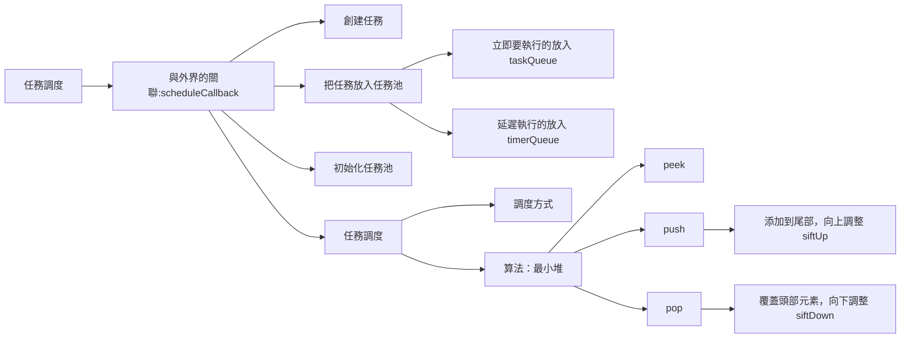

- [scheduler 造輪子](#scheduler-造輪子)
  - [scheduler 是做什麼的？](#scheduler-是做什麼的)
    - [什麼是協作式調度?](#什麼是協作式調度)
      - [協作式調度](#協作式調度)
      - [搶佔式調度](#搶佔式調度)
      - [轉換到瀏覽器](#轉換到瀏覽器)
    - [控制權的轉讓](#控制權的轉讓)
      - [為什麼不是微任務？](#為什麼不是微任務)
      - [React 為什麼選擇使用 MessageChannel 來實現類似 requestIdleCallback 的功能，主要是因為以下幾個原因：](#react-為什麼選擇使用-messagechannel-來實現類似-requestidlecallback-的功能主要是因為以下幾個原因)
        - [為什麼不能用 setTimeout 來代替 MessageChannel？不是都是呼叫執行宏任務嗎？](#為什麼不能用-settimeout-來代替-messagechannel不是都是呼叫執行宏任務嗎)
        - [window.requestAnimationFrame \& window.requestIdleCallback](#windowrequestanimationframe--windowrequestidlecallback)
    - [如何避免餓死現象?](#如何避免餓死現象)
      - [time slicing](#time-slicing)
      - [aging](#aging)
  - [造輪子步驟](#造輪子步驟)
    - [三把鎖的意義 - 避免重複調度](#三把鎖的意義---避免重複調度)
    - [1. 建立任務型別](#1-建立任務型別)
    - [2. 建立變數](#2-建立變數)
    - [scheduleCallback](#schedulecallback)
    - [requestHostCallback](#requesthostcallback)
    - [schedulePerformWorkUntilDeadline](#scheduleperformworkuntildeadline)
    - [performWorkUntilDeadline](#performworkuntildeadline)
    - [建立取消正在執行的任務堆的某任務函式 \& export](#建立取消正在執行的任務堆的某任務函式--export)
    - [建立取得當前正在執行的任務的優先等級函式 \& export](#建立取得當前正在執行的任務的優先等級函式--export)
    - [是否要終止任務，把控制權交給主線程函式 \& export](#是否要終止任務把控制權交給主線程函式--export)
  - [調度延遲任務](#調度延遲任務)
    - [延時任務轉普通任務的時機?](#延時任務轉普通任務的時機)
    - [`scheduleCallback` 加入延遲任務參數](#schedulecallback-加入延遲任務參數)
    - [建立計時器](#建立計時器)
    - [handleTimeout 時間到的 callback，調用 advanceTimers](#handletimeout-時間到的-callback調用-advancetimers)
  - [實現真正的 time slicing](#實現真正的-time-slicing)
  - [學習資料](#學習資料)

# scheduler 造輪子



## scheduler 是做什麼的？

在 README.md 當中可以看到

> This is a package for cooperative scheduling in a browser environment. It is currently used internally by React, but we plan to make it more generic.

> 在瀏覽器環境去實作協作式的調度(cooperative scheduling)（但其實也有使用到搶佔式調度的策略）（可以看到不只是可以運用在 react 上）

### 什麼是協作式調度?

這個概念主要是來自於作業系統，由於 CPU 資源極為寶貴，為了提高它的使用率，作業系統需要把 CPU 的使用權在同一時間段內分配給多個進程或任務去使用。多進程或任務對 CPU 的使用權的策略，稱為「調度策略」。協作式是其中一種。

#### 協作式調度

- 任務或進程**自願釋放 CPU 控制權**。這意味著任務具有一定的**合作性和自覺性**，只有在**主動讓出** CPU 的情況下，其他任務才能獲得執行機會；
- 由於任務必須自行管理 CPU 時間，協作式調度通常不夠穩定，容易出現問題，例如任務之間的競爭和餓死。
- 在處理 IO 操作、事件處理等場景下非常有用，可以避免阻塞瀏覽器主線程，提升用戶體驗。

#### 搶佔式調度

- **作業系統身為審判官，具有管理任務執行的權限，可隨時中斷正在執行的任務，並將 CPU 指派給其他任務。**
- 通常會使用**優先權、時間切片**等策略來決定任務執行的順序，高優先權任務會優先執行，而時間切片用於控制任務在 CPU 上執行的時間；
- 可以更好地保證系統的回應性和穩定性，因為它不依賴任務的合作性，如果某個任務陷入無限循環或其他問題，作業系統仍然可以確保其他任務能夠獲得執行機會；
- 但是相對容易出現餓死現象，對於餓死現象，常見的解決方法是定期檢查，對於優先級低的任務，提高他的優先級，react 也是採用這個方案。

#### 轉換到瀏覽器

CPU 的角色變成主執行緒（UI 執行緒）的控制權。scheduler 套件核心要實現的就是「讓 js 執行一段時間後，**主動**把主執行緒的控制權讓給瀏覽器」。

- 如何把主動地把控制權讓出去呢？
  - setImmediate()
  - MessageChannel
  - setTimeout()
- 執行一段時間？到底執行多久呢？

### 控制權的轉讓

react 按照使用者的瀏覽器支援度，選擇使用其中一種非同步 api 來實現，將執行任務放入宏任務中

- setImmediate()
- MessageChannel
- setTimeout()

#### 為什麼不是微任務？

微任務會緊接著在另一個微任務中執行，如果其中執行完後又呼叫微任務，event loop 的 call stack 一直被佔用。宏任務才可以實現控制權的轉讓。

#### React 為什麼選擇使用 MessageChannel 來實現類似 requestIdleCallback 的功能，主要是因為以下幾個原因：

1. <u>兼容性和一致性</u>：
   requestIdleCallback 在所有瀏覽器中的支持情況不一樣，特別是在一些舊版瀏覽器或不支持這個 API 的環境下，React 希望能在不同的環境中保持一致的行為。使用 MessageChannel 可以提供更一致的跨瀏覽器行為。

2. <u>精細控制和穩定性</u>：
   **呼叫的間隔不穩定，因特定的裝置效能和目前的瀏覽器任務而異，呼叫的頻率太低了，據說有網友檢查到只有 20 次/每秒**。MessageChannel 和 postMessage 使得 React 可以更精確地控制執行時機，並且在任務調度中提供更高的穩定性。

3. <u>更高的控制權</u>：
   使用 MessageChannel 使得 React 團隊可以完全掌控任務的調度過程。他們可以自行決定如何處理閒置時間，而不需要依賴瀏覽器的實現。這有助於 React 更好地優化性能和用戶體驗。

4. <u>測試和調試</u>：
   自己實現的調度機制可以讓 React 團隊更容易進行測試和調試，特別是在測試不同的瀏覽器和環境下的行為時。

##### 為什麼不能用 setTimeout 來代替 MessageChannel？不是都是呼叫執行宏任務嗎？

- MessageChannel 的執行時機會早於 setTimeout
- setTimeout(fn,0) 所建立的宏任務，會有至少 4ms 的執行時差
- 如果目前環境不支援 MessageChannel 時，會預設使用 setTimeout

##### window.requestAnimationFrame & window.requestIdleCallback

- 幀的概念
  - 大多數螢幕都是一秒六十次，大概是 16.6 毫秒一幀，幀數(fps)越高越流暢。
  - 每一幀包含樣式計算佈局和繪製
  - JS 引擎和頁面繪製在同一線程當中，GUI 渲染和 JS 執行是互斥的，如果 JS 引擎任務執行時間過長，就會推遲渲染
- 為了讓動畫等任務可以按照優先級渲染，需要使用 window.requestAnimationFrame & window.requestIdleCallback


```js
/**  requestAnimationFrame，
- 參數 time: 表執行開始到現在的時間，相當於 performance.now()
**/
let start;
let root = document.getElementById("root");
function animate(timestart) {
  // timestart 相當於 performance.now()
  //   console.log(timestart);
  if (!start) {
    start = timestart; // 只是記錄一開始執行的時間
  }
  //   console.log("ttttt", timestart, timestart - start);
  root.style.transform = `translate(${+timestart * 0.1}px)`;
  if (timestart < 2000) {
    // 必須主動呼叫下一次渲染
    window.requestAnimationFrame(animate);
  }
}
window.requestAnimationFrame(animate);
```

```js
// requestIdleCallback：在主要任務執行完後有空閒時間就可以執行
// 可執行低優先的任務
// 實例方法：IdleDeadline.timeRemaining() 表示現在 一幀中剩下的時間
function sleep(duration) {
  let now = Date.now();
  while (duration + now > Date.now()) {
    return;
  }
}
// 空閒時回調
let works = [
  () => {
    console.log("task 1");
    sleep(300);
  },
  () => {
    console.log("task 2");
    sleep(300);
  },
  () => {
    console.log("task 3");
  },
  () => {
    console.log("task 4");
  },
  () => {
    console.log("task 5");
  },
];
function runWorks() {
  let w = works.shift();
  w();
}
function progress(deadline) {
  // 如果有剩餘時間就執行任務
  // 實例方法：https://developer.mozilla.org/zh-CN/docs/Web/API/IdleDeadline
  // IdleDeadline.timeRemaining()
  let remaining = deadline.timeRemaining();
  console.log("剩下多少時間：", remaining);
  // 如果有時間而且還有任務就執行
  if (remaining > 0 && works.length > 0) {
    runWorks();
  }
  if (works.length > 0) {
    window.requestIdleCallback(progress);
  }
}
window.requestIdleCallback(progress);

/**
     * 剩下多少時間： 11.7
       task 1
       剩下多少時間： 12.6
       task 2
       剩下多少時間： 9.3
       task 3
       剩下多少時間： 49.9 // 為何會變成 49ms??
       task 4
       剩下多少時間： 49.9
       task 5

       如果執行的任務較少，瀏覽器會把一幀的時間拉長，
       讓頁面不用頻繁的更新，可以處理更多不重要的程式碼 requestIdleCallback，
       但用戶在變成100ms以上才會感受到變慢
     * **/
```

### 如何避免餓死現象?

#### time slicing

瀏覽器和 js 程式交替佔用主執行緒的控制權的這種現象就稱之為「time slicing」。
避免某個任務一直佔著主線程。
在源碼當中，會用非同步執行 `performWorkUntilDeadline` ，裡面又會去呼叫 `workLoop`，裡面會 while 執行，直到約定時間（時間切片）到點為止 (在`shouldYieldToHost()`中)，之後就會讓給瀏覽器去執行 layout, paint, composite。

在源碼中可以看到 `shouldYieldToHost()` 裡面的時間切片是 `const frameYieldMs = 5; // 5ms`，
react 團隊根據自己的實踐所獲得的經驗，覺得了預留 11ms 給瀏覽器所取得的介面更新效果比較理想。所以，留給 js 解釋執行的時間就是 16ms - 11ms = 5ms。

> ps. 源碼是使用 performance.now()來計算時間，是因為能表示的時間精度更高，相比於 Date.now()只能精確到 1ms，performance.now()能精確到微秒級別。Date.now()會受到作業系統時鐘或使用者時間調整的影響。

#### aging

> react-reconciler 中 ReactFiberLane.js 有一個函式 `markStarvedLanesAsExpired`，就是把餓死的任務標記為過期，相當於提高優先級，`root.expiredLanes |= lane`（把這個車道的任務標記為過期），強制完成。會在 `scheduleTaskForRootDuringMicroTask` 執行微任務函式內部調用或是在交換控制權給主線程之前，在渲染任務的結尾調用。他不能同步被調用。

## 造輪子步驟

1. 建立任務型別
2. 建立變數

   - 任務相關變數
     1. `currentPriorityLevel` - 紀錄當前處理的任務優先級，供之後合成事件 `getEventPriority()` `message` 依照 scheduler 中的優先級，返回不同的事件優先級
     2. `currentTask`: 指向當前正在執行的
     3. `taskQueue`: 任務池（最小堆）
     4. `taskIdCounter`: 任務 id 累加紀錄
   - 三把鎖
     1. `isHostCallbackScheduled` - 主線程處理時間切片調度確定已經開始，主線程是否還在忙調度
     2. `isPerformingWork` - 紀錄 workLoop 循環調度是否結束
     3. `isMessageLoopRunning` - 時間切片調度確定已經完整結束

3. `scheduleCallback`
   1. 紀錄當前時間
   2. 會按照優先等級＋當前時間變成 排序的依據，封裝成 Task 物件，推入最小堆，
   3. 看主線程是否還在忙調度 `isHostCallbackScheduled`?
      1. 沒有，啟動主線程，開始調度 `requestHostCallback`。
      2. `isHostCallbackScheduled`設定為`true`
4. `requestHostCallback`
   1. 詢問時間切片循環是否在進行`isMessageLoopRunning`？
      1. 沒有
         1. 通知申請時間切片的部門，請幫忙申請宏任務 `schedulePerformWorkUntilDeadline`
         2. `isMessageLoopRunning`設定為`true`
5. `schedulePerformWorkUntilDeadline` 透過 `MessageChannel()` 申請宏任務執行`performWorkUntilDeadline`
6. `performWorkUntilDeadline`
   1. 去執行任務池最小堆`flushWork`，
      1. 主線程是否還在忙調度`isHostCallbackScheduled`設定為`false`
      2. 紀錄當前的任務優先級，供任務循環後使用
      3. 是否在執行任務中`isPerformingWork`設定為`true`
      4. 調用工作循環`workLoop`會回傳 最小堆任務池還有剩餘的任務嗎？
         1. `workLoop` 不斷取出最高優先級任務，判斷任務是否過期&是否還在時間切片內（startTime 紀錄時間切片開始時間-當前執行時間，是否小於 5ms `shouldYieldToHost`，如果時間已到，則跳出循環
         2. 執行任務，將是否過期了傳給 callback
         3. 執行完成後就 currentTask.callback 設為空值
         4. 紀錄當前執行完成時間
         5. 紀錄當前執行任務的層級
         6. 如果當前任務的 callback 被取消是空值，就刪除堆頂
         7. 看是否回傳函式
            1. 是，賦值給當前任務的 callback，回傳 `true`
            2. 否，取最小堆頂判斷和當前執行任務是否為同一個
               1. 是就刪除堆頂
         8. 回傳看當前任務堆是否還有值，表示尚未執行完畢但時間已到
      5. 把`當前任務池`設為空，`當前處理的任務優先級`設定為前一個任務優先級
      6. 是否在執行任務中`isPerformingWork`設定為`false`
   2. 之後看`workLoop`回傳的當前任務池執行還有剩餘的任務嗎？
      1. 有: 就回到 2.`schedulePerformWorkUntilDeadline` 申請下一個時間切片。
      2. 沒有: 把時間切片部門設定為閒置：`isMessageLoopRunning  = false`
7. 建立取消正在執行的任務堆的某任務函式 & export
8. 建立取得當前正在執行的任務的優先等級函式 & export
9. 是否要終止任務，把控制權交給主線程函式 & export

### 三把鎖的意義 - 避免重複調度

簡單來說 scheduler 有兩個循環迴圈，
第一個是 和瀏覽器申請非同步(MessageChannel)的回調，他會在任務堆沒有完全清空之前持續申請時間切片
第二個是 workLoop，在時間切片內，處理任務堆

- 如果任務一直進來，不能瘋狂申請時間切片 requestHostCallback -> schedulePerformWorkUntilDeadline，
  才需要鎖，只有 task queue 被清空了、三個鎖頭都被設定成 false（也就是目前所有的任務有被執行完），scheduler 才會重新發起一次調度請求。

* `isHostCallbackScheduled`： 主線程是否在忙第一個循環調度呢？目的是確定第一個循環調度開始；(scheduleCallback 被設成 true，flushwork 被設成 false)
* `isPerformingWork`： 第二個循環調度在進行嗎，目的是紀錄時間切片內，正在運行的 work loop；(flushwork 開始被設成 true，結束 false)
* `isMessageLoopRunning`： 紀錄時間切片調度確定已經完整結束，無數個 申請時間切片和 workLoop 之後，task queue 終於被清空。
  (requestHostCallback 發起調度時間切片 schedulePerformWorkUntilDeadline 前，被設成 true。performWorkUntilDeadline 中，task queue 被清空，所有任務都執行完之後被設定為 false)

### 1. 建立任務型別

```ts
// 任務要執行的回調，有可能會再次回傳函式，就會再加入任務堆
// arg: 過期了嗎？
type Callback = (arg: boolean) => Callback | null | boolean;
// 任務進入 scheduler 後被封裝成 Task
export type Task = {
  // 對應 taskIdCounter
  id: number;
  // 任務的初始值，意思是時間到了要執行的任務
  callback: Callback | null;
  // 任務優先級
  priorityLevel: PriorityLevel;
  // 任務是什麼時候進來調度器的，時間切片的起始時間
  startTime: number;
  // 過期時間
  expirationTime: number;
  sortIndex: number;
};
```

### 2. 建立變數

```ts
/** 任務相關變數 */
/** 任務 id 累加紀錄，標註唯一性 */
let taskIdCounter = 1;
/** 任務池，最小堆 **/
const taskQueue: Array<Task> = [];
/** 指向當前正在執行的 **/
let currentTask: Task | null = null;
/** 紀錄當前處理的任務優先級，供之後判斷是否優先執行 */
let currentPriorityLevel: PriorityLevel = NoPriority; // 源碼當中是 NormalPriority
/** 時間切片的起始值，時間戳 */
let startTime = -1;
/** 時間切片的時間段，寫死 5ms */
let frameInterval = frameYieldMs; // 5

/** 建立三把鎖 */
/** 1. 紀錄 主線程處理時間切片調度確定已經開始 */
let isHostCallbackScheduled = false;
/** 2. 紀錄 時間切片調度確定已經完整結束 */
let isMessageLoopRunning = false;
/** 3. 紀錄 workLoop 循環調度是否結束 */
let isPerformingWork = false;
```

### scheduleCallback

1.  當有新的任務時，會按照優先等級，封裝成 Task 物件，推入最小堆，
2.  看主線程是否還在忙調度 `isHostCallbackScheduled`?
    1. 沒有，啟動主線程，開始調度 `requestHostCallback`。
    2. `isHostCallbackScheduled`設定為`true`

> 源碼當中叫做 `unstable_scheduleCallback`

```ts
/**
 * * 任務調度器的入口，某任務進入調度器，等待調度
 * @param priorityLevel
 * @param callback
 */
function scheduleCallback(priorityLevel: PriorityLevel, callback: Callback) {
  const startTime = getCurrentTime();
  // 理論上的過期時間 相當於執行時間，根據不同的優先級，給予不同的過期時間
  let timeout: number;
  switch (priorityLevel) {
    // 立即到期
    case ImmediatePriority:
      timeout = -1;
      break;
    case UserBlockingPriority:
      timeout = userBlockingPriorityTimeout;
      break;
      break;
    case LowPriority:
      timeout = lowPriorityTimeout;
      break;
    case IdlePriority:
      timeout = maxSigned31BitInt;
      break;
    case NormalPriority:
    default:
      timeout = normalPriorityTimeout;
      break;
  }
  const expirationTime = startTime + timeout;
  const newTask: Task = {
    id: taskIdCounter++,
    priorityLevel,
    callback,
    startTime,
    expirationTime,
    sortIndex: expirationTime,
  };

  push(taskQueue, newTask);

  // ! 主線程沒有在忙，而且也沒有時間切片在執行
  // 時間切片內正在執行中！
  if (!isHostCallbackScheduled && !isPerformingWork) {
    isHostCallbackScheduled = true;
    requestHostCallback();
  }
}
```

### requestHostCallback

啟動主線程，開始調度

1.  詢問時間切片循環是否在進行`isMessageLoopRunning`？
    1. 沒有，申請時間切片，申請宏任務 `schedulePerformWorkUntilDeadline`
    2. `isMessageLoopRunning`設定為`true`

```ts
// 主線程開始處理 callback，發起調度
function requestHostCallback() {
  // 上個任務池結束，沒有在調度中，可以發起調度
  if (!isMessageLoopRunning) {
    isMessageLoopRunning = true;
    schedulePerformWorkUntilDeadline();
  }
}
```

### schedulePerformWorkUntilDeadline

申請時間切片，申請宏任務

> 在源碼當中有實現兼容性，如果不支援 `MessageChannel`，則改用 `setImmeditate`

```ts
const channel = new MessageChannel();
const port2 = channel.port2;
channel.port1.onmessage = performWorkUntilDeadline;

// 申請時間切片
// 固定的時間切片內，執行任務們，直到時間切片到點為止
function schedulePerformWorkUntilDeadline() {
  port2.postMessage(null);
}
```

### performWorkUntilDeadline

1. 確定正在時間切片的循環當中`isMessageLoopRunning`
2. 去執行任務池最小堆`flushWork`，
   1. 主線程處理時間切片調度確定已經開始，主線程是否還在忙調度`isHostCallbackScheduled`設定為`false`
   2. 紀錄當前處理的任務優先級
   3. 是否在執行任務中`isPerformingWork`設定為`true`
   4. 調用工作循環`workLoop`會回傳 最小堆任務池還有剩餘的任務嗎？
      1. `workLoop` 不斷取出最高優先級任務，判斷任務是否過期&是否小於 5ms 終止任務
      2. 紀錄當前執行任務的層級
      3. 如果當前任務的 callback 被取消是空值，就刪除堆頂
      4. 執行完成後，把當前任務堆的 callback 設為空值
      5. 看是否回傳函式
         1. 是，賦值給當前任務的 callback，回傳 `true`
         2. 否，取最小堆頂判斷和當前執行任務是否為同一個
            1. 是就刪除堆頂
      6. 回傳看當前任務堆是否還有值，表示尚未執行完畢但時間已到
   5. 把`當前任務池`設為空，`當前處理的任務優先級`設定為前一個任務優先級
   6. 是否在執行任務中`isPerformingWork`設定為`false`
   7. 之後看`workLoop`回傳的當前任務池執行還有剩餘的任務嗎？
      1. 有: 就回到 2.`schedulePerformWorkUntilDeadline` 申請下一個時間切片。
      2. 沒有: 把時間切片部門設定為閒置：`isMessageLoopRunning  = false`
3. 之後看`workLoop`回傳的當前任務池執行還有剩餘的任務嗎？
   1. 有: 就回到 2.`schedulePerformWorkUntilDeadline` 申請下一個時間切片。
   2. 沒有: 把時間切片部門設定為閒置：`isMessageLoopRunning  = false`

```ts
// 時間切片的起始，時間戳
let startTime = -1;
function performWorkUntilDeadline() {
  if (isMessageLoopRunning) {
    const currentTime = getCurrentTime();
    // 供時間切片使用，看什麼時候達到 5ms
    startTime = currentTime;
    let hasMoreWork = true;

    try {
      // 還有任務還沒執行完成嗎
      hasMoreWork = flushWork(currentTime);
    } finally {
      if (hasMoreWork) {
        // 還有就申請下一個時間切片
        schedulePerformWorkUntilDeadline();
      } else {
        // 任務堆都被清空了，可以再發起調度了
        isMessageLoopRunning = false;
      }
    }
  }
}

function flushWork(initialTime: number) {
  isHostCallbackScheduled = false;
  isPerformingWork = true;
  let previousPriorityLevel = currentPriorityLevel;
  try {
    return workLoop(initialTime);
  } finally {
    currentTask = null;
    currentPriorityLevel = previousPriorityLevel;
    isPerformingWork = false;
  }
}

/**
 * 有很多的 Task，都包含要執行的 callback
 * 在時間切片內執行多個 task callback，循環執行 loop
 * 直到時間切片結束為止
 * @param initialTime 執行時間
 * @returns boolean 是否還有任務沒有執行完畢，還要繼續執行
 */
function workLoop(initialTime: number): boolean {
  let currentTime = initialTime;
  // 取出優先級最高的任務
  currentTask = peek(taskQueue);
  while (currentTask !== null) {
    // 如果當前的任務沒有過期，但時間已經到了，應該要跳出回圈
    // 如果，如果當前時間戳大於expirationTime的值（也就是說十分緊急！），也就無法跳出while(){}循環，只能去執行這個過期任務。同時，scheduler 還有透過didUserCallbackTimeout來把「任務過期了」這個訊息告知呼叫方，讓呼叫方自己看著辦。就react 這個呼叫方而言，它將會用「同步不可中斷」的方式去這個任務。 scheduler 只是負責告知呼叫方目前這個任務已經過期了。
    // time slicing 並不是總是能奏效的。它能奏效的前提是在一個時間片的時間內所執行的任務沒有過期任務。
    if (currentTask.expirationTime > currentTime && shouldYieldToHost()) {
      break;
    }
    const callback = currentTask.callback;
    if (isFn(callback)) {
      // 是否過期了？
      const didUserCallbackTimeout = currentTask.expirationTime <= currentTime;
      // 說不定執行完 callback 後，還回傳 callback
      const continuationCallback = callback(didUserCallbackTimeout);
      currentTask.callback = null;
      currentPriorityLevel = currentTask.priorityLevel;
      if (isFn(continuationCallback)) {
        currentTask.callback = continuationCallback;
        return true;
      } else {
        // 因為 taskQueue 是動態的，在執行 callback 期間可能又有其他任務被調度進去
        // 檢查下，如果是一樣的，就可以刪除
        if (peek(taskQueue) === currentTask) {
          pop(taskQueue);
        }
      }
    } else {
      pop(taskQueue);
    }

    currentTask = peek(taskQueue);
  }

  if (currentTask !== null) {
    return true;
  } else {
    return false;
  }
}
```

### 建立取消正在執行的任務堆的某任務函式 & export

```ts
/**
 * * 取消某個任務，由於已經放進任務池了，加上最小堆沒辦法直接刪，只能初步把 task.callback = null
 * 調度過程中，當這個任務至於堆頂時，刪掉
 */
function cancelCallback() {
  currentTask!.callback = null;
}
```

### 建立取得當前正在執行的任務的優先等級函式 & export

```ts
/**
 * * 獲取當前正在執行任務的優先級
 * @returns
 */
function getCurrentPriorityLevel(): PriorityLevel {
  return currentTask?.priorityLevel ?? currentPriorityLevel;
}
```

### 是否要終止任務，把控制權交給主線程函式 & export

```ts
/**
 * * 是否要終止執行，把控制權交還給主線程
 */
function shouldYieldToHost() {
  const timeElapsed = getCurrentTime() - startTime;

  if (timeElapsed < frameInterval) {
    return false;
  }
  return true;
}
```

## 調度延遲任務

`scheduler` 當中有延遲任務的代碼邏輯，但是這塊代碼在 react v18.2 中沒有用到。
在任務加入 `scheduleCallback` 時，就傳入必須要延遲的時間，待時間到後才能放入主要的任務池 `taskQueue`。

延遲任務在到執行時間之前有自己的任務池！`timeQueue`
以延遲時間＋現在時間 = 預計未來開始執行的時間，當作排序依據

1. `scheduleCallback`
   1. 新增參數`options?:{delay:number}`，延後執行的時間，把它加進開始時間`startTime`裡面。
   2. 一樣跑建立任務物件的流程，之後判斷是否是延遲任務
      1. 是，`sortIndex = startTime`，用開始時間來決定最小堆的排序，越小表示越先開始。
      2. 把他放入延遲的任務堆裡。
      3. 如果沒有等待進行的任務並且這個延遲任務又是最優先的
         1. 主線程正在忙調度嗎？
            1. 是，newTask 才是堆頂任務，應該會最先到達執行時間，但目前其他延遲任務正在倒計時，說明有問題！！
            2. 否，主線程是否在進行計時器調度 `isHostTimeoutScheduled = true;`
         2. 不管怎樣，開啟計時器 `requestHostTimeout`
2. 開啟計時器 `requestHostTimeout`，時間到執行 `handleTimeout`
   1. 主線程是否在進行計時器調度 `isHostTimeoutScheduled = false;`
   2. 進入整個延遲任務堆處理`advanceTimers`
      1. 把任務取出，，while 取堆頂，判斷任務是否有效
         1. `timer.sortIndex = timer.expirationTime;`，把他推進任務池當中
         2. 是執行時間還沒到？還是真的無效任務？要馬刪除要麻跳過循環
   3. `isHostCallbackScheduled` 主線程是否在調度中
      1. 否，任務堆頂是否有任務？
         1. 是，則開始調度
         2. 否，則延遲任務堆頂是否有任務？
            1. 否，則開啟計時器
3. `workLoop`，一開始必須先整個延遲任務堆處理，並且在 while 迴圈處理任務當中，每處理完一個任務，都應該要去驗證延遲任務堆是否到期，重新放入任務堆。
4. 如果當前任務執行完畢，檢查延遲任務堆，如果不為空，要發起計時器。

### 延時任務轉普通任務的時機?

1. 在放入任務堆後，啟動計時器，時間到，會執行 `handleTimeout` ，裡面會檢查一次
2. 在 workLoop 中， while 回圈之前
3. 在 workLoop 的每一個迭代中，當執行完一次任務後
4. 當 workLoop 因為『時間到並且任務還沒到期』而中斷後，且 task queue 已經清空，scheduler 就會嘗試去檢查 timer queue，看看是否有延遲到期的任務可以轉移到 task queue 中去

### `scheduleCallback` 加入延遲任務參數

只要任務隊列是空的&有延時任務，就要啟動計時器！

1. 新增參數`options:{delay:number}`，延後執行的時間，把它加進開始時間`startTime`裡面。
2. 一樣跑建立任務物件的流程
3. 之後判斷是否是延遲任務
   1. 是，`sortIndex = startTime`，用開始時間來決定最小堆的排序，越小表示越先開始。
   2. 把他放入延遲的任務堆裡。
   3. 如果沒有等待進行的任務並且這個延遲任務又是最優先的
      1. 主線程正在忙調度嗎？
         1. 是，newTask 才是堆頂任務，應該會最先到達執行時間，但目前其他延遲任務正在倒計時，說明有問題！！
         2. 否，主線程是否在進行計時器調度 `isHostTimeoutScheduled = true;`
      2. 不管怎樣，開啟計時器 `requestHostTimeout`

```ts
/**
 * ! 延遲任務的計時器
 */
let taskTimeoutId = -1;
/**
 * ! 主線程是否正在倒計時調度中
 */
let isHostTimeoutScheduled = false;

function scheduleCallback(
  priorityLevel: PriorityLevel,
  callback: Callback,
  // 1. 新增參數`options:{delay:number}`，延後執行的時間
  options?: { delay: number }
) {
  const currentTime = getCurrentTime();
  let startTime: number = currentTime;
  // 2. 把它加進開始時間`startTime`裡面。
  if (typeof options === "object" && options !== null) {
    let delay = options.delay;
    if (typeof delay === "number" && delay > 0) {
      startTime = currentTime + delay;
    }
  }

  // ...中間建立任務物件和判斷優先級省略

  // 3. 判斷是否是延遲任務
  if (startTime > currentTime) {
    // 3-1. 用開始時間來決定最小堆的排序，越小表示越先開始。
    newTask.sortIndex = startTime;
    // 3-2. 把他放入延遲的任務堆裡。
    push(timerQueue, newTask);

    // 3.3 如果沒有等待進行的任務並且這個延遲任務又是最優先的
    if (peek(taskQueue) === null && newTask === peek(timerQueue)) {
      // 3-1-1. 如果主線程正在忙調度
      if (isHostCallbackScheduled) {
        // newTask 才是堆頂任務，應該會最先到達執行時間，但目前其他延遲任務正在倒計時，說明有問題！！
        cancelHostTimeout();
      } else {
        isHostTimeoutScheduled = true;
      }
    }
    // 3-1-2. 啟動計時器！同時間的計時器只會有一個
    requestHostTimeout(handleTimeout, startTime - currentTime);
  } else {
    push(taskQueue, newTask);
    newTask.sortIndex = expirationTime;
    // ! 主線程沒有在忙，而且也沒有時間切片在執行
    if (!isHostCallbackScheduled && !isPerformingWork) {
      isHostCallbackScheduled = true;
      requestHostCallback();
    }
  }
}
```

### 建立計時器

```ts
function requestHostTimeout(
  callback: (currentTime: number) => void,
  ms: number
) {
  taskTimeoutId = setTimeout(() => {
    callback(getCurrentTime());
  }, ms);
}

function cancelHostTimeout() {
  clearTimeout(taskTimeoutId);
  taskTimeoutId = -1;
}
```

### handleTimeout 時間到的 callback，調用 advanceTimers

1.  主線程是否在進行計時器調度 `isHostTimeoutScheduled = false;`
2.  進入整個延遲任務堆處理`advanceTimers`
    1. 把任務取出，，while 取堆頂，判斷任務是否有效
       1. `timer.sortIndex = timer.expirationTime;`，把他推進任務池當中
       2. 是執行時間還沒到？還是真的無效任務？要馬刪除要麻跳過循環
3.  `isHostCallbackScheduled` 主線程是否在調度中
    1. 否，主任務堆頂是否有任務？
       1. 是，則開始調度主任務堆
       2. 否，則延遲任務堆頂是否有任務？
          1. 否，則開啟計時器

```ts
function handleTimeout(currentTime: number) {
  // 1. 主線程是否在進行計時器調度
  isHostTimeoutScheduled = false;
  // 2. 進入整個延遲任務堆處理
  // 如果 timerQueue中 "有效"任務到達執行時間，就放到 taskQueue 中
  advanceTimers(currentTime);

  // 3. 主線程是否在調度中
  if (!isHostCallbackScheduled) {
    // 3-1. 主任務堆不為空
    if (peek(taskQueue) !== null) {
      isHostCallbackScheduled = true;
      // 3-1-1. 調度主要的任務堆
      requestHostCallback();
    } else {
      // 3-1-2. 處理延時任務堆
      const firstTimer = peek(timerQueue);
      if (firstTimer !== null) {
        // 啟動計時器
        requestHostTimeout(handleTimeout, firstTimer.startTime - currentTime);
      }
    }
  }
}

// 處理延時堆
function advanceTimers(currentTime: number) {
  let timer = peek(timerQueue);
  while (timer !== null) {
    if (timer.callback === null) {
      // 無效任務
      pop(timerQueue);
    } else if (timer.startTime <= currentTime) {
      // 已經到達開始時間應該要被推入
      pop(timerQueue);
      timer.sortIndex = timer.expirationTime;
      push(taskQueue, timer);
    } else {
      // 有效任務
      break;
    }
  }
}
```

## 實現真正的 time slicing

task queue 有三個任務，第一個用時 3ms，第二個用時 4ms，第三個用時 5ms，那麼這個 work loop 就會佔用主執行緒 7ms 才會退出。 scheduler ，對 work loop 佔用時間的檢查只會發生在「任務執行之前」。
所以單靠 scheduler 會是 `[[3ms, 4ms], [5ms]]` ，第一個時間片就執行了 7ms!
只能靠 react 從 callback 內部去結束呼叫。 `performConcurrentWorkOnRoot()` 呼叫堆疊上的 `workLoopConcurrent()` 函數也有一個時間片檢查的原因：因為它需要配合 scheduler 一起來完成 time slicing 的能力：

```js
function workLoopConcurrent() {
  // Perform work until Scheduler asks us to yield
  while (workInProgress !== null && !shouldYield()) {
    performUnitOfWork(workInProgress);
  }
}
```

在 react 端也執行檢查，react fiber 的 work loop 在對下一個 fiber node 執行 work 之前。（當然如果 fiber node 執行時間超過 5ms 就是另一回事了。)

---

## 學習資料

> (2023 年，你是時候要掌握 react 的並發渲染了(2) - scheduler)[https://juejin.cn/post/7278597256957935628#heading-24]
> (bubucuo React18 底层源码深入剖析)[https://github.com/bubucuo/mini-react]
