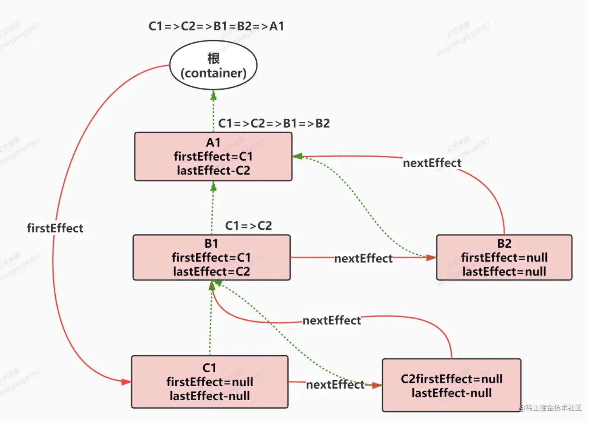
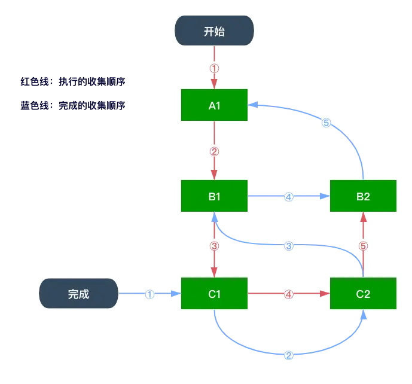

- [react 工作流程](#react-工作流程)
  - [Virtual DOM](#virtual-dom)
    - [What?](#what)
    - [Why? 為什麼要使用 VODM?](#why-為什麼要使用-vodm)
    - [Where? 在哪裡使用 VDOM?](#where-在哪裡使用-vdom)
    - [How? react 中如何使用 VDOM?](#how-react-中如何使用-vdom)
  - [react 的架構](#react-的架構)
    - [調度層 Scheduler](#調度層-scheduler)
    - [協調層 Reconciler](#協調層-reconciler)
    - [渲染層 Renderer](#渲染層-renderer)
  - [從 react element 到 fiber tree](#從-react-element-到-fiber-tree)
    - [更新的本質](#更新的本質)
    - [時間切片 time slice](#時間切片-time-slice)
    - [工作過程](#工作過程)
      - [雙緩存 fiber tree](#雙緩存-fiber-tree)
      - [創建更新 tree](#創建更新-tree)
    - [調和 Reconcile](#調和-reconcile)
  - [diff 算法](#diff-算法)
    - [核心思想](#核心思想)
    - [比較過程](#比較過程)
      - [情況 1 - before: 列表，after: 單節點](#情況-1---before-列表after-單節點)
      - [情況 2 - before: 列表，after: 列表](#情況-2---before-列表after-列表)
        - [🌰 為 type 都一致的情況，只有 key 不同的情況](#-為-type-都一致的情況只有-key-不同的情況)
        - [🌰 key 沒有設置或不同的情況](#-key-沒有設置或不同的情況)
      - [判斷新建的節點，是否有變化](#判斷新建的節點是否有變化)
      - [發生變化後要如何更新？](#發生變化後要如何更新)
  - [Effect](#effect)
  - [Fiber](#fiber)
    - [fiber 是什麼？](#fiber-是什麼)
      - [引入的背景](#引入的背景)
      - [基本概念](#基本概念)
    - [源碼中的 Fiber](#源碼中的-fiber)
  - [用簡單的模擬協調過程](#用簡單的模擬協調過程)
    - [遍歷順序和 render 階段](#遍歷順序和-render-階段)
    - [commit 階段 - 收集 Effect List](#commit-階段---收集-effect-list)
  - [常提到的專有名詞 - 增量式渲染 (Incremental Rendering)、併發模式 (Concurrent Mode)](#常提到的專有名詞---增量式渲染-incremental-rendering併發模式-concurrent-mode)
    - [增量式渲染 (Incremental Rendering)](#增量式渲染-incremental-rendering)
    - [併發模式 (Concurrent Mode)](#併發模式-concurrent-mode)
  - [重點整理](#重點整理)

---

# react 工作流程

## Virtual DOM

### What?

- 宏觀來說：又稱為 VDOM，是一種編程概念，由 React 在 2013 率先開拓，後續被許多不同的框架採用。
  在這個概念裡面，UI 以一種理想化的，或者說是虛擬的形式被保存在內存中，通過 ReactDOM 等套件包轉換，使它跟真的的 DOM 同步。同步的過程在 react 當中稱之為調和或是協調 Reconcile。而協調的核心就是 VDOM diff 算法。

- 微觀來說：用物件表現 DOM 的信息和結構，當狀態變更時，重新渲染這個物件結構，這個對象就稱為 VDOM。

### Why? 為什麼要使用 VODM?

DOM 操作很慢，輕微的操作都可以引發重新排版，非常消耗性能。相對於 DOM 對象， js 對象處理起來更快更簡單。通過 DIFF 算法對比新舊 VDOM 差異，可以批量的，最小化的執行 DOM 操作，從而提升用戶體驗。

### Where? 在哪裡使用 VDOM?

react 當中用 jsx 來表現視圖，在 v17 之前，必須經過 `babel-loader` 轉譯為 `React.createElement(...)` 調用，返回 ReactElememt。
在 v17 之後，新的轉換，自動從 React 的 package 中引入新的入口函式並調用。
<font color="red" size="2">❌ 不能說 JSX = VDOM，也不能說 ReactElement = VDOM</font>

### How? react 中如何使用 VDOM?

1. JSX 實際是一種 **JS 語法擴展**，他允許開發者用類似 HTML 的語法來寫組件。是一種**語法糖**。

2. 優點

   - JSX 編寫快速高效
   - 編譯為 JS 後進行了優化，執行更快
   - 在編譯過程中，就能發現錯誤

3. 與 vue 比較
   - vue 演進後才有 vdom + templete
   - jsx 原先就是 js 擴展，轉譯過程簡單直接; vue 把 templete 轉譯為 render 函式的過程需要複雜的編譯器轉換 -> 字符串 -> ast -> js

## react 的架構

在 v16 版本中就開始分為三層：調度層、協調層、渲染層

- **調度層 Scheduler** : 調度任務的優先級，高優先級的優先進入協調層
- **協調層 Reconciler** : 構建 fiber tree，diff 比對，找出差異，標記 fiber node 準備要進行的 dom 操作
- **渲染層 Renderer** : 負責將發生變化的部分渲染到頁面上

### 調度層 Scheduler

- v15 原先用遞歸進行 vdom 的比對，中間是同步進行，無法中斷，長期佔用主線程，會導致畫面無法交互或是掉幀的狀況。
- v16 之後採用 **循環遞歸** ，並且利用瀏覽器空閑時間處理。原先 react 想利用 `requestIdleCallback` 但最終支援度和觸發頻率不穩定等問題，改官方自身實現任務調度，這個庫就叫做 [Scheduler](./packages/scheduler/README.md) 。可以實現瀏覽器空閒時執行任務，還可以調度任務的優先級，高優先級的優先進入協調層。這一層確定了哪些任務應該被執行，哪些任務可以推遲執行。調度層並不直接執行渲染，而是通過協調層來觸發渲染。

### 協調層 Reconciler

- 協調層是 React 中的核心邏輯，負責構建 Fiber 樹（即虛擬 DOM 的結構），並進行 diff 比對。它還會標記需要更新的 Fiber 節點，並確定哪些 DOM 操作是必須執行的。
- v15 原先協調器和渲染器交替工作，找出差異就更新。
- v16 協調器只是找出差異後標記，之後交給渲染器更新。

### 渲染層 Renderer

渲染層的責任是根據協調層中生成的 Fiber 樹，將相應的變更最終應用到實際的 DOM 上。
要注意的是，調度層和協調層是在內存中處理，所以可以被打斷，但渲染器被設定不可中斷。

## 從 react element 到 fiber tree

- v17 之前，jsx 經過 babel 後，轉譯為 `React.createElement`。
- v17 之後，和 babel 進行了合作，使用 babel 進行上述的處理，所以在 React17.0 我們不用引入 React 也可以運行我們的 jsx，自動從套件包中引入新的入口函式調用，一樣返回 react element。

執行後返回 react element，再轉換成 **fiber tree**，對應到 **dom tree**，在構建 tree 的過程中以[深度優先遍歷](./DFS.md)的方式，從 child 延伸，直到 child 完成後尋找 return 指向 ，再找 sibling 指向。
首屏渲染完成後，進入交互更新階段。
更新時會產生兩個 **fiber tree**，一棵是對應當前顯示，一個是對應更新將要顯示 **workInProgress fiber tree**，更新完成後 即替換掉舊的。

---

### 更新的本質

需要將 fiber tree 更新完成後，更新 dom tree 執行生命週期方法
react 內部將一次更新分為兩個階段，**render**、**commit**。

- **render**: 對 fiber tree 做更新操作，收集更新過程中產生的副作用
- **commit**: 處理 render 階段收集的副作用

### 時間切片 time slice

在單線程的機制下，如果一個任務執行時間花費過久，就會堵塞後面的任務。
react 渲染時，**高優先級的任務（ex: 交互、佈局）被某個任務堵塞了**，螢幕就會出現卡頓。為了解決這種問題，react 操照操作系統，引入了時間切片的機制，**在某個時間段內週期性執行任務，週期性地把控制權交還給瀏覽器。**


每個 work 工作單元的時長是 5ms，超過執行時間，就要把控制權交還給瀏覽器

```js
// 偽代碼
// 時間切片的起始，時間戳
let startTime = -1;
// 時間切片，這是個時間段
let frameInterval = 5;

function shouldYieldToHost() {
  const timeElapsed = performance.now() - startTime;
  return timeElapsed >= frameInterval;
}
```

### 工作過程

分為兩階段

- 啟動階段：首屏渲染的整個過程，從無到有建構 fiber tree 和 dom tree。
- 交互階段：發生交互改變結構。

#### 雙緩存 fiber tree

在內存當中構建，完成後替換上一幀，比在渲染時才構建要快！這個技術就叫做雙緩存。

- `current fiber tree`: 當前螢幕顯示的樹
- `workInProgress fiber tree`: 更新產生的樹。
  更新完成後 `workInProgress fiber tree` 會取代 `current fiber tree`。
- alternate: 這個指針存在兩棵樹上，指向彼此，如果要更新，會替換掉舊的樹。
- flags: 標記更新的內容，比方刪除更新插入等等的變化。

#### 創建更新 tree

createElement 執行完畢後，執行 render，正式進入構建階段，在 root 容器節點上建立 fiber node，依次創建子節點。
比較麻煩的是更新。

1. 標記發生更新的節點，複製根節點作為 `workInProgress fiber tree` 的根節點，並且也有指針指向舊樹的 child。
2. `current fiber tree` 會有一個指針 `current` 指向目前處理的對象，同樣 `workInProgress fiber tree` 也有，叫做`workInProgress`。
3. 檢查 `workInProgress` 指向的節點有沒有變化，則複製 `current` 指向的 child 給 `workInProgress fiber tree`，並移動指針 `workInProgress` 和 `current`> APP
4. APP 有標記 Update，複製節點到 `workInProgress fiber tree`，再檢查 APP 的子節點，react Element 和 current.child 比較，發現一樣再複製，，並移動指針 `workInProgress` 和 `current`。以此方式重複流程。
5. 如果發現要刪除的節點，則標記刪除; 如果發現要新增的，則`current`指向 null，`workInProgress`指向新增的結構
6. 最後移動指針 `workInProgress` 和 `current`> 根節點，fiber root node 再把 current 指針指向新的樹，就更新完成、再處理副作用（包含 dom 節點移除，useEffect 的 destory 觸發）

### 調和 Reconcile

調整 fiber tree 的結構和更新以後的 jsx, dom tree 一致，在調和過程中整個調和的過程就發生在 `workInProgress fiber tree`，調和的時候主要做三件事

1. 生成 fiber node，使用 diff 算法，判斷要 clone 還是要 create

   - <u>clone</u>: 如果在 `current fiber tree` 上有找到匹配的節點，直接複用節點，只需要更新節點屬性或是移動節點。
   - <u>create</u>: 如果在 `current fiber tree` 上沒有找到匹配的節點，則創建。
   - <u>reuse</u>：不用做任何處理。如果 `shouldComponentUpdate` 或是 `memo` 包裹優化後，render 方法不用執行。可以加快 `workInProgress fiber tree` 調和。

2. 找到發生變化的 node，更新 fiber node，標記副作用
3. 收集帶 fiber 的副作用

## diff 算法

『`workInProgress fiber tree` 的 `react element`』 和 『`current fiber tree` 中的 `fiber node`』比較，type (component 或 dom 節點 或 react 提供的標籤) 和 key 完全一致才可以 clone。
這也是為什麼列表都需要有 key，他可以監聽到元素是否發生移動新增刪除，可以優化渲染過程。

### 核心思想

- 以匹配的父節點的子節點做比較，不跨父節點比較。
- key 的優先級大於 type。

### 比較過程

#### 情況 1 - before: 列表，after: 單節點

1. 如果有匹配到某個節點 -> clone，`workInProgress fiber node` 的 `alternate 指針` 指向節點。剩下的標記為刪除。
2. 如果有匹配到某個節點 -> create，`workInProgress fiber node` 的 `alternate 指針` 指向 null。

#### 情況 2 - before: 列表，after: 列表

需要判斷有沒有移動！
在過程當中會定義一個 `lastPlacedIndex` 的指針標示沒有移動的 node

- 如果 `lastPlacedIndex` > oldIndex 則表示 他發生了移動，要移到 `lastPlacedIndex` 之後
- 如果 `lastPlacedIndex` <= oldIndex 則表示 沒有移動，改變 `lastPlacedIndex` 的指向

##### 🌰 為 type 都一致的情況，只有 key 不同的情況

```js
// before current fiber tree
         div   --sibling-->  div   --sibling-->  div  --sibling-->  div
         key:A               key:B               key:C             key:D
index:     0                   1                   2                 3

// after workInProgress fiber tree
         div   --sibling-->  div   --sibling-->  div  --sibling-->  div
         key:C               key:B               key:A             key:D
index:     0                   1                   2                 3
```

從 workInProgress fiber tree 開始

1. 第一個節點 C: 匹配到 `current fiber tree` 的 C，index: 2，定義它為未移動的節點。
   `lastPlacedIndex` = 2
2. 第二個節點 B: 匹配到 `current fiber tree` 的 B index: 1 < `lastPlacedIndex`，表示他移動到了後面
3. 第三個節點 A: 匹配到 `current fiber tree` 的 A index: 0 < `lastPlacedIndex`，表示他移動到了後面
4. 第四個節點 D: 匹配到 `current fiber tree` 的 D index: 3 >= `lastPlacedIndex`，未移動
   `lastPlacedIndex` = 3

##### 🌰 key 沒有設置或不同的情況

- 沒有設置 key: 一開始會一同遍歷，type 相同就 clone，不相同就 create，把舊的打上刪除記號。遇到有 key 值出現了會改變匹配的方式。進入第二階段。
- key 值出現了，但不同: 生成一個 Map，key 為 `current fiber node` 的 key(|| index)，繼續遍歷新的樹，如果有在 Map 中匹配到就 clone，不然就新建。Map 中其他沒有匹配到的 全部標記刪除記號。

```js
// before current fiber tree
      div  --sibling-->  div --sibling-->  div --sibling-->  div  --sibling-->  div --sibling-->  div --sibling--> div --sibling--> div
                                          key:A             key:B             key:C              key:D             key:E            key:F
idx:   0                  1                 2                 3                  4                 5                6                 7

// after workInProgress fiber tree
       p  --sibling-->  div --sibling-->  div --sibling-->  div  --sibling-->  div --sibling-->  div
                                         key:B            key:A               key:G             key:D
idx:   0                 1                 2                 3                  4                 5
```

從 workInProgress fiber tree 開始

1. 第一個節點 p: `current fiber node[0]` 的 div，key === undefined，type 不相同，p 要 create，div 標記刪除
2. 第二個節點: `current fiber node[1]` 的 div，key === undefined，type 相同，
   `lastPlacedIndex` = 1
3. 第三個節點 B: 匹配到 `current fiber tree` 的 A，key 不相同，生成一個 Map 把剩下的 `current fiber node` 放進去，匹配到了 B，
   刪除 Map[B]
   `lastPlacedIndex` = 2
4. 第四個節點 A: 匹配到 Map[A]，標記移動
   刪除 Map[A]
   `lastPlacedIndex` = 2
5. 第五個節點 G: 沒有匹配，創新的，標記新增
6. 第六個節點 D: 匹配到 Map[D]
   刪除 Map[D]
   `lastPlacedIndex` = 5
7. Map 中剩下的節點標記刪除

#### 判斷新建的節點，是否有變化

判斷 props 有無改變，通過比較兩者就可以知道是否要更新屬性
`workInProgress fiber node` 的 `props`: `pendingProps`
`current fiber node` 的 `props`: `memoizedProps`

#### 發生變化後要如何更新？

判斷 type 給予不同的 tag 做不同的處理。
每一次 react element 創建時 props 都是一個新對象，`pendingProps` 也一定和 `memoizedProps`不一樣。
這也是為什麼 當子節點是一個組件時，儘管 props 屬性沒有改變，但依舊會觸發 render 方法，當子組件的 props 和 state 有變化，節點都會更新。

## Effect

Effect 又分很多類型

- Placement: 表節點需要移動或添加
- Update: 更新，比方說 props 變化，使用了 useEffect、useLayoutEffect，
- PlacementAndUpdate: 又移動又變化
- Ref: 初始化要賦值
- Deletion: 觸發 useEffect、useLayoutEffect 返回的 destory
- Snapshot: 類組件 getSnapshotBeforeUpdate
- Passive: 先執行 useEffect 返回的 destory 再異步執行 useEffect callback
- Layout: 先執行 useEffect 返回的 destory 再同步執行 useEffect callback
  ...

v17：在調和完成後，會收將被標記 Effect 的 fiber node 收集成一個單鏈表結構，通過 nextEffect 指針連接，由最下層的子節點開始收集。
收集完成後，分三階段處理：

1. dom 操作之前， before mutation
   - 處理 Snapshot
2. dom 操作，mutation
   - 處理 Deletion、Placement、Update、PlacementAndUpdate
   - 原生的 API setAttribute、removeArrribute、innerHtml、textContent，修改 style，appendChild、insertBefore、removeChild
   - componentWillUnmount、useEffect destory、ref 清空
   - ...
3. layout，mutation
   - ref.current 初始化
   - useLayoutEffect
   - ...

v18：以雙向鏈表來存儲，每個節點包含了要執行的副作用和對應的清理函數
// TODO: 待補充

## Fiber

### fiber 是什麼？

fiber 不是 React 獨有的，是一種常見的計算機術語。在 Ruby, PHP 中都有應用。可中斷可暫停。

react 中是指一種數據結構，在 v16 版本中引入的重大改變，目的是使 react 渲染更加靈活且高效，並支持**異步渲染**和**優先級渲染**。

#### 引入的背景

v16 之前的版本中，使用一種 **stack reconciliation** 的渲染算法。這種算法在處理渲染過程是**同步**的，每當有狀態更新或是 UI 變化時，react 都會執行一次完整的渲染過程，直到所有更新完成。在這個過程當中會阻塞主線程，導致 UI 卡頓。

Fiber 的引入就是為了讓渲染過程變成異步，將渲染拆分多塊，分散在不同幀處理。並且能根據優先級進行任務調度。

#### 基本概念

每個 Fiber 表示一個 UI 組件，上面有各種屬性，紀錄相關的信息，有節點實例、子節點 child、兄弟節點 silbling、父節點 return、優先級等等。
也是指一個將要執行或者是已經執行完成的工作單元 (unit of work)，一個組件可以有一個至多個 fiber。

1. 掛載不同的優先級，可暫停、終止、複用工作單元(unit of work)，給併發提供基礎：
   - 因為“時間切片”＋“增量渲染”的機制，將渲染過程分為多個小單元，這樣就可以中途暫停，處理更高優先級的任務（比如用戶交互）。
   - 可以實現“併發”模式(Concurrent Mode)，使得高優先級的更新（如用戶點擊）能夠更快地得到處理，而低優先級的更新（如動畫、數據加載）則可以推遲。
2. Fiber tree 更好的 DIFF 比對更新：
   - workInProgress tree: 指正在進行的工作單元，組建而成的樹狀結構
   - current tree: 舊的 fiber，已經執行完成的 work ，組建而成的樹狀結構。對應到未更新前的狀態。


### 源碼中的 Fiber

> [!TIP] 源碼筆記
> react-debugger/src/react/packages/react-reconciler/src/ReactInternalTypes.js

## 用簡單的模擬協調過程

### 遍歷順序和 render 階段

這邊暫時先用 window.requestIdleCallback

1. 請求瀏覽器分配時間段，執行任務
2. 用變數 `nextUnitWork` 來記下一個要處理的 node
3. 如果還有時間且 `nextUnitWork` 還有節點尚未處理，則進入處理工作
4. 創建 dom 節點，標記完成
5. 完成後將 `nextUnitWork` 指向節點的 child，，重複 4.，
   - 如果沒有 child，`nextUnitWork` 指向節點的 sibiling，重複 4.
   - 如果也完成，則 `nextUnitWork` 指向節點的 return
6. render 階段完成，準備進入 commit 階段

### commit 階段 - 收集 Effect List

1. 將待有副作用的 fiber node 節點收集起來，形成一個單鏈表。
2. 通過 commitWork 方法，將收集的副作用進行提交，修改真實的 dom
3. Effect List 的順序和 fiber 節點遍歷的完成順序一致
   
   

```js
//   <div id="A1">
//     <div id="B1">
//       <div id="C1"></div>
//       <div id="C2"></div>
//     </div>
//     <div id="B2"></div>
//   </div>

let container = document.getElementById("root");
let C1 = { type: "div", key: "C1", props: { id: "C1", children: [] } };
let C2 = { type: "div", key: "C2", props: { id: "C2", children: [] } };
let B1 = {
  type: "div",
  key: "B1",
  props: { id: "B1", children: [C1, C2] },
};
let B2 = { type: "div", key: "B2", props: { id: "B2", children: [] } };
let A1 = {
  type: "div",
  key: "A1",
  props: { id: "A1", children: [B1, B2] },
};

let workInProgressRoot = {
  key: "ROOT",
  /**
   * 節點實例，
   * 對於root來說，這裡保留dom節點
   * 對於class組件來說，保留class實例
   * 對於函式組件來說，是空的，因為沒有實例
   *  */
  stateNode: container,
  props: { children: [A1] },
};
// 下一個要處理的單元
let nextUnitWork = workInProgressRoot;
// 對應 diff 結果是要替換
const PLACEMEMT = "PLACEMEMT";
// 工作循環
function workLoop(deadline) {
  // 2. 開始工作！
  // 如果當前處理的節點存在，而且還有剩餘的時間
  // 就去構建 下一個 fiber node
  console.log(nextUnitWork);
  while (nextUnitWork && deadline.timeRemaining() > 0) {
    nextUnitWork = performUnitWork(nextUnitWork);
  }
  // 5. 如果沒有下一個節點了，進入第二階段 commit
  // 上圖的藍色線
  if (!nextUnitWork && workInProgressRoot) {
    commitRoot();
  }
  // 繼續下一幀的調度任務
  // requestIdleCallback(workLoop, { timeout: 500 });
}

function completeUnitOfWork(currentFiber) {
  const returnFiber = currentFiber.return;
  if (returnFiber) {
    if (!returnFiber.firstEffect) {
      returnFiber.firstEffect = currentFiber.firstEffect;
    }
    if (currentFiber.lastEffect) {
      if (returnFiber.lastEffect) {
        returnFiber.lastEffect.nextEffect = currentFiber.firstEffect;
      }
      returnFiber.lastEffect = currentFiber.lastEffect;
    }

    if (currentFiber.effectTag) {
      if (returnFiber.lastEffect) {
        if (currentFiber.key === "B1") {
          console.log(
            "returnFiber.returnFiber.lastEffect",
            returnFiber.lastEffect.key
          );
          console.log("returnFiber.firstEffect", returnFiber.lastEffect);
        }
        returnFiber.lastEffect.nextEffect = currentFiber;
      } else {
        returnFiber.firstEffect = currentFiber;
      }
      returnFiber.lastEffect = currentFiber;
    }
  }
}
// 構建 fiber tree
function performUnitWork(fiber) {
  // 4. 創建 dom節點
  startWork(fiber);
  // 如果有子節點優先處理子節點，以『深度優先』
  if (fiber.child) {
    return fiber.child;
  }
  // 如果沒有子節點
  while (fiber) {
    // 此節點已經完成
    completeUnitOfWork(fiber); // 收集effect
    // 檢查是否有兄弟節點
    if (fiber.sibling) {
      return fiber.sibling;
    }
    fiber = fiber.return; // 回到父層級，再去找父的兄弟節點
  }
}
function startWork(currentFiber) {
  // console.log("childFiber", currentFiber);
  if (!currentFiber.stateNode) {
    currentFiber.stateNode = document.createElement(currentFiber.type); //创建真实DOM
    for (let key in currentFiber.props) {
      //循环属性赋赋值给真实DOM
      if (key !== "children" && key !== "key")
        currentFiber.stateNode.setAttribute(key, currentFiber.props[key]);
    }
    console.log("currentFiber", currentFiber);
  }

  let previousFiber;
  // 创建子fiber
  currentFiber.props.children.forEach((child, index) => {
    let childFiber = {
      tag: "HOST",
      type: child.type,
      key: child.key,
      props: child.props,
      return: currentFiber,
      effectTag: "PLACEMENT",
      nextEffect: null,
    };
    if (index === 0) {
      currentFiber.child = childFiber;
    } else {
      previousFiber.sibling = childFiber;
    }
    previousFiber = childFiber;
  });
}
function commitRoot() {
  let fiber = workInProgressRoot.firstEffect;
  while (fiber) {
    console.log(fiber.key); //C1 C2 B1 B2 A1
    commitWork(fiber);
    fiber = fiber.nextEffect;
  }
  workInProgressRoot = null;
}
function commitWork(currentFiber) {
  currentFiber.return.stateNode.appendChild(currentFiber.stateNode);
}

// 1. 請求瀏覽器分配時間 requestIdleCallback，只要有時間就會去執行 workloop;
requestIdleCallback(workLoop, { timeout: 1000 });
```

## 常提到的專有名詞 - 增量式渲染 (Incremental Rendering)、併發模式 (Concurrent Mode)

### 增量式渲染 (Incremental Rendering)

增量式渲染 是 React 渲染過程中的一種策略，具體指的是將渲染過程拆分為許多小的“塊”或單元，這些小單元可以按需逐步執行，而不是一次性阻塞性地完成整個渲染過程。這樣做的目的是為了避免長時間的渲染工作阻塞 UI 更新，從而減少 UI 卡頓和延遲。
增量渲染是併發模式的基礎。增量式渲染主要關注渲染的拆分。

- 分片渲染：增量式渲染把渲染過程分解為許多小的工作單元，這些單元可以分別處理並逐步執行。React 不會一次性處理所有的更新，而是把更新拆成許多小部分，逐步完成。
- 中斷渲染：增量式渲染的過程也支持中斷。在渲染過程中，React 可以在某些時候中斷當前的工作，去處理更高優先級的任務，然後再回來繼續渲染剩下的部分。

### 併發模式 (Concurrent Mode)

併發模式 是 React 16.3 引入的一個重要特性，併發模式是一個更加全面的架構，它還包括了增量式渲染、優先級調度、Suspense、延遲渲染、錯誤邊界等。它的目的是讓 React 渲染過程更加靈活，能夠根據不同任務的優先級來進行調度。併發模式的關鍵在於**能夠打斷和恢復渲染**，從而使 React 能夠高效地處理大量的更新並優先響應用戶交互。

- 異步渲染：併發模式使得渲染過程變成異步，允許 React 在渲染過程中暫停或中斷，等有空閒時再繼續渲染。這樣 React 可以在處理大型或複雜更新時，不會阻塞用戶的交互。
- 優先級調度：React 在併發模式下會根據任務的優先級進行調度，確保高優先級的任務（例如用戶交互）能夠及時處理，而將低優先級的任務（如數據加載、動畫等）推遲處理。
- Suspense：併發模式和 Suspense 共同工作，能夠延遲某些非關鍵任務（如異步數據加載），並顯示加載指示器，直到數據或組件加載完成。

## 重點整理

1. jsx -> react element -> fiber tree -> dom tree
2. 更新發生調和，同時存在兩顆樹，新的樹會取代舊的樹，發生變化的 node 會標記 effect ，v17 之前調和完成後 以單鏈表的結構收集，順序為子節點、子節點兄弟節點、父節點，但性能問題加上內存管理不好，就使用一種新的數據結構 effectList 雙向鏈表來標記
3. 如果組件沒有執行 render，就是直接複用舊樹節點，除此之外要經過 diff 算法 來判斷是要克隆還是創建
4. diff 算法是比較已經匹配的父節點的子節點，不會跨父節點比較
5. diff 算法如果 key 和 type 相同則克隆，不然就重新創建

---

> 學習資料：
>
> [React Fiber 原理](https://juejin.cn/post/6962449722275528712)
>
> [由淺入深 React 的 Fiber 架構](https://segmentfault.com/a/1190000022960789#item-6-13)
>
> [手撕 React Fiber 源码](https://www.bilibili.com/video/BV1vP4y1w7TN/?share_source=copy_web&vd_source=34ac1b8e3ce252ba440c815f2d4f6cd3)
>
> [利用 react scheduler 思想，实现任务的打断与恢复](https://juejin.cn/post/7345746216150417446)
