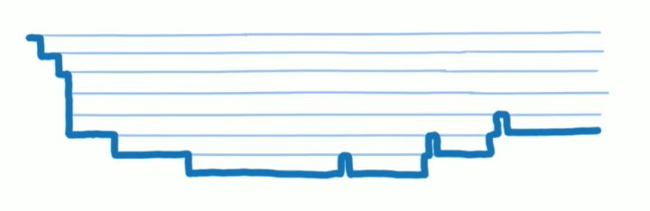

[TOC]

# react 面試寶典

## Hooks 篇

### Hooks 解決了什麼問題？

hooks 是 v16.8 引入的，以前只是單純的靜態組件。
class 組件主要有以下缺點

1. class 組件沒有辦法將重複的邏輯附加到組件上的方法，只能用 render props 或是要用高階組件(HOC)解決，容易形成嵌套地獄，或是 props 覆蓋，或是不容易找到錯誤來源
2. class 組件內部生命週期限制，導致邏輯分散，難以復用
3. class 組件一定要繼承 react 內部的類，不好壓縮，熱加載不穩定
4. class 組件的 this 讓人難以理解

Hooks 解決以上問題，最重要的是可以“復用狀態邏輯”（本題的重點 keyword)。

### 自定義 hooks 是什麼？

以 use 開頭 + 大寫首字母的命名定義。
將邏輯封裝成一個 hook，內容包含 react 原有的 hooks api。可以重複使用。
[可以練習的阿里做的自定義 hooks 套件 - ahooks](https://ahooks.js.org/hooks/use-request/index)

### 為什麼 hook 出現之後，函式組件就可以定義 state，是保存在哪裡？

hook 出現之前，內部無法定義 state ，主要在於每次重新更新，沒有地方可以保留狀態。
hook 出現之後，每個 hook 都有對應的 hook 對象，以鏈表的結構，放在 fiber 上，而 fiber 是 react 的虛擬 DOM ，存在在內存之中。
hook 數據內紀錄當前的 state、reducer，在每次渲染組件時，可以使用計算最新的狀態值。

### useState 和 useReducer 的區別？

都是在處理內部狀態的。基本上 在更新時， `useState` 的 `updateState` ，也是執行 `reducer` 的函式，走同個邏輯。如果狀態值遇到複雜的修改邏輯，需要抽離或是復用邏輯，就可以選 `useReducer。`

```tsx
const [state, setState] = useState(initialState);
const [state, dispatch] = useState(reducer, initialArg, init);
```

區別是:

1.  `useReducer` 必須要自定義 `reducer` (`state` 的修改邏輯執行的函式)`，useState` 是使用內建的。

    ```ts
    // const [state, dispatch] = useState({ count: 0 }); 基本等價於
    const [state, dispatch] = useReducer(
      function basicStateReducer(state, action) {
        return typeof action === "function" ? action(state) : action;
      },
      { count: 0 }
    );
    ```

2.  在使用 `useState` 時，如果狀態不變，則會提早 bailout。
    但 `useReducer` 不管狀態是否一樣，都會重新渲染！

        ```tsx
        function reducer(state, action) {
          switch (action.type) {
            case "increment":
              // return state + 1;
              return state; // 返回相同引用
            default:
              return state;
          }
        }

        export default function App() {
          const [first, setFirst] = useState(0);
          // dispatch 還是會觸發渲染
          const [count, dispatch] = useReducer(reducer, 0);
          console.log("render");

          return (
            <div>
              <button onClick={() => setFirst(0)}>{first}</button>
              <button onClick={() => dispatch({ type: "increment" })}>
                {count}
              </button>
            </div>
          );
        }
        ```

    這是為什麼呢！？要提到源碼對 `setState` 的優化
    `useState` 在 `setState` 不變的值時流程時這樣：

    ```rust
        用戶事件 (例如 onClick)
        |
        回調 dispatchSetState
        |
        判斷狀態更新一樣，調度一個不會觸發重新渲染的更新
        enqueueConcurrentHookUpdateAndEagerlyBailout
        |
        finishQueueingConcurrentUpdates 完成任務
    ```

    但在 `useReducer` 時，流程是長這樣：

    ```rust
        用戶事件 (例如 onClick)
        |
        執行回調 -> 呼叫 useReducer 的狀態更新函數 -> 觸發 dispatchReducerAction
        |
        創建 update
        |
        scheduleUpdateOnFiber ：通知 React 有新的更新需要處理。
        |
        finishQueueingConcurrentUpdates：將 update 從臨時內存隊列轉移到 fiber 的 queue.pending，並掛載到對應的 fiber 上。
        |
        進入 render 階段，執行組件函式和 updateReducerImpl
        |
        判斷狀態更新是否一樣，不一樣則標記更新
        |
        finishQueueingConcurrentUpdates 完成任務
        |
        commit

    ```

### useRef 和 useState 的區別？

`useRef` 並不會觸發更新，它是用來儲存永久保留的值，或是保存 DOM 節點，在組件卸載前都是指向同個對象。這個值紀錄在 `hook.memoizedState` 上。
`useState` 觸發後，會調用 schdeuleUpdateOnFiber，創建更新任務掛載到 fiber 身上，依照優先級調度更新。這個值也是紀錄在 `hook.memoizedState` 上。

### useLayout 和 useEffect 的區別？useLayout 和 useEffect 中的延遲和同步是什麼意思？（關於任務調度）

- 執行時機：
  - useLayout:
    在 Layout 階段同步執行 clearup 和 setup，此時已經可以操作 更新後的 DOM 節點了。
  - useEffect:
    在 Commit 階段結束後執行，異步執行。
- 特性：
  - useLayout:
    同步執行，因為跟渲染是在同個調度任務內，會阻塞渲染，可同步操作 DOM。
  - useEffect:
    異步，在 commit 階段剛開始就已經申請好任務調度，會在在下一個空閑時執行任務，在瀏覽器繪製後執行。不會阻塞到瀏覽器渲染。
- 使用場景：
  - useLayout:
    計算佈局、測量尺寸、同步樣式等。
  - useEffect:
    訂閱、網路請求、日誌紀錄等。

### 為什麼不能在條件或循環或嵌套中調用 hook?

因為 hooks 在組件初始渲染時，就會建立 hooks 鏈表，掛載在 fiber.memoizedState 上，透過後續的更新，來找到執行改變的對象。
鏈表本身是沒有 key 也沒有名字，能夠記錄他們的唯一性的只剩下順序，而在執行過程中，也會判定是否要復用原先的 hook，所以不能夠改變順序。嵌套則是因為無法保證他執行的時機。

### useState 和 useReducer 的原理？

- 初始創建時
  - 在 fiber 上建立 hooks 鏈表，在 `hook.memoizedState` 上紀錄當前狀態。
  - 初始化更新隊列，定義 dispatch 事件，存儲到 `hook.queue` 中。(`useState` 的 `dispatch` 有經過優化，如果狀態沒有變動，bailout，不會發起調度更新; `useReducer` 則是不管狀態是否改變，都會發起調度更新)
  - 返回 `[hook.memoizedState, dispatch]`。
- 用戶觸發更新時
  - 把 update 儲存在內存當中，後續批量更新到 fiber 的 `hook.pending` 上，發起調度 scheduleUpdateOnFiber。
  - 檢查是否有上次尚未處理的更新任務，拼接再一起，變成單向循環鏈表。
  - 循環處理計算新的狀態。
  - 返回 `[hook.memoizedState, dispatch]`。

### useImperativeHandle 的使用場景？

把一個變量當作 ref 暴露出來，v19 之前經常搭配 `forwardRef` 一起使用（因為普通的函式組件是沒辦法直接處理 ref 的）。（v19 之後廢棄 `forwardRef` 了）

```ts
import { useRef, useImperativeHandle } from "react";

function MyInput({ ref }) {
  const inputRef = useRef(null);

  useImperativeHandle(
    ref, // 把第二個參數的執行內容，賦予給此 ref
    () => {
      return {
        focus() {
          inputRef.current.focus();
        },
        scrollIntoView() {
          inputRef.current.scrollIntoView();
        },
      };
    },
    []
  );

  return <input ref={inputRef} />;
}
```

### 類組件的 componentDidMount 和 useLayout 和 useEffect 的對比？

`componentDidMount` 其實和 useLayout 比較相似，不但執行時間差不多，而且都是同步執行。
useEffect 是延遲執行。

// TODO: 待舉例。
比方：react-router 把狀態放到 context 中，如果把路由的訂閱放到 useEffect 會來不及更新內容。
比如 用函式組件實現 antd 4/5 form field，rc-field-form 是用類組件實現的，換成函式組件實現
ssr

## DIFF 算法

比較兩個鏈表，不能用嵌套的兩層循環，成本太高(O(n²))，特殊處理！
大多數情況都是局部更新，不太會調動順序。

> 刪除不是真的都刪了，是在父節點標記子節點刪除，推入父節點 `returnFiber.deletions`
> Fragment 需要特殊處理 Children


---


---


## 架構篇

### 虛擬 DOM 是什麼？

#### What?

- 宏觀來說：又稱為 VDOM，是一種編程概念，由 React 在 2013 率先開拓，後續被許多不同的框架採用。
  在這個概念裡面，UI 以一種理想化的，或者說是虛擬的形式被保存在內存中，通過 ReactDOM 等套件包轉換，使它跟真的的 DOM 同步。同步的過程在 react 當中稱之為調和或是協調 Reconcile。而協調的核心就是 VDOM diff 算法。

- 微觀來說：用物件表現 DOM 的信息和結構，當狀態變更時，重新渲染這個物件結構，這個對象就稱為 VDOM。

#### Why? 為什麼要使用 VODM?

DOM 操作很慢，輕微的操作都可以引發重新排版，非常消耗性能。相對於 DOM 對象， js 對象處理起來更快更簡單。通過 DIFF 算法對比新舊 VDOM 差異，可以批量的，最小化的執行 DOM 操作，從而提升用戶體驗。

#### Where? 在哪裡使用 VDOM?

react 當中用 jsx 來表現視圖，在 v17 之前，必須經過 `babel-loader` 轉譯為 `React.createElement(...)` 調用，返回 ReactElememt。
在 v17 之後，新的轉換，自動從 React 的 package 中引入新的入口函式並調用。
<font color="red" size="2">❌ 不能說 JSX = VDOM，也不能說 ReactElement = VDOM</font>

#### How? react 中如何使用 VDOM?

1. JSX 實際是一種 **JS 語法擴展**，他允許開發者用類似 HTML 的語法來寫組件。是一種**語法糖**。

2. 優點

   - JSX 編寫快速高效
   - 編譯為 JS 後進行了優化，執行更快
   - 在編譯過程中，就能發現錯誤

3. 與 vue 比較
   - vue 演進後才有 vdom + templete
   - jsx 原先就是 js 擴展，轉譯過程簡單直接; vue 把 templete 轉譯為 render 函式的過程需要複雜的編譯器轉換 -> 字符串 -> ast -> js

### fiber 是什麼？

fiber 不是 React 獨有的，是一種常見的計算機術語。在 Ruby, PHP 中都有應用。可中斷可暫停。

react 中是指一種數據結構，在 v16 版本中引入的重大改變，目的是使 react 渲染更加靈活且高效，並支持**異步渲染**和**優先級渲染**。

#### 引入的背景

v16 之前的版本中，使用一種 **stack reconciliation** 的渲染算法。這種算法在處理渲染過程是**同步**的，每當有狀態更新或是 UI 變化時，react 都會執行一次完整的渲染過程，直到所有更新完成。在這個過程當中會阻塞主線程，導致 UI 卡頓。

Fiber 的引入就是為了讓渲染過程變成異步，將渲染拆分多塊，分散在不同幀處理。並且能根據優先級進行任務調度。

#### 基本概念

每個 Fiber 表示一個 UI 組件，上面有各種屬性，紀錄相關的信息，有節點實例、子節點 child、兄弟節點 silbling、父節點 return、優先級等等。
也是指一個將要執行或者是已經執行完成的工作單元 (unit of work)，一個組件可以有一個至多個 fiber。

1. 掛載不同的優先級，可暫停、終止、複用工作單元(unit of work)，給併發提供基礎：
   - 因為“時間切片”＋“增量渲染”的機制，將渲染過程分為多個小單元，這樣就可以中途暫停，處理更高優先級的任務（比如用戶交互）。
   - 可以實現“併發”模式(Concurrent Mode)，使得高優先級的更新（如用戶點擊）能夠更快地得到處理，而低優先級的更新（如動畫、數據加載）則可以推遲。
2. Fiber tree 更好的 DIFF 比對更新：
   - workInProgress tree: 指正在進行的工作單元，組建而成的樹狀結構
   - current tree: 舊的 fiber，已經執行完成的 work ，組建而成的樹狀結構。對應到未更新前的狀態。


### 併發模式是什麼?

併發模式 是 React 16.3 引入的一個重要特性，併發模式是一個更加全面的架構，它還包括了增量式渲染、優先級調度、Suspense、延遲渲染、錯誤邊界等。它的目的是讓 React 渲染過程更加靈活，能夠根據不同任務的優先級來進行調度。併發模式的關鍵在於**能夠打斷和恢復渲染**，從而使 React 能夠高效地處理大量的更新並優先響應用戶交互。

- 異步渲染：併發模式使得渲染過程變成異步，允許 React 在渲染過程中暫停或中斷，等有空閒時再繼續渲染。這樣 React 可以在處理大型或複雜更新時，不會阻塞用戶的交互。
- 優先級調度：React 在併發模式下會根據任務的優先級進行調度，確保高優先級的任務（例如用戶交互）能夠及時處理，而將低優先級的任務（如數據加載、動畫等）推遲處理。
- Suspense：併發模式和 Suspense 共同工作，能夠延遲某些非關鍵任務（如異步數據加載），並顯示加載指示器，直到數據或組件加載完成。

### 增量式渲染 (Incremental Rendering) 是什麼？

增量式渲染 是 React 渲染過程中的一種策略，具體指的是將渲染過程拆分為許多小的“塊”或單元，這些小單元可以按需逐步執行，而不是一次性阻塞性地完成整個渲染過程。這樣做的目的是為了避免長時間的渲染工作阻塞 UI 更新，從而減少 UI 卡頓和延遲。
增量渲染是併發模式的基礎。增量式渲染主要關注渲染的拆分。

- 分片渲染：增量式渲染把渲染過程分解為許多小的工作單元，這些單元可以分別處理並逐步執行。React 不會一次性處理所有的更新，而是把更新拆成許多小部分，逐步完成。
- 中斷渲染：增量式渲染的過程也支持中斷。在渲染過程中，React 可以在某些時候中斷當前的工作，去處理更高優先級的任務，然後再回來繼續渲染剩下的部分。

### 時間切片是什麼？

一般來說螢幕更新的頻率是一秒六十次，相當於 16ms。
在單線程的機制下，如果一個任務執行時間花費過久，就會堵塞後面的任務。
react 渲染時，**高優先級的任務（ex: 交互、佈局）被某個任務堵塞了**，螢幕就會出現卡頓。為了解決這種問題，react 操照操作系統，引入了時間切片的機制，**在某個時間段內週期性執行任務，週期性地把控制權交還給瀏覽器。**




每個 work 工作單元的時長是 5ms，超過執行時間，就要把控制權交還給瀏覽器

### 任務調度機制？

單線程任務調度器，使用最小堆數據結構管理這些任務，每次新任務都會先放入最小堆任務池（動態的任務池，不用做準確的排序，只需最緊急的，所以不用其他的數據結構）。
任務執行的順序取決於優先級與過期時間的計算，值越小，越緊急。
如果任務過期，則持續執行（不管 5ms）。
另外和併發模式合作，任務做到一半，主動檢查是否過期，主動讓出執行權，還給瀏覽器。

### JSX 是什麼？

JSX 實際是一種 **JS 語法擴展**，他允許開發者用類似 HTML 的語法來寫視圖(UI)。是一種**語法糖**。

- JSX 編寫快速高效
- 編譯為 JS 後進行了優化，執行更快
- 在編譯過程中，就能發現錯誤

v17 之後 babel 自動從 package 中引入新的入口函式，就不用再引入 react。

### 為什麼 Hook 和 fiber 誕生後，廢棄了類組件的幾個生命週期？

stack reconciler -> fiber reconciler，隨著異步渲染的加入，v16.3 開始，組件的更新時間變得不穩定，可能會終止、打斷！把『將要掛載、將要更新、將要接受新的 props』都變得不可靠。

### 事件機制

合成事件，幫助用戶解決跨平台兼容性、事件委託的優化機制！
v17 之前是把事件綁定在 document 上，但如果項目中 react 只佔了一小部分，並且也在同層綁定事件，會讓兩邊的事件交叉，出現 bug。
v17 之後把事件委託到 container 了。

## react 版本差異

- 16.3: 引入 fiber 架構
- 16.8: 正式引入 Hooks
- 17:
  - 🌟 全新的 JSX 轉換
  - 🌟 事件委託的變更
  - 事件系統的變更
    - onScroll 不再冒泡
    - onFocus 和 onBlur 事件已在底層切換為原生的 focusin 和 focusout 事件。
    - 擷取事件（例如，onClickCapture）現在使用的是實際瀏覽器中的擷取監聽器。）
  - 去除事件池(以前加入事件池的概念是為了提升舊瀏覽器的效能，對於現代瀏覽器來說，已經不需要了。)
    - 在 React 17 以前，如果想要用非同步的方式使用事件 e，則必須先呼叫呼叫 e.persist() 才可以，這是因為 React 在舊瀏覽器中重用了不同事件的事件對象，以提高效能，並將所有事件字段在它們之前設定為 null。
  - 🌟 副作用的清理時間:React 17 中的 useEffect 的清理函數非同步執行，React 17 以前，當元件被卸載時，useEffect 和 useLayoutEffect 的清理函數都是同步運行
    - 補充：非同步執行清除函式時，ref 可能已經被清掉了，要記得在 effect 函式內部用變數保存。
  - 返回一致的 undefined 錯誤
    - 在 React 17 之前，返回 undefined 預期是一個錯誤，但是由於編碼錯誤，forwardRef  和 memo  組件的返回值是 undefined 時沒有做為錯誤，React 17 後對於不想進行渲染時返回 null。
- 🌟 Fiber Reconciler 再結合了優先權
- 18:
  - concurrent
  - transition
  - createRoot
  - Automatic batching
  - Suspense
  - 錯誤處理
  - 新的 hooks
    - useId
    - useSyncExternalStore
    - useInsertionEffect

## 狀態管理篇

### 如何理解 react 中的 state 和 props?

### 如何修改組件屬性 props?

### 函式組件中如何使用狀態

#### 內部

#### 外部

### 描述 redux 工作原理

### 描述 redux toolkit

### 描述 redux、mobX、recoil 解決什麼問題？

#### 設計原理

#### 優勢

#### 差異

### 比較函式組件和類組件的狀態

#### 什麼時候使用類組件比較好

錯誤邊界和生命週期

## 路由篇

### 簡述前端路由和解決了什麼問題

### 前端路由如何切換頁面

### Router 中 history, hash 路由差異

### react-router6 實現原理

## react 18 特性篇

### 正式支持的併發模式

### 為什麼要這樣修改？ react-dom/client 中的 createRoot 取代之前的 ReactDOM.render?

### 自動批量處理 Automatic Batching/ setState 是同步還異步

### Suspense

### 如何實現錯誤邊界

### SuspenseList

### transition

### 18 新的 API

#### startTransition

#### useTransition

#### useDeferredValue

#### useId

#### useSyncExternalStore

#### useInsertionEffect

## react19 新特性

### 19 新的 API
